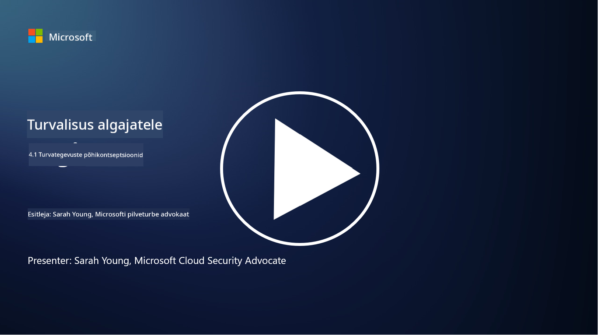

<!--
CO_OP_TRANSLATOR_METADATA:
{
  "original_hash": "6a55b31df9eebf550d040cef0ef7dff3",
  "translation_date": "2025-10-11T11:16:55+00:00",
  "source_file": "4.1 SecOps key concepts.md",
  "language_code": "et"
}
-->
# Turvategevuste põhikontseptsioonid

Turvategevused on organisatsiooni üldise turvafunktsiooni oluline komponent. Selles õppetükis õpime selle kohta rohkem:

 - Mis on turvategevuste funktsioon ettevõttes?
   
 - Millisel kujul võivad turvategevused esineda?
   
   - Kuidas erinevad turvategevused traditsioonilistest IT-tegevustest?

## Mis on turvategevuste funktsioon ettevõttes?

Turvategevuste funktsioon ettevõttes viitab spetsiaalsele meeskonnale või osakonnale, mis vastutab küberohtude ja -intsidentide jälgimise, tuvastamise, uurimise ja neile reageerimise eest. Turvategevuste peamine eesmärk on tagada organisatsiooni digitaalsete varade konfidentsiaalsus, terviklikkus ja kättesaadavus, tuvastades ja vähendades proaktiivselt turvariske ning reageerides tõhusalt turvaintsidentidele.

## Millisel kujul võivad turvategevused esineda?

Turvategevused võivad olenevalt organisatsiooni suurusest ja keerukusest esineda erinevates vormides. Mõned levinumad vormid on:

**Turvategevuste keskus (SOC):** Keskne meeskond, kes vastutab turvasündmuste 24/7 jälgimise, analüüsi ja neile reageerimise eest. SOC-id kasutavad sageli täiustatud tööriistu ja tehnoloogiaid, et tuvastada ja reageerida ohtudele reaalajas.

**Intsidentidele reageerimise meeskond:** Spetsialiseerunud meeskond, kes keskendub turvaintsidentidele ja rikkumistele reageerimisele. Nad viivad läbi uurimisi, koordineerivad reageerimismeetmeid ja hõlbustavad taastumist.

**Ohtude otsimise meeskond:** Meeskond, kes otsib proaktiivselt märke keerukatest ohtudest ja varjatud haavatavustest, mida traditsioonilised turvatööriistad ei pruugi tuvastada.

**Punane meeskond/Sinine meeskond:** Punane meeskond simuleerib rünnakuid, et tuvastada haavatavusi, samal ajal kui sinine meeskond kaitseb nende rünnakute eest. Mõlemad meeskonnad töötavad koos, et parandada turvameetmeid.

**Hallatavate turvateenuste pakkuja (MSSP):** Mõned organisatsioonid delegeerivad oma turvategevused kolmandatele osapooltele, kes on spetsialiseerunud turvamonitooringule ja intsidentidele reageerimisele.

## Kuidas erinevad turvategevused traditsioonilistest IT-tegevustest?

Turvategevused ja traditsioonilised IT-tegevused on seotud, kuid eristuvad funktsioonid:

**Fookus:** IT-tegevused keskenduvad organisatsiooni IT-infrastruktuuri haldamisele ja hooldamisele, tagades selle funktsionaalsuse ja kättesaadavuse. Turvategevused aga keskenduvad turvariskide tuvastamisele ja vähendamisele ning intsidentidele reageerimisele.

**Vastutus:** IT-tegevused hõlmavad ülesandeid nagu süsteemihooldus, tarkvarauuendused ja kasutajatoe pakkumine. Turvategevused hõlmavad ohtude tuvastamist, intsidentidele reageerimist, haavatavuste haldamist ja turvamonitooringut.

**Ajastus:** IT-tegevused rõhutavad süsteemi kohest kättesaadavust ja jõudlust. Turvategevused keskenduvad ohtude tuvastamisele ja kõrvaldamisele, mis ei pruugi alati kokku langeda kohese kättesaadavusega.

**Oskused:** Turvategevused nõuavad spetsialiseeritud oskusi ohtude analüüsis, intsidentidele reageerimises ja küberjulgeoleku tööriistades. IT-tegevused nõuavad teadmisi süsteemihalduses, võrgu haldamises ja rakenduste toetuses.

## Intsidentidele reageerimise töövoog

NIST küberjulgeoleku raamistikus on loetletud viis üldist funktsiooni, mida tuleks organisatsiooni operatiivkeskkonnas pidevalt täita, et vähendada küberjulgeoleku riske. 

Oluline on mõista, et need tegevused peaksid olema osa suuremast ringist, mis integreerub ja on kooskõlas organisatsiooni laiemate küberjulgeoleku protsessidega. 

**Note:** Loe rohkem NIST küberjulgeoleku raamistikust [https://www.nist.gov/cybersecurity](https://www.nist.gov/cybersecurity)

## Lisalugemine

- [Turvategevused | Microsoft Learn](https://learn.microsoft.com/security/operations/overview?WT.mc_id=academic-96948-sayoung)
- [Turvategevuste protsesside rakendamine | Microsoft Learn](https://learn.microsoft.com/security/operations/?WT.mc_id=academic-96948-sayoung)
- [Mis on turvategevuste keskus (SOC)? | Microsoft Security](https://www.microsoft.com/security/business/security-101/what-is-a-security-operations-center-soc?WT.mc_id=academic-96948-sayoung)
- [Mis on turvategevuste keskus | Küberjulgeolek | CompTIA](https://www.comptia.org/content/articles/what-is-a-security-operations-center)

---

**Lahtiütlus**:  
See dokument on tõlgitud, kasutades AI tõlketeenust [Co-op Translator](https://github.com/Azure/co-op-translator). Kuigi püüame tagada täpsust, palun arvestage, et automaatsed tõlked võivad sisaldada vigu või ebatäpsusi. Algne dokument selle algses keeles tuleks lugeda autoriteetseks allikaks. Olulise teabe puhul on soovitatav kasutada professionaalset inimtõlget. Me ei vastuta selle tõlke kasutamisest tulenevate arusaamatuste või valede tõlgenduste eest.