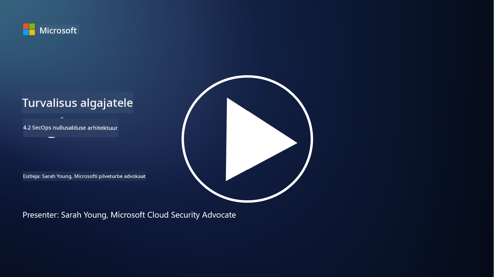

<!--
CO_OP_TRANSLATOR_METADATA:
{
  "original_hash": "45bbdc114e70936816b0b3e7c40189cf",
  "translation_date": "2025-10-11T11:31:24+00:00",
  "source_file": "4.2 SecOps zero trust architecture.md",
  "language_code": "et"
}
-->
# SecOps null-usaldus arhitektuur

Turvaoperatsioonid moodustavad null-usaldus arhitektuuri kaks osa ja selles õppetükis õpime mõlemat:

- Kuidas tuleb IT-arhitektuure üles ehitada, et võimaldada tsentraliseeritud logide kogumist?

- Millised on parimad tavad turvaoperatsioonide jaoks kaasaegsetes IT-keskkondades?

## Kuidas tuleb IT-arhitektuure üles ehitada, et võimaldada tsentraliseeritud logide kogumist?

Tsentraliseeritud logide kogumine on kaasaegsete turvaoperatsioonide kriitiline komponent. See võimaldab organisatsioonidel koondada logisid ja andmeid erinevatest allikatest, nagu serverid, rakendused, võrguseadmed ja turvatööriistad, ühte keskhoidlasse analüüsimiseks, jälgimiseks ja intsidentidele reageerimiseks. Siin on mõned parimad tavad IT-arhitektuuride ülesehitamiseks, et toetada tsentraliseeritud logide kogumist:

1. **Logi allikate integreerimine**:

- Veendu, et kõik asjakohased seadmed ja süsteemid on konfigureeritud logisid genereerima. See hõlmab servereid, tulemüüre, ruutereid, lüliteid, rakendusi ja turvaseadmeid.

- Konfigureeri logi allikad edastama logisid tsentraliseeritud logikogujale või haldussüsteemile.

2. **Vali sobiv SIEM (Security Information and Event Management) tööriist**:

- Vali SIEM-lahendus, mis vastab sinu organisatsiooni vajadustele ja ulatusele.

- Veendu, et valitud lahendus toetab logide kogumist, koondamist, analüüsi ja aruandlust.

3. **Mastaapsus ja varundus**:

- Kujunda arhitektuur mastaapsuse jaoks, et mahutada kasvavat logi allikate arvu ja suurenevat logimahtu.

- Rakenda varundus kõrge kättesaadavuse tagamiseks, et vältida katkestusi riistvara või võrgu rikete tõttu.

4. **Logide turvaline edastamine**:

- Kasuta turvalisi protokolle, nagu TLS/SSL või IPsec, logide edastamiseks allikatest keskhoidlasse.

- Rakenda autentimist ja juurdepääsukontrolle, et tagada, et ainult volitatud seadmed saavad logisid saata.

5. **Normaliseerimine**:

- Standardiseeri logiformaadid ja normaliseeri andmed, et tagada järjepidevus ja lihtne analüüs.

6. **Salvestamine ja säilitamine**:

- Määra logide sobiv säilitamisperiood vastavalt vastavus- ja turvanõuetele.

- Salvesta logid turvaliselt, kaitstes neid volitamata juurdepääsu ja rikkumise eest.

## Millised on parimad tavad turvaoperatsioonide jaoks kaasaegsetes IT-keskkondades?

Lisaks tsentraliseeritud logide kogumisele on siin mõned parimad tavad turvaoperatsioonide jaoks kaasaegsetes IT-keskkondades:

1. **Pidev jälgimine**: Rakenda pidev võrgu ja süsteemi tegevuste jälgimine, et tuvastada ja reageerida ohtudele reaalajas.

2. **Ohuluure**: Ole kursis uute ohtude ja haavatavustega, kasutades ohuluurevooge ja -teenuseid.

3. **Kasutajate koolitamine**: Korralda regulaarselt töötajatele turvateadlikkuse koolitusi, et vähendada sotsiaalse manipuleerimise ja õngitsusrünnakute riske.

4. **Intsidentidele reageerimise plaan**: Arenda ja testi intsidentidele reageerimise plaani, et tagada kiire ja tõhus reageerimine turvaintsidentidele.

5. **Turvaautomaatika**: Kasuta turvaautomaatika ja orkestreerimise tööriistu, et lihtsustada intsidentidele reageerimist ja korduvaid ülesandeid.

6. **Varundamine ja taastamine**: Rakenda tugevad varundus- ja katastroofitaaste lahendused, et tagada andmete kättesaadavus andmekao või lunavara rünnakute korral.

## Lisalugemine

- [Microsoft Security Best Practices module: Security operations | Microsoft Learn](https://learn.microsoft.com/security/operations/security-operations-videos-and-decks?WT.mc_id=academic-96948-sayoung)
- [Security operations - Cloud Adoption Framework | Microsoft Learn](https://learn.microsoft.com/azure/cloud-adoption-framework/secure/security-operations?WT.mc_id=academic-96948-sayoung)
- [What is Security Operations and Analytics Platform Architecture? A Definition of SOAPA, How It Works, Benefits, and More (digitalguardian.com)](https://www.digitalguardian.com/blog/what-security-operations-and-analytics-platform-architecture-definition-soapa-how-it-works#:~:text=All%20in%20all%2C%20security%20operations%20and%20analytics%20platform,become%20more%20efficient%20and%20operative%20with%20your%20security.)

---

**Lahtiütlus**:  
See dokument on tõlgitud AI tõlketeenuse [Co-op Translator](https://github.com/Azure/co-op-translator) abil. Kuigi püüame tagada täpsust, palume arvestada, et automaatsed tõlked võivad sisaldada vigu või ebatäpsusi. Algne dokument selle algses keeles tuleks pidada autoriteetseks allikaks. Olulise teabe puhul soovitame kasutada professionaalset inimtõlget. Me ei vastuta arusaamatuste või valesti tõlgenduste eest, mis võivad tekkida selle tõlke kasutamise tõttu.