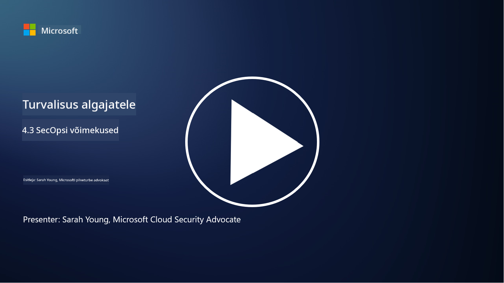

<!--
CO_OP_TRANSLATOR_METADATA:
{
  "original_hash": "553eb694c89f1caca0694e8d8ab89e0e",
  "translation_date": "2025-10-11T11:30:49+00:00",
  "source_file": "4.3 SecOps capabilities.md",
  "language_code": "et"
}
-->
# SecOpsi võimekused

Selles osas käsitleme põhjalikumalt peamisi tööriistu ja võimekusi, mida saab kasutada turvaoperatsioonides.

Selles õppetükis käsitleme:

- Mis on turvateabe ja sündmuste haldamise (SIEM) tööriist?

- Mis on XDR?

- Milliseid võimekusi saab kasutada turvaoperatsioonide täiustamiseks?

## Mis on turvateabe ja sündmuste haldamise (SIEM) tööriist?

Turvateabe ja sündmuste haldamise (SIEM) tööriist pakub analüüsi turvahoiatuste kohta, mis on genereeritud organisatsiooni IT-keskkonnas. Need koguvad, koondavad, korreleerivad ja analüüsivad logiandmeid ja turvasündmusi erinevatest allikatest, nagu võrguseadmed, serverid, rakendused ja turvasüsteemid.

SIEM-tööriistade peamised funktsioonid ja võimekused hõlmavad:

1. **Logide kogumine**: SIEM-tööriistad koguvad logisid ja turvasündmuste andmeid laia valiku seadmetest, süsteemidest ja rakendustest, sealhulgas tulemüüridest, sissetungimise tuvastamise süsteemidest, viirusetõrjetarkvarast ja muust.

2. **Andmete normaliseerimine**: Need normaliseerivad logiandmed ühtsesse formaati, et hõlbustada analüüsi ja korrelatsiooni.

3. **Sündmuste korrelatsioon**: SIEM-tööriistad korreleerivad sündmusi, et tuvastada mustreid ja anomaaliaid, mis võivad viidata turvaintsidentidele või ohtudele.

4. **Hoiatused ja teavitused**: SIEM-tööriistad genereerivad reaalajas hoiatusi ja teavitusi, kui avastatakse kahtlaseid tegevusi või turvarikkumisi, võimaldades kohest reageerimist.

5. **Intsidendi tuvastamine**: Need hõlbustavad turvaintsidentide, sealhulgas volitamata juurdepääsu, andmelekkete, pahavara nakatumiste ja sisemiste ohtude tuvastamist.

6. **Kasutaja ja üksuse käitumise analüüs (UEBA)**: Mõned SIEM-tööriistad sisaldavad UEBA-võimekusi, et tuvastada ebanormaalset kasutaja ja üksuse käitumist, mis võib viidata kompromiteeritud kontodele või sisemistele ohtudele.

7. **Ohuluure integreerimine**: SIEM-tööriistad saavad integreeruda ohuluurevoogudega, et täiustada ohtude tuvastamist, võrreldes teadaolevaid kompromiteerimise indikaatoreid (IOC) võrgutegevusega.

8. **Automatiseerimine ja orkestreerimine**: Automatiseerimisfunktsioonid võimaldavad SIEM-tööriistadel automatiseerida tavaliste turvaintsidentide lahendamist, vähendades reageerimisaega ja käsitsi tehtavat tööd.

9. **Töölaud ja visualiseerimine**: Need pakuvad töölaudu ja visualiseerimisvahendeid turvaandmete jälgimiseks ja kohandatud aruannete loomiseks.

10. **Integreerimine teiste turvatööriistadega**: SIEM-tööriistad integreeruvad sageli teiste turvatööriistade ja tehnoloogiatega, nagu lõpp-punkti tuvastamise ja reageerimise (EDR) lahendused, et pakkuda terviklikku ülevaadet organisatsiooni turvaseisundist.

## Mis on XDR?

XDR (Extended Detection and Response) on tehnoloogia, mis laiendab traditsioonilise lõpp-punkti tuvastamise ja reageerimise (EDR) võimalusi ning ühendab need laiemate turvatelemeetria allikatega, et pakkuda terviklikumat ülevaadet organisatsiooni turvaseisundist. XDR eesmärk on parandada ohtude tuvastamist, intsidentidele reageerimist ja üldist turvalisust, lahendades ainult EDR-i, SIEM-i või muude üksikute turvatööriistade kasutamise piiranguid.

XDR-i peamised omadused ja komponendid hõlmavad:

1. **Andmete integreerimine**: XDR integreerib andmeid mitmest allikast, sealhulgas lõpp-punktidest, võrguliiklusest, pilveteenustest, e-postist ja muust. See terviklik andmete koondamine pakub laiemat konteksti ohtude tuvastamiseks ja analüüsimiseks.

2. **Täpsem analüüs**: XDR kasutab täpsemat analüüsi, masinõpet ja käitumisanalüüsi, et tuvastada ja prioriseerida turvaohtusid. See otsib mustreid ja anomaaliaid integreeritud andmetes, et avastada nii teadaolevaid kui ka tundmatuid ohte.

3. **Automatiseeritud ohtude tuvastamine**: XDR automatiseerib turvaohtude ja anomaaliate tuvastamise, korreleerides teavet erinevatest allikatest. See suudab tuvastada keerulisi rünnakuahelaid, mis võivad hõlmata mitut vektorit.

4. **Intsidendi uurimine ja reageerimine**: XDR pakub tööriistu intsidentide uurimiseks ja neile reageerimiseks, aidates turvameeskondadel kiiresti hinnata intsidentide ulatust ja mõju ning võtta asjakohaseid parandusmeetmeid.

5. **Ohuluure integreerimine**: See integreerib ohuluurevoogusid ja andmeid, et täiustada ohtude tuvastamist, võrreldes teadaolevaid kompromiteerimise indikaatoreid (IOC) organisatsiooni võrgu ja lõpp-punkti tegevusega.

6. **Ühtne konsool**: XDR pakub tavaliselt ühtset konsooli või töölauda, kus turvameeskonnad saavad tsentraliseeritult vaadata ja hallata turvahoiatusi ja -intsidente erinevatest allikatest.

7. **Platvormideülene katvus**: XDR-lahendused katavad laia valikut platvorme, sealhulgas lõpp-punkte, servereid, pilvekeskkondi ja mobiilseadmeid, muutes selle sobivaks kaasaegsetele, mitme platvormiga IT-keskkondadele.

## Milliseid võimekusi saab kasutada turvaoperatsioonide täiustamiseks?

Turvaoperatsioonide täiustamiseks saavad organisatsioonid kasutada mitmeid võimekusi lisaks SIEM-tööriistadele:

1. **Masinõpe ja tehisintellekt**: Rakendage täiustatud analüütikat, masinõpet ja tehisintellekti, et tuvastada arenevaid ohte ja automatiseerida ohtude otsimist.

2. **Kasutaja ja üksuse käitumise analüüs (UEBA)**: Analüüsige kasutajate ja üksuste käitumist, et tuvastada anomaaliaid ja sisemisi ohte.

3. **Ohuluurevood**: Integreerige ohuluurevood, et olla kursis uusimate ohtude ja kompromiteerimise indikaatoritega.

4. **Turvaorkestreerimine, automatiseerimine ja reageerimine (SOAR)**: Rakendage SOAR-platvorme, et automatiseerida intsidentidele reageerimist ja sujuvamaks muuta turvaoperatsioonide töövooge.

5. **Petmistehnoloogiad**: Kasutage petmistehnoloogiaid, et eksitada ja tuvastada ründajaid võrgus.

## Lisalugemine

- [Mis on SIEM? | Microsoft Security](https://www.microsoft.com/security/business/security-101/what-is-siem?WT.mc_id=academic-96948-sayoung)  
- [Mis on SIEM? - Turvateabe ja sündmuste haldamine - Cisco](https://www.cisco.com/c/en/us/products/security/what-is-siem.html)  
- [Turvateabe ja sündmuste haldamine - Vikipeedia](https://en.wikipedia.org/wiki/Security_information_and_event_management)  
- [Mis on XDR? | Microsoft Security](https://www.microsoft.com/security/business/security-101/what-is-xdr?WT.mc_id=academic-96948-sayoung)  
- [XDR ja XDR-turvalisus (kaspersky.com.au)](https://www.kaspersky.com.au/resource-center/definitions/what-is-xdr)  
- [SecOpsi jõud: põhiturvavõimekuste ümbermõtestamine - The New Stack](https://thenewstack.io/the-power-of-secops-redefining-core-security-capabilities/)  
- [Seitse sammu turvaoperatsioonide ja reageerimise parandamiseks (securityintelligence.com)](https://securityintelligence.com/seven-steps-to-improve-your-security-operations-and-response/)  

---

**Lahtiütlus**:  
See dokument on tõlgitud AI tõlketeenuse [Co-op Translator](https://github.com/Azure/co-op-translator) abil. Kuigi püüame tagada täpsust, palume arvestada, et automaatsed tõlked võivad sisaldada vigu või ebatäpsusi. Algne dokument selle algses keeles tuleks pidada autoriteetseks allikaks. Olulise teabe puhul soovitame kasutada professionaalset inimtõlget. Me ei vastuta selle tõlke kasutamisest tulenevate arusaamatuste või valesti tõlgenduste eest.