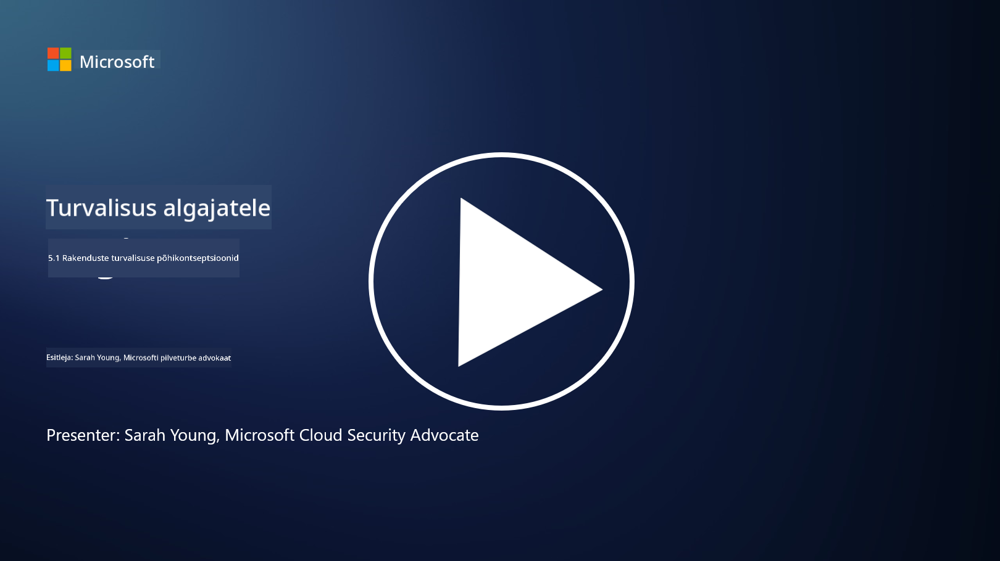

<!--
CO_OP_TRANSLATOR_METADATA:
{
  "original_hash": "e4b56bb23078d3ffb7ad407d280b0c36",
  "translation_date": "2025-10-11T11:24:22+00:00",
  "source_file": "5.1 AppSec key concepts.md",
  "language_code": "et"
}
-->
# AppSec põhikontseptsioonid

Rakenduste turvalisus on omaette turvalisuse eriala. Selles kursuse osas vaatame lähemalt rakenduste turvalisust.

## Sissejuhatus

Selles õppetükis käsitleme:

- Mis on rakenduste turvalisus?

- Millised on rakenduste turvalisuse põhikontseptsioonid/põhimõtted?

## Mis on rakenduste turvalisus?

Rakenduste turvalisus, sageli lühendatult "AppSec," viitab tarkvararakenduste kaitsmise praktikatele turvaohtude, haavatavuste ja rünnakute eest. See hõlmab protsesse, tehnikaid ja tööriistu, mida kasutatakse turvariskide tuvastamiseks, leevendamiseks ja ennetamiseks rakenduse arendamise, juurutamise ja hoolduse elutsükli jooksul.

Rakenduste turvalisus on kriitiline, kuna rakendused on küberrünnakute tavalised sihtmärgid. Pahatahtlikud osapooled kasutavad tarkvara haavatavusi ja nõrkusi, et saada volitamata juurdepääsu, varastada andmeid, häirida teenuseid või teostada muid pahatahtlikke tegevusi. Tõhus rakenduste turvalisus aitab tagada rakenduse ja sellega seotud andmete konfidentsiaalsuse, terviklikkuse ja kättesaadavuse.

## Millised on rakenduste turvalisuse põhikontseptsioonid/põhimõtted?

Rakenduste turvalisuse aluseks olevad põhikontseptsioonid ja põhimõtted hõlmavad järgmist:

1. **Turvalisus disainis**:

- Turvalisus tuleks integreerida rakenduse disaini ja arhitektuuri algusest peale, mitte lisada hiljem.

2. **Sisendi valideerimine**:

- Kõik kasutaja sisendid tuleks valideerida, et tagada nende vastavus oodatud vormingutele ja vabadus pahatahtlikust koodist või andmetest.

3. **Väljundi kodeerimine**:

- Kliendile saadetavad andmed tuleks korralikult kodeerida, et vältida haavatavusi nagu XSS (ristsaidist skriptimine).

4. **Autentimine ja autoriseerimine**:

- Kasutajate autentimine ja nende juurdepääsu autoriseerimine ressurssidele vastavalt nende rollidele ja õigustele.

5. **Andmete kaitse**:

- Tundlikud andmed tuleks krüpteerida salvestamisel, edastamisel ja töötlemisel, et vältida volitamata juurdepääsu.

6. **Sessioonihaldus**:

- Turvaline sessioonihaldus tagab kasutajate sessioonide kaitse kaaperdamise ja volitamata juurdepääsu eest.

7. **Turvalised sõltuvused**:

- Kõik tarkvara sõltuvused tuleks hoida ajakohasena turvaparandustega, et vältida haavatavusi.

8. **Vigade käsitlemine ja logimine**:

- Rakendada turvalist vigade käsitlemist, et vältida tundliku teabe avalikustamist, ning tagada turvalised logimispraktikad.

9. **Turvatestimine**:

- Rakendusi tuleks regulaarselt testida haavatavuste suhtes, kasutades meetodeid nagu läbitungimistestimine, koodide ülevaatus ja automatiseeritud skannimistööriistad.

10. **Turvaline tarkvara arenduse elutsükkel (SDLC)**:

- Integreerida turvapraktikad tarkvara arenduse elutsükli igasse etappi, alates nõuetest kuni juurutamise ja hoolduseni.

## Lisalugemine

- [SheHacksPurple: Mis on rakenduste turvalisus? - YouTube](https://www.youtube.com/watch?v=eNmccQNzSSY)
- [Mis on rakenduste turvalisus? - Cisco](https://www.cisco.com/c/en/us/solutions/security/application-first-security/what-is-application-security.html#~how-does-it-work)
- [Mis on rakenduste turvalisus? Protsess ja tööriistad tarkvara turvamiseks | CSO Online](https://www.csoonline.com/article/566471/what-is-application-security-a-process-and-tools-for-securing-software.html)
- [OWASP Cheat Sheet Series | OWASP Foundation](https://owasp.org/www-project-cheat-sheets/)

---

**Lahtiütlus**:  
See dokument on tõlgitud, kasutades AI tõlketeenust [Co-op Translator](https://github.com/Azure/co-op-translator). Kuigi püüame tagada täpsust, palun arvestage, et automaatsed tõlked võivad sisaldada vigu või ebatäpsusi. Algne dokument selle algkeeles tuleks lugeda autoriteetseks allikaks. Olulise teabe puhul on soovitatav kasutada professionaalset inimtõlget. Me ei vastuta selle tõlke kasutamisest tulenevate arusaamatuste või valede tõlgenduste eest.