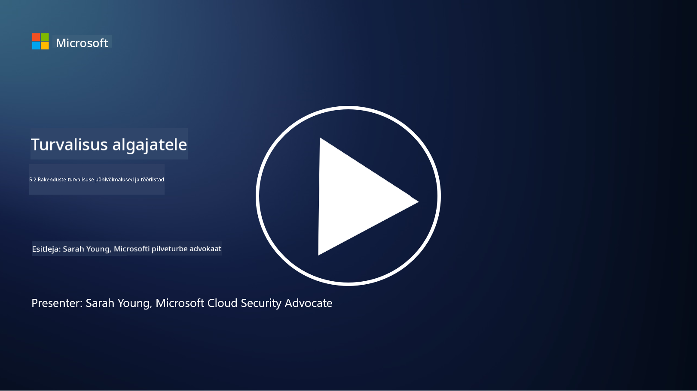

<!--
CO_OP_TRANSLATOR_METADATA:
{
  "original_hash": "790a3fa7e535ec60bb51bde13e759781",
  "translation_date": "2025-10-11T11:34:03+00:00",
  "source_file": "5.2 AppSec key capabilities.md",
  "language_code": "et"
}
-->
Selles jaotises käsitleme rakenduste turvalisuses kasutatavate põhivahendite ja -võimaluste üksikasju:

## Sissejuhatus

Selles õppetükis käsitleme rakenduste turvalisuses kasutatavaid peamisi võimalusi ja tööriistu.

## Rakenduste turvalisuse põhivõimalused ja tööriistad

Rakenduste turvalisuses kasutatavad põhivõimalused ja tööriistad on olulised turvaaukude ja ohtude tuvastamiseks, leevendamiseks ja ennetamiseks tarkvararakendustes. Siin on mõned kõige olulisemad:

**1. Staatiline rakenduste turvatestimine (SAST)**:

- **Võimalused**: Analüüsib lähtekoodi, baitkoodi või binaarkoodi, et tuvastada turvaauke rakenduse koodibaasis.

- **Tööriistad**: Näited hõlmavad Fortify, Checkmarx ja Veracode.

**2. Dünaamiline rakenduste turvatestimine (DAST)**:

- **Võimalused**: Skaneerib töötavat rakendust, et tuvastada turvaauke, saates sisendpäringuid ja analüüsides vastuseid.

- **Tööriistad**: Näited hõlmavad ZAP, Burp Suite ja Qualys Web Application Scanning.

**3. Interaktiivne rakenduste turvatestimine (IAST)**:

- **Võimalused**: Kombineerib SAST-i ja DAST-i elemente, analüüsides koodi käitamise ajal, pakkudes täpsemaid tulemusi ja vähendades valepositiivseid tulemusi.

- **Tööriistad**: Näited hõlmavad Contrast Security ja HCL AppScan.

**4. Rakenduste reaalajas enesekaitse (RASP)**:

- **Võimalused**: Jälgib ja kaitseb rakendusi reaalajas, tuvastades ja reageerides turvaohtudele nende tekkimisel.

- **Tööriistad**: Näited hõlmavad Veracode Runtime Protection ja F5 Advanced WAF koos RASP-iga.

**5. Veebirakenduste tulemüürid (WAF)**:

- **Võimalused**: Pakub kaitsekihti rakenduse ja interneti vahel, filtreerides sissetulevat liiklust ja blokeerides pahatahtlikke päringuid.

- **Tööriistad**: Näited hõlmavad ModSecurity, AWS WAF ja Akamai Kona Site Defender.

**6. Sõltuvuste skaneerimine**:

- **Võimalused**: Tuvastab turvaauke kolmandate osapoolte teekides ja komponentides, mida rakendus kasutab.

- **Tööriistad**: Näited hõlmavad OWASP Dependency-Check ja Snyk.

**7. Läbimurdetestimine (Pen Testing)**:

- **Võimalused**: Simuleerib reaalseid rünnakuid, et avastada turvaauke ja hinnata rakenduse turvalisust.

- **Tööriistad**: Teostavad sertifitseeritud eetilised häkkerid ja turvalisuse spetsialistid, kasutades erinevaid tööriistu nagu Metasploit ja Nmap.

**8. Turvalisuse skaneerimine ja analüüs**:

- **Võimalused**: Skaneerib teadaolevaid turvaauke, konfiguratsioonivigu ja turvalisuse valekonfiguratsioone.

- **Tööriistad**: Näited hõlmavad Nessus, Qualys Vulnerability Management ja OpenVAS.

**9. Konteinerite turvalisuse tööriistad**:

- **Võimalused**: Keskenduvad konteineriseeritud rakenduste ja nende keskkondade turvalisuse tagamisele.

- **Tööriistad**: Näited hõlmavad Docker Security Scanning ja Aqua Security.

**10. Turvalise arenduse koolitus**:

- **Võimalused**: Pakub koolitus- ja teadlikkusprogramme arendustiimidele, et edendada turvalise koodi kirjutamise praktikaid.

- **Tööriistad**: Kohandatud koolitusprogrammid ja platvormid.

**11. Turvatestimise raamistikud**:

- **Võimalused**: Pakub terviklikke testimisraamistikke erinevate rakenduste turvatestimise vajaduste jaoks.

- **Tööriistad**: OWASP Amass, OWASP OWTF ja FrAppSec.

**12. Turvalise koodi ülevaatamise tööriistad**:

- **Võimalused**: Ülevaatab lähtekoodi turvaaukude ja koodi parimate tavade osas.

- **Tööriistad**: Näited hõlmavad SonarQube ja Checkmarx.

**13. Turvaliste API-de ja mikroteenuste tööriistad**:

- **Võimalused**: Keskenduvad API-de ja mikroteenuste turvalisuse tagamisele, sealhulgas autentimine, autoriseerimine ja andmekaitse.

- **Tööriistad**: Näited hõlmavad Apigee, AWS API Gateway ja Istio.

## Lisalugemine

- [Mis on rakenduste turvalisus? Kontseptsioonid, tööriistad ja parimad praktikad | HackerOne](https://www.hackerone.com/knowledge-center/what-application-security-concepts-tools-best-practices)
- [Mis on IAST? (Interaktiivne rakenduste turvatestimine) (comparitech.com)](https://www.comparitech.com/net-admin/what-is-iast/)
- [10 tüüpi rakenduste turvatestimise tööriistu: millal ja kuidas neid kasutada (cmu.edu)](https://insights.sei.cmu.edu/blog/10-types-of-application-security-testing-tools-when-and-how-to-use-them/)
- [Küberjulgeoleku riskide tasakaalu nihutamine: turvalisuse disaini ja vaikeseadete põhimõtted ja lähenemised | Cyber.gov.au](https://www.cyber.gov.au/about-us/view-all-content/publications/principles-and-approaches-for-security-by-design-and-default)

---

**Lahtiütlus**:  
See dokument on tõlgitud AI tõlketeenuse [Co-op Translator](https://github.com/Azure/co-op-translator) abil. Kuigi püüame tagada täpsust, palume arvestada, et automaatsed tõlked võivad sisaldada vigu või ebatäpsusi. Algne dokument selle algses keeles tuleks pidada autoriteetseks allikaks. Olulise teabe puhul soovitame kasutada professionaalset inimtõlget. Me ei vastuta selle tõlke kasutamisest tulenevate arusaamatuste või valesti tõlgenduste eest.