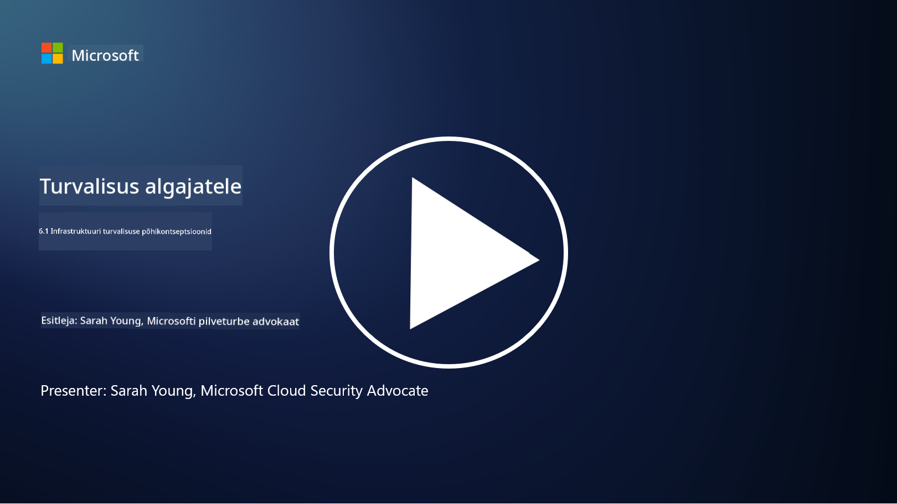

<!--
CO_OP_TRANSLATOR_METADATA:
{
  "original_hash": "882ebf66a648f419bcbf680ed6aefa00",
  "translation_date": "2025-10-11T11:15:25+00:00",
  "source_file": "6.1 Infrastructure security key concepts.md",
  "language_code": "et"
}
-->
# Infrastruktuuri turvalisuse põhikontseptsioonid

"Infrastruktuur" viitab IT-keskkonna ehituskividele, mis hõlmavad servereid, pilveteenuseid ja konteinereid – väga erinevaid tehnoloogiaid. Rakendused, mida käsitleti eelmises osas, töötavad infrastruktuuril, mistõttu võivad ka need olla ründajate sihtmärgiks.

Selles õppetükis käsitleme:

- Mis on turvahügieen ja miks see on oluline?

- Mis on turvapositsiooni haldamine?

- Mis on paigaldamine ja miks see on oluline?

- Mis on konteinerid ja mis on nende turvalisuses erinevat?

## Mis on turvahügieen ja miks see on oluline?

**Turvahügieen** viitab praktikate ja käitumiste kogumile, mida üksikisikud ja organisatsioonid järgivad, et säilitada head küberturvalisuse harjumused. See hõlmab samme süsteemide, andmete ja võrkude kaitsmiseks ohtude ja haavatavuste eest. Hea turvahügieen on oluline mitmel põhjusel:

- **Rünnakute ennetamine**: Parimate praktikate järgimine aitab vältida levinud küberrünnakuid, nagu andmepüük, pahavara nakatumine ja volitamata juurdepääs.

- **Andmete kaitsmine**: Õige turvahügieen kaitseb tundlikke ja konfidentsiaalseid andmeid varguse või lekkimise eest.

- **Usalduse säilitamine**: Organisatsioonid, kes demonstreerivad head turvahügieeni, loovad usaldust klientide ja partnerite seas.

- **Vastavus**: Paljud regulatsioonid ja standardid nõuavad turvahügieeni praktikate järgimist.

- **Riskide vähendamine**: Järjepidev turvahügieen vähendab üldist turvaintsidentide ja rikkumiste riski.

Turvahügieen hõlmab selliseid praktikaid nagu tarkvara ajakohasena hoidmine, tugevate paroolide ja mitmefaktorilise autentimise kasutamine, regulaarne varundamine, töötajate koolitamine ja kahtlaste tegevuste jälgimine. See on tugeva küberturvalisuse aluseks.

## Mis on turvapositsiooni haldamine?

Turvapositsiooni haldamine viitab organisatsiooni üldise küberturvalisuse positsiooni hindamisele, jälgimisele ja haldamisele. Küberturvalisuse positsioon viitab organisatsiooni üldisele lähenemisele ja valmisolekule kaitsta oma infotehnoloogiasüsteeme, võrke, andmeid ja varasid küberohtude ja -rünnakute eest. See hõlmab strateegiaid, poliitikaid, praktikaid ja tehnoloogiaid, mida organisatsioon kasutab oma digitaalsete varade kaitsmiseks ning teabe konfidentsiaalsuse, terviklikkuse ja kättesaadavuse tagamiseks. Turvapositsiooni haldamine hõlmab süsteemide, võrkude, rakenduste ja andmete turvalisuse hindamist ja säilitamist, et need vastaksid turvapoliitikatele, parimatele praktikatele ja vastavusnõuetele. Selle eesmärk on anda organisatsioonile terviklik ülevaade turvalisuse seisust, tuvastada haavatavused ja nõrkused ning prioriseerida parandusmeetmeid.

## Mis on paigaldamine ja miks see on oluline?

**Paigaldamine** viitab tarkvarauuenduste, mida tuntakse ka kui paike või parandusi, rakendamisele tarkvarale, operatsioonisüsteemidele ja rakendustele. Need uuendused lahendavad tavaliselt turvahaavatavusi, vigu ja muid probleeme, mida ründajad võivad ära kasutada. Riistvaraseadmed vajavad samuti paigaldamist: see võib olla nende püsivara või sisseehitatud operatsioonisüsteem. Riistvara paigaldamine võib olla palju keerulisem kui tarkvara paigaldamine.

Paigaldamine on oluline mitmel põhjusel:

- **Turvalisus**: Paigad parandavad teadaolevaid haavatavusi, mida ründajad võivad kasutada süsteemide kompromiteerimiseks ja andmete varastamiseks.

- **Stabiilsus**: Paigad sisaldavad sageli stabiilsuse ja jõudluse parandusi, vähendades süsteemi kokkujooksmise või tõrgete riski.

- **Vastavus**: Paljud regulatsioonid ja vastavusstandardid nõuavad turvapaikade kiiret rakendamist.

- **Usalduse säilitamine**: Regulaarne paigaldamine aitab säilitada klientide ja sidusrühmade usaldust, näidates pühendumust turvalisusele.

- **Riskide vähendamine**: Paigaldamine vähendab rünnakupinda ja edukate küberrünnakute tõenäosust.

Paikade õigeaegne rakendamata jätmine võib jätta süsteemid haavatavaks teadaolevatele ekspluatatsioonidele, suurendades turvarikkumiste ja andmekao riski.

## Mis on konteinerid ja mis on nende turvalisuses erinevat?

Konteinerid on kerged, iseseisvad ja käivitatavad tarkvarapakid, mis sisaldavad kõike, mida on vaja tarkvara käitamiseks, sealhulgas koodi, käituskeskkonda, teeke ja süsteemitööriistu. Konteinerid pakuvad rakendustele järjepidevat ja isoleeritud keskkonda, muutes tarkvara arendamise, pakendamise ja juurutamise erinevates keskkondades ja platvormidel lihtsamaks. Populaarsed konteineritehnoloogiad hõlmavad Dockeri ja Kubernetesit.

Konteinerite turvalisus viitab praktikatele ja tehnoloogiatele, mida kasutatakse konteinerite ja nende hostitud rakenduste kaitsmiseks erinevate turvaohtude ja haavatavuste eest. Konteinerite turvalisus on oluline, sest kuigi konteinerid pakuvad palju eeliseid, nagu teisaldatavus ja skaleeritavus, toovad need kaasa ka potentsiaalseid turvalisuse väljakutseid:

1. **Pildi turvalisus**: Konteineripildid võivad sisaldada haavatavusi, ja kui neid pilte ei uuendata ega paigata regulaarselt, võivad ründajad neid ära kasutada. Konteinerite turvalisus hõlmab piltide skaneerimist teadaolevate haavatavuste suhtes ja tagamist, et kasutatakse ainult usaldusväärseid pilte.

2. **Käitusaja turvalisus**: Käitatavad konteinerid peavad olema üksteisest ja hostisüsteemist isoleeritud, et vältida volitamata juurdepääsu ja võimalikke rünnakuid. Käitusaja turvamehhanismid hõlmavad konteinerite isoleerimistehnoloogiaid, nagu nimede ruumid ja cgroupid, samuti tööriistu konteinerite käitumise jälgimiseks ja auditeerimiseks.

3. **Võrgu turvalisus**: Konteinerid suhtlevad üksteise ja väliste süsteemidega võrkude kaudu. Õige võrgu segmentimine ja tulemüürireeglid on olulised konteinerite vahelise liikluse kontrollimiseks ja volitamata juurdepääsu vältimiseks.

4. **Juurdepääsukontroll**: Tagamine, et ainult volitatud kasutajad ja protsessid saavad konteineritele juurde pääseda ja neid muuta, on kriitiline. Rollipõhine juurdepääsukontroll (RBAC) ja identiteedihaldustööriistad on sageli kasutusel juurdepääsu kontrollimiseks.

5. **Logimine ja jälgimine**: Konteinerite turvalisus hõlmab logide kogumist ja analüüsi ning jälgimisandmeid, et tuvastada ja reageerida turvaintsidentidele ja anomaaliatele reaalajas.

6. **Orkestreerimise turvalisus**: Konteinerite orkestreerimisplatvormide, nagu Kubernetes, kasutamisel on oluline ka orkestreerimiskihi turvalisus. See hõlmab Kubernetes API serveri turvalisust, õige RBAC-poliitika tagamist ja klastri tegevuse auditeerimist.

7. **Saladuste haldamine**: Konteinerites tundliku teabe, nagu API võtmed ja paroolid, käsitlemine nõuab turvalisi salvestus- ja halduslahendusi, et vältida nende lekkimist.

Konteinerite turvalisuse lahendused hõlmavad sageli turvalisuse parimaid praktikaid, haavatavuste skaneerimise tööriistu, käitusaja kaitsemehhanisme, võrgu turvakonfiguratsioone ja konteinerite orkestreerimise turvafunktsioone. Jätkuv jälgimine ja automatiseerimine on konteinerite turvalisuse olulised komponendid, et kiiresti tuvastada ja reageerida ohtudele, kui konteineripõhised rakendused arenevad ja skaleeruvad.

## Lisalugemine

- [Turvahügieeni tähtsus | Security Magazine](https://www.securitymagazine.com/articles/99510-the-importance-of-security-hygiene)
- [Mis on CSPM? | Microsoft Security](https://www.microsoft.com/security/business/security-101/what-is-cspm?WT.mc_id=academic-96948-sayoung)
- [Mis on pilveturvalisuse positsiooni haldamine (CSPM)? | HackerOne](https://www.hackerone.com/knowledge-center/what-cloud-security-posture-management)
- [Pilveturvalisuse positsiooni haldamise funktsioon - Cloud Adoption Framework | Microsoft Learn](https://learn.microsoft.com/azure/cloud-adoption-framework/organize/cloud-security-posture-management?WT.mc_id=academic-96948-sayoung)
- [Mis on CNAPP? | Microsoft Security](https://www.microsoft.com/security/business/security-101/what-is-cnapp)
- [Miks kõik räägivad CNAPP-ist (forbes.com)](https://www.forbes.com/sites/forbestechcouncil/2021/12/10/why-everyone-is-talking-about-cnapp/?sh=567275ca1549)
- [Miks paigaldamine on küberturvalisuse jaoks oluline? - CyberSmart](https://cybersmart.co.uk/blog/why-is-patching-important-to-cybersecurity/)
- [Mis on konteinerite turvalisus? Täielik juhend [2023] (aquasec.com)](https://www.aquasec.com/cloud-native-academy/container-security/container-security/)

---

**Lahtiütlus**:  
See dokument on tõlgitud, kasutades AI tõlketeenust [Co-op Translator](https://github.com/Azure/co-op-translator). Kuigi püüame tagada täpsust, palun arvestage, et automaatsed tõlked võivad sisaldada vigu või ebatäpsusi. Algne dokument selle algses keeles tuleks lugeda autoriteetseks allikaks. Olulise teabe puhul on soovitatav kasutada professionaalset inimtõlget. Me ei vastuta selle tõlke kasutamisest tulenevate arusaamatuste või valede tõlgenduste eest.