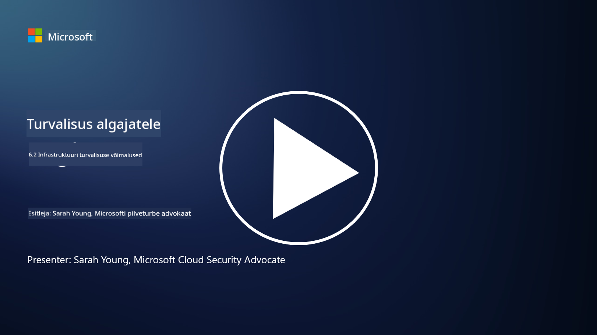

<!--
CO_OP_TRANSLATOR_METADATA:
{
  "original_hash": "7d79ba0e7668b3bdae1fba7aa047f6c0",
  "translation_date": "2025-10-11T11:18:15+00:00",
  "source_file": "6.2 Infrastructure security capabilities.md",
  "language_code": "et"
}
-->
# Infrastruktuuri turvalisuse võimalused

Selles jaotises käsitleme üksikasjalikumalt infrastruktuuri turvalisuse põhivahendeid ja -võimalusi.

**Sissejuhatus**

Selles õppetükis käsitleme:

- Mis on haavatavuste haldamine?

- Mis on CSPM?

- Mis on CNAPP?

## Mis on haavatavuste haldamine?

Haavatavuste haldamine on süstemaatiline protsess, mille käigus tuvastatakse, hinnatakse, prioritiseeritakse, leevendatakse ja jälgitakse arvutisüsteemide, tarkvara, võrkude ja infrastruktuuri haavatavusi. Selle peamine eesmärk on vähendada organisatsiooni kokkupuudet turvariskidega, tegeledes proaktiivselt teadaolevate haavatavustega enne, kui pahatahtlikud osapooled neid ära kasutada saavad. Siin on ülevaade peamistest sammudest:

Tuvastamine: Organisatsiooni varade, nagu serverid, rakendused, võrguseadmed ja lõpp-punktid, haavatavuste skaneerimine ja avastamine.

Hindamine: Iga haavatavuse tõsiduse ja võimaliku mõju hindamine, võttes arvesse näiteks Common Vulnerability Scoring System (CVSS) skoori ja ärikonteksti.

Prioritiseerimine: Haavatavuste järjestamine nende riskitaseme ja võimaliku mõju alusel organisatsiooni tegevusele ja andmetele.

Leevendamine: Strateegiate väljatöötamine ja rakendamine haavatavuste kõrvaldamiseks või leevendamiseks, mis võib hõlmata paranduste rakendamist, turvaseadete konfigureerimist või kompenseerivate kontrollide kasutuselevõttu.

Kinnitamine: Kontrollimine, kas leevendusmeetmed olid tõhusad haavatavuste kõrvaldamisel.

Pidev jälgimine: Haavatavuste ja potentsiaalsete ohtude pidev jälgimine regulaarsete skaneerimiste ja hindamistega.

Haavatavuste haldamine on küberjulgeoleku oluline komponent, mis aitab organisatsioonidel säilitada tugevat turvalisuse taset ja vähendada turvarikkumiste tõenäosust. Näited haavatavuste haldamise tööriistadest on Defender for Cloud, Nessus ja Qualys.

## Mis on CSPM?

Cloud Security Posture Management (CSPM) ehk pilveturvalisuse seisundi haldamine on tööriistade, protsesside ja praktikate kogum, mis on mõeldud pilvekeskkondade turvakonfiguratsioonide ja parimate tavade hindamiseks, jälgimiseks ja jõustamiseks. CSPM-lahendused aitavad organisatsioonidel tuvastada ja parandada valekonfiguratsioone, turvalünki ja vastavusnõuete rikkumisi nende pilveinfrastruktuuris, näiteks Amazon Web Services (AWS), Microsoft Azure, Google Cloud Platform (GCP) ja teised pilveteenuse pakkujad.

CSPM-i peamised aspektid hõlmavad:

- Konfiguratsiooni hindamine: Pilveressursside ja -teenuste skaneerimine, et tuvastada valekonfiguratsioone, ebaturvalisi seadeid ja kõrvalekaldeid turvalisuse parimatest tavadest.

- Turvapoliitika jõustamine: Turvapoliitikate ja vastavusstandardite jõustamine pilvekeskkondades, automaatselt valekonfiguratsioone parandades või teavitusi genereerides.

- Pidev jälgimine: Pilvevarade ja -ressursside turvalisuse seisundi pidev nähtavus, reaalajas teavitustega turvaintsidentide kohta.

- Vastavusaruandlus: Aruannete ja juhtpaneelide loomine, et näidata vastavust regulatiivsetele nõuetele ja tööstusstandarditele.

CSPM aitab organisatsioonidel tagada, et nende pilveinfrastruktuur on turvaline, vastavuses nõuetega ja kooskõlas parimate tavadega, vähendades pilvega seotud turvaintsidentide riski. Näited CSPM-i tööriistadest on Defender for Cloud ja Snyk.

## Mis on CNAPP?

CNAPP tähistab Cloud-Native Application Protection Platform ehk pilvepõhiste rakenduste kaitseplatvormi. See on kõik-ühes pilvepõhine tarkvaraplatvorm, mis lihtsustab pilveturvalisuse ohtude ja haavatavuste jälgimist, tuvastamist ja nendega tegelemist. CNAPP ühendab mitmed tööriistad ja võimalused ühte tarkvaralahendusse, et vähendada keerukust ja hõlbustada DevOps- ja DevSecOps-meeskondade tööd. CNAPP pakub terviklikku pilve- ja rakendusturvalisust kogu CI/CD rakenduse elutsükli jooksul, alates arendusest kuni tootmiseni. See vastab tööstuse vajadusele kaasaegsete pilveturvalisuse jälgimise, seisundi haldamise, rikkumiste ennetamise ja kontrollivahendite järele. CNAPP-lahendused annavad turvameeskondadele võimaluse kvantifitseerida ja reageerida riskidele pilvekeskkonnas. Mõned CNAPP-i funktsioonid hõlmavad täiustatud nähtavust, riskide kvantifitseerimist, turvalist tarkvaraarendust ja kombineeritud pilveturvalisuse lahendust. CNAPP integreerib mitmed traditsiooniliselt eraldiseisvad pilveturvalisuse lahendused ühte kasutajaliidesesse, muutes organisatsioonidel lihtsamaks kogu pilverakenduste ulatuse kaitsmise. CNAPP-id koondavad mitmeid pilvepõhiseid turvatööriistu ja andmeallikaid, sealhulgas konteinerite skaneerimist, pilveturvalisuse seisundi haldamist, infrastruktuuri kui koodi skaneerimist, pilveinfrastruktuuri õiguste haldamist ja pilve töökoormuse kaitseplatvorme.

## Lisalugemine
- [Mis on CSPM? | Microsoft Security](https://www.microsoft.com/security/business/security-101/what-is-cspm?WT.mc_id=academic-96948-sayoung)
- [Mis on pilveturvalisuse seisundi haldamine (CSPM)? | HackerOne](https://www.hackerone.com/knowledge-center/what-cloud-security-posture-management)
- [Pilveturvalisuse seisundi haldamise funktsioonid - Cloud Adoption Framework | Microsoft Learn](https://learn.microsoft.com/azure/cloud-adoption-framework/organize/cloud-security-posture-management?WT.mc_id=academic-96948-sayoung)
- [Mis on CNAPP? | Microsoft Security](https://www.microsoft.com/security/business/security-101/what-is-cnapp?WT.mc_id=academic-96948-sayoung)
- [Miks kõik räägivad CNAPP-ist (forbes.com)](https://www.forbes.com/sites/forbestechcouncil/2021/12/10/why-everyone-is-talking-about-cnapp/?sh=567275ca1549)
- [Kuidas parandada mitme pilve turvalisust pilvepõhise rakenduste kaitseplatvormiga (CNAPP)](https://www.youtube.com/watch?v=5w42kQ_QjZg&t=212s)

---

**Lahtiütlus**:  
See dokument on tõlgitud AI tõlketeenuse [Co-op Translator](https://github.com/Azure/co-op-translator) abil. Kuigi püüame tagada täpsust, palume arvestada, et automaatsed tõlked võivad sisaldada vigu või ebatäpsusi. Algne dokument selle algses keeles tuleks pidada autoriteetseks allikaks. Olulise teabe puhul soovitame kasutada professionaalset inimtõlget. Me ei vastuta selle tõlke kasutamisest tulenevate arusaamatuste või valesti tõlgenduste eest.