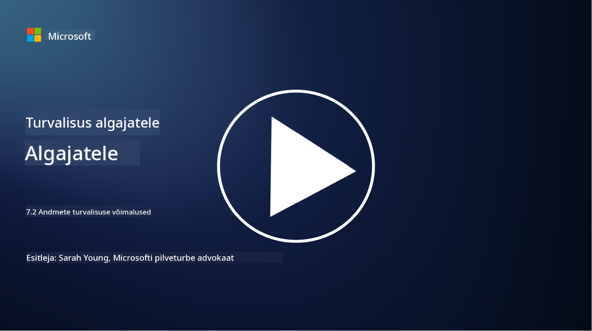

<!--
CO_OP_TRANSLATOR_METADATA:
{
  "original_hash": "50697add9758e54693442d502d2d5f8a",
  "translation_date": "2025-10-11T11:26:53+00:00",
  "source_file": "7.2 Data security capabilities.md",
  "language_code": "et"
}
-->
# Andmeturbe võimalused

Selles jaotises käsitleme põhjalikumalt andmeturbe põhivahendeid ja -võimalusi:

**Sissejuhatus**

Selles õppetükis käsitleme:

- Mis on andmekao ennetamise tööriistad?

- Mis on sisemiste riskide haldamise tööriistad?

- Millised andmete säilitamise tööriistad on saadaval?

## Mis on andmekao ennetamise tööriistad?

Andmekao ennetamise (DLP) tööriistad viitavad tarkvaralahendustele ja tehnoloogiatele, mis on loodud tundliku või konfidentsiaalse teabe volitamata juurdepääsu, jagamise või lekkimise vältimiseks organisatsioonis. Need tööriistad kasutavad sisu kontrollimist, poliitikate rakendamist ja jälgimist, et tuvastada ja kaitsta tundlikku teavet selle avalikustamise või väärkasutamise eest. Näited DLP toodetest: Symantec Data Loss Prevention, McAfee Total Protection for Data Loss Prevention, Microsoft 365 DLP**: Integreerub Microsoft 365 rakendustega, et aidata organisatsioonidel tuvastada ja kaitsta tundlikku teavet e-kirjades, dokumentides ja sõnumites.

## Mis on sisemiste riskide haldamise tööriistad?

Sisemiste riskide haldamise tööriistad aitavad organisatsioonidel tuvastada ja vähendada riske, mida põhjustavad töötajad, alltöövõtjad või partnerid, kes võivad tahtlikult või tahtmatult ohustada andmeturvet. Need tööriistad jälgivad kasutajate käitumist, juurdepääsumustreid ja andmete kasutamist, et tuvastada kahtlaseid tegevusi ja potentsiaalseid sisemisi ohte. Näited sisemiste riskide haldamise toodetest: Microsoft Insider Risk Management (osa Microsoft 365-st), Forcepoint Insider Threat Data Protection, Varonis Insider Threat Detection.

## Millised andmete säilitamise tööriistad on saadaval?

Andmete säilitamise tööriistad hõlmavad tarkvara ja lahendusi, mis on loodud andmete säilitamise ja kustutamise haldamiseks vastavalt organisatsiooni andmete säilitamise poliitikatele ja juriidilistele nõuetele. Need tööriistad aitavad automatiseerida andmete kindlaksmääratud ajaks säilitamise ja nende turvalise kustutamise protsessi, kui neid enam ei vajata. Näited andmete säilitamise toodetest: Veritas Enterprise Vault, Commvault Complete Data Protection, Microsoft data lifecycle management. Need tööriistad aitavad organisatsioonidel säilitada kontrolli andmete säilitamise ja kustutamise üle, tagades vastavuse andmekaitse määrustele ning hallates tõhusalt andmeid kogu nende elutsükli jooksul.

## Lisalugemine

- [Guide to Data Security Posture Management (DSPM) | CSA (cloudsecurityalliance.org)](https://cloudsecurityalliance.org/blog/2023/03/31/the-big-guide-to-data-security-posture-management-dspm/)
- [Andmekao ennetamine lõpp-punktides, rakendustes ja teenustes | Microsoft Purview](https://youtu.be/hvqq8L_0kgI)
- [18 parimat andmekao ennetamise tarkvara tööriista 2023 (tasuta + tasulised) (comparitech.com)](https://www.comparitech.com/data-privacy-management/data-loss-prevention-tools-software/)
- [Andmekao ennetamine (nist.gov)](https://tsapps.nist.gov/publication/get_pdf.cfm?pub_id=904672)
- [Lugege sisemiste riskide haldamise kohta | Microsoft Learn](https://learn.microsoft.com/purview/insider-risk-management?WT.mc_id=academic-96948-sayoung)
- [Andmete elutsükli haldamine | IBM](https://www.ibm.com/topics/data-lifecycle-management)
- [Mis on andmete elutsükli haldamine (DLM)? | 2023 parimad praktikad (selecthub.com)](https://www.selecthub.com/big-data-analytics/data-lifecycle-management/)

---

**Lahtiütlus**:  
See dokument on tõlgitud, kasutades AI tõlketeenust [Co-op Translator](https://github.com/Azure/co-op-translator). Kuigi püüame tagada täpsust, palun arvestage, et automaatsed tõlked võivad sisaldada vigu või ebatäpsusi. Algne dokument selle algkeeles tuleks lugeda autoriteetseks allikaks. Olulise teabe puhul on soovitatav kasutada professionaalset inimtõlget. Me ei vastuta selle tõlke kasutamisest tulenevate arusaamatuste või valede tõlgenduste eest.