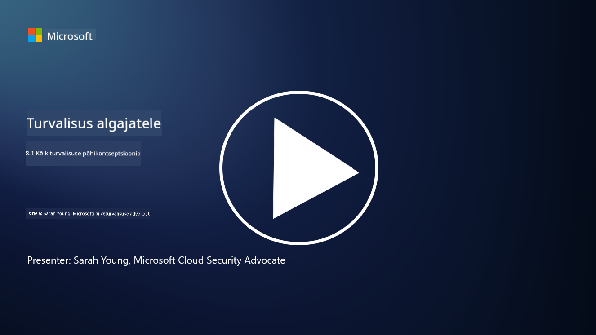

<!--
CO_OP_TRANSLATOR_METADATA:
{
  "original_hash": "66b61d96936cf25d20fcb411d4ce5227",
  "translation_date": "2025-10-11T11:18:55+00:00",
  "source_file": "8.1 AI security key concepts.md",
  "language_code": "et"
}
-->
# AI turvalisuse põhikontseptsioonid

## Kuidas AI turvalisus erineb traditsioonilisest küberturvalisusest?

AI-süsteemide turvalisuse tagamine toob kaasa ainulaadsed väljakutsed võrreldes traditsioonilise küberturvalisusega, peamiselt AI õppimisvõime ja otsustusprotsesside olemuse tõttu. Siin on mõned peamised erinevused:

-   **Andmete terviklikkus**: AI-süsteemid sõltuvad suuresti andmetest õppimiseks. [Andmete terviklikkuse tagamine on ülioluline, kuna ründajad võivad manipuleerida andmetega, et mõjutada AI käitumist, taktika, mida tuntakse andmete mürgitamisena.
-   **Mudeliturvalisus**: AI otsustusmudel ise võib olla sihtmärk. [Ründajad võivad proovida mudelit tagurpidi insenerida või ära kasutada selle nõrkusi, et teha valesid või kahjulikke otsuseid.
-   **Adversariaalsed rünnakud**: AI-süsteemid võivad olla vastuvõtlikud adversariaalsetele rünnakutele, kus sisendandmetesse tehakse väikeseid, sageli märkamatuid muudatusi, mis põhjustavad AI-l vigu või valesid prognoose.
-   **Infrastruktuuri turvalisus**: Kuigi traditsiooniline küberturvalisus keskendub ka infrastruktuuri kaitsmisele, võivad AI-süsteemid sisaldada täiendavaid keerukuse kihte, nagu pilvepõhised teenused või spetsiaalne riistvara, mis vajavad spetsiifilisi turvameetmeid.
-   **Eetilised kaalutlused**: AI kasutamine turvalisuses toob kaasa eetilisi kaalutlusi, nagu privaatsuse küsimused ja võimaliku kallutatuse oht otsuste tegemisel, mida tuleb turvastrateegias arvesse võtta.

Kokkuvõttes nõuab AI-süsteemide turvalisus teistsugust lähenemist, mis arvestab AI tehnoloogia ainulaadseid aspekte, sealhulgas andmete, mudelite ja AI õppimisprotsessi kaitset, samal ajal tegeledes AI kasutuse eetiliste tagajärgedega.

AI turvalisus ja traditsiooniline küberturvalisus jagavad palju sarnasusi, kuid neil on ka mõned olulised erinevused, mis tulenevad tehisintellekti süsteemide unikaalsetest omadustest ja võimekusest. Siin on, kuidas need erinevad:

- **Ohtude keerukus**: AI-süsteemid toovad küberturvalisusse uusi keerukuse kihte. Traditsiooniline küberturvalisus tegeleb peamiselt ohtudega nagu pahavara, andmepüük ja võrgu sissetungid. Kuid AI-süsteemid võivad olla haavatavad rünnakutele, nagu adversariaalsed rünnakud, andmete mürgitamine ja mudeli vältimine, mis sihivad otseselt masinõppe algoritme.

- **Rünnaku pind**: AI-süsteemidel on sageli suurem rünnaku pind võrreldes traditsiooniliste süsteemidega. See tuleneb sellest, et nad ei sõltu ainult tarkvarast, vaid ka andmetest ja mudelitest. Ründajad võivad sihtida treeningandmeid, manipuleerida mudeleid või ära kasutada algoritmide haavatavusi.

- **Ohtude kohanemisvõime**: AI-süsteemid võivad kohaneda ja õppida oma keskkonnast, mis muudab nad vastuvõtlikumaks kohanduvatele ja arenevatele ohtudele. Traditsioonilised küberturvalisuse meetmed ei pruugi olla piisavad, et kaitsta rünnakute eest, mis pidevalt arenevad vastavalt AI-süsteemi käitumisele.

- **Tõlgendatavus ja seletatavus**: AI-süsteemi otsuste põhjuste mõistmine on sageli keerulisem võrreldes traditsiooniliste tarkvarasüsteemidega. See tõlgendatavuse ja seletatavuse puudumine võib raskendada AI-süsteemide rünnakute tuvastamist ja leevendamist.

- **Andmete privaatsuse küsimused**: AI-süsteemid sõltuvad sageli suurtest andmehulkadest, mis võivad tuua kaasa privaatsusriske, kui neid ei käsitleta korralikult. Traditsioonilised küberturvalisuse meetmed ei pruugi piisavalt käsitleda AI-süsteemide spetsiifilisi andmete privaatsuse küsimusi.

- **Regulatiivne vastavus**: AI turvalisuse regulatiivne maastik on alles kujunemas, kus ilmuvad spetsiifilised regulatsioonid ja standardid, et käsitleda AI-süsteemide ainulaadseid väljakutseid. Traditsioonilised küberturvalisuse raamistikud võivad vajada laiendamist või kohandamist, et tagada vastavus nendele uutele regulatsioonidele.

- **Eetilised kaalutlused**: AI turvalisus hõlmab mitte ainult süsteemide kaitsmist pahatahtlike rünnakute eest, vaid ka tagamist, et AI-süsteeme kasutatakse eetiliselt ja vastutustundlikult. See hõlmab selliseid kaalutlusi nagu õiglus, läbipaistvus ja vastutus, mis ei pruugi olla traditsioonilises küberturvalisuses nii silmapaistvad.

## Kuidas AI turvalisus sarnaneb traditsiooniliste IT-süsteemide turvalisusega?

AI-süsteemide turvalisus jagab mitmeid põhimõtteid traditsioonilise küberturvalisusega:

-   **Ohtude kaitse**: Nii AI kui ka traditsioonilised süsteemid vajavad kaitset volitamata juurdepääsu, andmete muutmise ja hävitamise ning muude levinud ohtude eest.
-   **Haavatavuste haldamine**: Paljud haavatavused, mis mõjutavad traditsioonilisi süsteeme, nagu tarkvaravead või valekonfiguratsioonid, võivad mõjutada ka AI-süsteeme.
-   **Andmete turvalisus**: Töödeldud andmete kaitse on mõlemas valdkonnas ülioluline, et vältida andmeleket ja tagada konfidentsiaalsus.
-   **Tarneahela turvalisus**: Mõlemat tüüpi süsteemid on vastuvõtlikud tarneahela rünnakutele, kus kompromiteeritud komponent võib ohustada kogu süsteemi turvalisust.

Need sarnasused rõhutavad, et kuigi AI-süsteemid toovad kaasa uusi turvalisuse väljakutseid, vajavad nad ka traditsiooniliste küberturvalisuse praktikate rakendamist, et tagada tugev kaitse. See on segu traditsioonilise turvalisuse tarkuse kasutamisest ja AI tehnoloogia unikaalsete aspektide kohandamisest.

## Lisalugemine

- [Not with a Bug, But with a Sticker [Raamat] (oreilly.com)](https://www.oreilly.com/library/view/not-with-a/9781119883982/)
   
- [Intro to AI Security Part 1: AI Security 101 | by HarrietHacks | Medium](https://medium.com/@harrietfarlow/intro-to-ai-security-part-1-ai-security-101-b8662a9efe5)
   
- [Parimad praktikad AI turvalisuse riskijuhtimiseks | Microsoft Security Blog](https://www.microsoft.com/en-us/security/blog/2021/12/09/best-practices-for-ai-security-risk-management/?WT.mc_id=academic-96948-sayoung)
   
- [OWASP AI turvalisuse ja privaatsuse juhend | OWASP Foundation](https://owasp.org/www-project-ai-security-and-privacy-guide/)

---

**Lahtiütlus**:  
See dokument on tõlgitud AI tõlketeenuse [Co-op Translator](https://github.com/Azure/co-op-translator) abil. Kuigi püüame tagada täpsust, palume arvestada, et automaatsed tõlked võivad sisaldada vigu või ebatäpsusi. Algne dokument selle algses keeles tuleks pidada autoriteetseks allikaks. Olulise teabe puhul soovitame kasutada professionaalset inimtõlget. Me ei vastuta selle tõlke kasutamisest tulenevate arusaamatuste või valesti tõlgenduste eest.