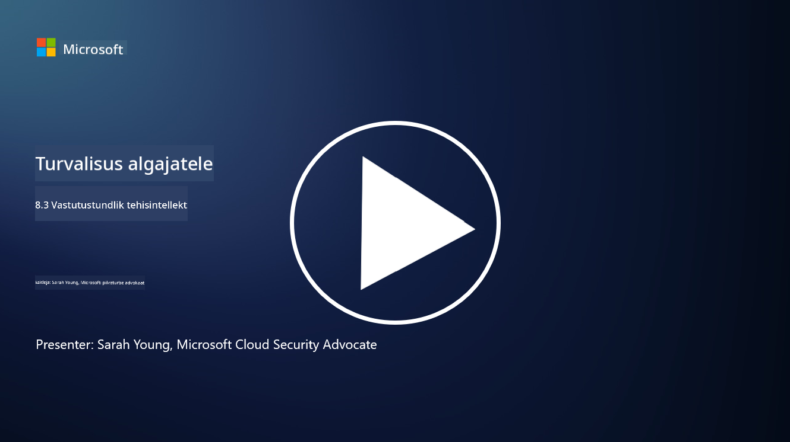

<!--
CO_OP_TRANSLATOR_METADATA:
{
  "original_hash": "5e9775ee91bde7d44577891d5f11c4c5",
  "translation_date": "2025-10-11T11:27:28+00:00",
  "source_file": "8.3 Responsible AI.md",
  "language_code": "et"
}
-->
# Vastutustundlik tehisintellekt

## Mis on vastutustundlik tehisintellekt ja kuidas see seostub tehisintellekti turvalisusega?

Vastutustundlik tehisintellekt viitab tehisintellekti arendamisele ja kasutamisele viisil, mis on eetiline, läbipaistev ja kooskõlas ühiskondlike väärtustega. See hõlmab selliseid põhimõtteid nagu õiglus, vastutus ja töökindlus, tagades, et tehisintellekti süsteemid on loodud ja toimivad eesmärgiga tuua kasu üksikisikutele, kogukondadele ja ühiskonnale tervikuna.

Vastutustundliku tehisintellekti ja tehisintellekti turvalisuse vaheline seos on oluline, kuna:

-   **Eetilised kaalutlused**: Vastutustundlik tehisintellekt hõlmab eetilisi kaalutlusi, mis mõjutavad otseselt turvalisust, näiteks privaatsus ja andmekaitse. Tehisintellekti süsteemide tagamine, et need austavad kasutajate privaatsust ja kaitsevad isikuandmeid, on vastutustundliku tehisintellekti oluline osa.
-   **Töökindlus ja usaldusväärsus**: Tehisintellekti süsteemid peavad olema vastupidavad manipuleerimisele ja rünnakutele, mis on nii vastutustundliku tehisintellekti kui ka tehisintellekti turvalisuse põhialus. See hõlmab kaitset pahatahtlike rünnakute eest ja tehisintellekti otsustusprotsesside terviklikkuse tagamist.
-   **Läbipaistvus ja selgitatavus**: Vastutustundliku tehisintellekti osa on tagada, et tehisintellekti süsteemid oleksid läbipaistvad ja nende otsuseid saaks selgitada. See on turvalisuse seisukohalt oluline, kuna osapooled peavad mõistma, kuidas tehisintellekti süsteemid toimivad, et usaldada nende turvameetmeid.
-   **Vastutus**: Tehisintellekti süsteemid peaksid olema vastutavad oma tegevuse eest, mis tähendab, et peavad olema mehhanismid otsuste jälgimiseks ja probleemide lahendamiseks. See on kooskõlas turvalisuse praktikatega, mis jälgivad ja auditeerivad süsteemi tegevusi, et ennetada ja reageerida rikkumistele.

Kokkuvõttes on vastutustundlik tehisintellekt ja tehisintellekti turvalisus omavahel tihedalt seotud, kus vastutustundliku tehisintellekti põhimõtete rakendamine aitab luua tehisintellekti süsteeme, mis on mitte ainult eetiliselt korrektsed, vaid ka turvalisemad võimalike ohtude vastu.

## Kuidas tagada, et minu tehisintellekti süsteem oleks nii turvaline kui ka eetiline?

Tagamaks, et teie tehisintellekti süsteem oleks nii turvaline kui ka eetiline, on vaja mitmekülgset lähenemist, mis hõlmab järgmisi samme:

- **Järgige eetilisi põhimõtteid**: Järgige kehtestatud eetilisi juhiseid, mis rõhutavad inimeste, ühiskonna ja keskkonna heaolu; õiglust; privaatsuse kaitset; töökindlust; läbipaistvust; vaidlustatavust ja vastutust.

- **Rakendage tugevaid turvameetmeid**: Kasutage proaktiivset turvatestimist ja tehisintellekti usalduse, riskide ja turvalisuse haldamise programme, et kaitsta ohtude ja haavatavuste eest.

- **Kaasa mitmekesised osapooled**: Kaasake tehisintellekti arendamise protsessi lai valik osalejaid, sealhulgas eetikaeksperte, sotsiaalteadlasi ja mõjutatud kogukondade esindajaid, et tagada mitmekesiste vaatenurkade ja väärtuste arvestamine.

- **Tagage läbipaistvus ja selgitatavus**: Veenduge, et tehisintellekti otsustusprotsessid oleksid läbipaistvad ja selgitatavad, võimaldades suuremat usaldust ja lihtsamat võimalike eelarvamuste või vigade tuvastamist.

- **Säilitage andmete privaatsus**: Kaitske andmete privaatsust ja autentsust krüpteerimise ja muude andmekaitsemeetmete abil, et austada kasutajate privaatsusõigusi.

- **Võimaldage inimjärelevalvet**: Rakendage mehhanisme inimjärelevalveks, et võimaldada tehisintellekti süsteemide otsuste vaidlustamist ja tagada vastutus.

- **Olge kursis tehisintellekti turvalisusega**: Hoidke end kursis uusimate uuringute ja aruteludega tehisintellekti turvalisuse teemal, et mõista tehisintellekti turvalisuse ja eetika muutuvat maastikku.

- **Järgige regulatsioone**: Veenduge, et teie tehisintellekti süsteem vastab kõigile asjakohastele seadustele ja regulatsioonidele, mis võivad hõlmata andmekaitse seadusi, diskrimineerimisvastaseid seadusi ja tööstusharu spetsiifilisi juhiseid.

## Kas saate tuua näiteid turvalisuse probleemidest, mis on põhjustatud tehisintellekti ebaeetilisest kasutamisest?

Siin on mõned näited turvalisuse probleemidest, mis võivad tekkida tehisintellekti ebaeetilisest kasutamisest:

- **Eelarvamuslik otsustamine**: Tehisintellekti süsteemid võivad olemasolevaid eelarvamusi säilitada ja võimendada, kui neid treenitakse eelarvamuslikel andmekogumitel. Näiteks, kui otsingumootor treenitakse andmetel, mis kajastavad ühiskondlikke stereotüüpe, võib see kuvada eelarvamuslikke otsingutulemusi, mis võivad viia ebaõiglase kohtlemise või diskrimineerimiseni.

- **Tehisintellekt kohtusüsteemides**: Tehisintellekti kasutamine õiguslike otsuste tegemisel võib tekitada eetilisi probleeme, eriti kui tehisintellekti otsustusprotsess ei ole läbipaistev või on mõjutatud eelarvamuslikest andmetest. See võib viia ebaõiglaste õiguslike tulemusteni ja rikkuda inimeste õigusi.

- **Tehisintellekti süsteemide manipuleerimine**: Tehisintellekti süsteemid võivad olla vastuvõtlikud pahatahtlikele rünnakutele, kus sisendandmete väiksed muudatused võivad põhjustada valesid tulemusi. Näiteks autonoomsed sõidukid võivad ekslikult tõlgendada liiklusmärke, mis võib põhjustada ohutusriske.

- **Tehisintellekti juhitud jälgimine**: Tehisintellekti kasutamine jälgimise eesmärgil võib viia privaatsuse rikkumiseni, eriti kui seda kasutatakse ilma nõuetekohase nõusolekuta või viisil, mis rikub isikuvabadusi. See võib olla eriti problemaatiline autoritaarsetes režiimides, kus tehisintellekti kasutatakse dissidentide jälgimiseks ja mahasurumiseks.

Need näited rõhutavad eetiliste kaalutluste olulisust tehisintellekti süsteemide arendamisel ja kasutamisel, et vältida turvalisuse probleeme ning kaitsta inimeste õigusi ja privaatsust.

## Lisalugemine

 - [Microsofti vastutustundliku tehisintellekti standard v2 üldnõuded](https://query.prod.cms.rt.microsoft.com/cms/api/am/binary/RE5cmFl?culture=en-us&country=us&WT.mc_id=academic-96948-sayoung)
 - [Vastutustundlik tehisintellekt (mit.edu)](https://sloanreview.mit.edu/big-ideas/responsible-ai/)
 - [13 põhimõtet tehisintellekti vastutustundlikuks kasutamiseks (hbr.org)](https://hbr.org/2023/06/13-principles-for-using-ai-responsibly)

---

**Lahtiütlus**:  
See dokument on tõlgitud AI tõlketeenuse [Co-op Translator](https://github.com/Azure/co-op-translator) abil. Kuigi püüame tagada täpsust, palume arvestada, et automaatsed tõlked võivad sisaldada vigu või ebatäpsusi. Algne dokument selle algses keeles tuleks pidada autoriteetseks allikaks. Olulise teabe puhul soovitame kasutada professionaalset inimtõlget. Me ei vastuta selle tõlke kasutamisest tulenevate arusaamatuste või valesti tõlgenduste eest.