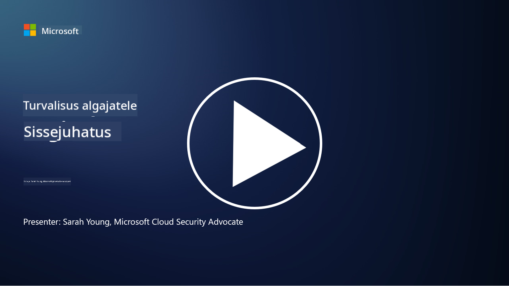

<!--
CO_OP_TRANSLATOR_METADATA:
{
  "original_hash": "33e83c2beb28a1b6e031416624dc23aa",
  "translation_date": "2025-10-11T11:21:39+00:00",
  "source_file": "README.md",
  "language_code": "et"
}
-->

### 🌐 Mitmekeelne tugi

#### Toetatud GitHub Actioni kaudu (automaatne ja alati ajakohane)

<!-- CO-OP TRANSLATOR LANGUAGES TABLE START -->
[Araabia](../ar/README.md) | [Bengali](../bn/README.md) | [Bulgaaria](../bg/README.md) | [Birma (Myanmar)](../my/README.md) | [Hiina (lihtsustatud)](../zh/README.md) | [Hiina (traditsiooniline, Hongkong)](../hk/README.md) | [Hiina (traditsiooniline, Macau)](../mo/README.md) | [Hiina (traditsiooniline, Taiwan)](../tw/README.md) | [Horvaatia](../hr/README.md) | [Tšehhi](../cs/README.md) | [Taani](../da/README.md) | [Hollandi](../nl/README.md) | [Eesti](./README.md) | [Soome](../fi/README.md) | [Prantsuse](../fr/README.md) | [Saksa](../de/README.md) | [Kreeka](../el/README.md) | [Heebrea](../he/README.md) | [Hindi](../hi/README.md) | [Ungari](../hu/README.md) | [Indoneesia](../id/README.md) | [Itaalia](../it/README.md) | [Jaapani](../ja/README.md) | [Korea](../ko/README.md) | [Leedu](../lt/README.md) | [Malai](../ms/README.md) | [Marathi](../mr/README.md) | [Nepali](../ne/README.md) | [Norra](../no/README.md) | [Pärsia (Farsi)](../fa/README.md) | [Poola](../pl/README.md) | [Portugali (Brasiilia)](../br/README.md) | [Portugali (Portugal)](../pt/README.md) | [Pandžabi (Gurmukhi)](../pa/README.md) | [Rumeenia](../ro/README.md) | [Vene](../ru/README.md) | [Serbia (kirillitsa)](../sr/README.md) | [Slovaki](../sk/README.md) | [Sloveeni](../sl/README.md) | [Hispaania](../es/README.md) | [Suahiili](../sw/README.md) | [Rootsi](../sv/README.md) | [Tagalogi (Filipino)](../tl/README.md) | [Tamili](../ta/README.md) | [Tai](../th/README.md) | [Türgi](../tr/README.md) | [Ukraina](../uk/README.md) | [Urdu](../ur/README.md) | [Vietnami](../vi/README.md)
<!-- CO-OP TRANSLATOR LANGUAGES TABLE END -->

**Kui soovite lisada täiendavaid tõlkeid, toetatud keeled on loetletud [siin](https://github.com/Azure/co-op-translator/blob/main/getting_started/supported-languages.md)**

#### Liitu meie kogukonnaga 

# 🚀 Küberjulgeolek algajatele – õppekava

Kiirelt muutuvas AI-tehnoloogia ajastus on IT-süsteemide turvalisuse mõistmine veelgi olulisem. See kursus on loodud selleks, et õpetada teile küberjulgeoleku põhimõisteid ja alustada teie turvalisuse õppimist. Kursus on sõltumatu konkreetsetest tootjatest ja jagatud väikesteks õppetundideks, mille läbimine võtab umbes 30–60 minutit. Iga õppetund sisaldab väikest testi ja viiteid täiendavale lugemisele, kui soovite teemasse süveneda.

Mida see kursus hõlmab 📚

- 🔐 Põhilised küberjulgeoleku mõisted, nagu CIA kolmik, riskide ja ohtude erinevused jne.
- 🛡️ Turvakontrollide mõistmine ja nende erinevad vormid.
- 🌐 Nullusalduse kontseptsiooni mõistmine ja selle tähtsus kaasaegses küberjulgeolekus.
- 🔑 Oluliste mõistete ja teemade mõistmine identiteedi, võrgu, turvaoperatsioonide, infrastruktuuri ja andmete turvalisuse valdkonnas.
- 🔧 Näited tööriistadest, mida kasutatakse turvakontrollide rakendamiseks.

Mida see kursus ei hõlma 🙅‍♂️

- 🚫 Konkreetsete turvatööriistade kasutamise õpetamist.
- 🚫 "Häkkimise" või ründemeeskonna/offensiivse turvalisuse õpetamist.
- 🚫 Konkreetsete vastavusstandardite õppimist.

Kui olete selle kursuse lõpetanud, saate jätkata meie Microsoft Learn moodulitega. Soovitame jätkata õppimist [Microsoft Security, Compliance, and Identity Fundamentals.](https://learn.microsoft.com/training/paths/describe-concepts-of-security-compliance-identity/?WT.mc_id=academic-96948-sayoung)

Lõpuks võite kaaluda [eksami SC-900: Microsoft Security, Compliance, and Identity Fundamentals eksami](https://learn.microsoft.com/credentials/certifications/exams/sc-900/?WT.mc_id=academic-96948-sayoung) sooritamist.

> 💁 Kui teil on selle kursuse kohta tagasisidet või ettepanekuid, mida võiksime lisada, oleksime väga tänulikud!

## Moodulite ülevaade 📝 
| **Mooduli number** | **Mooduli nimi**                         | **Õpetatavad mõisted**               | **Õpieesmärgid**                                                                                               |
|--------------------|------------------------------------------|--------------------------------------|----------------------------------------------------------------------------------------------------------------|
| **1.1**            | Põhilised turvalisuse mõisted            | [CIA kolmik](https://github.com/microsoft/Security-101/blob/main/1.1%20The%20CIA%20triad%20and%20other%20key%20concepts.md)                        | Õppige konfidentsiaalsuse, kättesaadavuse ja terviklikkuse kohta. Samuti autentsuse, mitte-eitamise ja privaatsuse kohta. |
| **1.2**            | Põhilised turvalisuse mõisted            | [Levinud küberjulgeoleku ohud](https://github.com/microsoft/Security-101/blob/main/1.2%20Common%20cybersecurity%20threats.md)        | Õppige tundma levinud küberjulgeoleku ohte, millega seisavad silmitsi nii üksikisikud kui organisatsioonid.     |
| **1.3**            | Põhilised turvalisuse mõisted            | [Riskijuhtimise mõistmine](https://github.com/microsoft/Security-101/blob/main/1.3%20Understanding%20risk%20management.md)       | Õppige hindama ja mõistma riske – mõju/tõenäosus ja kontrollide rakendamine.                                                                                                               | |
| **1.4**            | Põhilised turvalisuse mõisted            | [Turvatavad ja dokumentatsioon](https://github.com/microsoft/Security-101/blob/main/1.4%20Security%20practices%20and%20documentation.md) | Õppige tundma poliitikate, protseduuride, standardite ja regulatsioonide/seaduste erinevusi.                     |
| **1.5**            | Põhilised turvalisuse mõisted            | [Nullusalduse kontseptsioon](https://github.com/microsoft/Security-101/blob/main/1.5%20Zero%20trust.md)                           | Õppige, mis on nullusalduse kontseptsioon ja kuidas see mõjutab arhitektuuri. Mis on süvaturve?                 |
| **1.6**            | Põhilised turvalisuse mõisted            | [Jagatud vastutuse mudel](https://github.com/microsoft/Security-101/blob/main/1.6%20Shared%20responsibility%20model.md)                           | Mis on jagatud vastutuse mudel ja kuidas see mõjutab küberjulgeolekut?                  |
| **1.7**            | [Mooduli lõputest](https://github.com/microsoft/Security-101/blob/main/1.7%20End%20of%20module%20quiz.md)                        |                                      |                                                                                                                 |
| **2.1**            | Identiteedi ja juurdepääsu halduse alused | [IAM põhikontseptsioonid](https://github.com/microsoft/Security-101/blob/main/2.1%20IAM%20key%20concepts.md)                     | Õppige tundma vähima privileegi põhimõtet, ülesannete eraldamist ja kuidas IAM toetab nullusalduse kontseptsiooni. |
| **2.2**            | Identiteedi ja juurdepääsu halduse alused | [IAM nullusalduse arhitektuur](https://github.com/microsoft/Security-101/blob/main/2.2%20IAM%20zero%20trust%20architecture.md)          | Õppige, kuidas identiteet on kaasaegsete IT-keskkondade uus perimeeter ja milliseid ohte see leevendab.          |
| **2.3**            | Identiteedi ja juurdepääsu halduse alused | [IAM võimekused](https://github.com/microsoft/Security-101/blob/main/2.3%20IAM%20capabilities.md)                     | Õppige tundma IAM võimekusi ja kontrolle identiteetide turvalisuse tagamiseks.                                   |
| **2.4**            | [Mooduli lõputest](https://github.com/microsoft/Security-101/blob/main/2.4%20End%20of%20module%20quiz.md)                        |                                      |                                                                                                                 |
| **3.1**            | Võrgu turvalisuse alused                 | [Võrgu põhikontseptsioonid](https://github.com/microsoft/Security-101/blob/main/3.1%20Networking%20key%20concepts.md)              | Õppige tundma võrgu kontseptsioone (IP-aadressid, portide numbrid, krüpteerimine jne).                           |
| **3.2**            | Võrgu turvalisuse alused                 | [Võrgu nullusalduse arhitektuur](https://github.com/microsoft/Security-101/blob/main/3.2%20Networking%20zero%20trust%20architecture.md)   | Õppige, kuidas võrgu turvalisus aitab kaasa E2E nullusalduse arhitektuurile ja milliseid ohte see leevendab.    |
| **3.3**            | Võrgu turvalisuse alused                 | [Võrgu turvalisuse võimekused](https://github.com/microsoft/Security-101/blob/main/3.3%20Network%20security%20capabilities.md)        | Õppige tundma võrgu turvalisuse tööriistu – tulemüürid, WAF, DDoS kaitse jne.                                    |
| **3.4**            | [Mooduli lõputest](https://github.com/microsoft/Security-101/blob/main/3.4%20End%20of%20module%20quiz.md)                        |                                      |                                                                                                                 |
| **4.1**            | Turvaoperatsioonide alused               | [SecOps põhikontseptsioonid](https://github.com/microsoft/Security-101/blob/main/4.1%20SecOps%20key%20concepts.md)                  | Õppige, miks turvaoperatsioonid on olulised ja kuidas need erinevad tavapärastest IT-operatsioonide meeskondadest. |
| **4.2**            | Turvaoperatsioonide alused               | [SecOps nullusalduse arhitektuur](https://github.com/microsoft/Security-101/blob/main/4.2%20SecOps%20zero%20trust%20architecture.md)       | Õppige, kuidas SecOps aitab kaasa E2E nullusalduse arhitektuurile ja milliseid ohte see leevendab.              |
| **4.3**            | Turvaoperatsioonide alused               | [SecOps võimekused](https://github.com/microsoft/Security-101/blob/main/4.3%20SecOps%20capabilities.md)                  | Õppige tundma SecOps tööriistu – SIEM, XDR jne.                                                                 |
| **4.4**            | [Mooduli lõputest](https://github.com/microsoft/Security-101/blob/main/4.4%20End%20of%20module%20quiz.md)                        |                                      |                                                                                                                 |
| **5.1**            | Rakenduste turvalisuse alused            | [AppSec põhikontseptsioonid](https://github.com/microsoft/Security-101/blob/main/5.1%20AppSec%20key%20concepts.md)                  | Õppige tundma AppSec kontseptsioone, nagu turvalisus disainis, sisendi valideerimine jne.                        |
| **5.2**           | Rakenduste turvalisuse alused            | [AppSec võimalused](https://github.com/microsoft/Security-101/blob/main/5.2%20AppSec%20key%20capabilities.md)                  | Õpi tundma AppSec tööriistu: turvalisuse tööriistad torujuhtmes, koodi skaneerimine, saladuste skaneerimine jne.                       |
| **5.3**           | [Mooduli lõpu test](https://github.com/microsoft/Security-101/blob/main/5.3%20End%20of%20module%20quiz.md)                        |                                      |                                                                                                                 |
| **6.1**           | Infrastruktuuri turvalisuse alused       | [Infrastruktuuri turvalisuse põhikontseptsioonid](https://github.com/microsoft/Security-101/blob/main/6.1%20Infrastructure%20security%20key%20concepts.md) | Õpi tundma süsteemide tugevdamist, plaastrite rakendamist, turvalisuse hügieeni, konteinerite turvalisust.                                  |
| **6.2**           | Infrastruktuuri turvalisuse alused       | [Infrastruktuuri turvalisuse võimalused](https://github.com/microsoft/Security-101/blob/main/6.2%20Infrastructure%20security%20capabilities.md) | Õpi tundma tööriistu, mis aitavad infrastruktuuri turvalisust tagada, nt CSPM, konteinerite turvalisus jne.            |
| **6.3**           | [Mooduli lõpu test](https://github.com/microsoft/Security-101/blob/main/6.3%20End%20of%20module%20quiz.md)                        |                                      |                                                                                                                 |
| **7.1**           | Andmete turvalisuse alused               | [Andmete turvalisuse põhikontseptsioonid](https://github.com/microsoft/Security-101/blob/main/7.1%20Data%20security%20key%20concepts.md)           | Õpi tundma andmete klassifitseerimist ja säilitamist ning miks see on organisatsioonile oluline.                     |
| **7.2**           | Andmete turvalisuse alused               | [Andmete turvalisuse võimalused](https://github.com/microsoft/Security-101/blob/main/7.2%20Data%20security%20capabilities.md)           | Õpi tundma andmete turvalisuse tööriistu – DLP, sisemiste riskide haldamine, andmete haldus jne.                          |
| **7.3**           | [Mooduli lõpu test](https://github.com/microsoft/Security-101/blob/main/7.3%20End%20of%20module%20quiz.md)                        |
| **8.1**           | Tehisintellekti turvalisuse alused       | [AI turvalisuse põhikontseptsioonid](https://github.com/microsoft/Security-101/blob/main/8.1%20AI%20security%20key%20concepts.md)          | Õpi tundma traditsioonilise turvalisuse ja AI turvalisuse erinevusi ja sarnasusi.                 |
| **8.2**           | Tehisintellekti turvalisuse alused       | [AI turvalisuse võimalused](https://github.com/microsoft/Security-101/blob/main/8.2%20AI%20security%20capabilities.md)           | Õpi tundma AI turvalisuse tööriistu ja kontrollimeetmeid, mida saab kasutada AI turvalisuse tagamiseks.                         |
| **8.3**           | Tehisintellekti turvalisuse alused       | [Vastutustundlik AI](https://github.com/microsoft/Security-101/blob/main/8.3%20Responsible%20AI.md)          | Õpi tundma, mis on vastutustundlik AI ja AI-spetsiifilisi ohte, millest turvalisuse spetsialistid peaksid teadlikud olema.                          |
| **8.4**           | [Mooduli lõpu test](https://github.com/microsoft/Security-101/blob/main/8.4%20End%20of%20module%20quiz.md)     

## 🎒 Muud kursused 

Meie meeskond pakub ka teisi kursusi! Vaata:

- [Generatiivne AI algajatele](https://aka.ms/genai-beginners)
- [Generatiivne AI algajatele .NET](https://github.com/microsoft/Generative-AI-for-beginners-dotnet)
- [Generatiivne AI JavaScriptiga](https://github.com/microsoft/generative-ai-with-javascript)
- [Generatiivne AI Javaga](https://github.com/microsoft/Generative-AI-for-beginners-java)
- [AI algajatele](https://aka.ms/ai-beginners)
- [Andmeteadus algajatele](https://aka.ms/datascience-beginners)
- [Masinõpe algajatele](https://aka.ms/ml-beginners)
- [Küberjulgeolek algajatele](https://github.com/microsoft/Security-101) 
- [Veebiarendus algajatele](https://aka.ms/webdev-beginners)
- [IoT algajatele](https://aka.ms/iot-beginners)
- [XR arendus algajatele](https://github.com/microsoft/xr-development-for-beginners)
- [GitHub Copiloti valdamine paarisprogrammeerimiseks](https://github.com/microsoft/Mastering-GitHub-Copilot-for-Paired-Programming)
- [GitHub Copiloti valdamine C#/.NET arendajatele](https://github.com/microsoft/mastering-github-copilot-for-dotnet-csharp-developers)
- [Vali oma Copiloti seiklus](https://github.com/microsoft/CopilotAdventures)

---

**Lahtiütlus**:  
See dokument on tõlgitud AI tõlketeenuse [Co-op Translator](https://github.com/Azure/co-op-translator) abil. Kuigi püüame tagada täpsust, palume arvestada, et automaatsed tõlked võivad sisaldada vigu või ebatäpsusi. Algne dokument selle algses keeles tuleks pidada autoriteetseks allikaks. Olulise teabe puhul soovitame kasutada professionaalset inimtõlget. Me ei vastuta selle tõlke kasutamisest tulenevate arusaamatuste või valesti tõlgenduste eest.