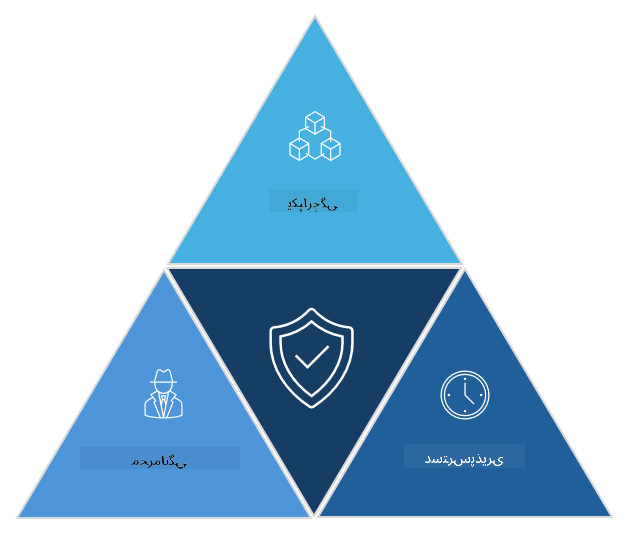

<!--
CO_OP_TRANSLATOR_METADATA:
{
  "original_hash": "16a76f9fa372fb63cffb6d76b855f023",
  "translation_date": "2025-09-03T18:46:54+00:00",
  "source_file": "1.1 The CIA triad and other key concepts.md",
  "language_code": "fa"
}
-->
# سه‌گانه CIA و مفاهیم کلیدی دیگر

## مقدمه

در این درس، به موارد زیر می‌پردازیم:

- امنیت سایبری چیست؟

- سه‌گانه CIA در امنیت سایبری چیست؟

- اصالت، عدم انکار و حریم خصوصی در زمینه امنیت سایبری چه معنایی دارند؟

## امنیت سایبری چیست؟

امنیت سایبری، که به عنوان امنیت اطلاعات نیز شناخته می‌شود، به معنای حفاظت از سیستم‌های کامپیوتری، شبکه‌ها، دستگاه‌ها و داده‌ها در برابر حملات دیجیتال، دسترسی غیرمجاز، آسیب یا سرقت است. هدف اصلی امنیت سایبری تضمین محرمانگی، یکپارچگی و دسترسی‌پذیری دارایی‌ها و اطلاعات دیجیتال است. متخصصان امنیت سایبری کنترل‌های امنیتی را طراحی و اجرا می‌کنند تا از دارایی‌ها، داده‌ها و اطلاعات محافظت کنند. با دیجیتالی شدن و آنلاین شدن بخش‌های بیشتری از زندگی ما، امنیت سایبری به یکی از نگرانی‌های اصلی افراد و سازمان‌ها تبدیل شده است.

## سه‌گانه CIA در امنیت سایبری چیست؟

سه‌گانه امنیت سایبری به مدلی اشاره دارد که سه ملاحظه اصلی برای هر کار امنیت سایبری یا طراحی یک سیستم/محیط را در بر می‌گیرد:

### محرمانگی

این ملاحظه‌ای است که اکثر افراد هنگام فکر کردن به "امنیت سایبری" با آن آشنا هستند: محرمانگی فرآیند حفاظت از داده‌ها و اطلاعات در برابر تلاش‌های دسترسی غیرمجاز است، یعنی فقط افرادی که نیاز به دیدن اطلاعات دارند قادر به دسترسی به آن هستند. البته همه داده‌ها به یک اندازه مهم نیستند و معمولاً داده‌ها بر اساس میزان آسیبی که در صورت دسترسی افراد غیرمجاز به آن‌ها رخ می‌دهد، دسته‌بندی و محافظت می‌شوند.

### یکپارچگی

به حفاظت از دقت و قابل اعتماد بودن داده‌ها در محیط‌ها اشاره دارد و اجازه نمی‌دهد داده‌ها توسط افراد غیرمجاز تغییر یا اصلاح شوند. به عنوان مثال، یک دانش‌آموز تاریخ تولد خود را در سوابق رانندگی DMV تغییر می‌دهد تا سن خود را بیشتر نشان دهد و بتواند گواهینامه خود را با تاریخ تولد زودتر چاپ کند و الکل بخرد.

### دسترسی‌پذیری

این ملاحظه‌ای است که در سراسر فناوری اطلاعات عملیاتی اهمیت دارد، اما دسترسی‌پذیری برای امنیت سایبری نیز مهم است. انواع خاصی از حملات وجود دارند که دسترسی‌پذیری را هدف قرار می‌دهند و متخصصان امنیت باید از آن‌ها محافظت کنند (مانند حملات انکار سرویس توزیع‌شده – DDoS).

**سه‌گانه CIA در امنیت سایبری**

## اصالت، عدم انکار و حریم خصوصی در زمینه امنیت سایبری چه معنایی دارند؟

این‌ها مفاهیم مهم دیگری هستند که به تضمین امنیت و قابل اعتماد بودن سیستم‌ها و داده‌ها مربوط می‌شوند:

**اصالت** - به اطمینان از این که اطلاعات، ارتباطات یا موجودیتی که با آن تعامل دارید واقعی است و توسط افراد غیرمجاز دستکاری یا تغییر نشده است، اشاره دارد.

**عدم انکار** - مفهومی است که تضمین می‌کند یک طرف نمی‌تواند دخالت خود یا اصالت یک تراکنش یا ارتباط را انکار کند. این مفهوم مانع از این می‌شود که کسی ادعا کند پیامی ارسال نکرده یا اقدامی انجام نداده است، در حالی که شواهد خلاف آن وجود دارد.

**حریم خصوصی** - به حفاظت از اطلاعات حساس و قابل شناسایی شخصی در برابر دسترسی، استفاده، افشا یا دستکاری غیرمجاز اشاره دارد. این مفهوم شامل کنترل این است که چه کسی به داده‌های شخصی دسترسی دارد و این داده‌ها چگونه جمع‌آوری، ذخیره و به اشتراک گذاشته می‌شوند.

## مطالعه بیشتر

[What Is Information Security (InfoSec)? | Microsoft Security](https://www.microsoft.com/security/business/security-101/what-is-information-security-infosec#:~:text=Three%20pillars%20of%20information%20security%3A%20the%20CIA%20triad,as%20guiding%20principles%20for%20implementing%20an%20InfoSec%20plan.)

---

**سلب مسئولیت**:  
این سند با استفاده از سرویس ترجمه هوش مصنوعی [Co-op Translator](https://github.com/Azure/co-op-translator) ترجمه شده است. در حالی که ما برای دقت تلاش می‌کنیم، لطفاً توجه داشته باشید که ترجمه‌های خودکار ممکن است شامل خطاها یا نادقتی‌ها باشند. سند اصلی به زبان اصلی آن باید به عنوان منبع معتبر در نظر گرفته شود. برای اطلاعات حساس، ترجمه حرفه‌ای انسانی توصیه می‌شود. ما هیچ مسئولیتی در قبال سوءتفاهم‌ها یا تفسیرهای نادرست ناشی از استفاده از این ترجمه نداریم.