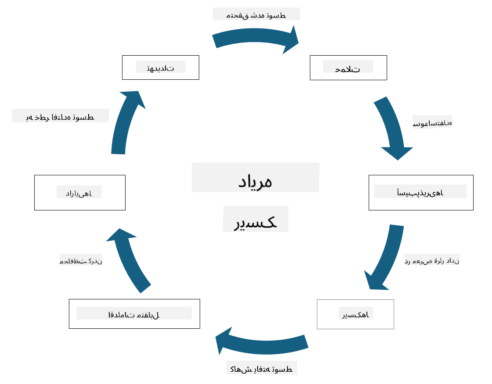

<!--
CO_OP_TRANSLATOR_METADATA:
{
  "original_hash": "fcca304f072cabf206388199e8e2e578",
  "translation_date": "2025-09-03T18:52:10+00:00",
  "source_file": "1.3 Understanding risk management.md",
  "language_code": "fa"
}
-->
# درک مدیریت ریسک

## مقدمه

در این درس، موارد زیر را پوشش خواهیم داد:

- تعریف اصطلاحات رایج امنیتی

- انواع کنترل‌های امنیتی

- ارزیابی ریسک‌های امنیتی

## تعریف اصطلاحات رایج امنیتی

این اصطلاحات مفاهیم پایه‌ای در حوزه امنیت سایبری و مدیریت ریسک هستند. بیایید هر اصطلاح را بررسی کنیم و ببینیم چگونه به یکدیگر مرتبط هستند:

1. **عامل تهدید**:

عامل تهدید فرد، گروه، سازمان یا سیستم خودکاری است که توانایی سوءاستفاده از آسیب‌پذیری‌های یک سیستم یا شبکه را برای ایجاد آسیب یا خسارت دارد. عوامل تهدید می‌توانند شامل هکرها، نویسندگان بدافزار، کارکنان ناراضی یا هر موجودیتی باشند که برای سیستم‌های اطلاعاتی و فناوری خطر ایجاد می‌کند.

2. **تهدید**:

تهدید یک رویداد یا اقدام بالقوه است که می‌تواند از آسیب‌پذیری‌های یک سیستم سوءاستفاده کند و به یک دارایی آسیب برساند. تهدیدها می‌توانند شامل اقداماتی مانند هک، نقض داده‌ها، حملات انکار سرویس و موارد دیگر باشند. تهدیدها همان "چه چیزی" هستند که می‌توانند به دارایی‌های یک سازمان آسیب برسانند.

3. **آسیب‌پذیری**:

آسیب‌پذیری یک ضعف یا نقص در طراحی، پیاده‌سازی یا پیکربندی یک سیستم است که می‌تواند توسط عامل تهدید برای به خطر انداختن امنیت سیستم مورد سوءاستفاده قرار گیرد. آسیب‌پذیری‌ها می‌توانند در نرم‌افزار، سخت‌افزار، فرآیندها یا رفتار انسانی وجود داشته باشند. شناسایی و رفع آسیب‌پذیری‌ها برای کاهش خطر حملات موفق ضروری است.

4. **ریسک**:

ریسک احتمال وقوع خسارت، آسیب یا زیان ناشی از تعامل بین تهدید و آسیب‌پذیری است. این احتمال وجود دارد که یک عامل تهدید از یک آسیب‌پذیری سوءاستفاده کند و تأثیر منفی ایجاد کند. ریسک‌ها معمولاً بر اساس تأثیر بالقوه و احتمال وقوع ارزیابی می‌شوند.

5. **دارایی**:

دارایی هر چیزی با ارزش است که یک سازمان به دنبال حفاظت از آن است. دارایی‌ها می‌توانند شامل اشیاء فیزیکی (مانند کامپیوترها و سرورها)، داده‌ها (اطلاعات مشتری، سوابق مالی)، مالکیت معنوی (اسرار تجاری، پتنت‌ها) و حتی منابع انسانی (مهارت‌ها و دانش کارکنان) باشند. حفاظت از دارایی‌ها هدف اصلی امنیت سایبری است.

6. **مواجهه**:

مواجهه به وضعیت آسیب‌پذیری در برابر تهدیدهای بالقوه اشاره دارد. این زمانی رخ می‌دهد که یک آسیب‌پذیری وجود داشته باشد که بتواند توسط یک عامل تهدید مورد سوءاستفاده قرار گیرد. مواجهه خطر مرتبط با وجود آسیب‌پذیری‌ها در یک سیستم یا شبکه را برجسته می‌کند.

7. **کنترل**:

کنترل یک اقدام است که برای کاهش خطر مرتبط با آسیب‌پذیری‌ها و تهدیدها انجام می‌شود. کنترل‌ها می‌توانند فنی، رویه‌ای یا اداری باشند. آن‌ها طراحی شده‌اند تا تهدیدها و آسیب‌پذیری‌های بالقوه را پیشگیری، شناسایی یا کاهش دهند. نمونه‌هایی از کنترل‌ها شامل فایروال‌ها، کنترل‌های دسترسی، رمزنگاری، سیاست‌های امنیتی و آموزش کارکنان هستند.

برای خلاصه کردن رابطه بین این اصطلاحات: عوامل تهدید از آسیب‌پذیری‌ها برای اجرای تهدیدها استفاده می‌کنند، که می‌تواند منجر به ریسک‌هایی شود که توانایی آسیب رساندن به دارایی‌های ارزشمند را دارند. مواجهه زمانی رخ می‌دهد که آسیب‌پذیری‌ها وجود داشته باشند، و کنترل‌ها برای کاهش خطر با پیشگیری یا کاهش تأثیر تهدیدها بر دارایی‌ها اعمال می‌شوند. این چارچوب اساس مدیریت ریسک امنیت سایبری را تشکیل می‌دهد و سازمان‌ها را در شناسایی، ارزیابی و رسیدگی به ریسک‌های بالقوه سیستم‌های اطلاعاتی و دارایی‌هایشان راهنمایی می‌کند.

## انواع کنترل‌های امنیتی

کنترل‌های امنیتی اقداماتی یا تدابیری هستند که برای حفاظت از سیستم‌های اطلاعاتی و دارایی‌ها در برابر تهدیدها و آسیب‌پذیری‌های مختلف اجرا می‌شوند. آن‌ها بر اساس تمرکز و هدفشان به چند دسته تقسیم می‌شوند. در اینجا برخی از انواع رایج کنترل‌های امنیتی آورده شده است:

1. **کنترل‌های اداری**:

این کنترل‌ها مربوط به سیاست‌ها، رویه‌ها و دستورالعمل‌هایی هستند که شیوه‌های امنیتی و رفتار کاربران سازمان را مدیریت می‌کنند.

- سیاست‌ها و رویه‌های امنیتی: دستورالعمل‌های مستند که تعریف می‌کنند چگونه امنیت در یک سازمان حفظ می‌شود.

- آگاهی و آموزش امنیتی: برنامه‌هایی برای آموزش کارکنان درباره بهترین شیوه‌های امنیتی و تهدیدهای بالقوه.

- پاسخ و مدیریت حادثه: برنامه‌هایی برای پاسخگویی و کاهش حوادث امنیتی.

2. **کنترل‌های فنی**:

کنترل‌های فنی شامل استفاده از فناوری برای اجرای اقدامات امنیتی و حفاظت از سیستم‌ها و داده‌ها هستند. نمونه‌هایی از کنترل‌های فنی عبارتند از:

- کنترل‌های دسترسی: اقداماتی که دسترسی کاربران به منابع را بر اساس نقش‌ها و مجوزهایشان محدود می‌کنند.

- رمزنگاری: تبدیل داده‌ها به یک فرمت امن برای جلوگیری از دسترسی غیرمجاز.

- فایروال‌ها: دستگاه‌های امنیت شبکه که ترافیک ورودی و خروجی را فیلتر و کنترل می‌کنند.

- سیستم‌های شناسایی و پیشگیری از نفوذ (IDPS): ابزارهایی که ترافیک شبکه را برای فعالیت‌های مشکوک نظارت می‌کنند.

- نرم‌افزارهای آنتی‌ویروس و ضد بدافزار: برنامه‌هایی که نرم‌افزارهای مخرب را شناسایی و حذف می‌کنند.

- مکانیزم‌های احراز هویت: روش‌هایی برای تأیید هویت کاربران، مانند رمز عبور، بیومتریک و احراز هویت چندعاملی.

- مدیریت وصله‌ها: به‌روزرسانی منظم نرم‌افزار برای رفع آسیب‌پذیری‌های شناخته‌شده.

3. **کنترل‌های فیزیکی**:

کنترل‌های فیزیکی اقداماتی برای حفاظت از دارایی‌ها و تأسیسات فیزیکی هستند.

- نگهبانان امنیتی و پرسنل کنترل دسترسی: افرادی که دسترسی به محل‌های فیزیکی را نظارت و کنترل می‌کنند.

- دوربین‌های نظارتی: سیستم‌های نظارت تصویری برای نظارت و ضبط فعالیت‌ها.

- قفل‌ها و موانع فیزیکی: اقداماتی فیزیکی برای محدود کردن دسترسی به مناطق حساس.

- کنترل‌های محیطی: اقداماتی برای تنظیم دما، رطوبت و سایر عوامل محیطی که بر تجهیزات و مراکز داده تأثیر می‌گذارند.

4. **کنترل‌های عملیاتی**:

این کنترل‌ها مربوط به عملیات روزمره و فعالیت‌هایی هستند که امنیت سیستم‌ها را به‌طور مداوم تضمین می‌کنند.

- مدیریت تغییرات: فرآیندهایی برای پیگیری و تأیید تغییرات در سیستم‌ها و پیکربندی‌ها.

- پشتیبان‌گیری و بازیابی در برابر بلایا: برنامه‌هایی برای پشتیبان‌گیری از داده‌ها و بازیابی در صورت خرابی سیستم یا بلایا.

- ثبت و حسابرسی: نظارت و ثبت فعالیت‌های سیستم برای اهداف امنیتی و انطباق.

- شیوه‌های کدنویسی امن: دستورالعمل‌هایی برای نوشتن نرم‌افزار به‌منظور کاهش آسیب‌پذیری‌ها.

5. **کنترل‌های قانونی و مقرراتی**:

این کنترل‌ها تضمین می‌کنند که سازمان با قوانین، مقررات و استانداردهای صنعتی مرتبط مطابقت دارد. استانداردهایی که یک سازمان باید رعایت کند به حوزه قضایی، صنعت و عوامل دیگر بستگی دارد.

- مقررات حفاظت از داده‌ها: رعایت قوانینی مانند GDPR، HIPAA و CCPA.

- استانداردهای خاص صنعت: پیروی از استانداردهایی مانند PCI DSS برای امنیت داده‌های کارت پرداخت.

این دسته‌بندی‌های کنترل‌های امنیتی با هم کار می‌کنند تا یک وضعیت امنیتی جامع برای سازمان‌ها ایجاد کنند و به حفاظت از سیستم‌ها، داده‌ها و دارایی‌هایشان در برابر طیف گسترده‌ای از تهدیدها کمک کنند.

## ارزیابی ریسک‌های امنیتی

برخی از متخصصان امنیتی معتقدند که مدیریت ریسک باید به متخصصان ریسک واگذار شود، اما درک فرآیند مدیریت ریسک امنیتی برای هر متخصص امنیتی مهم است تا بتواند ریسک امنیتی را به زبانی بیان کند که سایر بخش‌های سازمان بتوانند آن را درک کرده و بر اساس آن اقدام کنند.

سازمان‌ها باید به‌طور مداوم ریسک‌های امنیتی را ارزیابی کنند و تصمیم بگیرند که چه اقدامی (یا عدم اقدام) در برابر ریسک‌های کسب‌وکار انجام دهند. در زیر یک نمای کلی از نحوه انجام این کار آورده شده است. توجه داشته باشید که این فرآیند معمولاً توسط چندین تیم مختلف در یک سازمان انجام می‌شود و به‌ندرت یک تیم مسئول مدیریت کامل ریسک است.

1. **شناسایی دارایی‌ها و تهدیدها**:

سازمان دارایی‌هایی را که می‌خواهد از آن‌ها محافظت کند شناسایی می‌کند. این دارایی‌ها می‌توانند شامل داده‌ها، سیستم‌ها، سخت‌افزار، نرم‌افزار، مالکیت معنوی و موارد دیگر باشند. سپس تهدیدهای بالقوه‌ای که ممکن است این دارایی‌ها را هدف قرار دهند شناسایی می‌شوند.

2. **ارزیابی آسیب‌پذیری‌ها**:

سازمان‌ها سپس آسیب‌پذیری‌ها یا ضعف‌هایی در سیستم‌ها یا فرآیندها را که ممکن است توسط تهدیدها مورد سوءاستفاده قرار گیرند شناسایی می‌کنند. این آسیب‌پذیری‌ها می‌توانند ناشی از نقص‌های نرم‌افزاری، پیکربندی‌های نادرست، کمبود کنترل‌های امنیتی و خطای انسانی باشند.

3. **ارزیابی احتمال وقوع**:

سازمان سپس احتمال وقوع هر تهدید را ارزیابی می‌کند. این شامل بررسی داده‌های تاریخی، اطلاعات تهدید، روندهای صنعتی و عوامل داخلی است. احتمال وقوع می‌تواند به‌صورت کم، متوسط یا زیاد دسته‌بندی شود.

4. **ارزیابی تأثیر**:

سپس سازمان تأثیر بالقوه هر تهدید را در صورت سوءاستفاده از آسیب‌پذیری تعیین می‌کند. تأثیر می‌تواند شامل خسارت مالی، اختلالات عملیاتی، آسیب به شهرت، پیامدهای قانونی و موارد دیگر باشد. تأثیر نیز می‌تواند به‌صورت کم، متوسط یا زیاد دسته‌بندی شود.

5. **محاسبه ریسک**:

ارزیابی‌های احتمال وقوع و تأثیر با هم ترکیب می‌شوند تا سطح کلی ریسک برای هر تهدید شناسایی‌شده محاسبه شود. این معمولاً با استفاده از یک ماتریس ریسک انجام می‌شود که مقادیر عددی یا توصیف‌های کیفی به سطوح احتمال وقوع و تأثیر اختصاص می‌دهد. سطح ریسک حاصل به اولویت‌بندی ریسک‌هایی که نیاز به توجه فوری دارند کمک می‌کند.

6. **اولویت‌بندی و تصمیم‌گیری**:

سازمان سپس ریسک‌ها را با تمرکز بر مواردی که بالاترین مقادیر ترکیبی احتمال وقوع و تأثیر را دارند اولویت‌بندی می‌کند. این به تخصیص منابع و اجرای کنترل‌ها به‌طور مؤثر کمک می‌کند. تهدیدهای پرریسک نیاز به توجه فوری دارند، در حالی که تهدیدهای کم‌ریسک ممکن است در طول زمان رسیدگی شوند.

7. **درمان ریسک**:

بر اساس ارزیابی ریسک، سازمان تعیین می‌کند که چگونه هر ریسک را کاهش یا مدیریت کند. این می‌تواند شامل اجرای کنترل‌های امنیتی، انتقال ریسک از طریق بیمه یا حتی پذیرش سطوح خاصی از ریسک باقی‌مانده باشد اگر مدیریت آن‌ها قابل قبول یا بسیار پرهزینه باشد.

8. **نظارت و بازبینی مداوم**:

ارزیابی ریسک یک فرآیند یک‌باره نیست. باید به‌طور دوره‌ای یا هر زمان که تغییرات قابل‌توجهی در محیط سازمان رخ دهد انجام شود. نظارت مداوم تضمین می‌کند که تهدیدها، آسیب‌پذیری‌ها یا تغییرات جدید در چشم‌انداز کسب‌وکار در نظر گرفته شوند.

با ارزیابی ریسک‌های امنیتی به این روش ساختاریافته، سازمان‌ها می‌توانند تصمیمات آگاهانه‌ای درباره تخصیص منابع، کنترل‌های امنیتی و استراتژی‌های کلی مدیریت ریسک بگیرند. هدف کاهش مواجهه کلی سازمان با ریسک است، در حالی که تلاش‌های امنیتی با اهداف و مقاصد کسب‌وکار سازمان هماهنگ می‌شوند.

---

**سلب مسئولیت**:  
این سند با استفاده از سرویس ترجمه هوش مصنوعی [Co-op Translator](https://github.com/Azure/co-op-translator) ترجمه شده است. در حالی که ما تلاش می‌کنیم دقت را حفظ کنیم، لطفاً توجه داشته باشید که ترجمه‌های خودکار ممکن است شامل خطاها یا نادقتی‌ها باشند. سند اصلی به زبان اصلی آن باید به عنوان منبع معتبر در نظر گرفته شود. برای اطلاعات حساس، ترجمه حرفه‌ای انسانی توصیه می‌شود. ما هیچ مسئولیتی در قبال سوءتفاهم‌ها یا تفسیرهای نادرست ناشی از استفاده از این ترجمه نداریم.