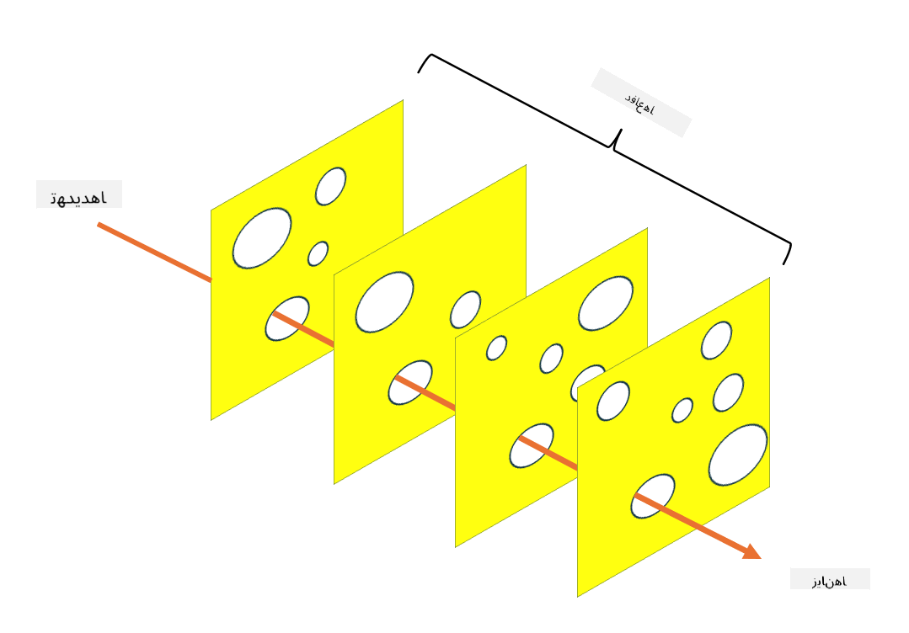

<!--
CO_OP_TRANSLATOR_METADATA:
{
  "original_hash": "75f77f972d2233c584f87c1eb96c983b",
  "translation_date": "2025-09-03T18:23:32+00:00",
  "source_file": "1.5 Zero trust.md",
  "language_code": "fa"
}
-->
# اعتماد صفر

«اعتماد صفر» عبارتی است که این روزها در محافل امنیتی زیاد شنیده می‌شود. اما این مفهوم دقیقاً به چه معناست؟ آیا فقط یک واژه پر زرق و برق است؟ در این درس، به طور دقیق به مفهوم اعتماد صفر خواهیم پرداخت.

## مقدمه

- در این درس، به موضوعات زیر خواهیم پرداخت:

- اعتماد صفر چیست؟

- تفاوت اعتماد صفر با معماری‌های امنیتی سنتی چیست؟

- دفاع در عمق چیست؟

## اعتماد صفر

اعتماد صفر یک رویکرد امنیت سایبری است که مفهوم سنتی «اعتماد کن اما بررسی کن» را به چالش می‌کشد و فرض می‌کند که هیچ موجودیتی، چه در داخل و چه خارج از شبکه سازمان، نباید به طور ذاتی مورد اعتماد قرار گیرد. در عوض، اعتماد صفر تأکید دارد که هر کاربر، دستگاه و برنامه‌ای که قصد دسترسی به منابع را دارد، صرف نظر از موقعیت مکانی، باید مورد تأیید قرار گیرد. اصل اساسی اعتماد صفر کاهش «سطح حمله» و کاهش تأثیر احتمالی نقض‌های امنیتی است.

در مدل اعتماد صفر، اصول زیر مورد تأکید قرار می‌گیرند:

1. **تأیید هویت**: احراز هویت و مجوز به طور دقیق برای همه کاربران و دستگاه‌ها، صرف نظر از موقعیت مکانی آنها، اعمال می‌شود. به یاد داشته باشید که هویت لزوماً انسانی نیست؛ می‌تواند یک دستگاه، برنامه و غیره باشد.

2. **حداقل دسترسی**: کاربران و دستگاه‌ها فقط به حداقل سطح دسترسی لازم برای انجام وظایف خود دسترسی دارند، که این امر آسیب احتمالی در صورت نقض را کاهش می‌دهد.

3. **تقسیم‌بندی کوچک**: منابع شبکه به بخش‌های کوچکتر تقسیم می‌شوند تا حرکت جانبی در شبکه در صورت نقض محدود شود.

4. **نظارت مداوم**: نظارت و تحلیل مداوم رفتار کاربران و دستگاه‌ها برای شناسایی ناهنجاری‌ها و تهدیدات احتمالی انجام می‌شود. استفاده از تکنیک‌های نظارت مدرن همچنین از یادگیری ماشین، هوش مصنوعی و اطلاعات تهدید برای ارائه جزئیات و زمینه‌های اضافی به نظارت بهره می‌برد.

5. **رمزگذاری داده‌ها**: داده‌ها هم در حال انتقال و هم در حالت ذخیره‌سازی رمزگذاری می‌شوند تا از دسترسی غیرمجاز جلوگیری شود.

6. **کنترل دسترسی سختگیرانه**: کنترل‌های دسترسی بر اساس زمینه‌هایی مانند نقش‌های کاربر، سلامت دستگاه و موقعیت شبکه اعمال می‌شوند.

مایکروسافت اعتماد صفر را به پنج ستون تقسیم می‌کند که در درس‌های بعدی به آنها خواهیم پرداخت.

## تفاوت‌ها با معماری‌های امنیتی سنتی

اعتماد صفر در چندین جنبه با معماری‌های امنیتی سنتی، مانند مدل‌های مبتنی بر محیط پیرامونی، تفاوت دارد:

1. **محیط پیرامونی در مقابل هویت‌محور**: مدل‌های سنتی بر ایمن‌سازی محیط پیرامونی شبکه تمرکز دارند و فرض می‌کنند که کاربران و دستگاه‌های داخلی پس از ورود قابل اعتماد هستند. اعتماد صفر، در مقابل، فرض می‌کند که تهدیدات می‌توانند هم از داخل و هم از خارج شبکه منشأ بگیرند و کنترل‌های سختگیرانه مبتنی بر هویت را اعمال می‌کند.

2. **اعتماد ضمنی در مقابل اعتماد صریح**: مدل‌های سنتی به طور ضمنی به دستگاه‌ها و کاربران داخل شبکه اعتماد می‌کنند تا زمانی که خلاف آن ثابت شود. اعتماد صفر به طور صریح هویت‌ها را تأیید می‌کند و به طور مداوم برای ناهنجاری‌ها نظارت می‌کند.

3. **شبکه تخت در مقابل شبکه تقسیم‌بندی‌شده**: معماری‌های سنتی اغلب شامل شبکه‌های تخت هستند که کاربران داخلی دسترسی گسترده‌ای دارند. اعتماد صفر تقسیم‌بندی شبکه به مناطق کوچکتر و ایزوله را برای محدود کردن نقض‌های احتمالی توصیه می‌کند.

4. **واکنشی در مقابل پیشگیرانه**: امنیت سنتی اغلب به اقدامات واکنشی مانند فایروال‌های محیطی و سیستم‌های تشخیص نفوذ متکی است. اعتماد صفر رویکردی پیشگیرانه اتخاذ می‌کند و فرض می‌کند که نقض‌ها محتمل هستند و تأثیر آنها را به حداقل می‌رساند.

## دفاع در عمق

دفاع در عمق، که به عنوان امنیت لایه‌ای نیز شناخته می‌شود، یک استراتژی امنیت سایبری است که شامل استقرار چندین لایه کنترل‌ها و اقدامات امنیتی برای محافظت از دارایی‌های سازمان است. هدف ایجاد لایه‌های همپوشانی دفاعی است تا اگر یک لایه نقض شد، لایه‌های دیگر همچنان بتوانند محافظت ارائه دهند. هر لایه بر جنبه متفاوتی از امنیت تمرکز دارد و وضعیت کلی امنیت سازمان را افزایش می‌دهد.

دفاع در عمق شامل ترکیبی از اقدامات امنیتی فنی، رویه‌ای و فیزیکی است. این اقدامات می‌توانند شامل فایروال‌ها، سیستم‌های تشخیص نفوذ، کنترل‌های دسترسی، رمزگذاری، آموزش کاربران، سیاست‌های امنیتی و موارد دیگر باشند. ایده این است که موانع متعددی ایجاد شود که به طور جمعی نفوذ به سیستم‌ها و شبکه‌های سازمان را برای مهاجمان دشوار کند. این مدل گاهی به عنوان مدل «پنیر سوئیسی» نیز شناخته می‌شود که در پیشگیری از حوادث در صنایع دیگر (مانند حمل‌ونقل) نیز استفاده می‌شود.

## مطالعه بیشتر

[اعتماد صفر چیست؟](https://learn.microsoft.com/security/zero-trust/zero-trust-overview?WT.mc_id=academic-96948-sayoung)

[تکامل اعتماد صفر – مقاله موضع مایکروسافت](https://query.prod.cms.rt.microsoft.com/cms/api/am/binary/RWJJdT?WT.mc_id=academic-96948-sayoung)

[اعتماد صفر و BeyondCorp Google Cloud | وبلاگ Google Cloud](https://cloud.google.com/blog/topics/developers-practitioners/zero-trust-and-beyondcorp-google-cloud)

---

**سلب مسئولیت**:  
این سند با استفاده از سرویس ترجمه هوش مصنوعی [Co-op Translator](https://github.com/Azure/co-op-translator) ترجمه شده است. در حالی که ما تلاش می‌کنیم دقت را حفظ کنیم، لطفاً توجه داشته باشید که ترجمه‌های خودکار ممکن است شامل خطاها یا نادرستی‌ها باشند. سند اصلی به زبان اصلی آن باید به عنوان منبع معتبر در نظر گرفته شود. برای اطلاعات حساس، توصیه می‌شود از ترجمه حرفه‌ای انسانی استفاده کنید. ما مسئولیتی در قبال سوء تفاهم‌ها یا تفسیرهای نادرست ناشی از استفاده از این ترجمه نداریم.