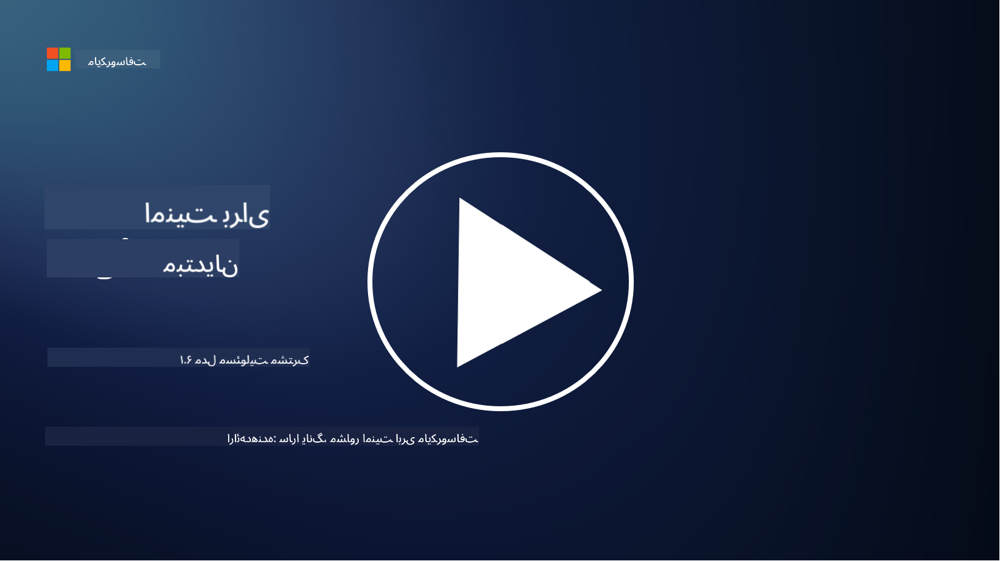

<!--
CO_OP_TRANSLATOR_METADATA:
{
  "original_hash": "a48db640d80c786b928ca178c414f084",
  "translation_date": "2025-09-03T18:34:50+00:00",
  "source_file": "1.6 Shared responsibility model.md",
  "language_code": "fa"
}
-->
# مدل مسئولیت مشترک

مسئولیت مشترک یک مفهوم جدید در فناوری اطلاعات است که با ظهور رایانش ابری شکل گرفت. از دیدگاه امنیت سایبری، بسیار مهم است که بدانیم چه کسی کدام کنترل‌های امنیتی را ارائه می‌دهد تا هیچ شکافی در دفاع ایجاد نشود.

## مقدمه

در این درس، به موارد زیر خواهیم پرداخت:

- مسئولیت مشترک در زمینه امنیت سایبری چیست؟

- تفاوت مسئولیت مشترک برای کنترل‌های امنیتی بین IaaS، PaaS و SaaS چیست؟

- چگونه می‌توانید بفهمید که پلتفرم ابری شما چه کنترل‌های امنیتی ارائه می‌دهد؟

- مفهوم "اعتماد کن اما بررسی کن" چیست؟

## مسئولیت مشترک در زمینه امنیت سایبری چیست؟

مسئولیت مشترک در امنیت سایبری به توزیع مسئولیت‌های امنیتی بین ارائه‌دهنده خدمات ابری (CSP) و مشتریان آن اشاره دارد. در محیط‌های رایانش ابری مانند زیرساخت به‌عنوان سرویس (IaaS)، پلتفرم به‌عنوان سرویس (PaaS) و نرم‌افزار به‌عنوان سرویس (SaaS)، هم CSP و هم مشتری نقش‌هایی در تضمین امنیت داده‌ها، برنامه‌ها و سیستم‌ها دارند.

## تفاوت مسئولیت مشترک برای کنترل‌های امنیتی بین IaaS، PaaS و SaaS چیست؟

تقسیم مسئولیت‌ها معمولاً به نوع خدمات ابری مورد استفاده بستگی دارد:

- **IaaS (زیرساخت به‌عنوان سرویس)**: CSP زیرساخت پایه‌ای (سرورها، شبکه، ذخیره‌سازی) را ارائه می‌دهد، در حالی که مشتری مسئول مدیریت سیستم‌عامل‌ها، برنامه‌ها و تنظیمات امنیتی روی آن زیرساخت است.

- **PaaS (پلتفرم به‌عنوان سرویس)**: CSP یک پلتفرم برای ساخت و استقرار برنامه‌ها ارائه می‌دهد. CSP زیرساخت پایه را مدیریت می‌کند و مشتری بر توسعه برنامه‌ها و امنیت داده‌ها تمرکز دارد.

- **SaaS (نرم‌افزار به‌عنوان سرویس)**: CSP برنامه‌های کاملاً کاربردی را که از طریق اینترنت قابل دسترسی هستند ارائه می‌دهد. در این حالت، CSP مسئول امنیت برنامه و زیرساخت است، در حالی که مشتری مدیریت دسترسی کاربران و استفاده از داده‌ها را بر عهده دارد.

درک مسئولیت مشترک بسیار مهم است زیرا مشخص می‌کند کدام جنبه‌های امنیتی توسط CSP پوشش داده می‌شود و کدام جنبه‌ها باید توسط مشتری رسیدگی شود. این امر از سوءتفاهم‌ها جلوگیری کرده و تضمین می‌کند که اقدامات امنیتی به‌صورت جامع اجرا شوند.

## چگونه می‌توانید بفهمید که پلتفرم ابری شما چه کنترل‌های امنیتی ارائه می‌دهد؟

برای فهمیدن اینکه پلتفرم ابری شما چه کنترل‌های امنیتی ارائه می‌دهد، باید به مستندات و منابع ارائه‌دهنده خدمات ابری مراجعه کنید. این منابع شامل موارد زیر هستند:

- **وب‌سایت و مستندات CSP**: وب‌سایت CSP اطلاعاتی درباره ویژگی‌ها و کنترل‌های امنیتی ارائه‌شده به‌عنوان بخشی از خدمات آن‌ها دارد. CSPها معمولاً مستندات دقیقی ارائه می‌دهند که شیوه‌های امنیتی، کنترل‌ها و توصیه‌های آن‌ها را توضیح می‌دهد. این مستندات ممکن است شامل مقالات سفید، راهنماهای امنیتی و مستندات فنی باشد.

- **ارزیابی‌ها و ممیزی‌های امنیتی**: اکثر CSPها کنترل‌های امنیتی خود را توسط کارشناسان و سازمان‌های امنیتی مستقل ارزیابی می‌کنند. این بررسی‌ها می‌توانند بینش‌هایی درباره کیفیت اقدامات امنیتی CSP ارائه دهند. گاهی این ارزیابی‌ها منجر به دریافت گواهینامه‌های امنیتی توسط CSP می‌شود (به مورد بعدی مراجعه کنید).

- **گواهینامه‌های انطباق امنیتی**: اکثر CSPها گواهینامه‌هایی مانند ISO:27001، SOC 2 و FedRAMP و غیره دریافت می‌کنند. این گواهینامه‌ها نشان می‌دهند که ارائه‌دهنده استانداردهای خاص امنیتی و انطباق را رعایت می‌کند.

به یاد داشته باشید که سطح جزئیات و دسترسی به اطلاعات ممکن است بین ارائه‌دهندگان ابری متفاوت باشد. همیشه مطمئن شوید که از منابع رسمی و به‌روز ارائه‌شده توسط ارائه‌دهنده خدمات ابری استفاده می‌کنید تا تصمیمات آگاهانه‌ای درباره امنیت دارایی‌های مبتنی بر ابر خود بگیرید.

## مفهوم "اعتماد کن اما بررسی کن" چیست؟

در زمینه استفاده از CSP، نرم‌افزارهای شخص ثالث یا سایر خدمات امنیتی فناوری اطلاعات، یک سازمان ممکن است ابتدا به ادعاهای ارائه‌دهنده درباره اقدامات امنیتی اعتماد کند. با این حال، برای اطمینان واقعی از ایمنی داده‌ها و سیستم‌های خود، باید این ادعاها را از طریق ارزیابی‌های امنیتی، آزمایش نفوذ و بررسی کنترل‌های امنیتی طرف خارجی تأیید کند، پیش از اینکه نرم‌افزار یا خدمات را به‌طور کامل در عملیات خود ادغام کند. همه افراد و سازمان‌ها باید تلاش کنند تا به کنترل‌های امنیتی که مسئولیت آن‌ها نیست اعتماد کنند اما آن‌ها را بررسی کنند.

## مسئولیت مشترک درون یک سازمان

به یاد داشته باشید، مسئولیت مشترک برای امنیت درون یک سازمان بین تیم‌های مختلف نیز باید در نظر گرفته شود. تیم امنیتی به‌ندرت همه کنترل‌ها را خودشان اجرا می‌کنند و نیاز دارند با تیم‌های عملیاتی، توسعه‌دهندگان و سایر بخش‌های کسب‌وکار همکاری کنند تا همه کنترل‌های امنیتی لازم برای حفظ امنیت سازمان را اجرا کنند.

## مطالعه بیشتر

- [مسئولیت مشترک در ابر - Microsoft Azure | Microsoft Learn](https://learn.microsoft.com/azure/security/fundamentals/shared-responsibility?WT.mc_id=academic-96948-sayoung)
- [مدل مسئولیت مشترک چیست؟ – تعریف از TechTarget.com](https://www.techtarget.com/searchcloudcomputing/definition/shared-responsibility-model)
- [مدل مسئولیت مشترک توضیح داده شده و معنای آن برای امنیت ابری | CSO Online](https://www.csoonline.com/article/570779/the-shared-responsibility-model-explained-and-what-it-means-for-cloud-security.html)
- [مسئولیت مشترک برای امنیت ابری: آنچه باید بدانید (cisecurity.org)](https://www.cisecurity.org/insights/blog/shared-responsibility-cloud-security-what-you-need-to-know)

---

**سلب مسئولیت**:  
این سند با استفاده از سرویس ترجمه هوش مصنوعی [Co-op Translator](https://github.com/Azure/co-op-translator) ترجمه شده است. در حالی که ما تلاش می‌کنیم دقت را حفظ کنیم، لطفاً توجه داشته باشید که ترجمه‌های خودکار ممکن است شامل خطاها یا نادرستی‌ها باشند. سند اصلی به زبان اصلی آن باید به عنوان منبع معتبر در نظر گرفته شود. برای اطلاعات حساس، توصیه می‌شود از ترجمه حرفه‌ای انسانی استفاده کنید. ما مسئولیتی در قبال سوء تفاهم‌ها یا تفسیرهای نادرست ناشی از استفاده از این ترجمه نداریم.