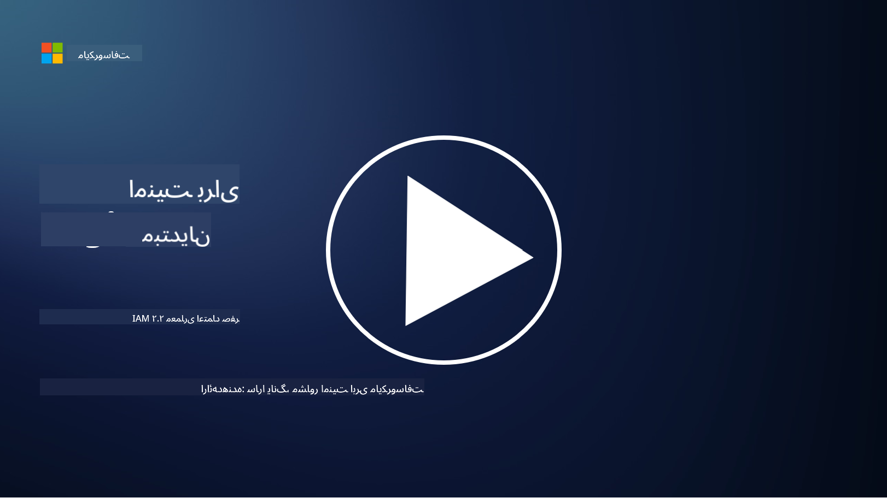

<!--
CO_OP_TRANSLATOR_METADATA:
{
  "original_hash": "4774a978af123f72ebb872199c4c4d4f",
  "translation_date": "2025-09-03T18:21:45+00:00",
  "source_file": "2.2 IAM zero trust architecture.md",
  "language_code": "fa"
}
-->
# معماری اعتماد صفر در مدیریت هویت (IAM)

هویت بخش کلیدی در اجرای معماری اعتماد صفر و ایجاد محیط امن برای هر سیستم IT است. در این بخش بررسی می‌کنیم که چرا استفاده از کنترل‌های هویتی برای اجرای اعتماد صفر اهمیت دارد.

## مقدمه

در این درس، به موارد زیر می‌پردازیم:

- چرا باید از هویت به عنوان محیط امن در سیستم‌های IT مدرن استفاده کنیم؟

- تفاوت این رویکرد با معماری‌های سنتی IT چیست؟

- چگونه از هویت برای اجرای معماری اعتماد صفر استفاده می‌شود؟

## چرا باید از هویت به عنوان محیط امن در سیستم‌های IT مدرن استفاده کنیم؟

در سیستم‌های IT مدرن، مفهوم سنتی محیط فیزیکی (مانند استفاده از فایروال‌ها و مرزهای شبکه) به عنوان خط دفاع اصلی در برابر تهدیدات سایبری، به دلیل پیچیدگی روزافزون فناوری، افزایش کار از راه دور و استفاده از خدمات ابری، کمتر مؤثر است. به جای آن، سازمان‌ها به سمت استفاده از هویت به عنوان محیط جدید حرکت می‌کنند. این بدان معناست که امنیت بر اساس تأیید و مدیریت هویت کاربران، دستگاه‌ها و برنامه‌هایی که قصد دسترسی به منابع را دارند، صرف نظر از موقعیت فیزیکی آنها، متمرکز می‌شود.

دلایل اهمیت استفاده از هویت به عنوان محیط امن در سیستم‌های IT مدرن عبارتند از:

**نیروی کار از راه دور**: با گسترش کار از راه دور و استفاده از دستگاه‌های موبایل، کاربران می‌توانند از مکان‌ها و دستگاه‌های مختلف به منابع دسترسی پیدا کنند. رویکرد سنتی محیط امن زمانی که کاربران محدود به دفتر فیزیکی نیستند، کارایی ندارد.

**محیط‌های ابری و ترکیبی**: سازمان‌ها به طور فزاینده‌ای خدمات ابری و محیط‌های ترکیبی را به کار می‌گیرند. داده‌ها و برنامه‌ها دیگر فقط در محل سازمان قرار ندارند، که باعث کاهش اهمیت دفاع‌های محیطی سنتی می‌شود.

**امنیت اعتماد صفر**: مفهوم امنیت اعتماد صفر فرض می‌کند که هیچ موجودیتی، چه داخل شبکه و چه خارج از آن، نباید به طور خودکار مورد اعتماد قرار گیرد. هویت پایه‌ای برای تأیید درخواست‌های دسترسی، صرف نظر از منبع آنها، می‌شود.

**چشم‌انداز تهدیدات**: تهدیدات سایبری در حال تکامل هستند و مهاجمان راه‌هایی برای دور زدن دفاع‌های محیطی سنتی پیدا می‌کنند. حملات فیشینگ، مهندسی اجتماعی و تهدیدات داخلی اغلب از آسیب‌پذیری‌های انسانی سوءاستفاده می‌کنند، نه تلاش برای نفوذ به محیط شبکه.

**رویکرد مبتنی بر داده**: حفاظت از داده‌های حساس بسیار مهم است. با تمرکز بر هویت، سازمان‌ها می‌توانند کنترل کنند که چه کسی به چه داده‌هایی دسترسی دارد و خطر نقض داده‌ها را کاهش دهند.

## تفاوت این رویکرد با معماری‌های سنتی IT چیست؟

معماری‌های سنتی IT به شدت به مدل‌های امنیتی مبتنی بر محیط متکی بودند، جایی که فایروال‌ها و مرزهای شبکه نقش مهمی در جلوگیری از تهدیدات داشتند. تفاوت‌های اصلی بین رویکرد سنتی و رویکرد مبتنی بر هویت عبارتند از:

|      جنبه                  |      معماری‌های سنتی IT                                                                      |      رویکرد مبتنی بر هویت                                                                             |
|-----------------------------|---------------------------------------------------------------------------------------------|-------------------------------------------------------------------------------------------------------|
|     تمرکز                  |     تمرکز بر محیط: متکی به دفاع‌های محیطی مانند فایروال‌ها و کنترل دسترسی.                   |     تمرکز بر تأیید هویت: انتقال از مرزهای شبکه به تأیید هویت کاربران/دستگاه‌ها.                     |
|     وابستگی به مکان        |     وابستگی به مکان: امنیت مرتبط با مکان‌های فیزیکی دفتر و مرزهای شبکه.                    |     استقلال از مکان: امنیت وابسته به مکان خاص نیست؛ دسترسی از هر جا امکان‌پذیر است.                |
|     فرض اعتماد             |     اعتماد فرضی: اعتماد به کاربران/دستگاه‌ها در داخل محیط شبکه.                             |     رویکرد اعتماد صفر: اعتماد هرگز فرض نمی‌شود؛ دسترسی بر اساس هویت و زمینه تأیید می‌شود.           |
|     توجه به دستگاه         |     تنوع دستگاه‌ها: فرض بر این بود که دستگاه‌های داخل محیط شبکه امن هستند.                 |     آگاهی از دستگاه: توجه به سلامت و وضعیت امنیتی دستگاه، صرف نظر از مکان.                         |
|     حفاظت از داده‌ها        |     حفاظت از داده‌ها: تمرکز بر ایمن‌سازی محیط شبکه برای حفاظت از داده‌ها.                   |     حفاظت مبتنی بر داده: تمرکز بر کنترل دسترسی به داده‌ها بر اساس هویت و حساسیت داده‌ها.            |

## چگونه از هویت برای اجرای معماری اعتماد صفر استفاده می‌شود؟

در معماری اعتماد صفر، اصل اساسی این است که هیچ موجودیتی، چه داخل شبکه و چه خارج از آن، نباید به طور خودکار مورد اعتماد قرار گیرد. هویت نقش مرکزی در اجرای رویکرد اعتماد صفر دارد و امکان تأیید مداوم موجودیت‌هایی که قصد دسترسی به منابع را دارند، فراهم می‌کند. کنترل‌های امنیتی مدرن هویت این امکان را فراهم می‌کنند که هر کاربر، دستگاه، برنامه و خدماتی که به منابع دسترسی می‌خواهند، باید به طور کامل شناسایی و احراز هویت شوند. این فرآیند شامل تأیید هویت دیجیتال از طریق روش‌هایی مانند ترکیب نام کاربری/رمز عبور، احراز هویت چندعاملی (MFA)، بیومتریک و سایر مکانیزم‌های احراز هویت قوی است.

## مطالعه بیشتر

- [Securing identity with Zero Trust | Microsoft Learn](https://learn.microsoft.com/security/zero-trust/deploy/identity?WT.mc_id=academic-96948-sayoung)
- [Zero Trust Principles and Guidance for Identity and Access | CSA (cloudsecurityalliance.org)](https://cloudsecurityalliance.org/artifacts/zero-trust-principles-and-guidance-for-iam/)
- [Zero Trust Identity Controls - Essentials Series - Episode 2 - YouTube](https://www.youtube.com/watch?v=fQZQznIKcGM&list=PLXtHYVsvn_b_gtX1-NB62wNervQx1Fhp4&index=13)

---

**سلب مسئولیت**:  
این سند با استفاده از سرویس ترجمه هوش مصنوعی [Co-op Translator](https://github.com/Azure/co-op-translator) ترجمه شده است. در حالی که ما تلاش می‌کنیم دقت را حفظ کنیم، لطفاً توجه داشته باشید که ترجمه‌های خودکار ممکن است شامل خطاها یا نادرستی‌ها باشند. سند اصلی به زبان اصلی آن باید به عنوان منبع معتبر در نظر گرفته شود. برای اطلاعات حساس، توصیه می‌شود از ترجمه حرفه‌ای انسانی استفاده کنید. ما مسئولیتی در قبال سوء تفاهم‌ها یا تفسیرهای نادرست ناشی از استفاده از این ترجمه نداریم.