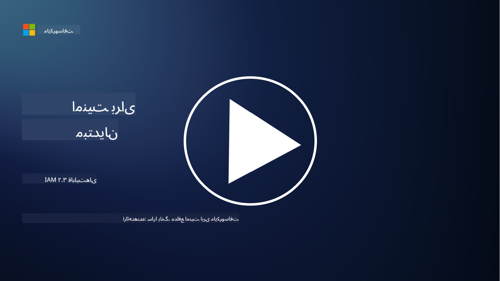

<!--
CO_OP_TRANSLATOR_METADATA:
{
  "original_hash": "bf0b8a54f2c69951744df5a94bc923f7",
  "translation_date": "2025-09-03T18:58:26+00:00",
  "source_file": "2.3 IAM capabilities.md",
  "language_code": "fa"
}
-->
# قابلیت‌های IAM

در این بخش، جزئیات بیشتری درباره ابزارها و قابلیت‌های اصلی که در امنیت هویت استفاده می‌شوند، بررسی خواهیم کرد.

## مقدمه

در این درس، به موارد زیر خواهیم پرداخت:

 - سرویس دایرکتوری چیست؟
      
 - چه قابلیت‌هایی می‌توانند برای ایمن‌سازی هویت‌ها استفاده شوند؟
>
>        احراز هویت چندعاملی (MFA)
> 
>        ورود یکپارچه (SSO)
> 
>        کنترل دسترسی مبتنی بر نقش (RBAC)
> 
>        احراز هویت تطبیقی
> 
>        احراز هویت بیومتریک
> 
>        مدیریت دسترسی‌های ویژه (PAM)
> 
>        مدیریت و حاکمیت هویت (IGA)
> 
>        تحلیل رفتاری

## سرویس دایرکتوری چیست؟

سرویس دایرکتوری یک پایگاه داده تخصصی است که اطلاعات مربوط به منابع شبکه، از جمله کاربران، گروه‌ها، دستگاه‌ها، برنامه‌ها و سایر اشیاء را ذخیره و مدیریت می‌کند. این سرویس به‌عنوان یک مخزن مرکزی برای داده‌های مرتبط با هویت و دسترسی عمل می‌کند و به سازمان‌ها اجازه می‌دهد تا احراز هویت کاربران، مجوزدهی و سایر وظایف امنیتی را به‌صورت کارآمد مدیریت و کنترل کنند.

سرویس‌های دایرکتوری نقش مهمی در محیط‌های مدرن فناوری اطلاعات ایفا می‌کنند و پایه‌ای برای راهکارهای مدیریت هویت و دسترسی (IAM) فراهم می‌کنند. این سرویس‌ها دسترسی امن به منابع را تسهیل می‌کنند، سیاست‌های دسترسی را اعمال می‌کنند و وظایف مدیریتی را ساده می‌سازند. یکی از شناخته‌شده‌ترین سرویس‌های دایرکتوری، Microsoft Active Directory است، اما راهکارهای دیگری مانند دایرکتوری‌های LDAP (پروتکل دسترسی سبک به دایرکتوری) نیز وجود دارند که اهداف مشابهی را دنبال می‌کنند.

وظایف و ویژگی‌های کلیدی سرویس دایرکتوری در زمینه امنیت سایبری شامل موارد زیر است:

 - **احراز هویت کاربران**: سرویس‌های دایرکتوری اعتبارنامه‌های کاربران (مانند نام کاربری و رمز عبور) را تأیید می‌کنند تا اطمینان حاصل شود که فقط کاربران مجاز می‌توانند به شبکه و منابع آن دسترسی داشته باشند.
 - **مجوزدهی کاربران**: این سرویس‌ها سطح دسترسی هر کاربر را بر اساس نقش، عضویت در گروه و سایر ویژگی‌ها تعیین می‌کنند. این کار تضمین می‌کند که کاربران فقط به منابعی که مجاز هستند دسترسی داشته باشند.
 - **مدیریت گروه‌ها**: سرویس‌های دایرکتوری به مدیران اجازه می‌دهند کاربران را در گروه‌های منطقی سازماندهی کنند و مدیریت کنترل دسترسی را ساده‌تر کنند. مجوزها می‌توانند به جای کاربران فردی، به گروه‌ها اختصاص داده شوند.
 - **سیاست‌های رمز عبور**: این سرویس‌ها قوانین پیچیدگی و انقضای رمز عبور را اعمال می‌کنند و امنیت حساب‌های کاربری را افزایش می‌دهند.
 - **ورود یکپارچه (SSO)**: برخی از سرویس‌های دایرکتوری از SSO پشتیبانی می‌کنند و به کاربران اجازه می‌دهند با یک مجموعه اعتبارنامه به چندین برنامه و سرویس دسترسی پیدا کنند.
 - **مدیریت متمرکز کاربران**: سرویس‌های دایرکتوری اطلاعات کاربران را متمرکز می‌کنند و مدیریت حساب‌ها، پروفایل‌ها و ویژگی‌های کاربران را از یک مکان واحد آسان‌تر می‌کنند.
 - **ممیزی و ثبت وقایع**: این سرویس‌ها می‌توانند فعالیت‌های احراز هویت و دسترسی کاربران را ثبت کنند و در ممیزی‌های امنیتی و تلاش‌های انطباق کمک کنند.

## چه قابلیت‌هایی می‌توانند برای ایمن‌سازی هویت‌ها استفاده شوند؟

**احراز هویت چندعاملی (MFA)**

MFA از کاربران می‌خواهد که قبل از دسترسی، چندین شکل از تأیید هویت ارائه دهند. این معمولاً شامل چیزی است که کاربر می‌داند (رمز عبور)، چیزی که کاربر دارد (گوشی هوشمند یا توکن امنیتی)، و چیزی که کاربر هست (داده‌های بیومتریک مانند اثر انگشت یا تشخیص چهره).

**ورود یکپارچه (SSO)**

SSO به کاربران اجازه می‌دهد با یک مجموعه اعتبارنامه به چندین برنامه و سیستم دسترسی پیدا کنند. این قابلیت تجربه کاربری را بهبود می‌بخشد و خطرات مرتبط با مدیریت چندین رمز عبور را کاهش می‌دهد.

**کنترل دسترسی مبتنی بر نقش (RBAC)**

RBAC مجوزها را بر اساس نقش‌های از پیش تعریف‌شده اختصاص می‌دهد. کاربران بر اساس نقش‌های خود در سازمان دسترسی دریافت می‌کنند.

**احراز هویت تطبیقی**

احراز هویت تطبیقی عوامل خطری مانند مکان، دستگاه، زمان دسترسی و رفتار کاربر را ارزیابی می‌کند تا سطح احراز هویت مورد نیاز را به‌صورت پویا تنظیم کند. اگر یک درخواست مشکوک به نظر برسد، مراحل اضافی احراز هویت ممکن است فعال شوند.

**احراز هویت بیومتریک**

احراز هویت بیومتریک از ویژگی‌های بیولوژیکی منحصربه‌فرد مانند اثر انگشت، ویژگی‌های چهره، الگوهای صدا و حتی ویژگی‌های رفتاری مانند سرعت تایپ برای تأیید هویت استفاده می‌کند.

**مدیریت دسترسی‌های ویژه (PAM)**

PAM بر ایمن‌سازی دسترسی به سیستم‌ها و داده‌های حساس تمرکز دارد و کنترل‌های سختگیرانه‌ای بر حساب‌های دارای دسترسی ویژه اعمال می‌کند. این شامل قابلیت‌هایی مانند دسترسی به‌موقع و نظارت بر جلسات است.

**مدیریت و حاکمیت هویت (IGA)**

راهکارهای IGA هویت کاربران و دسترسی آن‌ها به منابع را در طول چرخه عمر مدیریت می‌کنند. این شامل فرآیندهایی مانند ورود کاربران جدید، تخصیص دسترسی، کنترل دسترسی مبتنی بر نقش و حذف دسترسی است.

**تحلیل رفتاری**

تحلیل رفتاری رفتار کاربران را نظارت می‌کند و الگوهای پایه‌ای را ایجاد می‌کند. انحراف از این الگوها می‌تواند هشدارهایی برای بررسی بیشتر ایجاد کند.

# مطالعه بیشتر
- [مستندات اصول اولیه Azure Active Directory - Microsoft Entra | Microsoft Learn](https://learn.microsoft.com/azure/active-directory/fundamentals/?WT.mc_id=academic-96948-sayoung)
- [Azure Active Directory چیست؟ - Microsoft Entra | Microsoft Learn](https://learn.microsoft.com/azure/active-directory/fundamentals/whatis?WT.mc_id=academic-96948-sayoung)
- [مدیریت زیرساخت هویت چندابری خود با Microsoft Entra - YouTube](https://www.youtube.com/watch?v=9qQiq3wTS2Y&list=PLXtHYVsvn_b_gtX1-NB62wNervQx1Fhp4&index=18)

---

**سلب مسئولیت**:  
این سند با استفاده از سرویس ترجمه هوش مصنوعی [Co-op Translator](https://github.com/Azure/co-op-translator) ترجمه شده است. در حالی که ما برای دقت تلاش می‌کنیم، لطفاً توجه داشته باشید که ترجمه‌های خودکار ممکن است شامل خطاها یا نادرستی‌هایی باشند. سند اصلی به زبان بومی آن باید به عنوان منبع معتبر در نظر گرفته شود. برای اطلاعات حساس، ترجمه حرفه‌ای انسانی توصیه می‌شود. ما هیچ مسئولیتی در قبال سوءتفاهم‌ها یا تفسیرهای نادرست ناشی از استفاده از این ترجمه نداریم.