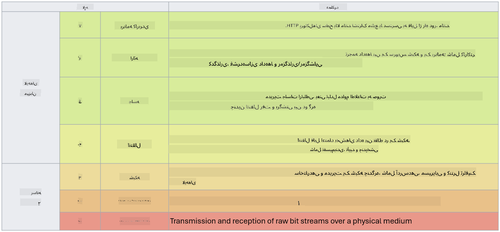

<!--
CO_OP_TRANSLATOR_METADATA:
{
  "original_hash": "252724eceeb183fb9018f88c5e1a3f0c",
  "translation_date": "2025-09-03T18:56:02+00:00",
  "source_file": "3.1 Networking key concepts.md",
  "language_code": "fa"
}
-->
# مفاهیم کلیدی شبکه

اگر در حوزه فناوری اطلاعات فعالیت کرده باشید، احتمالاً با مفاهیم شبکه آشنا شده‌اید. اگرچه در محیط‌های مدرن از هویت به عنوان کنترل اصلی محیط استفاده می‌کنیم، این به معنای بی‌اهمیت بودن کنترل‌های شبکه نیست. با وجود اینکه این موضوع بسیار گسترده است، در این درس به برخی از مفاهیم کلیدی شبکه می‌پردازیم.

در این درس، موارد زیر را بررسی خواهیم کرد:

- آدرس‌دهی IP چیست؟

- مدل OSI چیست؟

- TCP/UDP چیست؟

- شماره‌های پورت چیست؟

- رمزنگاری در حالت ذخیره و در حالت انتقال چیست؟

## آدرس‌دهی IP چیست؟

آدرس‌دهی IP یا آدرس‌دهی پروتکل اینترنت، یک برچسب عددی است که به هر دستگاه متصل به شبکه کامپیوتری که از پروتکل اینترنت برای ارتباط استفاده می‌کند، اختصاص داده می‌شود. این آدرس به عنوان شناسه‌ای منحصر به فرد برای دستگاه‌ها در یک شبکه عمل می‌کند و امکان ارسال و دریافت داده‌ها را در اینترنت یا شبکه‌های متصل فراهم می‌کند. دو نسخه اصلی از آدرس‌دهی IP وجود دارد: IPv4 (نسخه ۴ پروتکل اینترنت) و IPv6 (نسخه ۶ پروتکل اینترنت). آدرس IP معمولاً به صورت فرمت IPv4 (مانند 192.168.1.1) یا فرمت IPv6 (مانند 2001:0db8:85a3:0000:0000:8a2e:0370:7334) نمایش داده می‌شود.

## مدل OSI چیست؟

مدل OSI (اتصال سیستم‌های باز) یک چارچوب مفهومی است که عملکردهای یک سیستم ارتباطی را به هفت لایه مجزا استاندارد می‌کند. هر لایه وظایف خاصی را انجام می‌دهد و با لایه‌های مجاور ارتباط برقرار می‌کند تا ارتباط داده‌ها بین دستگاه‌ها در یک شبکه به صورت کارآمد و قابل اعتماد انجام شود. لایه‌ها از پایین به بالا عبارتند از:

1. لایه فیزیکی

2. لایه پیوند داده

3. لایه شبکه

4. لایه انتقال

5. لایه جلسه

6. لایه نمایش

7. لایه کاربرد

مدل OSI یک مرجع مشترک برای درک نحوه تعامل پروتکل‌ها و فناوری‌های شبکه فراهم می‌کند، بدون توجه به سخت‌افزار یا نرم‌افزار خاصی که استفاده می‌شود.

_ref: https://en.wikipedia.org/wiki/OSI_model_

## TCP/UDP چیست؟

TCP (پروتکل کنترل انتقال) و UDP (پروتکل دیتاگرام کاربر) دو پروتکل اساسی لایه انتقال هستند که در شبکه‌های کامپیوتری برای تسهیل ارتباط بین دستگاه‌ها در اینترنت یا شبکه محلی استفاده می‌شوند. این پروتکل‌ها مسئول تقسیم داده‌ها به بسته‌ها برای انتقال و سپس بازسازی آن بسته‌ها به داده اصلی در سمت گیرنده هستند. با این حال، ویژگی‌ها و موارد استفاده آن‌ها متفاوت است.

**TCP (پروتکل کنترل انتقال)**:

TCP یک پروتکل مبتنی بر اتصال است که تحویل داده‌ها به صورت قابل اعتماد و مرتب بین دستگاه‌ها را فراهم می‌کند. این پروتکل قبل از شروع تبادل داده‌ها، یک اتصال بین فرستنده و گیرنده برقرار می‌کند. TCP تضمین می‌کند که بسته‌های داده به ترتیب صحیح برسند و می‌تواند بسته‌های گم‌شده را دوباره ارسال کند تا یکپارچگی و کامل بودن داده‌ها را تضمین کند. این ویژگی‌ها TCP را برای برنامه‌هایی که نیاز به تحویل داده‌های قابل اعتماد دارند، مانند مرور وب، ایمیل، انتقال فایل (FTP) و ارتباطات پایگاه داده مناسب می‌کند.

**UDP (پروتکل دیتاگرام کاربر)**:

UDP یک پروتکل بدون اتصال است که انتقال داده‌ها را سریع‌تر انجام می‌دهد اما سطح قابل اعتمادی مشابه TCP را ارائه نمی‌دهد. این پروتکل قبل از ارسال داده‌ها اتصال رسمی برقرار نمی‌کند و مکانیزم‌هایی برای تأیید یا ارسال مجدد بسته‌های گم‌شده ندارد. UDP برای برنامه‌هایی مناسب است که سرعت و کارایی مهم‌تر از تحویل تضمین‌شده هستند، مانند ارتباطات بلادرنگ، پخش رسانه، بازی‌های آنلاین و پرس‌وجوهای DNS.

به طور خلاصه، TCP اولویت را به قابلیت اطمینان و تحویل مرتب می‌دهد و برای برنامه‌هایی که دقت داده‌ها ضروری است مناسب است، در حالی که UDP بر سرعت و کارایی تأکید دارد و برای برنامه‌هایی که از دست دادن جزئی داده یا تغییر ترتیب قابل قبول است، مناسب است. انتخاب بین TCP و UDP به نیازهای خاص برنامه یا خدمات مورد استفاده بستگی دارد.

## شماره‌های پورت چیست؟

در شبکه، شماره پورت یک شناسه عددی است که برای تمایز بین خدمات یا برنامه‌های مختلفی که روی یک دستگاه در یک شبکه اجرا می‌شوند، استفاده می‌شود. پورت‌ها به هدایت داده‌های ورودی به برنامه مناسب کمک می‌کنند. شماره‌های پورت اعداد صحیح ۱۶ بیتی هستند، به این معنی که در محدوده ۰ تا ۶۵۵۳۵ قرار دارند. این شماره‌ها به سه محدوده تقسیم می‌شوند:

- پورت‌های شناخته‌شده (۰-۱۰۲۳): برای خدمات استاندارد مانند HTTP (پورت ۸۰) و FTP (پورت ۲۱) رزرو شده‌اند.

- پورت‌های ثبت‌شده (۱۰۲۴-۴۹۱۵۱): برای برنامه‌ها و خدماتی که بخشی از محدوده شناخته‌شده نیستند اما به طور رسمی ثبت شده‌اند، استفاده می‌شوند.

- پورت‌های پویا/خصوصی (۴۹۱۵۲-۶۵۵۳۵): برای استفاده موقت یا خصوصی توسط برنامه‌ها در دسترس هستند.

## رمزنگاری در حالت ذخیره و در حالت انتقال چیست؟

رمزنگاری فرآیند تبدیل داده‌ها به یک فرمت امن برای محافظت از آن‌ها در برابر دسترسی یا دستکاری غیرمجاز است. رمزنگاری می‌تواند هم برای داده‌های "در حالت ذخیره" (زمانی که روی یک دستگاه یا سرور ذخیره شده‌اند) و هم برای داده‌های "در حالت انتقال" (زمانی که بین دستگاه‌ها یا در شبکه‌ها منتقل می‌شوند) اعمال شود.

رمزنگاری در حالت ذخیره: این نوع رمزنگاری شامل رمزنگاری داده‌هایی است که روی دستگاه‌ها، سرورها یا سیستم‌های ذخیره‌سازی ذخیره شده‌اند. حتی اگر مهاجم به رسانه ذخیره‌سازی دسترسی فیزیکی پیدا کند، بدون کلیدهای رمزنگاری نمی‌تواند به داده‌ها دسترسی داشته باشد. این نوع رمزنگاری برای محافظت از داده‌های حساس در صورت سرقت دستگاه، نقض داده‌ها یا دسترسی غیرمجاز ضروری است.

رمزنگاری در حالت انتقال: این نوع رمزنگاری شامل رمزنگاری داده‌ها در حین انتقال بین دستگاه‌ها یا در شبکه‌ها است. این کار از شنود و رهگیری غیرمجاز داده‌ها در طول انتقال جلوگیری می‌کند. پروتکل‌های رایج برای رمزنگاری در حالت انتقال شامل HTTPS برای ارتباطات وب و TLS/SSL برای ایمن‌سازی انواع مختلف ترافیک شبکه هستند.

## مطالعه بیشتر
- [How Do IP Addresses Work? (howtogeek.com)](https://www.howtogeek.com/341307/how-do-ip-addresses-work/)
- [Understanding IP Address: An Introductory Guide (geekflare.com)](https://geekflare.com/understanding-ip-address/)
- [What is the OSI model? The 7 layers of OSI explained (techtarget.com)](https://www.techtarget.com/searchnetworking/definition/OSI)
- [The OSI Model – The 7 Layers of Networking Explained in Plain English (freecodecamp.org)](https://www.freecodecamp.org/news/osi-model-networking-layers-explained-in-plain-english/)
- [TCP/IP protocols - IBM Documentation](https://www.ibm.com/docs/en/aix/7.3?topic=protocol-tcpip-protocols)
- [Common Ports Cheat Sheet: The Ultimate Ports & Protocols List (stationx.net)](https://www.stationx.net/common-ports-cheat-sheet/)
- [Azure Data Encryption-at-Rest - Azure Security | Microsoft Learn](https://learn.microsoft.com/azure/security/fundamentals/encryption-atrest?WT.mc_id=academic-96948-sayoung)

---

**سلب مسئولیت**:  
این سند با استفاده از سرویس ترجمه هوش مصنوعی [Co-op Translator](https://github.com/Azure/co-op-translator) ترجمه شده است. در حالی که ما تلاش می‌کنیم دقت را حفظ کنیم، لطفاً توجه داشته باشید که ترجمه‌های خودکار ممکن است شامل خطاها یا نادرستی‌ها باشند. سند اصلی به زبان اصلی آن باید به عنوان منبع معتبر در نظر گرفته شود. برای اطلاعات حساس، توصیه می‌شود از ترجمه حرفه‌ای انسانی استفاده کنید. ما مسئولیتی در قبال سوء تفاهم‌ها یا تفسیرهای نادرست ناشی از استفاده از این ترجمه نداریم.