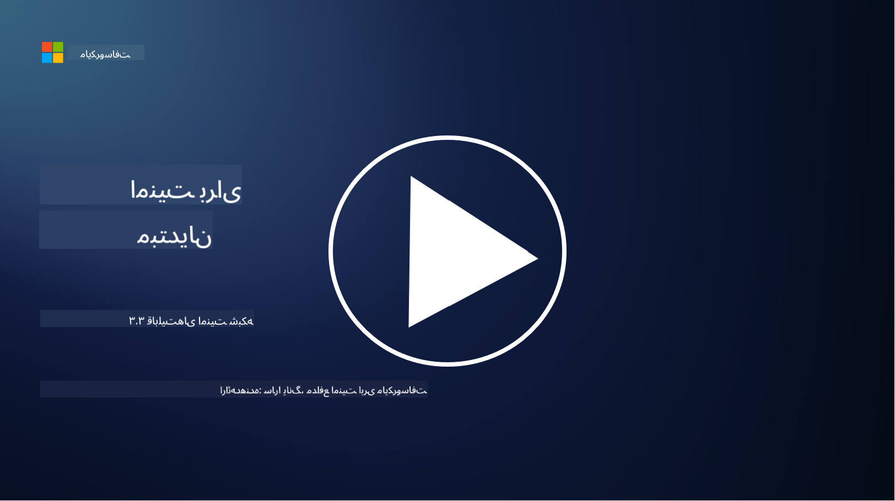

<!--
CO_OP_TRANSLATOR_METADATA:
{
  "original_hash": "c3aba077bb98eebc925dd58d870229ab",
  "translation_date": "2025-09-03T18:19:29+00:00",
  "source_file": "3.3 Network security capabilities.md",
  "language_code": "fa"
}
-->
# قابلیت‌های امنیت شبکه

در این درس، با قابلیت‌های زیر که می‌توانند برای ایمن‌سازی شبکه استفاده شوند، آشنا خواهیم شد:

- فایروال‌های سنتی  
- فایروال‌های برنامه‌های وب  
- گروه‌های امنیتی ابری  
- شبکه تحویل محتوا (CDN)  
- متعادل‌کننده‌های بار  
- میزبان‌های Bastion  
- شبکه‌های خصوصی مجازی (VPN)  
- ابزارهای محافظت در برابر حملات DDoS  

## فایروال‌های سنتی

فایروال‌های سنتی دستگاه‌های امنیتی هستند که ترافیک ورودی و خروجی شبکه را بر اساس قوانین امنیتی از پیش تعریف‌شده کنترل و نظارت می‌کنند. این فایروال‌ها به‌عنوان یک مانع بین شبکه داخلی قابل اعتماد و شبکه‌های خارجی غیرقابل اعتماد عمل کرده و ترافیک را فیلتر می‌کنند تا از دسترسی غیرمجاز و تهدیدات احتمالی جلوگیری شود.

## فایروال‌های برنامه‌های وب

فایروال‌های برنامه‌های وب (WAF) فایروال‌های تخصصی هستند که برای محافظت از برنامه‌های وب در برابر حملات مختلف مانند تزریق SQL، اسکریپت‌نویسی بین‌سایتی و سایر آسیب‌پذیری‌ها طراحی شده‌اند. این فایروال‌ها درخواست‌ها و پاسخ‌های HTTP را تحلیل می‌کنند تا ترافیک مخرب هدفمند به برنامه‌های وب را شناسایی و مسدود کنند.

## گروه‌های امنیتی ابری

گروه‌های امنیتی یکی از ویژگی‌های اساسی امنیت شبکه هستند که توسط ارائه‌دهندگان خدمات ابری ارائه می‌شوند. این گروه‌ها به‌عنوان فایروال‌های مجازی عمل کرده و ترافیک ورودی و خروجی به منابع ابری مانند ماشین‌های مجازی (VM) و نمونه‌ها را کنترل می‌کنند. گروه‌های امنیتی به سازمان‌ها اجازه می‌دهند قوانین مشخصی را تعریف کنند که تعیین می‌کند چه نوع ترافیکی مجاز یا ممنوع است، و یک لایه دفاعی اضافی به استقرارهای ابری اضافه می‌کنند.

## شبکه تحویل محتوا (CDN)

شبکه تحویل محتوا یک شبکه توزیع‌شده از سرورها است که در مکان‌های جغرافیایی مختلف قرار دارند. CDN‌ها با ذخیره‌سازی محتوای وب‌سایت‌ها و ارائه آن از سرورهایی که به کاربر نزدیک‌تر هستند، عملکرد و دسترسی وب‌سایت‌ها را بهبود می‌بخشند. همچنین، با توزیع ترافیک در مکان‌های مختلف سرور، سطحی از محافظت در برابر حملات DDoS فراهم می‌کنند.

## متعادل‌کننده‌های بار

متعادل‌کننده‌های بار ترافیک ورودی شبکه را بین چندین سرور توزیع می‌کنند تا استفاده از منابع بهینه شود، دسترسی بالا تضمین شود و عملکرد برنامه بهبود یابد. این ابزارها از بارگذاری بیش از حد سرورها جلوگیری کرده و زمان پاسخ‌دهی کارآمد را حفظ می‌کنند، که به انعطاف‌پذیری شبکه کمک می‌کند.

## میزبان‌های Bastion

میزبان‌های Bastion سرورهایی بسیار امن و ایزوله هستند که دسترسی کنترل‌شده به شبکه را از یک شبکه خارجی غیرقابل اعتماد (مانند اینترنت) فراهم می‌کنند. این میزبان‌ها به‌عنوان نقاط ورود برای مدیران جهت دسترسی امن به سیستم‌های داخلی عمل می‌کنند. میزبان‌های Bastion معمولاً با اقدامات امنیتی قوی پیکربندی می‌شوند تا سطح حمله را به حداقل برسانند.

## شبکه‌های خصوصی مجازی (VPN)

شبکه‌های خصوصی مجازی (VPN) تونل‌های رمزگذاری‌شده‌ای بین دستگاه کاربر و یک سرور راه دور ایجاد می‌کنند، که ارتباط امن و خصوصی را در شبکه‌های بالقوه ناامن مانند اینترنت تضمین می‌کند. VPN‌ها معمولاً برای دسترسی از راه دور به شبکه‌های داخلی استفاده می‌شوند و به کاربران اجازه می‌دهند منابع را به‌گونه‌ای دسترسی داشته باشند که گویی به‌صورت فیزیکی در همان شبکه هستند.

## ابزارهای محافظت در برابر حملات DDoS

ابزارها و خدمات محافظت در برابر حملات DDoS (حملات انکار سرویس توزیع‌شده) برای کاهش تأثیر این حملات طراحی شده‌اند، که در آن چندین دستگاه آلوده شبکه یا سرویس را با ترافیک زیاد پر می‌کنند تا آن را از کار بیندازند. راه‌حل‌های محافظت در برابر DDoS ترافیک مخرب را شناسایی و فیلتر می‌کنند تا اطمینان حاصل شود که ترافیک قانونی همچنان به مقصد مورد نظر خود می‌رسد.

## مطالعه بیشتر

- [What Is a Firewall? - Cisco](https://www.cisco.com/c/en/us/products/security/firewalls/what-is-a-firewall.html#~types-of-firewalls)  
- [What Does a Firewall Actually Do? (howtogeek.com)](https://www.howtogeek.com/144269/htg-explains-what-firewalls-actually-do/)  
- [What is a Firewall? How Firewalls Work & Types of Firewalls (kaspersky.com)](https://www.kaspersky.com/resource-center/definitions/firewall)  
- [Network security group - how it works | Microsoft Learn](https://learn.microsoft.com/azure/virtual-network/network-security-group-how-it-works)  
- [Introduction to Azure Content Delivery Network (CDN) - Training | Microsoft Learn](https://learn.microsoft.com/training/modules/intro-to-azure-content-delivery-network/?WT.mc_id=academic-96948-sayoung)  
- [What is a content delivery network (CDN)? - Azure | Microsoft Learn](https://learn.microsoft.com/azure/cdn/cdn-overview?WT.mc_id=academic-96948-sayoung)  
- [What Is Load Balancing? How Load Balancers Work (nginx.com)](https://www.nginx.com/resources/glossary/load-balancing/)  
- [Bastion hosts vs. VPNs · Tailscale](https://tailscale.com/learn/bastion-hosts-vs-vpns/)  
- [What is VPN? How It Works, Types of VPN (kaspersky.com)](https://www.kaspersky.com/resource-center/definitions/what-is-a-vpn)  
- [Introduction to Azure DDoS Protection - Training | Microsoft Learn](https://learn.microsoft.com/training/modules/introduction-azure-ddos-protection/?WT.mc_id=academic-96948-sayoung)  
- [What Is a DDoS Attack? | Microsoft Security](https://www.microsoft.com/security/business/security-101/what-is-a-ddos-attack?WT.mc_id=academic-96948-sayoung)  

---

**سلب مسئولیت**:  
این سند با استفاده از سرویس ترجمه هوش مصنوعی [Co-op Translator](https://github.com/Azure/co-op-translator) ترجمه شده است. در حالی که ما تلاش می‌کنیم دقت را حفظ کنیم، لطفاً توجه داشته باشید که ترجمه‌های خودکار ممکن است شامل خطاها یا نادرستی‌ها باشند. سند اصلی به زبان اصلی آن باید به عنوان منبع معتبر در نظر گرفته شود. برای اطلاعات حساس، توصیه می‌شود از ترجمه حرفه‌ای انسانی استفاده کنید. ما مسئولیتی در قبال سوء تفاهم‌ها یا تفسیرهای نادرست ناشی از استفاده از این ترجمه نداریم.