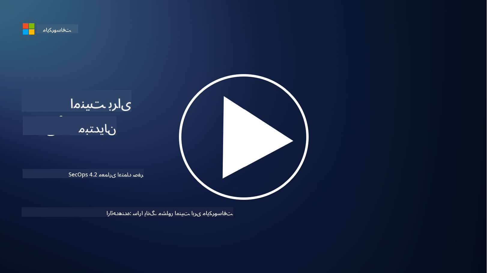

<!--
CO_OP_TRANSLATOR_METADATA:
{
  "original_hash": "45bbdc114e70936816b0b3e7c40189cf",
  "translation_date": "2025-09-03T18:39:59+00:00",
  "source_file": "4.2 SecOps zero trust architecture.md",
  "language_code": "fa"
}
-->
# معماری اعتماد صفر در عملیات امنیتی

عملیات امنیتی دو بخش از معماری اعتماد صفر را تشکیل می‌دهد و در این درس درباره هر دو بخش یاد خواهیم گرفت:

- چگونه باید معماری‌های فناوری اطلاعات طراحی شوند تا امکان جمع‌آوری متمرکز لاگ‌ها فراهم شود؟

- بهترین روش‌ها برای عملیات امنیتی در محیط‌های مدرن فناوری اطلاعات چیست؟

## چگونه باید معماری‌های فناوری اطلاعات طراحی شوند تا امکان جمع‌آوری متمرکز لاگ‌ها فراهم شود؟

جمع‌آوری متمرکز لاگ‌ها یکی از اجزای حیاتی عملیات امنیتی مدرن است. این فرآیند به سازمان‌ها اجازه می‌دهد تا لاگ‌ها و داده‌ها را از منابع مختلف مانند سرورها، برنامه‌ها، دستگاه‌های شبکه و ابزارهای امنیتی جمع‌آوری کرده و در یک مخزن مرکزی برای تحلیل، نظارت و پاسخ به حوادث ذخیره کنند. در ادامه بهترین روش‌ها برای طراحی معماری‌های فناوری اطلاعات جهت پشتیبانی از جمع‌آوری متمرکز لاگ‌ها آورده شده است:

1. **یکپارچه‌سازی منابع لاگ**:

- اطمینان حاصل کنید که تمام دستگاه‌ها و سیستم‌های مرتبط برای تولید لاگ‌ها پیکربندی شده‌اند. این شامل سرورها، فایروال‌ها، روترها، سوئیچ‌ها، برنامه‌ها و تجهیزات امنیتی می‌شود.

- منابع لاگ را برای ارسال لاگ‌ها به یک جمع‌کننده یا سیستم مدیریت لاگ متمرکز پیکربندی کنید.

2. **انتخاب ابزار مناسب SIEM (مدیریت اطلاعات و رویدادهای امنیتی)**:

- یک راه‌حل SIEM انتخاب کنید که با نیازها و مقیاس سازمان شما هماهنگ باشد.

- اطمینان حاصل کنید که راه‌حل انتخابی از جمع‌آوری، تجمیع، تحلیل و گزارش‌دهی لاگ‌ها پشتیبانی می‌کند.

3. **مقیاس‌پذیری و افزونگی**:

- معماری را برای مقیاس‌پذیری طراحی کنید تا تعداد منابع لاگ و حجم لاگ‌های افزایش‌یافته را پشتیبانی کند.

- افزونگی را برای دسترسی بالا پیاده‌سازی کنید تا از اختلالات ناشی از خرابی سخت‌افزار یا شبکه جلوگیری شود.

4. **انتقال امن لاگ‌ها**:

- از پروتکل‌های امن مانند TLS/SSL یا IPsec برای انتقال لاگ‌ها از منابع به مخزن مرکزی استفاده کنید.

- احراز هویت و کنترل دسترسی را پیاده‌سازی کنید تا فقط دستگاه‌های مجاز بتوانند لاگ‌ها ارسال کنند.

5. **نرمال‌سازی**:

- فرمت‌های لاگ را استاندارد کنید و داده‌ها را نرمال‌سازی کنید تا تحلیل و بررسی آسان‌تر شود.

6. **ذخیره‌سازی و نگهداری**:

- دوره نگهداری مناسب برای لاگ‌ها را بر اساس الزامات امنیتی و انطباق تعیین کنید.

- لاگ‌ها را به صورت امن ذخیره کنید و از دسترسی غیرمجاز و دستکاری محافظت کنید.

## بهترین روش‌ها برای عملیات امنیتی در محیط‌های مدرن فناوری اطلاعات چیست؟

علاوه بر جمع‌آوری متمرکز لاگ‌ها، در ادامه بهترین روش‌ها برای عملیات امنیتی در محیط‌های مدرن فناوری اطلاعات آورده شده است:

1. **نظارت مداوم**: نظارت مداوم بر فعالیت‌های شبکه و سیستم‌ها را پیاده‌سازی کنید تا تهدیدات را در زمان واقعی شناسایی و به آنها پاسخ دهید.

2. **اطلاعات تهدیدات**: با استفاده از منابع اطلاعات تهدیدات و خدمات مرتبط، از تهدیدات و آسیب‌پذیری‌های جدید مطلع باشید.

3. **آموزش کاربران**: آموزش‌های منظم آگاهی امنیتی برای کارکنان برگزار کنید تا خطرات مرتبط با مهندسی اجتماعی و حملات فیشینگ کاهش یابد.

4. **برنامه پاسخ به حوادث**: یک برنامه پاسخ به حوادث طراحی و آزمایش کنید تا در صورت وقوع حوادث امنیتی، پاسخ سریع و مؤثر ارائه شود.

5. **اتوماسیون امنیتی**: از ابزارهای اتوماسیون و هماهنگی امنیتی برای ساده‌سازی پاسخ به حوادث و وظایف تکراری استفاده کنید.

6. **پشتیبان‌گیری و بازیابی**: راه‌حل‌های پشتیبان‌گیری و بازیابی فاجعه را پیاده‌سازی کنید تا در صورت از دست دادن داده‌ها یا حملات باج‌افزاری، دسترسی به داده‌ها تضمین شود.

## مطالعه بیشتر

- [ماژول بهترین روش‌های امنیتی مایکروسافت: عملیات امنیتی | Microsoft Learn](https://learn.microsoft.com/security/operations/security-operations-videos-and-decks?WT.mc_id=academic-96948-sayoung)
- [عملیات امنیتی - چارچوب پذیرش ابری | Microsoft Learn](https://learn.microsoft.com/azure/cloud-adoption-framework/secure/security-operations?WT.mc_id=academic-96948-sayoung)
- [معماری پلتفرم عملیات و تحلیل امنیت چیست؟ تعریف SOAPA، نحوه عملکرد، مزایا و بیشتر (digitalguardian.com)](https://www.digitalguardian.com/blog/what-security-operations-and-analytics-platform-architecture-definition-soapa-how-it-works#:~:text=All%20in%20all%2C%20security%20operations%20and%20analytics%20platform,become%20more%20efficient%20and%20operative%20with%20your%20security.)

---

**سلب مسئولیت**:  
این سند با استفاده از سرویس ترجمه هوش مصنوعی [Co-op Translator](https://github.com/Azure/co-op-translator) ترجمه شده است. در حالی که ما تلاش می‌کنیم دقت را حفظ کنیم، لطفاً توجه داشته باشید که ترجمه‌های خودکار ممکن است شامل خطاها یا نادرستی‌ها باشند. سند اصلی به زبان اصلی آن باید به عنوان منبع معتبر در نظر گرفته شود. برای اطلاعات حساس، توصیه می‌شود از ترجمه حرفه‌ای انسانی استفاده کنید. ما مسئولیتی در قبال سوء تفاهم‌ها یا تفسیرهای نادرست ناشی از استفاده از این ترجمه نداریم.