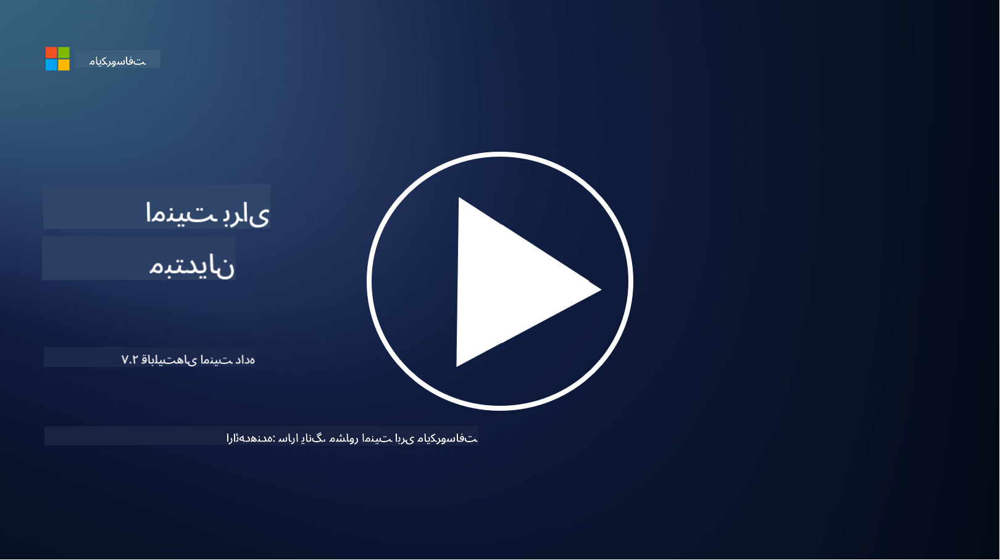

<!--
CO_OP_TRANSLATOR_METADATA:
{
  "original_hash": "50697add9758e54693442d502d2d5f8a",
  "translation_date": "2025-09-03T18:43:04+00:00",
  "source_file": "7.2 Data security capabilities.md",
  "language_code": "fa"
}
-->
# قابلیت‌های امنیت داده

در این بخش، جزئیات بیشتری درباره ابزارها و قابلیت‌های اصلی مورد استفاده در امنیت داده را بررسی خواهیم کرد:

**مقدمه**

در این درس، به موارد زیر خواهیم پرداخت:

- ابزارهای جلوگیری از نشت داده چیست؟

- ابزارهای مدیریت ریسک داخلی چیست؟

- چه ابزارهایی برای نگهداری داده در دسترس هستند؟

## ابزارهای جلوگیری از نشت داده چیست؟

ابزارهای جلوگیری از نشت داده (DLP) به مجموعه‌ای از راه‌حل‌های نرم‌افزاری و فناوری‌هایی اشاره دارند که برای جلوگیری از دسترسی غیرمجاز، اشتراک‌گذاری یا نشت داده‌های حساس یا محرمانه در یک سازمان طراحی شده‌اند. این ابزارها با استفاده از بازرسی محتوا، اجرای سیاست‌ها و نظارت، داده‌های حساس را شناسایی کرده و از افشا یا سوءاستفاده از آن‌ها جلوگیری می‌کنند. نمونه‌هایی از محصولات DLP شامل موارد زیر هستند: Symantec Data Loss Prevention، McAfee Total Protection for Data Loss Prevention، Microsoft 365 DLP**: با برنامه‌های Microsoft 365 یکپارچه شده و به سازمان‌ها کمک می‌کند داده‌های حساس در ایمیل‌ها، اسناد و پیام‌ها را شناسایی و محافظت کنند.

## ابزارهای مدیریت ریسک داخلی چیست؟

ابزارهای مدیریت ریسک داخلی به سازمان‌ها کمک می‌کنند تا ریسک‌هایی را که توسط کارکنان، پیمانکاران یا شرکای تجاری ممکن است به‌طور عمدی یا غیرعمدی امنیت داده‌ها را به خطر بیندازند، شناسایی و کاهش دهند. این ابزارها رفتار کاربران، الگوهای دسترسی و استفاده از داده‌ها را نظارت می‌کنند تا فعالیت‌های مشکوک و تهدیدات داخلی احتمالی را شناسایی کنند. نمونه‌هایی از محصولات مدیریت ریسک داخلی شامل موارد زیر هستند: Microsoft Insider Risk Management (بخشی از Microsoft 365)، Forcepoint Insider Threat Data Protection، Varonis Insider Threat Detection.

## چه ابزارهایی برای نگهداری داده در دسترس هستند؟

ابزارهای نگهداری داده شامل نرم‌افزارها و راه‌حل‌هایی هستند که برای مدیریت نگهداری و حذف داده‌ها مطابق با سیاست‌های نگهداری داده و الزامات قانونی سازمان طراحی شده‌اند. این ابزارها فرآیند نگهداری داده برای مدت زمان مشخص و حذف امن آن زمانی که دیگر نیازی به آن نیست را خودکار می‌کنند. نمونه‌هایی از محصولات نگهداری داده شامل موارد زیر هستند: Veritas Enterprise Vault، Commvault Complete Data Protection، Microsoft data lifecycle management. این ابزارها به سازمان‌ها کمک می‌کنند تا کنترل نگهداری و حذف داده‌ها را حفظ کنند، از رعایت مقررات حفاظت از داده‌ها اطمینان حاصل کنند و داده‌ها را در طول چرخه عمرشان به‌طور مؤثر مدیریت کنند.

## مطالعه بیشتر

- [راهنمای مدیریت وضعیت امنیت داده (DSPM) | CSA (cloudsecurityalliance.org)](https://cloudsecurityalliance.org/blog/2023/03/31/the-big-guide-to-data-security-posture-management-dspm/)
- [جلوگیری از نشت داده در دستگاه‌ها، اپلیکیشن‌ها و سرویس‌ها | Microsoft Purview](https://youtu.be/hvqq8L_0kgI)
- [18 ابزار برتر نرم‌افزار جلوگیری از نشت داده 2023 (رایگان + پولی) (comparitech.com)](https://www.comparitech.com/data-privacy-management/data-loss-prevention-tools-software/)
- [جلوگیری از نشت داده (nist.gov)](https://tsapps.nist.gov/publication/get_pdf.cfm?pub_id=904672)
- [آشنایی با مدیریت ریسک داخلی | Microsoft Learn](https://learn.microsoft.com/purview/insider-risk-management?WT.mc_id=academic-96948-sayoung)
- [مدیریت چرخه عمر داده | IBM](https://www.ibm.com/topics/data-lifecycle-management)
- [مدیریت چرخه عمر داده چیست؟ | بهترین روش‌های 2023 (selecthub.com)](https://www.selecthub.com/big-data-analytics/data-lifecycle-management/)

---

**سلب مسئولیت**:  
این سند با استفاده از سرویس ترجمه هوش مصنوعی [Co-op Translator](https://github.com/Azure/co-op-translator) ترجمه شده است. در حالی که ما برای دقت تلاش می‌کنیم، لطفاً توجه داشته باشید که ترجمه‌های خودکار ممکن است شامل خطاها یا نادرستی‌هایی باشند. سند اصلی به زبان اصلی آن باید به عنوان منبع معتبر در نظر گرفته شود. برای اطلاعات حساس، ترجمه حرفه‌ای انسانی توصیه می‌شود. ما هیچ مسئولیتی در قبال سوءتفاهم‌ها یا تفسیرهای نادرست ناشی از استفاده از این ترجمه نداریم.