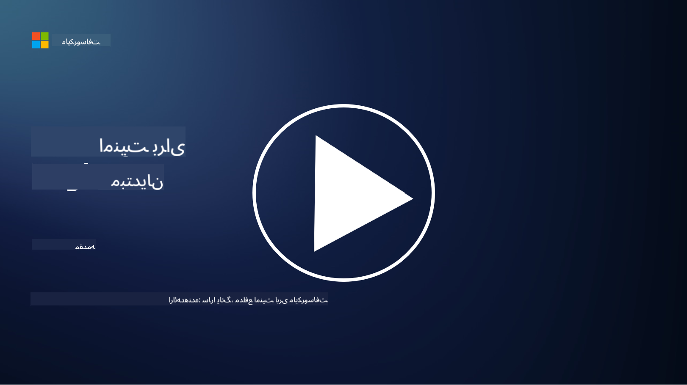

<!--
CO_OP_TRANSLATOR_METADATA:
{
  "original_hash": "79a7e63fa60f649eb3560e1cd7246272",
  "translation_date": "2025-11-18T17:06:51+00:00",
  "source_file": "README.md",
  "language_code": "fa"
}
-->
  
  
  
  
  
  

### 🌐 پشتیبانی چندزبانه

#### پشتیبانی شده از طریق GitHub Action (خودکار و همیشه به‌روز)

<!-- CO-OP TRANSLATOR LANGUAGES TABLE START -->
[عربی](../ar/README.md) | [بنگالی](../bn/README.md) | [بلغاری](../bg/README.md) | [برمه‌ای (میانمار)](../my/README.md) | [چینی (ساده‌شده)](../zh/README.md) | [چینی (سنتی، هنگ‌کنگ)](../hk/README.md) | [چینی (سنتی، ماکائو)](../mo/README.md) | [چینی (سنتی، تایوان)](../tw/README.md) | [کرواتی](../hr/README.md) | [چکی](../cs/README.md) | [دانمارکی](../da/README.md) | [هلندی](../nl/README.md) | [استونیایی](../et/README.md) | [فنلاندی](../fi/README.md) | [فرانسوی](../fr/README.md) | [آلمانی](../de/README.md) | [یونانی](../el/README.md) | [عبری](../he/README.md) | [هندی](../hi/README.md) | [مجاری](../hu/README.md) | [اندونزیایی](../id/README.md) | [ایتالیایی](../it/README.md) | [ژاپنی](../ja/README.md) | [کره‌ای](../ko/README.md) | [لیتوانیایی](../lt/README.md) | [مالایی](../ms/README.md) | [مراتی](../mr/README.md) | [نپالی](../ne/README.md) | [پیجین نیجریه‌ای](../pcm/README.md) | [نروژی](../no/README.md) | [فارسی](./README.md) | [لهستانی](../pl/README.md) | [پرتغالی (برزیل)](../br/README.md) | [پرتغالی (پرتغال)](../pt/README.md) | [پنجابی (گورمخی)](../pa/README.md) | [رومانیایی](../ro/README.md) | [روسی](../ru/README.md) | [صربی (سیریلیک)](../sr/README.md) | [اسلواکی](../sk/README.md) | [اسلوونیایی](../sl/README.md) | [اسپانیایی](../es/README.md) | [سواحیلی](../sw/README.md) | [سوئدی](../sv/README.md) | [تاگالوگ (فیلیپینی)](../tl/README.md) | [تامیلی](../ta/README.md) | [تایلندی](../th/README.md) | [ترکی](../tr/README.md) | [اوکراینی](../uk/README.md) | [اردو](../ur/README.md) | [ویتنامی](../vi/README.md)  
<!-- CO-OP TRANSLATOR LANGUAGES TABLE END -->

**اگر می‌خواهید زبان‌های ترجمه بیشتری پشتیبانی شوند، لیست زبان‌های پشتیبانی شده [اینجا](https://github.com/Azure/co-op-translator/blob/main/getting_started/supported-languages.md) موجود است.**

#### به جامعه ما بپیوندید  

# 🚀 امنیت سایبری برای مبتدیان – یک برنامه آموزشی

در این عصر پرسرعت پذیرش فناوری هوش مصنوعی، درک نحوه ایمن‌سازی سیستم‌های فناوری اطلاعات از همیشه مهم‌تر است. این دوره برای آموزش مفاهیم پایه امنیت سایبری طراحی شده است تا یادگیری امنیت شما را آغاز کند. این دوره مستقل از فروشنده است و به درس‌های کوتاهی تقسیم شده که تکمیل هر کدام حدود ۳۰ تا ۶۰ دقیقه زمان می‌برد. هر درس شامل یک آزمون کوچک و لینک‌هایی برای مطالعه بیشتر است، اگر بخواهید عمیق‌تر به موضوع بپردازید.

آنچه این دوره پوشش می‌دهد 📚

- 🔐 مفاهیم پایه امنیت سایبری مانند مثلث CIA، تفاوت بین ریسک‌ها، تهدیدها و غیره.
- 🛡️ درک اینکه کنترل امنیتی چیست و چه اشکالی دارد.
- 🌐 درک مفهوم اعتماد صفر و اهمیت آن در امنیت سایبری مدرن.
- 🔑 درک مفاهیم و موضوعات کلیدی در حوزه هویت، شبکه، عملیات امنیتی، زیرساخت و امنیت داده.
- 🔧 ارائه مثال‌هایی از ابزارهایی که برای پیاده‌سازی کنترل‌های امنیتی استفاده می‌شوند.

آنچه این دوره پوشش نمی‌دهد 🙅‍♂️

- 🚫 نحوه استفاده از ابزارهای امنیتی خاص.
- 🚫 نحوه "هک کردن" یا انجام امنیت تهاجمی/تیم قرمز.
- 🚫 یادگیری استانداردهای خاص انطباق.

پس از اتمام این دوره، می‌توانید به برخی از ماژول‌های Microsoft Learn ما بروید. ما توصیه می‌کنیم یادگیری خود را با [Microsoft Security, Compliance, and Identity Fundamentals](https://learn.microsoft.com/training/paths/describe-concepts-of-security-compliance-identity/?WT.mc_id=academic-96948-sayoung) ادامه دهید.

در نهایت، می‌توانید به شرکت در [آزمون SC-900: Microsoft Security, Compliance, and Identity Fundamentals](https://learn.microsoft.com/credentials/certifications/exams/sc-900/?WT.mc_id=academic-96948-sayoung) فکر کنید.

> 💁 اگر بازخورد یا پیشنهادی درباره این دوره و محتوایی که ممکن است کمبود داشته باشد دارید، خوشحال می‌شویم از شما بشنویم!

## نمای کلی ماژول‌ها 📝  
| **شماره ماژول** | **نام ماژول**                           | **مفاهیم آموزش داده شده**                  | **اهداف یادگیری**                                                                                          |
|-------------------|-------------------------------------------|--------------------------------------|-----------------------------------------------------------------------------------------------------------------|
| **1.1**           | مفاهیم پایه امنیت                     | [مثلث CIA](https://github.com/microsoft/Security-101/blob/main/1.1%20The%20CIA%20triad%20and%20other%20key%20concepts.md)                        | یادگیری درباره محرمانگی، دسترسی‌پذیری و یکپارچگی. همچنین اصالت، عدم انکار و حریم خصوصی. |
| **1.2**           | مفاهیم پایه امنیت                     | [تهدیدهای رایج امنیت سایبری](https://github.com/microsoft/Security-101/blob/main/1.2%20Common%20cybersecurity%20threats.md)        | یادگیری درباره تهدیدهای رایج امنیت سایبری که افراد و سازمان‌ها با آن مواجه هستند.                             |
| **1.3**           | مفاهیم پایه امنیت                     | [درک مدیریت ریسک](https://github.com/microsoft/Security-101/blob/main/1.3%20Understanding%20risk%20management.md)       | یادگیری درباره ارزیابی و درک ریسک – تأثیر/احتمال و پیاده‌سازی کنترل‌ها.                                                                                                               | |
| **1.4**           | مفاهیم پایه امنیت                     | [روش‌ها و مستندسازی امنیتی](https://github.com/microsoft/Security-101/blob/main/1.4%20Security%20practices%20and%20documentation.md) | یادگیری درباره تفاوت بین سیاست‌ها، رویه‌ها، استانداردها و مقررات/قوانین.                         |
| **1.5**           | مفاهیم پایه امنیت                     | [اعتماد صفر](https://github.com/microsoft/Security-101/blob/main/1.5%20Zero%20trust.md)                           | یادگیری درباره اینکه اعتماد صفر چیست و چگونه بر معماری تأثیر می‌گذارد؟ دفاع در عمق چیست؟                   |
| **1.6**           | مفاهیم پایه امنیت                     | [مدل مسئولیت مشترک](https://github.com/microsoft/Security-101/blob/main/1.6%20Shared%20responsibility%20model.md)                           | مدل مسئولیت مشترک چیست و چگونه بر امنیت سایبری تأثیر می‌گذارد؟                  |
| **1.7**           | [آزمون پایان ماژول](https://github.com/microsoft/Security-101/blob/main/1.7%20End%20of%20module%20quiz.md)                        |                                      |                                                                                                                 |
| **2.1**           | اصول مدیریت هویت و دسترسی | [مفاهیم کلیدی IAM](https://github.com/microsoft/Security-101/blob/main/2.1%20IAM%20key%20concepts.md)                     | یادگیری درباره اصل حداقل دسترسی، جداسازی وظایف، و چگونگی پشتیبانی IAM از اعتماد صفر.               |
| **2.2**           | اصول مدیریت هویت و دسترسی | [معماری اعتماد صفر IAM](https://github.com/microsoft/Security-101/blob/main/2.2%20IAM%20zero%20trust%20architecture.md)          | یادگیری درباره اینکه چگونه هویت به عنوان محیط جدید برای محیط‌های فناوری اطلاعات مدرن عمل می‌کند و تهدیدهایی که کاهش می‌دهد.          |
| **2.3**           | اصول مدیریت هویت و دسترسی | [قابلیت‌های IAM](https://github.com/microsoft/Security-101/blob/main/2.3%20IAM%20capabilities.md)                     | یادگیری درباره قابلیت‌ها و کنترل‌های IAM برای ایمن‌سازی هویت‌ها                                                  |
| **2.4**           | [آزمون پایان ماژول](https://github.com/microsoft/Security-101/blob/main/2.4%20End%20of%20module%20quiz.md)                        |                                      |                                                                                                                 |
| **3.1**           | اصول امنیت شبکه             | [مفاهیم کلیدی شبکه](https://github.com/microsoft/Security-101/blob/main/3.1%20Networking%20key%20concepts.md)              | یادگیری درباره مفاهیم شبکه (آدرس‌دهی IP، شماره پورت‌ها، رمزنگاری و غیره).                                 |
| **3.2**           | اصول امنیت شبکه             | [معماری اعتماد صفر شبکه](https://github.com/microsoft/Security-101/blob/main/3.2%20Networking%20zero%20trust%20architecture.md)   | یادگیری درباره اینکه چگونه شبکه به معماری اعتماد صفر انتها به انتها کمک می‌کند و تهدیدهایی که کاهش می‌دهد.                  |
| **3.3**           | اصول امنیت شبکه             | [قابلیت‌های امنیت شبکه](https://github.com/microsoft/Security-101/blob/main/3.3%20Network%20security%20capabilities.md)        | یادگیری درباره ابزارهای امنیت شبکه – فایروال‌ها، WAF، حفاظت DDoS و غیره.                                    |
| **3.4**           | [آزمون پایان ماژول](https://github.com/microsoft/Security-101/blob/main/3.4%20End%20of%20module%20quiz.md)                        |                                      |                                                                                                                 |
| **4.1**           | اصول عملیات امنیتی          | [مفاهیم کلیدی SecOps](https://github.com/microsoft/Security-101/blob/main/4.1%20SecOps%20key%20concepts.md)                  | یادگیری درباره اینکه چرا عملیات امنیتی مهم است و چگونه با تیم‌های معمولی عملیات فناوری اطلاعات متفاوت است.                  |
| **4.2**           | اصول عملیات امنیتی          | [معماری اعتماد صفر SecOps](https://github.com/microsoft/Security-101/blob/main/4.2%20SecOps%20zero%20trust%20architecture.md)       | یادگیری درباره اینکه چگونه SecOps به معماری اعتماد صفر انتها به انتها کمک می‌کند و تهدیدهایی که کاهش می‌دهد.                      |
| **4.3**           | اصول عملیات امنیتی          | [قابلیت‌های SecOps](https://github.com/microsoft/Security-101/blob/main/4.3%20SecOps%20capabilities.md)                  | یادگیری درباره ابزارهای SecOps – SIEM، XDR و غیره.                                                                    |
| **4.4**           | [آزمون پایان ماژول](https://github.com/microsoft/Security-101/blob/main/4.4%20End%20of%20module%20quiz.md)                        |                                      |                                                                                                                 |
| **5.1**           | اصول امنیت برنامه         | [مفاهیم کلیدی AppSec](https://github.com/microsoft/Security-101/blob/main/5.1%20AppSec%20key%20concepts.md)                  | یادگیری درباره مفاهیم AppSec مانند طراحی امن، اعتبارسنجی ورودی و غیره.                                    |
| **5.2**           | اصول امنیت برنامه‌ها                     | [قابلیت‌های AppSec](https://github.com/microsoft/Security-101/blob/main/5.2%20AppSec%20key%20capabilities.md)                  | درباره ابزارهای AppSec مانند ابزارهای امنیتی خط لوله، اسکن کد، اسکن اسرار و غیره یاد بگیرید.                       |
| **5.3**           | [آزمون پایان ماژول](https://github.com/microsoft/Security-101/blob/main/5.3%20End%20of%20module%20quiz.md)                        |                                      |                                                                                                                 |
| **6.1**           | اصول امنیت زیرساخت‌ها                   | [مفاهیم کلیدی امنیت زیرساخت](https://github.com/microsoft/Security-101/blob/main/6.1%20Infrastructure%20security%20key%20concepts.md) | درباره تقویت سیستم‌ها، به‌روزرسانی، بهداشت امنیتی، امنیت کانتینرها یاد بگیرید.                                  |
| **6.2**           | اصول امنیت زیرساخت‌ها                   | [قابلیت‌های امنیت زیرساخت](https://github.com/microsoft/Security-101/blob/main/6.2%20Infrastructure%20security%20capabilities.md) | درباره ابزارهایی که می‌توانند در امنیت زیرساخت کمک کنند مانند CSPM، امنیت کانتینرها و غیره یاد بگیرید.            |
| **6.3**           | [آزمون پایان ماژول](https://github.com/microsoft/Security-101/blob/main/6.3%20End%20of%20module%20quiz.md)                        |                                      |                                                                                                                 |
| **7.1**           | اصول امنیت داده‌ها                      | [مفاهیم کلیدی امنیت داده‌ها](https://github.com/microsoft/Security-101/blob/main/7.1%20Data%20security%20key%20concepts.md)           | درباره طبقه‌بندی و نگهداری داده‌ها و اهمیت آن برای سازمان‌ها یاد بگیرید.                     |
| **7.2**           | اصول امنیت داده‌ها                      | [قابلیت‌های امنیت داده‌ها](https://github.com/microsoft/Security-101/blob/main/7.2%20Data%20security%20capabilities.md)           | درباره ابزارهای امنیت داده‌ها – DLP، مدیریت ریسک داخلی، حاکمیت داده‌ها و غیره یاد بگیرید.                          |
| **7.3**           | [آزمون پایان ماژول](https://github.com/microsoft/Security-101/blob/main/7.3%20End%20of%20module%20quiz.md)                        |
| **8.1**           | اصول امنیت هوش مصنوعی                   | [مفاهیم کلیدی امنیت هوش مصنوعی](https://github.com/microsoft/Security-101/blob/main/8.1%20AI%20security%20key%20concepts.md)          | درباره تفاوت‌ها و شباهت‌های بین امنیت سنتی و امنیت هوش مصنوعی یاد بگیرید.                 |
| **8.2**           | اصول امنیت هوش مصنوعی                   | [قابلیت‌های امنیت هوش مصنوعی](https://github.com/microsoft/Security-101/blob/main/8.2%20AI%20security%20capabilities.md)           | درباره ابزارهای امنیت هوش مصنوعی و کنترل‌هایی که می‌توانند برای ایمن‌سازی هوش مصنوعی استفاده شوند یاد بگیرید.                         |
| **8.3**           | اصول امنیت هوش مصنوعی                   | [هوش مصنوعی مسئولانه](https://github.com/microsoft/Security-101/blob/main/8.3%20Responsible%20AI.md)          | درباره مفهوم هوش مصنوعی مسئولانه و آسیب‌های خاص هوش مصنوعی که متخصصان امنیت باید از آن‌ها آگاه باشند یاد بگیرید.                          |
| **8.4**           | [آزمون پایان ماژول](https://github.com/microsoft/Security-101/blob/main/8.4%20End%20of%20module%20quiz.md)     

## 🎒 دوره‌های دیگر 

تیم ما دوره‌های دیگری نیز تولید می‌کند! بررسی کنید:

### Azure / Edge / MCP / Agents

---
 
### سری هوش مصنوعی مولد

[-9333EA?style=for-the-badge&labelColor=E5E7EB&color=9333EA)](https://github.com/microsoft/Generative-AI-for-beginners-dotnet?WT.mc_id=academic-105485-koreyst)
[-C084FC?style=for-the-badge&labelColor=E5E7EB&color=C084FC)](https://github.com/microsoft/generative-ai-for-beginners-java?WT.mc_id=academic-105485-koreyst)
[-E879F9?style=for-the-badge&labelColor=E5E7EB&color=E879F9)](https://github.com/microsoft/generative-ai-with-javascript?WT.mc_id=academic-105485-koreyst)

---
 
### یادگیری اصلی

---
 
### سری Copilot

## دریافت کمک

اگر گیر کردید یا سوالی درباره ساخت اپلیکیشن‌های هوش مصنوعی دارید، به بحث‌های بین یادگیرندگان و توسعه‌دهندگان باتجربه در مورد MCP بپیوندید. این یک جامعه حمایتی است که در آن سوالات خوش‌آمد هستند و دانش آزادانه به اشتراک گذاشته می‌شود.

اگر بازخورد محصول دارید یا هنگام ساخت با خطا مواجه شدید، به اینجا مراجعه کنید:

---

<!-- CO-OP TRANSLATOR DISCLAIMER START -->
**سلب مسئولیت**:  
این سند با استفاده از سرویس ترجمه هوش مصنوعی [Co-op Translator](https://github.com/Azure/co-op-translator) ترجمه شده است. در حالی که ما برای دقت تلاش می‌کنیم، لطفاً توجه داشته باشید که ترجمه‌های خودکار ممکن است حاوی خطاها یا نادرستی‌هایی باشند. سند اصلی به زبان اصلی آن باید به عنوان منبع معتبر در نظر گرفته شود. برای اطلاعات حیاتی، ترجمه حرفه‌ای انسانی توصیه می‌شود. ما مسئولیتی در قبال هرگونه سوءتفاهم یا تفسیر نادرست ناشی از استفاده از این ترجمه نداریم.
<!-- CO-OP TRANSLATOR DISCLAIMER END -->