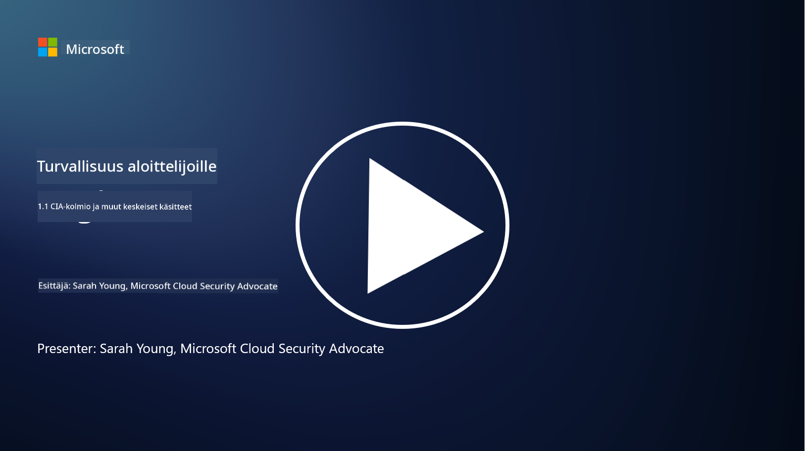
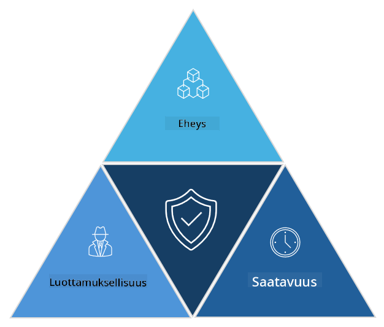

<!--
CO_OP_TRANSLATOR_METADATA:
{
  "original_hash": "16a76f9fa372fb63cffb6d76b855f023",
  "translation_date": "2025-09-03T21:39:58+00:00",
  "source_file": "1.1 The CIA triad and other key concepts.md",
  "language_code": "fi"
}
-->
# CIA-kolmio ja muita keskeisiä käsitteitä

## Johdanto

Tässä oppitunnissa käsitellään:

 - Mitä kyberturvallisuus on?
   
 
 - Mikä on kyberturvallisuuden CIA-kolmio?

   

 - Mitä tarkoittavat aitous, kiistämättömyys ja yksityisyys kyberturvallisuuden yhteydessä?

## Mitä kyberturvallisuus on?

Kyberturvallisuus, joka tunnetaan myös nimellä tietoturva, tarkoittaa tietokonejärjestelmien, verkkojen, laitteiden ja datan suojaamista digitaalisilta hyökkäyksiltä, luvattomalta pääsyltä, vahingoilta tai varkauksilta. Kyberturvallisuuden ensisijainen tavoite on varmistaa digitaalisten omaisuuserien ja tiedon luottamuksellisuus, eheys ja saatavuus. Kyberturvallisuuden ammattilaiset suunnittelevat ja toteuttavat suojausmekanismeja omaisuuden, datan ja tiedon suojaamiseksi. Kun yhä suurempi osa elämästämme on siirtynyt digitaaliseen ja verkkoon, kyberturvallisuus on noussut tärkeäksi huolenaiheeksi sekä yksityishenkilöille että organisaatioille.

## Mikä on kyberturvallisuuden CIA-kolmio?

Kyberturvallisuuden kolmio viittaa malliin, joka sisältää kolme keskeistä näkökohtaa kaikessa kyberturvallisuustyössä tai järjestelmän/ympäristön suunnittelussa:

### Luottamuksellisuus

Tämä on näkökohta, jonka useimmat ihmiset yhdistävät kyberturvallisuuteen: luottamuksellisuus tarkoittaa datan ja tiedon suojaamista luvattomilta pääsyyrityksiltä, eli vain niiden henkilöiden, jotka tarvitsevat tietoa, tulisi päästä siihen käsiksi. Kaikki data ei kuitenkaan ole samanarvoista, ja data luokitellaan ja suojataan yleensä sen perusteella, kuinka paljon vahinkoa tapahtuisi, jos se päätyisi vääriin käsiin.

### Eheys

Tarkoittaa datan tarkkuuden ja luotettavuuden suojaamista ympäristöissä ja estää datan muuttamisen tai muokkaamisen luvattomien henkilöiden toimesta. Esimerkiksi opiskelija muuttaa syntymäaikansa ajokorttitiedoissaan saadakseen ajokortin uudelleen painettuna vanhemmalla syntymäajalla alkoholin ostamista varten.

### Saatavuus

Tämä on tärkeä näkökohta operatiivisessa IT:ssä, mutta saatavuus on myös merkittävä kyberturvallisuuden kannalta. On olemassa erityisiä hyökkäystyyppejä, jotka kohdistuvat saatavuuteen, ja turvallisuusammattilaisten on suojattava näitä vastaan (esim. hajautetut palvelunestohyökkäykset – DDoS-hyökkäykset).

**Kyberturvallisuuden CIA-kolmio**

## Mitä aitous, kiistämättömyys ja yksityisyys tarkoittavat kyberturvallisuuden yhteydessä?

Nämä ovat muita tärkeitä käsitteitä, jotka liittyvät järjestelmien ja datan turvallisuuden ja luotettavuuden varmistamiseen:

**Aitous** - tarkoittaa varmuutta siitä, että tieto, viestintä tai taho, jonka kanssa olet vuorovaikutuksessa, on aito eikä sitä ole peukaloitu tai muutettu luvattomien osapuolten toimesta.

**Kiistämättömyys** - on käsite, joka varmistaa, että osapuoli ei voi kiistää osallisuuttaan tai viestin tai tapahtuman aitoutta. Se estää jonkun väittämästä, ettei hän lähettänyt viestiä tai suorittanut tiettyä toimintaa, kun todisteet osoittavat toisin.

**Yksityisyys** - tarkoittaa arkaluonteisten ja henkilökohtaisesti tunnistettavien tietojen suojaamista luvattomalta pääsyltä, käytöltä, paljastamiselta tai manipuloinnilta. Se sisältää sen hallinnan, kuka pääsee käsiksi henkilökohtaisiin tietoihin ja miten näitä tietoja kerätään, säilytetään ja jaetaan.

## Lisälukemista

[What Is Information Security (InfoSec)? | Microsoft Security](https://www.microsoft.com/security/business/security-101/what-is-information-security-infosec#:~:text=Three%20pillars%20of%20information%20security%3A%20the%20CIA%20triad,as%20guiding%20principles%20for%20implementing%20an%20InfoSec%20plan.)

---

**Vastuuvapauslauseke**:  
Tämä asiakirja on käännetty käyttämällä tekoälypohjaista käännöspalvelua [Co-op Translator](https://github.com/Azure/co-op-translator). Vaikka pyrimme tarkkuuteen, huomioithan, että automaattiset käännökset voivat sisältää virheitä tai epätarkkuuksia. Alkuperäinen asiakirja sen alkuperäisellä kielellä tulisi pitää ensisijaisena lähteenä. Kriittisen tiedon osalta suositellaan ammattimaista ihmiskäännöstä. Emme ole vastuussa väärinkäsityksistä tai virhetulkinnoista, jotka johtuvat tämän käännöksen käytöstä.