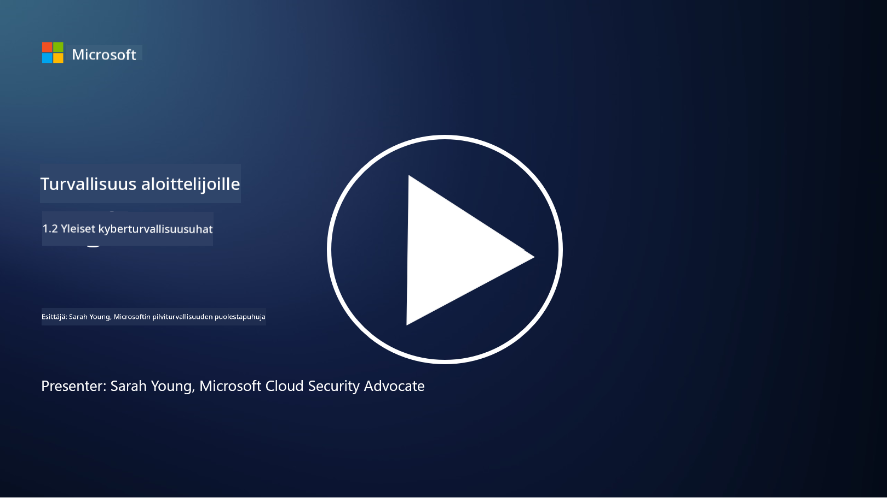

<!--
CO_OP_TRANSLATOR_METADATA:
{
  "original_hash": "6fc3030323139d7134a4ca9d03eccac9",
  "translation_date": "2025-09-03T20:12:57+00:00",
  "source_file": "1.2 Common cybersecurity threats.md",
  "language_code": "fi"
}
-->
# Yleiset kyberturvallisuusuhat

## Johdanto

Tässä oppitunnissa käsitellään:

- Mitä kyberturvallisuusuhka tarkoittaa?

- Miksi haitalliset toimijat haluavat vaarantaa dataa ja IT-järjestelmiä?

- Mitkä ovat yleisimmät kyberturvallisuusuhkien tyypit?

- Mikä on MITRE ATT&CK -kehys?

- Mistä voin pysyä ajan tasalla kyberturvallisuusuhkien kehityksestä?

## Mitä kyberturvallisuusuhka tarkoittaa?

Kyberturvallisuusuhka viittaa mahdolliseen vaaratilanteeseen tai riskiin, joka voi vaarantaa datan tai IT-järjestelmien luottamuksellisuuden, eheyden tai saatavuuden. Nämä uhat johtuvat haitallisista toimijoista, jotka pyrkivät hyödyntämään haavoittuvuuksia saadakseen luvattoman pääsyn, varastaakseen arkaluontoista tietoa, häiritäkseen toimintaa tai aiheuttaakseen vahinkoa yksilöille, organisaatioille tai jopa kokonaisille valtioille. Kyberturvallisuusuhat voivat ilmetä monin eri tavoin ja kohdistua digitaalisten järjestelmien ja datan eri osa-alueisiin.

## Miksi haitalliset toimijat haluavat vaarantaa dataa ja IT-järjestelmiä?

Haitalliset toimijat vaarantavat dataa ja IT-järjestelmiä monista syistä, jotka usein liittyvät henkilökohtaiseen hyötyyn, ideologisiin motiiveihin tai haluun aiheuttaa häiriöitä. Näiden motiivien ymmärtäminen voi auttaa organisaatioita ja yksilöitä puolustautumaan kyberuhkia vastaan. Joitakin yleisiä syitä, miksi haitalliset toimijat toteuttavat kyberhyökkäyksiä, ovat:

1. **Taloudellinen hyöty**: Monet hyökkäykset johtuvat halusta saada taloudellista voittoa. Haitalliset toimijat voivat varastaa arkaluontoista tietoa, kuten luottokorttinumeroita, pankkitilitietoja tai henkilötietoja, tehdäkseen petoksia, identiteettivarkauksia, kiristääkseen yksilöitä tai organisaatioita tai myydäkseen varastettua dataa pimeässä verkossa.

2. **Vakoilu**: Valtiot, kilpailijat tai muut tahot voivat harjoittaa kybervakoilua varastaakseen arkaluontoista hallituksen, yrityksen tai tutkimuksen dataa poliittisen, taloudellisen tai sotilaallisen edun saavuttamiseksi.

3. **Häirintä ja sabotointi**: Jotkut hyökkäykset pyrkivät häiritsemään kriittistä infrastruktuuria, palveluita tai toimintaa poliittisista tai ideologisista syistä. Nämä hyökkäykset voivat aiheuttaa laajamittaista kaaosta, taloudellisia tappioita ja maineen vahingoittumista.

4. **Ideologiset motiivit**: Aktivistit ja ryhmät, joilla on ideologisia tai poliittisia motiiveja, voivat vaarantaa järjestelmiä lisätäkseen tietoisuutta tietyistä asioista, edistääkseen uskomuksiaan tai protestoidakseen tiettyjä toimia tai organisaatioita vastaan.

5. **Tahattomat toimet**: Kaikki haitalliset toimet eivät ole tarkoituksellisia; jotkut yksilöt voivat tietämättään edistää kyberuhkia joutumalla sosiaalisen manipuloinnin uhreiksi tai olemalla osa vaarantunutta verkkoa.

Lopulta datan ja IT-järjestelmien vaarantamisen motiivit voivat vaihdella suuresti, ja näiden hyökkäysten vaikutukset voivat olla vakavia. On tärkeää, että yksilöt, organisaatiot ja hallitukset suhtautuvat kyberturvallisuuteen vakavasti ja toteuttavat toimenpiteitä suojautuakseen näiltä uhilta.

## Mitkä ovat yleisimmät kyberturvallisuusuhkien tyypit?

Haitalliset toimijat käyttävät useita yleisiä kyberhyökkäysten tyyppejä järjestelmien vaarantamiseen, datan varastamiseen ja häiriöiden aiheuttamiseen. Tässä on joitakin yleisimpiä uhkatyyppejä kirjoitushetkellä:

1. **Kalastelu (Phishing)**:

Kalastelu tarkoittaa harhaanjohtavien sähköpostien tai viestien lähettämistä, jotka näyttävät tulevan luotettavista lähteistä, tarkoituksena huijata vastaanottajia paljastamaan arkaluontoista tietoa, kuten salasanoja, luottokorttinumeroita tai henkilötietoja. Kalastelu voi myös ohjata uhreja haitallisille verkkosivustoille tai lataamaan haittaohjelmia.

2. **Haittaohjelmat (Malware)**:

Haittaohjelmat (pahantahtoiset ohjelmistot) kattavat joukon haitallisia ohjelmia, jotka on suunniteltu tartuttamaan järjestelmiä, varastamaan dataa tai aiheuttamaan vahinkoa. Haittaohjelmien tyyppejä ovat:

- **Kiristysohjelmat (Ransomware)**: Salakirjoittavat tiedostoja ja vaativat lunnaita niiden purkamiseksi.

- **Troijalaiset (Trojans)**: Naamioituvat laillisiksi ohjelmistoiksi ja antavat hyökkääjille luvattoman pääsyn.

- **Virukset (Viruses)**: Itseään kopioivat ohjelmat, jotka kiinnittyvät tiedostoihin ja leviävät.

- **Madot (Worms)**: Itseään kopioivat ohjelmat, jotka leviävät verkkojen kautta.

3. **Palvelunestohyökkäykset (DoS) ja hajautetut palvelunestohyökkäykset (DDoS)**:

DoS-hyökkäykset kuormittavat kohdejärjestelmää, tehden sen käyttäjille saavuttamattomaksi. DDoS-hyökkäykset käyttävät verkkoa vaarantuneista laitteista tulviakseen kohteen liikenteellä, mikä vaikeuttaa järjestelmän toimintaa tai saattaa pysäyttää sen kokonaan.

4. **SQL-injektio**:

Tässä hyökkäyksessä hyökkääjät manipuloivat verkkosovelluksen syötekenttiä injektoidakseen haitallisia SQL-kyselyitä, mikä voi johtaa luvattomaan pääsyyn tietokantoihin ja arkaluontoiseen dataan.

5. **Cross-Site Scripting (XSS)**:

Hyökkääjät injektoivat haitallisia skriptejä verkkosovelluksiin, jotka suoritetaan käyttäjien selaimissa. Tämä voi johtaa käyttäjädatan varastamiseen ja/tai haittaohjelmien leviämiseen.

6. **Sosiaalinen manipulointi (Social Engineering)**:

Sosiaalinen manipulointi hyödyntää ihmisten psykologiaa manipuloidakseen yksilöitä paljastamaan luottamuksellista tietoa tai suorittamaan toimia, jotka vaarantavat turvallisuuden.

7. **Nollapäivähaavoittuvuudet (Zero-Day Exploits)**:

Nämä hyökkäykset kohdistuvat ohjelmistojen tai laitteistojen haavoittuvuuksiin, joita ei vielä tunneta valmistajan tai yleisön keskuudessa. Hyökkääjät hyödyntävät näitä haavoittuvuuksia ennen kuin korjauksia kehitetään. Monet organisaatiot pelkäävät nollapäiviä, koska niille ei ole olemassa korjausta, mutta ne eivät ole yhtä yleisiä kuin muut tässä listassa mainitut hyökkäykset. Kun nollapäivähaavoittuvuus havaitaan, tietoturvatutkijat työskentelevät nopeasti korjauksen kehittämiseksi, ja siksi nollapäivät ovat yleensä lyhytikäisiä.

8. **Tunnistetiedot-hyökkäykset (Credential Attacks)**:

Näihin hyökkäyksiin kuuluvat esimerkiksi brute force -hyökkäykset, joissa hyökkääjät arvaavat salasanoja toistuvasti, sekä credential stuffing -hyökkäykset, joissa varastettuja tunnistetietoja yhdeltä sivustolta käytetään pääsyn yrittämiseen muilla sivustoilla.

## Mikä on MITRE ATT&CK -kehys?

[MITRE ATT&CK -kehys](https://attack.mitre.org/) (Adversarial Tactics, Techniques, and Common Knowledge) on kehys, joka luokittelee ja dokumentoi taktiikat, tekniikat ja menetelmät (TTP:t), joita hyökkääjät käyttävät kyberhyökkäysten aikana. Kehyksen on luonut MITRE Corporation, voittoa tavoittelematon organisaatio, joka operoi tutkimus- ja kehityskeskuksia eri hallitusvirastoille.

MITRE ATT&CK -kehys tarjoaa standardoidun tavan kuvata ja analysoida kyberuhkia, mikä auttaa kyberturvallisuuden ammattilaisia ymmärtämään ja puolustautumaan erilaisia hyökkäystekniikoita vastaan. Sitä käyttävät laajalti turvallisuustiimit, uhkien metsästäjät ja tapahtumien tutkijat:

1. **Hyökkääjien käyttäytymisen ymmärtäminen**: Kehys dokumentoi todellisia hyökkäystapoja, jotka kuvaavat hyökkääjien toimia aloitusvaiheesta tavoitteiden saavuttamiseen. Se kattaa laajan valikoiman hyökkäystekniikoita, joita eri uhkaryhmät käyttävät.

2. **Puolustusstrategioiden suunnittelu ja toteutus**: Turvallisuustiimit voivat käyttää kehystä kehittääkseen ennakoivia puolustusstrategioita, jotka vastaavat hyökkääjien mahdollisesti käyttämiä taktiikoita ja tekniikoita.

3. **Tapahtumien tutkinta ja uhkien metsästys**: Tapahtumia tutkittaessa tai uhkia metsästettäessä turvallisuusammattilaiset voivat viitata kehykseen tunnistaakseen ja lieventääkseen hyökkääjien käyttämiä tekniikoita.

MITRE ATT&CK -kehys on järjestetty matriiseihin, jotka ryhmittelevät hyökkäystekniikat tiettyjen alustojen ja ympäristöjen, kuten Windowsin, macOS:n, Linuxin ja pilvipalveluiden, perusteella. Jokainen matriisi on jaettu taktiikoihin (korkean tason tavoitteet) ja tekniikoihin (tarkat menetelmät tavoitteiden saavuttamiseksi). Jokaiselle tekniikalle kehys tarjoaa tietoa sen toiminnasta, mahdollisista lieventämiskeinoista ja asiaankuuluvista viittauksista todellisiin uhkatoimijoihin, jotka ovat käyttäneet tekniikkaa.

Kehystä päivitetään ja laajennetaan jatkuvasti uuden uhkatiedon keräämisen ja kyberturvallisuusympäristön kehittymisen myötä. Se on arvokas resurssi organisaation kyberturvallisuuden parantamiseksi, sillä se mahdollistaa syvemmän ymmärryksen hyökkääjien toiminnasta ja siitä, miten heidän taktiikoitaan vastaan voidaan puolustautua.

## Mistä voin pysyä ajan tasalla kyberturvallisuusuhkien kehityksestä?

Kyberturvallisuusuhkien seuraamiseen on monia lähteitä, tässä muutamia:

- [Open Web Application Security Project (OWASP) top 10 haavoittuvuudet](https://owasp.org/Top10/)
- [Common Vulnerabilities and Exposures (CVEs)](https://www.bing.com/ck/a?!&&p=53df6007f017bca2JmltdHM9MTY5MjU3NjAwMCZpZ3VpZD0zYmY4N2RiYS1jYWI1LTYwMDgtMWY1YS02ZmYyY2JjNjYxZWUmaW5zaWQ9NTc2OQ&ptn=3&hsh=3&fclid=3bf87dba-cab5-6008-1f5a-6ff2cbc661ee&psq=cve&u=a1aHR0cHM6Ly9iaW5nLmNvbS9hbGluay9saW5rP3VybD1odHRwcyUzYSUyZiUyZmN2ZS5taXRyZS5vcmclMmYmc291cmNlPXNlcnAtcnImaD1BZXN4S0VBWTNnbGhNZEFpd3daMlNSZkZQNTlrODhIUnYxRUtlSkY1RTk0JTNkJnA9a2NvZmZjaWFsd2Vic2l0ZQ&ntb=1 "Common Vulnerabilities and Exposures")
- [Microsoft Security Response Center -blogit](https://msrc.microsoft.com/blog/)
- [National Institute of Standards and Technology (NIST)](https://www.dhs.gov/topics/cybersecurity): NIST tarjoaa resursseja, hälytyksiä ja viimeisimpiä päivityksiä mahdollisista kyberturvallisuusuhista.
- [Cybersecurity and Infrastructure Security Agency (CISA)](https://www.cisa.gov/resources-tools/resources/free-cybersecurity-services-and-tools): CISA tarjoaa kyberturvallisuusresursseja ja parhaita käytäntöjä yrityksille, hallitusvirastoille ja muille organisaatioille. CISA jakaa ajankohtaista tietoa yhteisöä laajasti koskettavista korkean vaikutuksen turvallisuustoimista sekä syvällistä analyysiä uusista ja kehittyvistä kyberuhista.
- [National Cybersecurity Center of Excellence (NCCoE)](https://www.dhs.gov/topics/cybersecurity): NCCoE on keskus, joka tarjoaa käytännön kyberturvallisuusratkaisuja, joita voidaan soveltaa todellisissa tilanteissa.
- [US-CERT](https://www.cisa.gov/resources-tools/resources/free-cybersecurity-services-and-tools): Yhdysvaltain tietokoneiden hätävalmiusryhmä (US-CERT) tarjoaa monenlaisia kyberturvallisuusresursseja, kuten hälytyksiä, vinkkejä ja muuta.
- Oman maasi kyberhätävalmiusryhmä (CERT).

---

**Vastuuvapauslauseke**:  
Tämä asiakirja on käännetty käyttämällä tekoälypohjaista käännöspalvelua [Co-op Translator](https://github.com/Azure/co-op-translator). Vaikka pyrimme tarkkuuteen, huomioithan, että automaattiset käännökset voivat sisältää virheitä tai epätarkkuuksia. Alkuperäistä asiakirjaa sen alkuperäisellä kielellä tulisi pitää ensisijaisena lähteenä. Kriittisen tiedon osalta suositellaan ammattimaista ihmiskäännöstä. Emme ole vastuussa väärinkäsityksistä tai virhetulkinnoista, jotka johtuvat tämän käännöksen käytöstä.