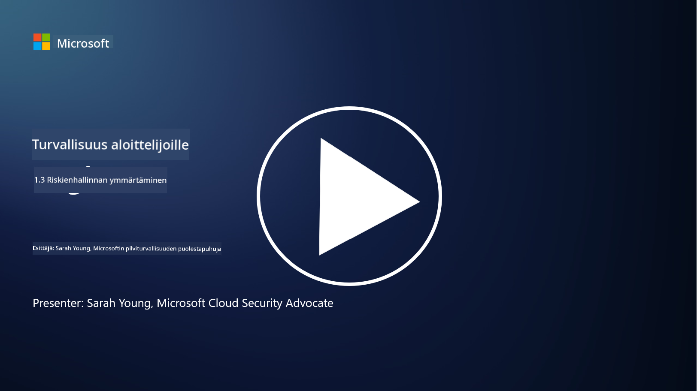
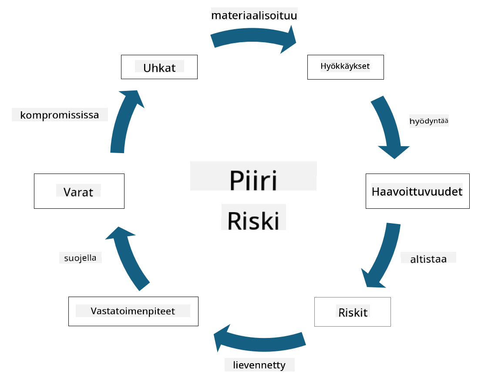

<!--
CO_OP_TRANSLATOR_METADATA:
{
  "original_hash": "fcca304f072cabf206388199e8e2e578",
  "translation_date": "2025-09-03T21:54:24+00:00",
  "source_file": "1.3 Understanding risk management.md",
  "language_code": "fi"
}
-->
# Riskienhallinnan ymmärtäminen

## Johdanto

Tässä oppitunnissa käsitellään:

- Yleisesti käytettyjen tietoturvatermien määritelmiä

- Tietoturvakontrollien tyyppejä

- Tietoturvariskien arviointia

## Yleisesti käytettyjen tietoturvatermien määritelmät

Nämä termit ovat keskeisiä käsitteitä kyberturvallisuuden ja riskienhallinnan alalla. Käydään läpi jokainen termi ja niiden keskinäinen yhteys:

1. **Uhka-agentti**:

Uhka-agentti on yksilö, ryhmä, organisaatio tai automatisoitu järjestelmä, jolla on kyky hyödyntää järjestelmän tai verkon haavoittuvuuksia aiheuttaakseen vahinkoa. Uhka-agentteja voivat olla esimerkiksi hakkerit, haittaohjelmien tekijät, tyytymättömät työntekijät tai mikä tahansa taho, joka muodostaa riskin tieto- ja teknologiajärjestelmille.

2. **Uhka**:

Uhka on mahdollinen tapahtuma tai toiminta, joka voi hyödyntää järjestelmän haavoittuvuuksia ja aiheuttaa vahinkoa omaisuudelle. Uhkiin kuuluvat esimerkiksi hakkerointi, tietomurrot, palvelunestohyökkäykset ja muut vastaavat toimet. Uhka kuvaa "mitä" vahinkoa organisaation omaisuudelle voi aiheutua.

3. **Haavoittuvuus**:

Haavoittuvuus on järjestelmän suunnittelussa, toteutuksessa tai konfiguraatiossa oleva heikkous, jota uhka-agentti voi hyödyntää järjestelmän turvallisuuden vaarantamiseksi. Haavoittuvuuksia voi esiintyä ohjelmistoissa, laitteistoissa, prosesseissa tai ihmisten toiminnassa. Haavoittuvuuksien tunnistaminen ja korjaaminen on olennaista onnistuneiden hyökkäysten riskin minimoimiseksi.

4. **Riski**:

Riski on mahdollisuus menetykseen, vahinkoon tai haittaan, joka syntyy uhkan ja haavoittuvuuden vuorovaikutuksesta. Se kuvaa todennäköisyyttä, että uhka-agentti hyödyntää haavoittuvuutta aiheuttaakseen negatiivisen vaikutuksen. Riskiä arvioidaan usein sen mahdollisen vaikutuksen ja toteutumisen todennäköisyyden perusteella.

5. **Omaisuus**:

Omaisuus on mikä tahansa arvo, jota organisaatio pyrkii suojaamaan. Omaisuuteen voi kuulua fyysiset esineet (kuten tietokoneet ja palvelimet), data (asiakastiedot, taloudelliset tiedot), immateriaalioikeudet (liikesalaisuudet, patentit) ja jopa henkilöstö (työntekijöiden taidot ja tieto). Omaisuuden suojaaminen on kyberturvallisuuden keskeinen tavoite.

6. **Altistus**:

Altistus viittaa tilaan, jossa järjestelmä on haavoittuvainen mahdollisille uhkille. Se tapahtuu, kun haavoittuvuus on olemassa ja uhka-agentti voisi hyödyntää sitä. Altistus korostaa riskiä, joka liittyy haavoittuvuuksien olemassaoloon järjestelmässä tai verkossa.

7. **Kontrolli**:

Kontrolli on toimenpide, joka on otettu käyttöön riskin vähentämiseksi haavoittuvuuksien ja uhkien yhteydessä. Kontrollit voivat olla teknisiä, menettelyllisiä tai hallinnollisia. Niiden tarkoituksena on estää, havaita tai lieventää mahdollisia uhkia ja haavoittuvuuksia. Esimerkkejä ovat palomuurit, pääsynhallinta, salaus, tietoturvapolitiikat ja työntekijöiden koulutus.

Yhteenvetona näiden termien välisestä suhteesta: Uhka-agentit hyödyntävät haavoittuvuuksia toteuttaakseen uhkia, jotka voivat johtaa riskeihin ja aiheuttaa vahinkoa arvokkaalle omaisuudelle. Altistus tapahtuu, kun haavoittuvuuksia on olemassa, ja kontrollit otetaan käyttöön riskin vähentämiseksi estämällä tai lieventämällä uhkien vaikutusta omaisuuteen. Tämä kehys muodostaa kyberturvallisuuden riskienhallinnan perustan, ohjaten organisaatioita tunnistamaan, arvioimaan ja käsittelemään mahdollisia riskejä heidän tietojärjestelmiinsä ja omaisuuteensa liittyen.

## Tietoturvakontrollien tyypit

Tietoturvakontrollit ovat toimenpiteitä tai suojakeinoja, jotka on otettu käyttöön tietojärjestelmien ja omaisuuden suojaamiseksi erilaisilta uhkilta ja haavoittuvuuksilta. Ne voidaan luokitella useisiin kategorioihin niiden painopisteen ja tarkoituksen perusteella. Tässä on joitakin yleisiä tietoturvakontrollien tyyppejä:

1. **Hallinnolliset kontrollit**:

Nämä kontrollit liittyvät organisaation tietoturvakäytäntöjä ja käyttäjien toimintaa ohjaaviin politiikkoihin, menettelytapoihin ja ohjeisiin.

- Tietoturvapolitiikat ja -menettelyt: Dokumentoidut ohjeet, jotka määrittelevät, miten tietoturvaa ylläpidetään organisaatiossa.

- Tietoturvatietoisuus ja koulutus: Ohjelmat, jotka kouluttavat työntekijöitä tietoturvan parhaista käytännöistä ja mahdollisista uhista.

- Tapahtumien hallinta: Suunnitelmat tietoturvatapahtumiin reagoimiseksi ja niiden vaikutusten lieventämiseksi.

2. **Tekniset kontrollit**:

Tekniset kontrollit sisältävät teknologian käytön tietoturvatoimenpiteiden toteuttamiseksi ja järjestelmien sekä datan suojaamiseksi. Esimerkkejä teknisistä kontrolleista ovat:

- Pääsynhallinta: Toimenpiteet, jotka rajoittavat käyttäjien pääsyä resursseihin heidän rooliensa ja oikeuksiensa perusteella.

- Salaus: Datan muuntaminen turvalliseen muotoon luvattoman pääsyn estämiseksi.

- Palomuurit: Verkkoturvalaitteet, jotka suodattavat ja hallitsevat sisään- ja uloskäyvää liikennettä.

- Tunkeutumisen havaitsemis- ja estojärjestelmät (IDPS): Työkalut, jotka seuraavat verkkoliikennettä epäilyttävän toiminnan varalta.

- Virustorjunta- ja haittaohjelmisto: Ohjelmat, jotka havaitsevat ja poistavat haitallista ohjelmistoa.

- Todennusmekanismit: Menetelmät käyttäjien identiteetin varmistamiseksi, kuten salasanat, biometriset tunnisteet ja monivaiheinen todennus.

- Päivitysten hallinta: Ohjelmistojen säännöllinen päivittäminen tunnettuja haavoittuvuuksia korjaamaan.

3. **Fyysiset kontrollit**:

Fyysiset kontrollit ovat toimenpiteitä fyysisen omaisuuden ja tilojen suojaamiseksi.

- Turvahenkilöstö ja pääsynvalvonta: Henkilöstö, joka valvoo ja hallitsee pääsyä fyysisiin tiloihin.

- Valvontakamerat: Videovalvontajärjestelmät, jotka seuraavat ja tallentavat toimintoja.

- Lukot ja fyysiset esteet: Fyysiset toimenpiteet, jotka rajoittavat pääsyä arkaluonteisiin alueisiin.

- Ympäristönhallinta: Toimenpiteet, jotka säätelevät lämpötilaa, kosteutta ja muita ympäristötekijöitä, jotka vaikuttavat laitteisiin ja datakeskuksiin.

4. **Operatiiviset kontrollit**:

Nämä kontrollit liittyvät päivittäisiin toimintoihin ja aktiviteetteihin, jotka varmistavat järjestelmien jatkuvan turvallisuuden.

- Muutostenhallinta: Prosessit järjestelmien ja konfiguraatioiden muutosten seuraamiseksi ja hyväksymiseksi.

- Varmuuskopiointi ja katastrofienhallinta: Suunnitelmat datan varmuuskopioimiseksi ja palauttamiseksi järjestelmävikojen tai katastrofien sattuessa.

- Lokitus ja auditointi: Järjestelmätoimintojen seuranta ja tallentaminen turvallisuuden ja vaatimustenmukaisuuden varmistamiseksi.

- Turvalliset ohjelmointikäytännöt: Ohjeet ohjelmistojen kirjoittamiseen haavoittuvuuksien minimoimiseksi.

5. **Lainsäädännölliset ja sääntelyyn liittyvät kontrollit**:

Nämä kontrollit varmistavat vaatimustenmukaisuuden sovellettavien lakien, säädösten ja toimialastandardien kanssa. Organisaation noudatettavat standardit riippuvat lainkäyttöalueesta, toimialasta ja muista tekijöistä.

- Tietosuojalainsäädäntö: Vaatimustenmukaisuus lakien, kuten GDPR:n, HIPAA:n ja CCPA:n, kanssa.

- Toimialakohtaiset standardit: Standardien, kuten PCI DSS:n, noudattaminen maksukorttidatan turvallisuuden varmistamiseksi.

Nämä tietoturvakontrollien kategoriat toimivat yhdessä luodakseen kattavan tietoturvan organisaatioille, auttaen suojaamaan niiden järjestelmiä, dataa ja omaisuutta monenlaisilta uhkilta.

## Tietoturvariskien arviointi

Jotkut tietoturva-ammattilaiset ajattelevat, että riskienhallinta kuuluu riskienhallinnan ammattilaisille, mutta tietoturvariskien hallintaprosessin ymmärtäminen on tärkeää jokaiselle tietoturva-ammattilaiselle, jotta he voivat ilmaista tietoturvariskit tavalla, jonka muu organisaatio ymmärtää ja jonka perusteella voi toimia.

Organisaatioiden on arvioitava tietoturvariskejä jatkuvasti ja päätettävä, mitä toimia (tai toimimattomuutta) riskeihin liittyen tehdään. Alla on yleiskatsaus siitä, miten tämä prosessi tyypillisesti toteutetaan. Huomaa, että tämä prosessi toteutetaan yleensä useiden eri tiimien kesken organisaatiossa, harvoin yksi tiimi vastaa riskien hallinnasta alusta loppuun.

1. **Omaisuuden ja uhkien tunnistaminen**:

Organisaatio tunnistaa omaisuudet, joita se haluaa suojata. Näihin voi kuulua data, järjestelmät, laitteisto, ohjelmisto, immateriaalioikeudet ja paljon muuta. Seuraavaksi tunnistetaan mahdolliset uhkat, jotka voivat kohdistua näihin omaisuuksiin.

2. **Haavoittuvuuksien arviointi**:

Organisaatiot tunnistavat haavoittuvuudet tai heikkoudet järjestelmissä tai prosesseissa, joita uhkat voivat hyödyntää. Nämä haavoittuvuudet voivat johtua ohjelmistovirheistä, vääristä konfiguraatioista, tietoturvakontrollien puutteesta ja inhimillisistä virheistä.

3. **Todennäköisyyden arviointi**:

Organisaatio arvioi kunkin uhkan toteutumisen todennäköisyyden. Tämä sisältää historiallisen datan, uhkatiedustelun, toimialatrendien ja sisäisten tekijöiden huomioimisen. Todennäköisyys voidaan luokitella matalaksi, keskitasoiseksi tai korkeaksi uhkan toteutumisen todennäköisyyden perusteella.

4. **Vaikutuksen arviointi**:

Seuraavaksi organisaatio määrittää kunkin uhkan mahdollisen vaikutuksen, jos se hyödyntäisi haavoittuvuutta. Vaikutus voi sisältää taloudellisia menetyksiä, toiminnallisia häiriöitä, mainehaittoja, oikeudellisia seuraamuksia ja paljon muuta. Vaikutus voidaan myös luokitella matalaksi, keskitasoiseksi tai korkeaksi mahdollisten seurausten perusteella.

5. **Riskin laskenta**:

Todennäköisyyden ja vaikutuksen arvioinnit yhdistetään kunkin tunnistetun uhkan kokonaisriskitason laskemiseksi. Tämä tehdään usein riskimatriisilla, joka antaa numeerisia arvoja tai laadullisia kuvauksia todennäköisyys- ja vaikutustasoille. Tuloksena oleva riskitaso auttaa priorisoimaan, mitkä riskit vaativat välitöntä huomiota.

6. **Priorisointi ja päätöksenteko**:

Organisaatio priorisoi riskit keskittymällä niihin, joilla on korkein yhdistetty todennäköisyys ja vaikutus. Tämä mahdollistaa resurssien kohdentamisen ja kontrollien toteuttamisen tehokkaammin. Korkean riskin uhkat vaativat välitöntä huomiota, kun taas matalan riskin uhkat voidaan käsitellä pidemmällä aikavälillä.

7. **Riskin käsittely**:

Riskinarvioinnin perusteella organisaatio päättää, miten kukin riski lievennetään tai hallitaan. Tämä voi sisältää tietoturvakontrollien toteuttamisen, riskin siirtämisen vakuutuksen kautta tai jopa tietyn jäännösriskin hyväksymisen, jos sen katsotaan olevan hallittavissa/liian kallis korjata/jne.

8. **Jatkuva seuranta ja tarkastelu**:

Riskinarviointi ei ole kertaluonteinen prosessi. Se tulisi suorittaa säännöllisesti tai aina, kun organisaation ympäristössä tapahtuu merkittäviä muutoksia. Jatkuva seuranta varmistaa, että uudet uhkat, haavoittuvuudet tai muutokset liiketoimintaympäristössä otetaan huomioon.

Arvioimalla tietoturvariskejä tällä rakenteellisella tavalla organisaatiot voivat tehdä perusteltuja päätöksiä resurssien kohdentamisesta, tietoturvakontrolleista ja yleisistä riskienhallintastrategioista. Tavoitteena on vähentää organisaation kokonaisriskialtistusta samalla, kun tietoturvatoimet linjataan organisaation liiketoimintatavoitteiden ja -päämäärien kanssa.

---

**Vastuuvapauslauseke**:  
Tämä asiakirja on käännetty käyttämällä tekoälypohjaista käännöspalvelua [Co-op Translator](https://github.com/Azure/co-op-translator). Vaikka pyrimme tarkkuuteen, huomioithan, että automaattiset käännökset voivat sisältää virheitä tai epätarkkuuksia. Alkuperäinen asiakirja sen alkuperäisellä kielellä tulisi pitää ensisijaisena lähteenä. Kriittisen tiedon osalta suositellaan ammattimaista ihmiskäännöstä. Emme ole vastuussa väärinkäsityksistä tai virhetulkinnoista, jotka johtuvat tämän käännöksen käytöstä.