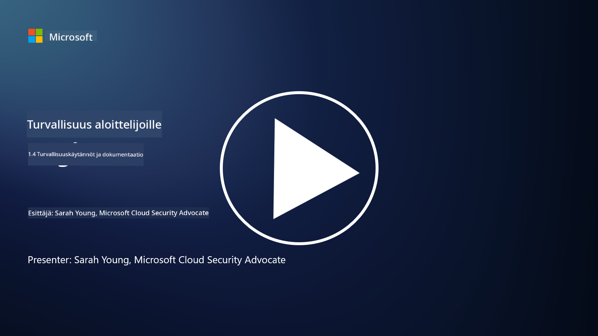

<!--
CO_OP_TRANSLATOR_METADATA:
{
  "original_hash": "d33500902124e52870935bdce4546fcc",
  "translation_date": "2025-09-03T20:59:44+00:00",
  "source_file": "1.4 Security practices and documentation.md",
  "language_code": "fi"
}
-->
# Turvakäytännöt ja dokumentaatio

Olet ehkä kuullut aiemmin termejä kuten "turvapolitiikka", "turvastandardi" jne., mutta todellisuudessa monet kyberturvallisuuden ammattilaiset eivät käytä niitä oikein. Tässä osiossa selitämme, mitä kukin näistä termeistä tarkoittaa ja miksi organisaatio käyttäisi niitä.

## Johdanto

Tässä oppitunnissa käsitellään:

- Mikä on turvapolitiikka?

- Mikä on turvastandardi?

- Mikä on turvaperusta?

- Mikä on turvaohje?

- Mikä on turvamenettely?

- Mitä lait ja säädökset tarkoittavat kyberturvallisuuden yhteydessä?

Näitä termejä käytetään usein kyberturvallisuuden yhteydessä kuvaamaan organisaation eri tasoja turvallisuusdokumentaation ja -käytäntöjen osalta. Selvennetään jokainen termi:

## Mikä on turvapolitiikka?

Turvapolitiikka on korkeatasoinen dokumentti, joka määrittelee organisaation yleiset turvallisuustavoitteet, periaatteet ja ohjeet. Se tarjoaa viitekehyksen turvallisuuteen liittyvien päätösten tekemiselle ja asettaa organisaation turvallisuusasenteen. Turvapolitiikat käsittelevät yleensä aiheita kuten resurssien hyväksyttävä käyttö, tietosuoja, pääsynhallinta, tapahtumien käsittely ja paljon muuta. Politiikka on riippumaton ratkaisuista ja teknologiasta. Esimerkki turvapolitiikasta, joka on monille tuttu, voisi olla organisaation hyväksyttävän käytön politiikka.

## Mikä on turvastandardi?

Turvastandardi on yksityiskohtaisempi ja tarkempi dokumentti, joka tarjoaa ohjeita ja vaatimuksia turvallisuuskontrollien ja -toimenpiteiden toteuttamiseksi organisaatiossa. Standardit ovat konkreettisempia ja teknisempiä kuin politiikat, ja ne tarjoavat tarkkoja ohjeita ja suosituksia järjestelmien, verkkojen ja prosessien konfiguroimiseksi ja ylläpitämiseksi turvallisuustavoitteiden saavuttamiseksi. Esimerkki turvastandardista voisi olla _"Kaikki sisäinen data on salattava levossa ja siirron aikana."_

## Mikä on turvaperusta?

Turvaperusta on joukko vähimmäisturvallisuuskonfiguraatioita, jotka katsotaan välttämättömiksi tietylle järjestelmälle, sovellukselle tai ympäristölle tiettynä ajankohtana. Se määrittelee lähtökohdan turvallisuudelle, joka tulisi toteuttaa kaikissa asiaankuuluvissa tapauksissa. Turvaperustat auttavat varmistamaan johdonmukaisuuden ja tietyn turvallisuustason organisaation IT-infrastruktuurissa. Esimerkki turvaperustasta voisi olla _"Azure-virtuaalikoneilla ei saa olla suoraa internet-yhteyttä."_

## Mikä on turvaohje?

Turvaohje on dokumentti, joka tarjoaa suosituksia ja ohjeita silloin, kun tietty turvastandardi ei ole sovellettavissa. Ohjeet pyrkivät käsittelemään "harmaita alueita", jotka syntyvät, kun standardi ei kata tai kattaa vain osittain tietyn asian.

## Mikä on turvamenettely?

Turvamenettely on yksityiskohtainen vaiheittainen opas, joka määrittelee tarkat toimet ja tehtävät, jotka on suoritettava turvallisuuteen liittyvän prosessin tai tehtävän toteuttamiseksi. Menettelyt ovat käytännöllisiä ja toteutettavia dokumentteja, jotka tarjoavat selkeän toimintajärjestyksen esimerkiksi tapahtumien käsittelyssä, järjestelmän ylläpidossa, käyttäjien perehdyttämisessä ja muissa turvallisuuteen liittyvissä toiminnoissa. Esimerkki turvamenettelystä voisi olla _"Kun Microsoft Sentinel tuottaa P1-turvallisuustapahtuman, turvallisuuskeskuksen (SOC) on välittömästi informoitava päivystävää turvallisuuspäällikköä ja lähetettävä tapahtuman tiedot hänelle."_

Yhteenvetona nämä termit edustavat organisaation kyberturvallisuuskehyksen eri tasoja dokumentaation ja ohjeistuksen osalta. Turvapolitiikat asettavat korkeatasoiset tavoitteet, standardit tarjoavat yksityiskohtaisia vaatimuksia, perustat määrittelevät vähimmäisturvallisuuskonfiguraatiot, ohjeet tarjoavat parhaita käytäntöjä ja menettelyt tarjoavat toteutettavia vaiheita turvallisuusprosesseille.

## Mitä lait ja säädökset tarkoittavat kyberturvallisuuden yhteydessä?

Lait ja säädökset viittaavat hallitusten ja sääntelyelinten luomiin oikeudellisiin kehyksiin, jotka määrittelevät ja valvovat sääntöjä, standardeja ja vaatimuksia digitaalisten järjestelmien, datan ja tiedon suojaamiseksi. Nämä lait ja säädökset vaihtelevat lainkäyttöalueittain ja keskittyvät kyberturvallisuuden eri osa-alueisiin, kuten tietosuojaan, yksityisyyteen, tapahtumien raportointiin ja kriittisen infrastruktuurin turvallisuuteen. Tässä muutamia esimerkkejä kyberturvallisuuteen liittyvistä laeista ja säädöksistä: esim. General Data Protection Regulation (GDPR), Health Insurance Portability and Accountability Act (HIPAA), California Consumer Privacy Act (CCPA), Payment Card Industry Data Security Standard (PCI DSS).

## Lisälukemista

[Information Security Policy Templates | SANS Institute](https://www.sans.org/information-security-policy/)

[Compliance with Cybersecurity and Privacy Laws and Regulations | NIST](https://www.nist.gov/mep/cybersecurity-resources-manufacturers/compliance-cybersecurity-and-privacy-laws-and-regulations)

---

**Vastuuvapauslauseke**:  
Tämä asiakirja on käännetty käyttämällä tekoälypohjaista käännöspalvelua [Co-op Translator](https://github.com/Azure/co-op-translator). Vaikka pyrimme tarkkuuteen, huomioithan, että automaattiset käännökset voivat sisältää virheitä tai epätarkkuuksia. Alkuperäinen asiakirja sen alkuperäisellä kielellä tulisi pitää ensisijaisena lähteenä. Kriittisen tiedon osalta suositellaan ammattimaista ihmiskäännöstä. Emme ole vastuussa väärinkäsityksistä tai virhetulkinnoista, jotka johtuvat tämän käännöksen käytöstä.