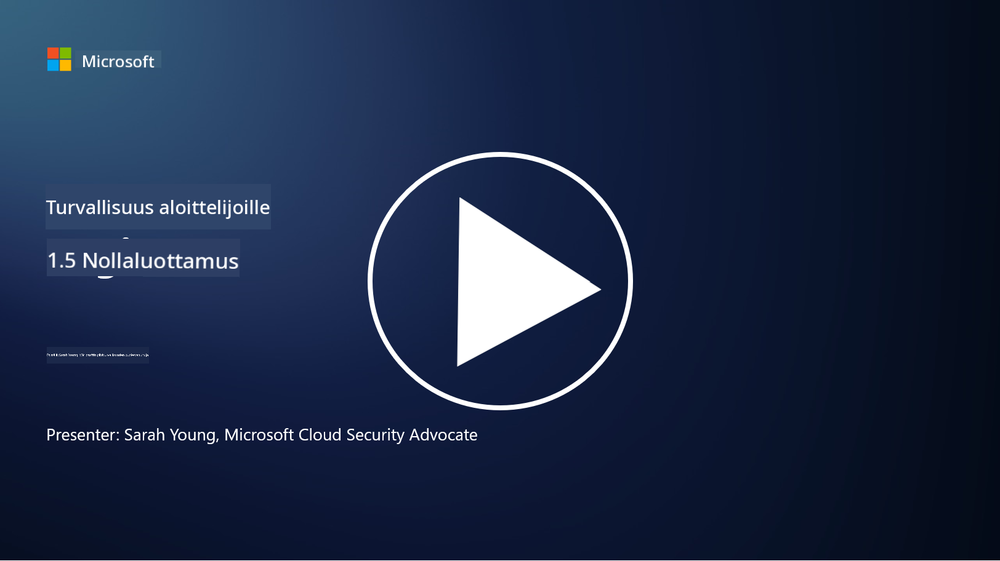
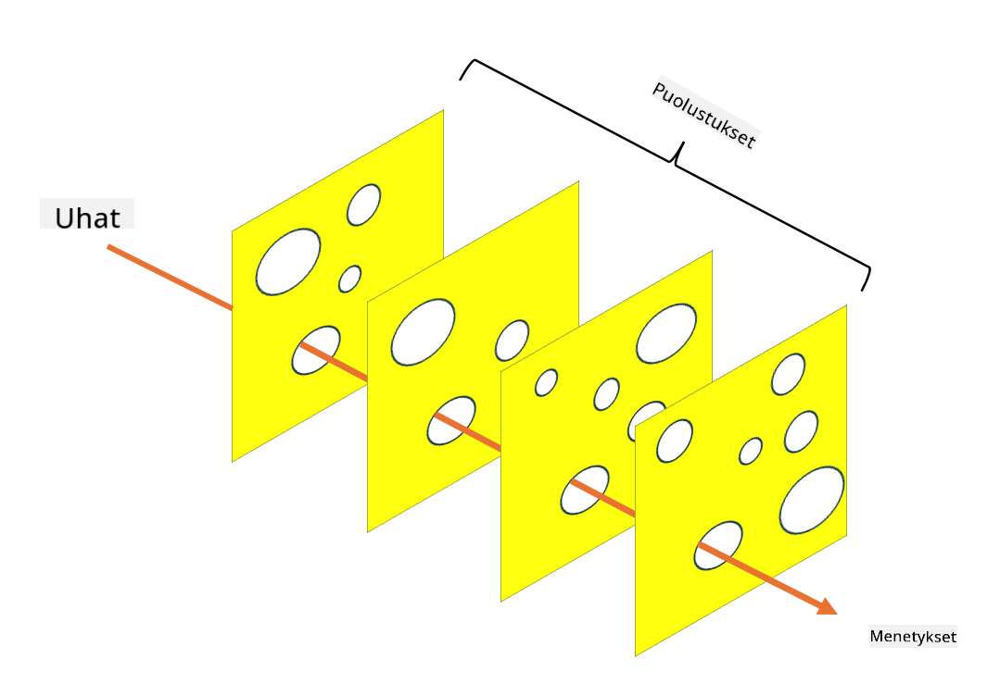

<!--
CO_OP_TRANSLATOR_METADATA:
{
  "original_hash": "75f77f972d2233c584f87c1eb96c983b",
  "translation_date": "2025-09-03T20:31:58+00:00",
  "source_file": "1.5 Zero trust.md",
  "language_code": "fi"
}
-->
# Zero Trust

"Zero trust" on termi, jota käytetään nykyään paljon tietoturvapiireissä. Mutta mitä se tarkoittaa, onko se vain muotisana? Tässä oppitunnissa sukellamme tarkemmin siihen, mitä zero trust todella tarkoittaa.

## Johdanto

- Tässä oppitunnissa käsittelemme:

- Mitä zero trust tarkoittaa?

- Miten zero trust eroaa perinteisistä tietoturva-arkkitehtuureista?

- Mitä tarkoittaa syvyyspuolustus?

## Zero Trust

Zero Trust on kyberturvallisuuslähestymistapa, joka haastaa perinteisen "luota mutta varmista" -ajattelutavan olettamalla, että mikään taho, olipa se organisaation verkon sisä- tai ulkopuolella, ei ole automaattisesti luotettava. Sen sijaan Zero Trust korostaa jokaisen käyttäjän, laitteen ja sovelluksen tarkistamista ennen resurssien käyttöä, sijainnista riippumatta. Zero Trustin keskeinen periaate on minimoida "hyökkäyspinta" ja vähentää tietoturvaloukkausten mahdollisia vaikutuksia.

Zero Trust -mallissa korostetaan seuraavia periaatteita:

1. **Tunnista käyttäjä**: Kaikkien käyttäjien ja laitteiden autentikointi ja valtuutus toteutetaan tiukasti sijainnista riippumatta. Muista, että identiteetti ei välttämättä ole aina ihminen: se voi olla laite, sovellus jne.

2. **Vähimmäisoikeudet**: Käyttäjille ja laitteille annetaan vain välttämättömät käyttöoikeudet tehtävien suorittamiseen, mikä vähentää mahdollisia vahinkoja, jos ne vaarantuvat.

3. **Mikrosegmentointi**: Verkkoresurssit jaetaan pienempiin osiin, jotta verkon sisäinen liikkuminen voidaan rajoittaa mahdollisen tietomurron sattuessa.

4. **Jatkuva seuranta**: Käyttäjien ja laitteiden käyttäytymistä seurataan jatkuvasti poikkeavuuksien ja mahdollisten uhkien havaitsemiseksi. Modernit seurantatekniikat hyödyntävät myös koneoppimista, tekoälyä ja uhkatiedustelua tuottaakseen lisätietoa ja kontekstia seurantaan.

5. **Tietojen salaus**: Tiedot salataan sekä siirron aikana että levossa luvattoman käytön estämiseksi.

6. **Tiukat käyttöoikeudet**: Käyttöoikeuksia valvotaan kontekstin perusteella, kuten käyttäjän roolin, laitteen kunnon ja verkon sijainnin mukaan.

Microsoft jakaa zero trustin viiteen pilariin, joita käsittelemme myöhemmässä oppitunnissa.

## Erot perinteisiin tietoturva-arkkitehtuureihin

Zero Trust eroaa perinteisistä tietoturva-arkkitehtuureista, kuten perimetriin perustuvista malleista, useilla tavoilla:

1. **Perimetri vs. identiteettikeskeisyys**: Perinteiset mallit keskittyvät verkon perimetrin suojaamiseen ja olettavat, että sisäiset käyttäjät ja laitteet ovat luotettavia, kun ne ovat verkon sisällä. Zero Trust puolestaan olettaa, että uhkia voi tulla sekä verkon sisältä että ulkopuolelta, ja käyttää tiukkoja identiteettipohjaisia valvontakeinoja.

2. **Implisiittinen vs. eksplisiittinen luottamus**: Perinteiset mallit luottavat implisiittisesti verkon sisällä oleviin laitteisiin ja käyttäjiin, kunnes toisin todistetaan. Zero Trust tarkistaa identiteetit eksplisiittisesti ja seuraa jatkuvasti poikkeavuuksia.

3. **Tasainen vs. segmentoitu verkko**: Perinteiset arkkitehtuurit sisältävät usein tasaisia verkkoja, joissa sisäisillä käyttäjillä on laaja pääsy. Zero Trust puolestaan suosii verkon jakamista pienempiin, eristettyihin alueisiin tietomurtojen rajoittamiseksi.

4. **Reaktiivinen vs. proaktiivinen**: Perinteinen tietoturva luottaa usein reaktiivisiin toimenpiteisiin, kuten perimetritason palomuureihin ja tunkeutumisen havaitsemiseen. Zero Trust lähestyy asiaa proaktiivisesti olettamalla, että tietomurrot ovat todennäköisiä, ja pyrkii minimoimaan niiden vaikutukset.

## Syvyyspuolustus

Syvyyspuolustus, joka tunnetaan myös kerroksellisena tietoturvana, on kyberturvallisuusstrategia, jossa organisaation omaisuutta suojataan useilla päällekkäisillä tietoturvatoimenpiteillä. Tavoitteena on luoda useita suojakerroksia, jotta yhden kerroksen murtuessa muut voivat edelleen tarjota suojaa. Jokainen kerros keskittyy eri tietoturvan osa-alueeseen ja parantaa organisaation kokonaisvaltaista tietoturvaa.

Syvyyspuolustus sisältää teknisiä, menettelyllisiä ja fyysisiä tietoturvatoimenpiteitä. Näitä voivat olla esimerkiksi palomuurit, tunkeutumisen havaitsemisjärjestelmät, käyttöoikeuksien hallinta, salaus, käyttäjäkoulutus, tietoturvapolitiikat ja paljon muuta. Ajatuksena on luoda useita esteitä, jotka yhdessä tekevät organisaation järjestelmien ja verkkojen läpäisemisen vaikeaksi hyökkääjille. Tätä lähestymistapaa kutsutaan joskus myös "sveitsiläisen juuston" malliksi, jota käytetään myös onnettomuuksien ehkäisyssä muilla aloilla (esim. liikenne).

## Lisälukemista

[What is Zero Trust?](https://learn.microsoft.com/security/zero-trust/zero-trust-overview?WT.mc_id=academic-96948-sayoung)

[Evolving Zero Trust – Microsoft Position Paper](https://query.prod.cms.rt.microsoft.com/cms/api/am/binary/RWJJdT?WT.mc_id=academic-96948-sayoung)

[Zero Trust and BeyondCorp Google Cloud | Google Cloud Blog](https://cloud.google.com/blog/topics/developers-practitioners/zero-trust-and-beyondcorp-google-cloud)

---

**Vastuuvapauslauseke**:  
Tämä asiakirja on käännetty käyttämällä tekoälypohjaista käännöspalvelua [Co-op Translator](https://github.com/Azure/co-op-translator). Vaikka pyrimme tarkkuuteen, huomioithan, että automaattiset käännökset voivat sisältää virheitä tai epätarkkuuksia. Alkuperäinen asiakirja sen alkuperäisellä kielellä tulisi pitää ensisijaisena lähteenä. Kriittisen tiedon osalta suositellaan ammattimaista ihmiskäännöstä. Emme ole vastuussa väärinkäsityksistä tai virhetulkinnoista, jotka johtuvat tämän käännöksen käytöstä.