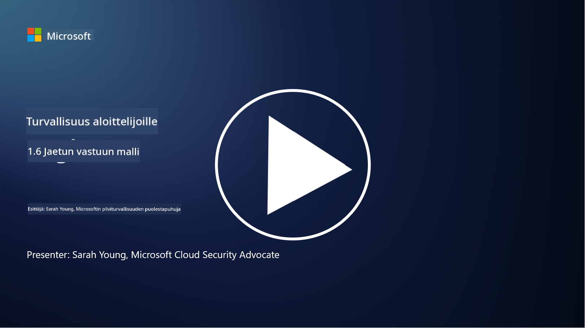

<!--
CO_OP_TRANSLATOR_METADATA:
{
  "original_hash": "a48db640d80c786b928ca178c414f084",
  "translation_date": "2025-09-03T21:04:50+00:00",
  "source_file": "1.6 Shared responsibility model.md",
  "language_code": "fi"
}
-->
# Jaetun vastuun malli

Jaettu vastuu on uudempi käsite IT-alalla, joka syntyi pilvipalveluiden myötä. Kyberturvallisuuden näkökulmasta on kriittistä ymmärtää, kuka tarjoaa mitkä turvallisuusratkaisut, jotta puolustuksessa ei synny aukkoja.

## Johdanto

Tässä oppitunnissa käsittelemme:

- Mitä jaettu vastuu tarkoittaa kyberturvallisuuden yhteydessä?

- Mikä on ero jaetussa vastuussa turvallisuusratkaisujen osalta IaaS:n, PaaS:n ja SaaS:n välillä?

- Mistä voit selvittää, mitä turvallisuusratkaisuja pilvialustasi tarjoaa?

- Mitä tarkoittaa "luota, mutta varmista"?

## Mitä jaettu vastuu tarkoittaa kyberturvallisuuden yhteydessä?

Jaettu vastuu kyberturvallisuudessa viittaa turvallisuusvastuiden jakautumiseen pilvipalveluntarjoajan (CSP) ja sen asiakkaiden välillä. Pilvipalveluympäristöissä, kuten Infrastructure as a Service (IaaS), Platform as a Service (PaaS) ja Software as a Service (SaaS), sekä CSP:llä että asiakkaalla on roolinsa tietojen, sovellusten ja järjestelmien turvallisuuden varmistamisessa.

## Mikä on ero jaetussa vastuussa turvallisuusratkaisujen osalta IaaS:n, PaaS:n ja SaaS:n välillä?

Vastuiden jakautuminen riippuu yleensä käytettävästä pilvipalvelutyypistä:

- **IaaS (Infrastructure as a Service)**: CSP tarjoaa perustavan infrastruktuurin (palvelimet, verkot, tallennus), kun taas asiakas vastaa käyttöjärjestelmien, sovellusten ja turvallisuusasetusten hallinnasta kyseisellä infrastruktuurilla.

- **PaaS (Platform as a Service):** CSP tarjoaa alustan, jolla asiakkaat voivat rakentaa ja ottaa käyttöön sovelluksia. CSP hallinnoi taustalla olevaa infrastruktuuria, ja asiakas keskittyy sovelluskehitykseen ja tietoturvaan.

- **SaaS (Software as a Service):** CSP tarjoaa täysin toimivia sovelluksia, jotka ovat käytettävissä internetin kautta. Tässä tapauksessa CSP vastaa sovelluksen ja infrastruktuurin turvallisuudesta, kun taas asiakas hallinnoi käyttäjien pääsyä ja tietojen käyttöä.

Jaetun vastuun ymmärtäminen on tärkeää, koska se selventää, mitkä turvallisuusnäkökohdat kuuluvat CSP:lle ja mitkä asiakkaan vastuulle. Tämä auttaa välttämään väärinkäsityksiä ja varmistaa, että turvallisuustoimenpiteet toteutetaan kokonaisvaltaisesti.

## Mistä voit selvittää, mitä turvallisuusratkaisuja pilvialustasi tarjoaa?

Pilvialustasi tarjoamat turvallisuusratkaisut voi selvittää tutustumalla pilvipalveluntarjoajan dokumentaatioon ja resursseihin. Näitä ovat esimerkiksi:

- **CSP:n verkkosivusto ja dokumentaatio**: CSP:n verkkosivustolla on tietoa palveluiden mukana tulevista turvallisuusominaisuuksista ja -ratkaisuista. CSP:t tarjoavat yleensä yksityiskohtaista dokumentaatiota, joka selittää heidän turvallisuuskäytäntönsä, ratkaisunsa ja suosituksensa. Tämä voi sisältää esimerkiksi whitepapereita, turvallisuusoppaita ja teknistä dokumentaatiota.

- **Turvallisuusarvioinnit ja auditoinnit**: Useimmat CSP:t teettävät turvallisuusratkaisujensa arviointeja riippumattomilla turvallisuusasiantuntijoilla ja organisaatioilla. Nämä arviot voivat antaa tietoa CSP:n turvallisuustoimenpiteiden laadusta. Joskus tämä johtaa siihen, että CSP saa turvallisuussertifikaatin (katso seuraava kohta).

- **Turvallisuussertifikaatit**: Useimmat CSP:t hankkivat sertifikaatteja, kuten ISO:27001, SOC 2 ja FedRAMP. Nämä sertifikaatit osoittavat, että palveluntarjoaja täyttää tietyt turvallisuus- ja vaatimustenmukaisuusstandardit.

Muista, että tiedon yksityiskohtaisuus ja saatavuus voivat vaihdella pilvipalveluntarjoajien välillä. Varmista aina, että käytät virallisia ja ajantasaisia resursseja, joita pilvipalveluntarjoaja tarjoaa, jotta voit tehdä tietoon perustuvia päätöksiä pilvipohjaisten omaisuuseriesi turvallisuudesta.

## Mitä tarkoittaa "luota, mutta varmista"?

Kun käytetään CSP:tä, kolmannen osapuolen ohjelmistoa tai muuta IT-turvallisuuspalvelua, organisaatio saattaa aluksi luottaa palveluntarjoajan väitteisiin turvallisuustoimenpiteistä. Kuitenkin varmistaakseen tietojensa ja järjestelmiensä turvallisuuden, organisaation tulisi varmistaa nämä väitteet turvallisuusarviointien, tunkeutumistestauksen ja ulkopuolisen tahon turvallisuusratkaisujen tarkastelun avulla ennen ohjelmiston tai palvelun täyttä integrointia toimintaansa. Kaikkien yksilöiden ja organisaatioiden tulisi pyrkiä luottamaan, mutta varmistamaan ne turvallisuusratkaisut, joista he eivät itse ole vastuussa.

## Jaettu vastuu organisaation sisällä

Muista, että jaettu vastuu turvallisuudesta organisaation sisällä eri tiimien välillä on myös otettava huomioon. Turvatiimi harvoin toteuttaa kaikki kontrollit itse, vaan sen on tehtävä yhteistyötä operatiivisten tiimien, kehittäjien ja muiden liiketoiminnan osien kanssa tarvittavien turvallisuuskontrollien toteuttamiseksi, jotta organisaatio pysyy turvassa.

## Lisälukemista
- [Jaettu vastuu pilvessä - Microsoft Azure | Microsoft Learn](https://learn.microsoft.com/azure/security/fundamentals/shared-responsibility?WT.mc_id=academic-96948-sayoung)
- [Mitä jaetun vastuun malli tarkoittaa? – Määritelmä TechTarget.com](https://www.techtarget.com/searchcloudcomputing/definition/shared-responsibility-model)
- [Jaetun vastuun malli selitettynä ja mitä se tarkoittaa pilviturvallisuudelle | CSO Online](https://www.csoonline.com/article/570779/the-shared-responsibility-model-explained-and-what-it-means-for-cloud-security.html)
- [Jaettu vastuu pilviturvallisuudessa: Mitä sinun tulee tietää (cisecurity.org)](https://www.cisecurity.org/insights/blog/shared-responsibility-cloud-security-what-you-need-to-know)

---

**Vastuuvapauslauseke**:  
Tämä asiakirja on käännetty käyttämällä tekoälypohjaista käännöspalvelua [Co-op Translator](https://github.com/Azure/co-op-translator). Vaikka pyrimme tarkkuuteen, huomioithan, että automaattiset käännökset voivat sisältää virheitä tai epätarkkuuksia. Alkuperäinen asiakirja sen alkuperäisellä kielellä tulisi pitää ensisijaisena lähteenä. Kriittisen tiedon osalta suositellaan ammattimaista ihmiskäännöstä. Emme ole vastuussa väärinkäsityksistä tai virhetulkinnoista, jotka johtuvat tämän käännöksen käytöstä.