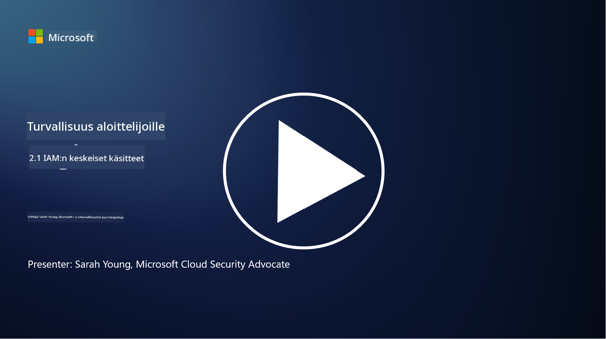

<!--
CO_OP_TRANSLATOR_METADATA:
{
  "original_hash": "2e3864e3d579f0dbb4ac2ec8c5f82acf",
  "translation_date": "2025-09-03T19:36:31+00:00",
  "source_file": "2.1 IAM key concepts.md",
  "language_code": "fi"
}
-->
# IAM:n keskeiset käsitteet

Oletko koskaan kirjautunut tietokoneelle tai verkkosivustolle? Tietenkin olet! Tämä tarkoittaa, että olet jo käyttänyt identiteettikontrolleja jokapäiväisessä elämässäsi. Identiteetin ja pääsyn hallinta (IAM) on keskeinen osa turvallisuutta, ja opimme siitä lisää seuraavissa oppitunneissa.

**Johdanto**

Tässä oppitunnissa käsittelemme:

- Mitä identiteetin ja pääsyn hallinnalla (IAM) tarkoitetaan kyberturvallisuuden yhteydessä?

- Mitä tarkoittaa vähimmän oikeuden periaate?

- Mitä tarkoittaa tehtävien eriyttäminen?

- Mitä ovat autentikointi ja valtuutus?

## Mitä identiteetin ja pääsyn hallinnalla (IAM) tarkoitetaan kyberturvallisuuden yhteydessä?

Identiteetin ja pääsyn hallinta (IAM) viittaa prosessien, teknologioiden ja käytäntöjen kokonaisuuteen, jotka on otettu käyttöön varmistamaan, että oikeat henkilöt saavat asianmukaisen pääsyn organisaation digitaalisen ympäristön resursseihin. IAM sisältää digitaalisten identiteettien (käyttäjät, työntekijät, kumppanit) hallinnan sekä niiden pääsyn järjestelmiin, sovelluksiin, tietoihin ja verkkoihin. IAM:n ensisijainen tavoite on parantaa turvallisuutta, yksinkertaistaa käyttäjien pääsyä ja varmistaa organisaation käytäntöjen ja säädösten noudattaminen. IAM-ratkaisut sisältävät yleensä käyttäjän autentikoinnin, valtuutuksen, identiteetin provisioinnin, pääsyn hallinnan ja käyttäjän elinkaaren hallinnan (varmistetaan, että tilit poistetaan, kun niitä ei enää käytetä).

## Mitä tarkoittaa vähimmän oikeuden periaate?

Vähimmän oikeuden periaate on keskeinen käsite, joka korostaa, että käyttäjille ja järjestelmille myönnetään vain ne vähimmäisoikeudet, jotka ovat välttämättömiä heidän tehtäviensä tai rooliensa suorittamiseksi. Tämä periaate auttaa rajoittamaan mahdollisia vahinkoja, jotka voivat syntyä tietoturvaloukkauksen tai sisäisen uhan seurauksena. Noudattamalla vähimmän oikeuden periaatetta organisaatiot pienentävät hyökkäyspinta-alaa ja vähentävät luvattoman pääsyn, tietomurtojen ja oikeuksien väärinkäytön riskiä. Käytännössä tämä tarkoittaa, että käyttäjille myönnetään pääsy vain niihin resursseihin ja toimintoihin, jotka ovat välttämättömiä heidän työtehtäviensä suorittamiseksi, eikä enempää. Esimerkiksi, jos sinun tarvitsee vain lukea dokumentti, olisi liiallista myöntää sinulle täydet ylläpitäjän oikeudet kyseiseen dokumenttiin.

## Mitä tarkoittaa tehtävien eriyttäminen?

Tehtävien eriyttäminen on periaate, jonka tavoitteena on estää eturistiriidat ja vähentää petosten ja virheiden riskiä jakamalla kriittiset tehtävät ja vastuut eri henkilöille organisaation sisällä. Kyberturvallisuuden yhteydessä tehtävien eriyttäminen tarkoittaa, että yksittäisellä henkilöllä ei ole hallintaa kaikkien kriittisen prosessin tai järjestelmän osa-alueiden yli. Tavoitteena on luoda tarkistus- ja tasapainojärjestelmä, joka estää yksittäistä henkilöä suorittamasta sekä prosessin asetus- että hyväksymisvaiheita. Esimerkiksi talousjärjestelmissä tämä voi tarkoittaa, että henkilö, joka syöttää tapahtumat järjestelmään, ei saa olla sama henkilö, joka hyväksyy kyseiset tapahtumat. Tämä vähentää luvattomien tai vilpillisten toimien riskiä jäädä huomaamatta.

## Mitä ovat autentikointi ja valtuutus?

Autentikointi ja valtuutus ovat kaksi keskeistä käsitettä kyberturvallisuudessa, jotka ovat ratkaisevan tärkeitä tietokonejärjestelmien ja tietojen turvallisuuden ja eheyden varmistamisessa. Niitä käytetään usein yhdessä resurssien hallintaan ja arkaluontoisten tietojen suojaamiseen.

**1. Autentikointi**: Autentikointi on prosessi, jossa varmistetaan käyttäjän, järjestelmän tai tahon identiteetti, joka yrittää päästä tietokonejärjestelmään tai tiettyyn resurssiin. Se varmistaa, että väitetty identiteetti on aito ja oikea. Autentikointimenetelmät sisältävät yleensä yhden tai useamman seuraavista tekijöistä:

   a. Jotain, mitä tiedät: Tämä sisältää salasanat, PIN-koodit tai muun salaisen tiedon, jonka vain valtuutetun käyttäjän pitäisi tietää.

   b. Jotain, mitä sinulla on: Tämä sisältää fyysiset tunnisteet tai laitteet, kuten älykortit, turvatunnisteet tai matkapuhelimet, joita käytetään käyttäjän identiteetin vahvistamiseen.

   c. Jotain, mitä olet: Tämä viittaa biometrisiin tekijöihin, kuten sormenjälkiin, kasvojentunnistukseen tai verkkokalvoskannauksiin, jotka ovat yksilöllisiä henkilölle.

Autentikointimekanismeja käytetään varmistamaan, että käyttäjä on se, kuka hän väittää olevansa, ennen kuin pääsy järjestelmään tai resurssiin sallitaan. Tämä auttaa estämään luvattoman pääsyn ja varmistaa, että vain oikeutetut käyttäjät voivat suorittaa toimintoja järjestelmässä.

**2. Valtuutus**: Valtuutus on prosessi, jossa autentikoiduille käyttäjille tai tahoille myönnetään tai evätään tietyt oikeudet ja käyttöoikeudet sen jälkeen, kun heidän identiteettinsä on vahvistettu. Se määrittää, mitä toimintoja tai operaatioita käyttäjä saa suorittaa järjestelmässä tai tietyissä resursseissa. Valtuutus perustuu usein ennalta määriteltyihin käytäntöihin, pääsynhallintasääntöihin ja käyttäjille määritettyihin rooleihin.

Valtuutusta voidaan ajatella kysymyksenä: "Mitä autentikoitu käyttäjä saa tehdä?" Se sisältää pääsynhallintakäytäntöjen määrittämisen ja täytäntöönpanon, jotta arkaluontoiset tiedot ja resurssit suojataan luvattomalta käytöltä tai muokkaukselta.

**Yhteenveto:**

- Autentikointi vahvistaa käyttäjien tai tahojen identiteetin.

- Valtuutus määrittää, mitä toimintoja ja resursseja autentikoidut käyttäjät saavat käyttää tai muokata.

## Lisälukemista

- [Describe identity concepts - Training | Microsoft Learn](https://learn.microsoft.com/training/modules/describe-identity-principles-concepts/?WT.mc_id=academic-96948-sayoung)
- [Introduction to identity - Microsoft Entra | Microsoft Learn](https://learn.microsoft.com/azure/active-directory/fundamentals/identity-fundamental-concepts?WT.mc_id=academic-96948-sayoung)
- [What is Identity Access Management (IAM)? | Microsoft Security](https://www.microsoft.com/security/business/security-101/what-is-identity-access-management-iam?WT.mc_id=academic-96948-sayoung)
- [What is IAM? Identity and access management explained | CSO Online](https://www.csoonline.com/article/518296/what-is-iam-identity-and-access-management-explained.html)
- [What is IAM? (auth0.com)](https://auth0.com/blog/what-is-iam/)
- [Security+: implementing Identity and Access Management (IAM) controls [updated 2021] | Infosec (infosecinstitute.com)](https://resources.infosecinstitute.com/certifications/securityplus/security-implementing-identity-and-access-management-iam-controls/)
- [least privilege - Glossary | CSRC (nist.gov)](https://csrc.nist.gov/glossary/term/least_privilege)
- [Security: The Principle of Least Privilege (POLP) - Microsoft Community Hub](https://techcommunity.microsoft.com/t5/azure-sql-blog/security-the-principle-of-least-privilege-polp/ba-p/2067390?WT.mc_id=academic-96948-sayoung)
- [Principle of least privilege | CERT NZ](https://www.cert.govt.nz/it-specialists/critical-controls/principle-of-least-privilege/)
- [Why is separation of duties required by NIST 800-171 and CMMC? - (totem.tech)](https://www.totem.tech/cmmc-separation-of-duties/)

---

**Vastuuvapauslauseke**:  
Tämä asiakirja on käännetty käyttämällä tekoälypohjaista käännöspalvelua [Co-op Translator](https://github.com/Azure/co-op-translator). Vaikka pyrimme tarkkuuteen, huomioithan, että automaattiset käännökset voivat sisältää virheitä tai epätarkkuuksia. Alkuperäistä asiakirjaa sen alkuperäisellä kielellä tulisi pitää ensisijaisena lähteenä. Kriittisen tiedon osalta suositellaan ammattimaista ihmiskäännöstä. Emme ole vastuussa väärinkäsityksistä tai virhetulkinnoista, jotka johtuvat tämän käännöksen käytöstä.