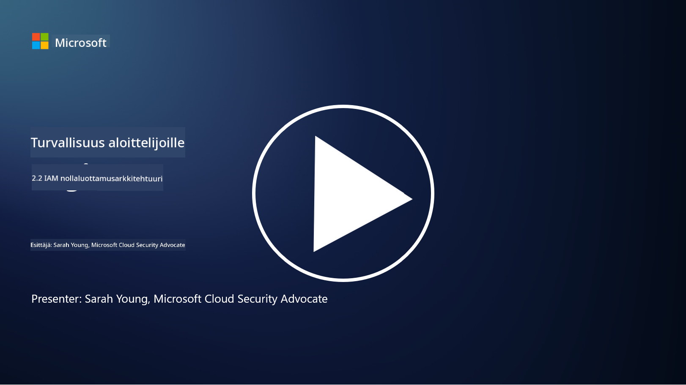

<!--
CO_OP_TRANSLATOR_METADATA:
{
  "original_hash": "4774a978af123f72ebb872199c4c4d4f",
  "translation_date": "2025-09-03T20:26:44+00:00",
  "source_file": "2.2 IAM zero trust architecture.md",
  "language_code": "fi"
}
-->
# IAM:n nollaluottamusarkkitehtuuri

Identiteetti on keskeinen osa nollaluottamusarkkitehtuurin toteuttamista ja IT-ympäristön suojaperimän rakentamista. Tässä osiossa tarkastelemme, miksi identiteettikontrollien käyttö on tärkeää nollaluottamuksen toteuttamisessa.

## Johdanto

Tässä oppitunnissa käsittelemme:

- Miksi meidän täytyy käyttää identiteettiä suojaperimänä nykyaikaisissa IT-ympäristöissä?

- Miten tämä eroaa perinteisistä IT-arkkitehtuureista?

- Miten identiteettiä käytetään nollaluottamusarkkitehtuurin toteuttamisessa?

## Miksi meidän täytyy käyttää identiteettiä suojaperimänä nykyaikaisissa IT-ympäristöissä?

Nykyaikaisissa IT-ympäristöissä perinteinen fyysisen suojaperimän käsite (esimerkiksi palomuurien ja verkkorajojen käyttö) ensisijaisena puolustuslinjana kyberuhkia vastaan on käymässä tehottomaksi teknologian kasvavan monimutkaisuuden, etätyön yleistymisen ja pilvipalveluiden käyttöönoton vuoksi. Sen sijaan organisaatiot siirtyvät käyttämään identiteettiä uutena suojaperimänä. Tämä tarkoittaa, että turvallisuus keskittyy käyttäjien, laitteiden ja sovellusten identiteetin vahvistamiseen ja hallintaan, riippumatta niiden fyysisestä sijainnista.

Tässä syitä, miksi identiteetin käyttö suojaperimänä on tärkeää nykyaikaisissa IT-ympäristöissä:

**Etätyövoima**: Etätyön ja mobiililaitteiden yleistyessä käyttäjät voivat käyttää resursseja eri sijainneista ja laitteista. Perinteinen suojaperimä ei toimi, kun käyttäjät eivät enää ole sidottuja fyysiseen toimistoon.

**Pilvi- ja hybridiympäristöt**: Organisaatiot ottavat yhä enemmän käyttöön pilvipalveluita ja hybridiympäristöjä. Data ja sovellukset eivät enää sijaitse pelkästään organisaation tiloissa, mikä tekee perinteisistä suojaperimistä vähemmän merkityksellisiä.

**Nollaluottamusturvallisuus**: Nollaluottamusturvallisuuden periaate olettaa, että mikään taho, olipa se verkon sisä- tai ulkopuolella, ei ole automaattisesti luotettava. Identiteetti toimii perustana pääsypyynnön vahvistamiselle, riippumatta sen alkuperästä.

**Uhkamaisema**: Kyberuhkat kehittyvät, ja hyökkääjät löytävät tapoja kiertää perinteiset suojaperimät. Kalastelu, sosiaalinen manipulointi ja sisäiset uhat hyödyntävät usein ihmisten haavoittuvuuksia sen sijaan, että yrittäisivät murtaa verkkorajoja.

**Tietokeskeinen lähestymistapa**: Arkaluontoisten tietojen suojaaminen on ensisijaisen tärkeää. Keskittymällä identiteettiin organisaatiot voivat hallita, kuka pääsee käsiksi mihinkin tietoihin, vähentäen tietomurtojen riskiä.

## Miten tämä eroaa perinteisistä IT-arkkitehtuureista?

Perinteiset IT-arkkitehtuurit perustuivat vahvasti suojaperustaisiin turvallisuusmalleihin, joissa palomuurit ja verkkorajat olivat keskeisessä roolissa uhkien torjumisessa. Pääasialliset erot perinteisten ja identiteettikeskeisten lähestymistapojen välillä ovat:

|      Näkökulma              |      Perinteiset IT-arkkitehtuurit                                                               |      Identiteettikeskeinen lähestymistapa                                                                  |
|-----------------------------|--------------------------------------------------------------------------------------------------|------------------------------------------------------------------------------------------------------------|
|     Painopiste              |     Suojaperustainen: Perustui suojaperimiin, kuten palomuureihin ja   pääsynvalvontaan.          |     Identiteetin vahvistaminen: Siirtyminen verkkorajojen valvonnasta   käyttäjän/laitteen identiteetin tarkistamiseen. |
|     Sijainti                |     Sijaintiriippuvuus: Turvallisuus sidottu fyysisiin toimistopaikkoihin ja   verkkorajoihin.    |     Sijaintiriippumattomuus: Turvallisuus ei sidottu tiettyihin sijainteihin;   pääsy mistä tahansa.       |
|     Luottamusolettama       |     Oletettu luottamus: Luottamus oletettiin verkon sisällä oleville   käyttäjille/laitteille.   |     Nollaluottamus: Luottamus ei koskaan oleteta; pääsy vahvistetaan identiteetin ja   kontekstin perusteella. |
|     Laitteiden huomiointi   |     Laitteiden monimuotoisuus: Oletettiin, että verkon sisällä olevat   laitteet ovat turvallisia. |     Laitteiden tilan huomiointi: Huomioidaan laitteen terveys ja   turvallisuustilanne sijainnista riippumatta. |
|     Tietosuoja              |     Tietosuoja: Keskittyi verkon suojaperimien turvaamiseen tietojen   suojaamiseksi.             |     Tietokeskeinen suojaus: Keskittyy tietojen käyttöoikeuksien hallintaan   identiteetin ja tietojen arkaluontoisuuden perusteella. |

## Miten identiteettiä käytetään nollaluottamusarkkitehtuurin toteuttamisessa?

Nollaluottamusarkkitehtuurissa keskeinen periaate on, ettei mitään tahoa, olipa se verkon sisä- tai ulkopuolella, koskaan automaattisesti luoteta. Identiteetti on keskeisessä roolissa nollaluottamuslähestymistavan toteuttamisessa, sillä se mahdollistaa jatkuvan pääsyn pyytävien tahojen vahvistamisen. Modernit identiteettiturvallisuuden kontrollit varmistavat, että jokainen käyttäjä, laite, sovellus ja palvelu, joka pyrkii pääsemään resursseihin, tunnistetaan ja todennetaan perusteellisesti ennen pääsyn myöntämistä. Tämä sisältää digitaalisen identiteetin vahvistamisen menetelmillä, kuten käyttäjätunnus/salasana-yhdistelmät, monivaiheinen todennus (MFA), biometriset tunnisteet ja muut vahvat todennusmekanismit.

## Lisälukemista

- [Securing identity with Zero Trust | Microsoft Learn](https://learn.microsoft.com/security/zero-trust/deploy/identity?WT.mc_id=academic-96948-sayoung)
- [Zero Trust Principles and Guidance for Identity and Access | CSA (cloudsecurityalliance.org)](https://cloudsecurityalliance.org/artifacts/zero-trust-principles-and-guidance-for-iam/)
- [Zero Trust Identity Controls - Essentials Series - Episode 2 - YouTube](https://www.youtube.com/watch?v=fQZQznIKcGM&list=PLXtHYVsvn_b_gtX1-NB62wNervQx1Fhp4&index=13)

---

**Vastuuvapauslauseke**:  
Tämä asiakirja on käännetty käyttämällä tekoälypohjaista käännöspalvelua [Co-op Translator](https://github.com/Azure/co-op-translator). Vaikka pyrimme tarkkuuteen, huomioithan, että automaattiset käännökset voivat sisältää virheitä tai epätarkkuuksia. Alkuperäinen asiakirja sen alkuperäisellä kielellä tulisi pitää ensisijaisena lähteenä. Kriittisen tiedon osalta suositellaan ammattimaista ihmiskäännöstä. Emme ole vastuussa väärinkäsityksistä tai virhetulkinnoista, jotka johtuvat tämän käännöksen käytöstä.