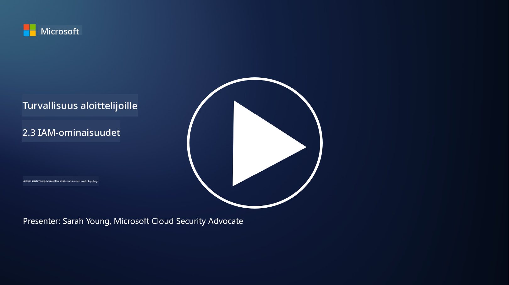

<!--
CO_OP_TRANSLATOR_METADATA:
{
  "original_hash": "bf0b8a54f2c69951744df5a94bc923f7",
  "translation_date": "2025-09-03T22:10:38+00:00",
  "source_file": "2.3 IAM capabilities.md",
  "language_code": "fi"
}
-->
# IAM-ominaisuudet

Tässä osiossa käsitellään tarkemmin ydintyökaluja ja ominaisuuksia, joita käytetään identiteettiturvallisuudessa.

## Johdanto

Tässä oppitunnissa käsitellään:

 - Mikä on hakemistopalvelu?
      
     
    
 - Millaisia ominaisuuksia voidaan käyttää identiteettien suojaamiseen?
>
>        Monivaiheinen todennus (MFA)
> 
>        Kertakirjautuminen (SSO)
> 
>        Roolipohjainen käyttöoikeuksien hallinta (RBAC)
> 
>        Mukautuva todennus
> 
>        Biometrinen todennus
> 
>        Etuoikeutettujen käyttöoikeuksien hallinta (PAM)
> 
>        Identiteettien hallinta ja hallinnointi (IGA)
> 
>        Käyttäytymisanalytiikka

## Mikä on hakemistopalvelu?

Hakemistopalvelu on erikoistunut tietokanta, joka tallentaa ja hallinnoi tietoja verkon resursseista, kuten käyttäjistä, ryhmistä, laitteista, sovelluksista ja muista objekteista. Se toimii keskitettynä identiteetti- ja käyttöoikeustietojen säilytyspaikkana, mikä mahdollistaa organisaatioille käyttäjien todennuksen, valtuutuksen ja muiden turvallisuuteen liittyvien tehtävien tehokkaan hallinnan.

Hakemistopalvelut ovat keskeisessä roolissa nykyaikaisissa IT-ympäristöissä, sillä ne tarjoavat perustan identiteetin ja käyttöoikeuksien hallintaratkaisuille (IAM). Ne mahdollistavat turvallisen pääsyn resursseihin, valvovat käyttöoikeuspolitiikkoja ja yksinkertaistavat hallinnollisia tehtäviä. Yksi tunnetuimmista hakemistopalveluista on Microsoft Active Directory, mutta myös muita ratkaisuja, kuten LDAP (Lightweight Directory Access Protocol) -hakemistot, on olemassa.

Hakemistopalvelun keskeiset toiminnot ja ominaisuudet kyberturvallisuuden näkökulmasta:

 - **Käyttäjien todennus**: Hakemistopalvelut vahvistavat käyttäjätunnukset (kuten käyttäjänimet ja salasanat) varmistaakseen, että vain valtuutetut käyttäjät pääsevät verkkoon ja sen resursseihin.
 - **Käyttäjien valtuutus**: Ne määrittävät, millä tasolla käyttäjä voi käyttää resursseja roolin, ryhmäjäsenyyden ja muiden ominaisuuksien perusteella. Tämä varmistaa, että käyttäjät pääsevät vain niihin resursseihin, joihin heillä on oikeus.
 - **Ryhmien hallinta**: Hakemistopalvelut mahdollistavat käyttäjien organisoinnin loogisiin ryhmiin, mikä yksinkertaistaa käyttöoikeuksien hallintaa. Käyttöoikeudet voidaan määrittää ryhmille yksittäisten käyttäjien sijaan.
 - **Salasanapolitiikat**: Ne valvovat salasanan monimutkaisuutta ja vanhenemissääntöjä, mikä parantaa käyttäjätilien turvallisuutta.
 - **Kertakirjautuminen (SSO)**: Jotkut hakemistopalvelut tukevat SSO:ta, mikä mahdollistaa käyttäjien pääsyn useisiin sovelluksiin ja palveluihin yhdellä tunnuksella.
 - **Keskitetty käyttäjähallinta**: Hakemistopalvelut keskittävät käyttäjätiedot, mikä helpottaa käyttäjätilien, profiilien ja ominaisuuksien hallintaa yhdestä paikasta.
 - **Auditointi ja lokitus**: Ne voivat tallentaa käyttäjien todennus- ja käyttötoiminnot, mikä auttaa turvallisuusauditoinneissa ja vaatimustenmukaisuuden valvonnassa.

## Millaisia ominaisuuksia voidaan käyttää identiteettien suojaamiseen?

**Monivaiheinen todennus (MFA)**

MFA vaatii käyttäjiä antamaan useita vahvistustapoja ennen pääsyn myöntämistä. Tämä sisältää yleensä jotain, mitä käyttäjä tietää (salasana), jotain, mitä käyttäjällä on (älypuhelin tai turvatunniste), ja jotain, mitä käyttäjä on (biometriset tiedot, kuten sormenjälki tai kasvojentunnistus).

**Kertakirjautuminen (SSO)**

SSO mahdollistaa käyttäjien pääsyn useisiin sovelluksiin ja järjestelmiin yhdellä tunnuksella. Tämä parantaa käyttäjäkokemusta ja vähentää riskejä, jotka liittyvät useiden salasanojen hallintaan.

**Roolipohjainen käyttöoikeuksien hallinta (RBAC)**

RBAC määrittää käyttöoikeudet ennalta määriteltyjen roolien perusteella. Käyttäjille myönnetään pääsy heidän rooliensa mukaisesti organisaatiossa.

**Mukautuva todennus**

Mukautuva todennus arvioi riskitekijöitä, kuten sijaintia, laitetta, käyttöaikaa ja käyttäjän käyttäytymistä, ja mukauttaa tarvittavan todennuksen tasoa dynaamisesti. Jos pyyntö vaikuttaa epäilyttävältä, lisätodennusvaiheita voidaan vaatia.

**Biometrinen todennus**

Biometrinen todennus käyttää yksilöllisiä biologisia ominaisuuksia, kuten sormenjälkiä, kasvonpiirteitä, äänen sävyä ja jopa käyttäytymiseen liittyviä piirteitä, kuten kirjoitusnopeutta, identiteetin vahvistamiseen.

**Etuoikeutettujen käyttöoikeuksien hallinta (PAM)**

PAM keskittyy kriittisten järjestelmien ja tietojen käyttöoikeuksien suojaamiseen valvomalla tarkasti etuoikeutettuja tilejä. Se sisältää ominaisuuksia, kuten oikea-aikainen pääsy ja istuntojen valvonta.

**Identiteettien hallinta ja hallinnointi (IGA)**

IGA-ratkaisut hallinnoivat käyttäjäidentiteettejä ja niiden pääsyä resursseihin koko niiden elinkaaren ajan. Tämä sisältää perehdyttämisen, käyttöoikeuksien myöntämisen, roolipohjaisen käyttöoikeuksien hallinnan ja käyttöoikeuksien poistamisen.

**Käyttäytymisanalytiikka**

Käyttäytymisanalytiikka seuraa käyttäjän toimintaa ja luo perustason käyttäytymismalleja. Poikkeamat normaalista voivat laukaista hälytyksiä jatkotutkimuksia varten.

# Lisälukemista
- [Azure Active Directory fundamentals documentation - Microsoft Entra | Microsoft Learn](https://learn.microsoft.com/azure/active-directory/fundamentals/?WT.mc_id=academic-96948-sayoung)
- [What is Azure Active Directory? - Microsoft Entra | Microsoft Learn](https://learn.microsoft.com/azure/active-directory/fundamentals/whatis?WT.mc_id=academic-96948-sayoung)
- [Manage your multi-cloud identity infrastructure with Microsoft Entra - YouTube](https://www.youtube.com/watch?v=9qQiq3wTS2Y&list=PLXtHYVsvn_b_gtX1-NB62wNervQx1Fhp4&index=18)

---

**Vastuuvapauslauseke**:  
Tämä asiakirja on käännetty käyttämällä tekoälypohjaista käännöspalvelua [Co-op Translator](https://github.com/Azure/co-op-translator). Vaikka pyrimme tarkkuuteen, huomioithan, että automaattiset käännökset voivat sisältää virheitä tai epätarkkuuksia. Alkuperäinen asiakirja sen alkuperäisellä kielellä tulisi pitää ensisijaisena lähteenä. Kriittisen tiedon osalta suositellaan ammattimaista ihmiskäännöstä. Emme ole vastuussa väärinkäsityksistä tai virhetulkinnoista, jotka johtuvat tämän käännöksen käytöstä.