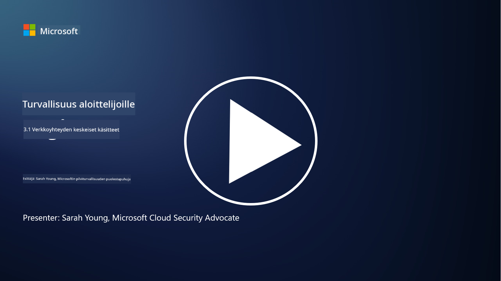
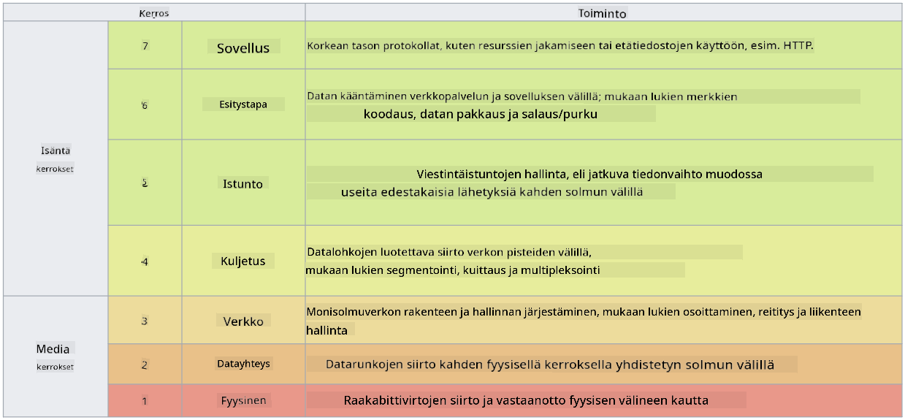

<!--
CO_OP_TRANSLATOR_METADATA:
{
  "original_hash": "252724eceeb183fb9018f88c5e1a3f0c",
  "translation_date": "2025-09-03T22:04:58+00:00",
  "source_file": "3.1 Networking key concepts.md",
  "language_code": "fi"
}
-->
# Verkostoitumisen keskeiset käsitteet

Jos olet työskennellyt IT-alalla, olet todennäköisesti törmännyt verkostoitumisen käsitteisiin. Vaikka identiteetti on ensisijainen rajavalvontakeinomme nykyaikaisissa ympäristöissä, tämä ei tarkoita, että verkon hallintakeinot olisivat tarpeettomia. Vaikka aihe on laaja, tässä oppitunnissa käsittelemme joitakin keskeisiä verkostoitumisen käsitteitä.

Tässä oppitunnissa käsitellään:

- Mitä IP-osoitteet ovat?

- Mikä on OSI-malli?

- Mitä TCP/UDP tarkoittaa?

- Mitä porttinumerot ovat?

- Mitä tarkoittaa salaus levossa ja siirrossa?

## Mitä IP-osoitteet ovat?

IP-osoitteet, eli Internet Protocol -osoitteet, ovat numeerisia tunnisteita, jotka annetaan jokaiselle laitteelle, joka on kytketty tietokoneverkkoon ja käyttää Internet Protocolia viestintään. IP-osoite toimii laitteen yksilöllisenä tunnisteena verkossa, mahdollistaen datan lähettämisen ja vastaanottamisen internetissä tai muissa yhdistetyissä verkoissa. IP-osoitteista on kaksi pääversiota: IPv4 (Internet Protocol version 4) ja IPv6 (Internet Protocol version 6). IP-osoite esitetään yleensä joko IPv4-muodossa (esim. 192.168.1.1) tai IPv6-muodossa (esim. 2001:0db8:85a3:0000:0000:8a2e:0370:7334).

## Mikä on OSI-malli?

OSI (Open Systems Interconnection) -malli on käsitteellinen viitekehys, joka standardoi viestintäjärjestelmän toiminnot seitsemään erilliseen kerrokseen. Jokainen kerros suorittaa tiettyjä tehtäviä ja kommunikoi viereisten kerrosten kanssa varmistaakseen tehokkaan ja luotettavan dataviestinnän laitteiden välillä verkossa. Kerrokset, alhaalta ylöspäin, ovat seuraavat:

1. Fyysinen kerros

2. Tiedonsiirtokerros

3. Verkkokerros

4. Kuljetuskerros

5. Istuntokerros

6. Esityskerros

7. Sovelluskerros

OSI-malli tarjoaa yhteisen viitekehyksen ymmärtää, miten verkon protokollat ja teknologiat toimivat yhdessä, riippumatta tietystä laitteistosta tai ohjelmistosta.

  
_ref: https://en.wikipedia.org/wiki/OSI_model_

## Mitä TCP/UDP tarkoittaa?

TCP (Transmission Control Protocol) ja UDP (User Datagram Protocol) ovat kaksi keskeistä kuljetuskerroksen protokollaa, joita käytetään tietokoneverkoissa mahdollistamaan laitteiden välinen viestintä internetissä tai paikallisessa verkossa. Ne vastaavat datan jakamisesta paketteihin lähettämistä varten ja näiden pakettien kokoamisesta alkuperäiseksi dataksi vastaanottavassa päässä. Niillä on kuitenkin erilaiset ominaisuudet ja käyttötarkoitukset.

**TCP (Transmission Control Protocol):**

TCP on yhteyteen perustuva protokolla, joka tarjoaa luotettavan ja järjestetyn datan toimituksen laitteiden välillä. Se muodostaa yhteyden lähettäjän ja vastaanottajan välillä ennen datan vaihtoa. TCP varmistaa, että datapaketit saapuvat oikeassa järjestyksessä ja voi käsitellä kadonneiden pakettien uudelleenlähetyksen taatakseen datan eheyden ja täydellisyyden. Tämä tekee TCP:stä sopivan sovelluksille, jotka vaativat luotettavaa datan toimitusta, kuten verkkoselaus, sähköposti, tiedostonsiirto (FTP) ja tietokantaviestintä.

**UDP (User Datagram Protocol):**

UDP on yhteydetön protokolla, joka tarjoaa nopeamman datan siirron, mutta ei tarjoa samaa luotettavuuden tasoa kuin TCP. Se ei muodosta virallista yhteyttä ennen datan lähettämistä eikä sisällä mekanismeja kadonneiden pakettien kuittaamiseen tai uudelleenlähetykseen. UDP sopii sovelluksiin, joissa nopeus ja tehokkuus ovat tärkeämpiä kuin taattu toimitus, kuten reaaliaikainen viestintä, suoratoisto, verkkopelaaminen ja DNS-kyselyt.

Yhteenvetona: TCP painottaa luotettavuutta ja järjestettyä toimitusta, mikä tekee siitä sopivan sovelluksille, jotka vaativat datan tarkkuutta, kun taas UDP korostaa nopeutta ja tehokkuutta, mikä tekee siitä sopivan sovelluksille, joissa pieni datan menetys tai järjestyksen vaihtuminen on hyväksyttävää pienemmän viiveen vastineeksi. Valinta TCP:n ja UDP:n välillä riippuu käytettävän sovelluksen tai palvelun erityisvaatimuksista.

## Mitä porttinumerot ovat?

Verkostoitumisessa porttinumero on numeerinen tunniste, jota käytetään erottamaan eri palvelut tai sovellukset, jotka toimivat yhdellä laitteella verkossa. Portit auttavat ohjaamaan saapuvan datan oikeaan sovellukseen. Porttinumerot ovat 16-bittisiä kokonaislukuja, mikä tarkoittaa, että niiden arvo vaihtelee välillä 0–65535. Ne jaetaan kolmeen ryhmään:

- Tunnetut portit (0–1023): Varattu standardipalveluille, kuten HTTP (portti 80) ja FTP (portti 21).

- Rekisteröidyt portit (1024–49151): Käytetään sovelluksille ja palveluille, jotka eivät kuulu tunnettuun ryhmään mutta ovat virallisesti rekisteröityjä.

- Dynaamiset/yksityiset portit (49152–65535): Saatavilla väliaikaiseen tai yksityiseen käyttöön sovelluksille.

## Mitä tarkoittaa salaus levossa ja siirrossa?

Salaus on prosessi, jossa data muutetaan turvalliseen muotoon sen suojaamiseksi luvattomalta pääsyltä tai manipuloinnilta. Salausta voidaan soveltaa dataan sekä "levossa" (kun se on tallennettuna laitteelle tai palvelimelle) että "siirrossa" (kun se siirtyy laitteiden välillä tai verkkojen kautta).

Salaus levossa: Tämä tarkoittaa datan salaamista, kun se on tallennettuna laitteille, palvelimille tai tallennusjärjestelmiin. Vaikka hyökkääjä saisi fyysisen pääsyn tallennusvälineeseen, hän ei voi käyttää dataa ilman salausavaimia. Tämä on tärkeää arkaluontoisen datan suojaamiseksi esimerkiksi laitteen varkauden, tietomurtojen tai luvattoman pääsyn tapauksessa.

Salaus siirrossa: Tämä tarkoittaa datan salaamista sen kulkiessa laitteiden välillä tai verkkojen kautta. Tämä estää salakuuntelua ja luvattoman datan sieppaamisen siirron aikana. Yleisiä protokollia siirron salaukseen ovat HTTPS verkkoviestinnässä ja TLS/SSL erilaisten verkkoliikenteen suojaamisessa.

## Lisälukemista
- [How Do IP Addresses Work? (howtogeek.com)](https://www.howtogeek.com/341307/how-do-ip-addresses-work/)
- [Understanding IP Address: An Introductory Guide (geekflare.com)](https://geekflare.com/understanding-ip-address/)
- [What is the OSI model? The 7 layers of OSI explained (techtarget.com)](https://www.techtarget.com/searchnetworking/definition/OSI)
- [The OSI Model – The 7 Layers of Networking Explained in Plain English (freecodecamp.org)](https://www.freecodecamp.org/news/osi-model-networking-layers-explained-in-plain-english/)
- [TCP/IP protocols - IBM Documentation](https://www.ibm.com/docs/en/aix/7.3?topic=protocol-tcpip-protocols)
- [Common Ports Cheat Sheet: The Ultimate Ports & Protocols List (stationx.net)](https://www.stationx.net/common-ports-cheat-sheet/)
- [Azure Data Encryption-at-Rest - Azure Security | Microsoft Learn](https://learn.microsoft.com/azure/security/fundamentals/encryption-atrest?WT.mc_id=academic-96948-sayoung)

---

**Vastuuvapauslauseke**:  
Tämä asiakirja on käännetty käyttämällä tekoälypohjaista käännöspalvelua [Co-op Translator](https://github.com/Azure/co-op-translator). Vaikka pyrimme tarkkuuteen, huomioithan, että automaattiset käännökset voivat sisältää virheitä tai epätarkkuuksia. Alkuperäistä asiakirjaa sen alkuperäisellä kielellä tulisi pitää ensisijaisena lähteenä. Kriittisen tiedon osalta suositellaan ammattimaista ihmiskäännöstä. Emme ole vastuussa väärinkäsityksistä tai virhetulkinnoista, jotka johtuvat tämän käännöksen käytöstä.