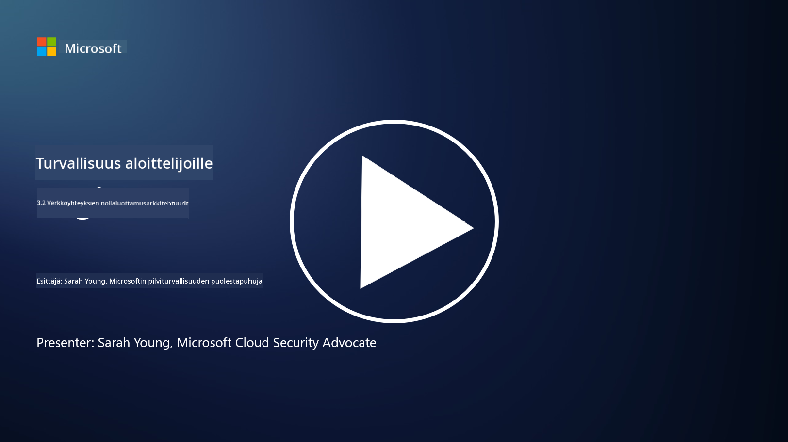

<!--
CO_OP_TRANSLATOR_METADATA:
{
  "original_hash": "680d6e14d9d33fc471c22f44679713f8",
  "translation_date": "2025-09-03T21:14:35+00:00",
  "source_file": "3.2 Networking zero trust architecture.md",
  "language_code": "fi"
}
-->
# Verkkojen nollaluottamusarkkitehtuurit

Verkko tarjoaa tärkeän kerroksen nollaluottamuksen hallinnassa, tässä oppitunnissa opimme lisää seuraavista aiheista:

- Mitä verkon segmentointi tarkoittaa?  
- Kuinka verkon segmentointi auttaa toteuttamaan nollaluottamusta?  
- Mitä tarkoittaa päästä-päähän-salaus?

## Mitä verkon segmentointi tarkoittaa?

Verkon segmentointi tarkoittaa verkon jakamista pienempiin, eristettyihin osiin tai aliverkkoihin. Jokainen segmentti on eristetty muista, ja pääsy segmenttien välillä on hallittu ja rajoitettu tiettyjen turvallisuuskäytäntöjen mukaisesti. Verkon segmentointia käytetään parantamaan turvallisuutta rajoittamalla mahdollisten tietomurtojen vaikutuksia ja estämällä hyökkääjien sivuttaisliikettä verkossa.

Segmentoimalla verkkoa organisaatio voi luoda "vyöhykkeitä", jotka erottavat eri käyttäjätyypit, sovellukset ja tiedot toisistaan. Tämä pienentää hyökkäyspinta-alaa ja minimoi turvallisuusongelmien aiheuttamat vahingot. Verkon segmentointi voidaan toteuttaa teknologioilla, kuten virtuaaliset lähiverkot (VLAN), palomuurit ja pääsynhallinta.

## Kuinka verkon segmentointi auttaa toteuttamaan nollaluottamusta?

Verkon segmentointi on tiiviisti yhteydessä nollaluottamusmallin periaatteisiin. Nollaluottamusarkkitehtuurissa verkon segmentointi auttaa toteuttamaan "vähimmän oikeuden" periaatetta varmistamalla, että käyttäjillä ja laitteilla on pääsy vain niihin resursseihin ja palveluihin, joita he tarvitsevat tehtäviensä suorittamiseen. Jakamalla verkko pienempiin vyöhykkeisiin organisaatiot voivat toteuttaa tiukkoja pääsynhallintakäytäntöjä, eristää kriittiset resurssit ja estää hyökkääjien sivuttaisliikkeen.

Verkon segmentointi tukee myös identiteettipohjaista pääsynhallintaa, jossa käyttäjät ja laitteet tunnistetaan ja valtuutetaan perusteellisesti ennen pääsyä tiettyihin segmentteihin. Tämä estää luvattoman pääsyn arkaluonteisiin resursseihin ja vähentää vaarantuneiden tunnistetietojen aiheuttamia riskejä.

## Mitä tarkoittaa päästä-päähän-salaus?

Päästä-päähän (E2E) -salauksella tarkoitetaan turvallisuustoimenpidettä, joka varmistaa, että data pysyy salattuna koko matkansa ajan lähettäjältä vastaanottajalle. Tässä prosessissa data salataan lähettäjän päässä, ja vain vastaanottajalla on salauksen purkuavain, jolla data voidaan avata ja lukea. Salaus- ja purkuprosessit tapahtuvat päätepisteissä, mikä tekee erittäin vaikeaksi luvattomien osapuolten, mukaan lukien palveluntarjoajien ja välikäsien, päästä käsiksi selväkieliseen dataan.

Päästä-päähän-salaus tarjoaa korkean tason luottamuksellisuutta ja turvallisuutta datan siirrossa, vaikka data kulkisi useiden välikäsien tai verkkojen kautta. Sitä käytetään yleisesti turvallisissa viestintäsovelluksissa, sähköpostipalveluissa ja muilla viestintäalustoilla suojaamaan arkaluonteista tietoa sieppaukselta ja luvattomalta käytöltä.

Tämä salausmenetelmä varmistaa, että vaikka hyökkääjät saisivat pääsyn siirrettävään dataan, he näkisivät vain salattua sisältöä, joka on merkityksetöntä ilman purkuavainta. Päästä-päähän-salaus on keskeisessä roolissa käyttäjien yksityisyyden suojaamisessa ja arkaluonteisen tiedon suojaamisessa luvattomilta osapuolilta.

## Mitä tarkoittaa SASE?

SASE tarkoittaa "Secure Access Service Edge" ja se on kyberturvallisuuskehys ja arkkitehtuuri, joka yhdistää verkon turvallisuuden ja laajakaistaverkkojen (WAN) ominaisuudet yhdeksi pilvipohjaiseksi palveluksi. SASE on suunniteltu tarjoamaan turvallista ja skaalautuvaa pääsyä verkon resursseihin, sovelluksiin ja dataan etä- ja mobiilikäyttäjille samalla kun se yksinkertaistaa verkon hallintaa ja vähentää perinteisten verkko- ja turvallisuusarkkitehtuurien monimutkaisuutta.

SASE:n keskeiset ominaisuudet ja komponentit:

1. **Pilvipohjaisuus:** SASE toimitetaan pilvipalveluna, mikä tarkoittaa, että turvallisuus- ja verkkotoiminnot tarjotaan pilvestä perinteisten paikallisten laitteiden ja laitteistojen sijaan.

2. **Turvallisuuden ja verkon integrointi:** SASE yhdistää erilaisia turvallisuuspalveluita, kuten turvalliset verkkoyhdyskäytävät (SWG), palomuuri palveluna (FWaaS), tietojen menetyksen estäminen (DLP), nollaluottamusverkkopääsy (ZTNA) ja WAN-optimointi laajakaistaverkkojen ominaisuuksiin. Tämä integrointi auttaa virtaviivaistamaan turvallisuus- ja verkkotoimintoja.

3. **Nollaluottamus:** SASE toimii nollaluottamusperiaatteen mukaisesti, mikä tarkoittaa, että se toteuttaa tiukat pääsynhallintakäytännöt ja vähimmän oikeuden periaatteet. Käyttäjiä ja laitteita ei oletusarvoisesti luoteta, ja heidän on todistettava identiteettinsä ja valtuutuksensa ennen resurssien käyttöä.

4. **Identiteettikeskeisyys:** SASE keskittyy käyttäjien ja laitteiden identiteetteihin pääsynhallinnan perustana. Identiteetti- ja kontekstipohjaisia käytäntöjä käytetään pääsyoikeuksien määrittämiseen, ja nämä käytännöt mukautuvat dynaamisesti käyttäjän toiminnan ja kontekstin perusteella.

5. **Skaalautuvuus ja joustavuus:** SASE voi helposti skaalautua suuren käyttäjä- ja laitemäärän tarpeisiin, mikä tekee siitä sopivan organisaatioille, joilla on monipuolisia ja muuttuvia verkko- ja turvallisuustarpeita.

SASE on erityisen merkityksellinen nykyaikana, jolloin etätyö ja pilvipalveluiden käyttö ovat yleistyneet. Se tarjoaa kattavan ja joustavan lähestymistavan verkon pääsyn turvallisuuteen ja hallintaan. SASE auttaa organisaatioita sopeutumaan muuttuviin turvallisuus- ja verkkovaatimuksiin samalla kun se säilyttää vahvan käyttäjäkeskeisen ja nollaluottamukseen perustuvan turvallisuusmallin.

## Lisälukemista

- [What Is Network Segmentation? - Cisco](https://www.cisco.com/c/en/us/products/security/what-is-network-segmentation.html#~benefits)  
- [What Is Micro-Segmentation? - Cisco](https://www.cisco.com/c/en/us/products/security/what-is-microsegmentation.html)  
- [Implementing Network Segmentation and Segregation | Cyber.gov.au](https://www.cyber.gov.au/resources-business-and-government/maintaining-devices-and-systems/system-hardening-and-administration/network-hardening/implementing-network-segmentation-and-segregation)  
- [What Is Network Segmentation and Why It Matters | CompTIA](https://www.comptia.org/blog/security-awareness-training-network-segmentation)  
- [Network Segmentation: Concepts and Practices (cmu.edu)](https://insights.sei.cmu.edu/blog/network-segmentation-concepts-and-practices/)  
- [Secure networks with Zero Trust | Microsoft Learn](https://learn.microsoft.com/security/zero-trust/deploy/networks?WT.mc_id=academic-96948-sayoung)  
- [What is end-to-end encryption? | IBM](https://www.ibm.com/topics/end-to-end-encryption)  
- [What Is End-to-End Encryption, and Why Does It Matter? (howtogeek.com)](https://www.howtogeek.com/711656/what-is-end-to-end-encryption-and-why-does-it-matter/)  
- [Definition of Secure Access Service Edge (SASE) - Gartner Information Technology Glossary](https://www.gartner.com/en/information-technology/glossary/secure-access-service-edge-sase)  
- [What Is Secure Access Service Edge (SASE)? | Microsoft Security](https://www.microsoft.com/security/business/security-101/what-is-sase?WT.mc_id=academic-96948-sayoung)  

---

**Vastuuvapauslauseke**:  
Tämä asiakirja on käännetty käyttämällä tekoälypohjaista käännöspalvelua [Co-op Translator](https://github.com/Azure/co-op-translator). Vaikka pyrimme tarkkuuteen, huomioithan, että automaattiset käännökset voivat sisältää virheitä tai epätarkkuuksia. Alkuperäinen asiakirja sen alkuperäisellä kielellä tulisi pitää ensisijaisena lähteenä. Kriittisen tiedon osalta suositellaan ammattimaista ihmiskäännöstä. Emme ole vastuussa väärinkäsityksistä tai virhetulkinnoista, jotka johtuvat tämän käännöksen käytöstä.