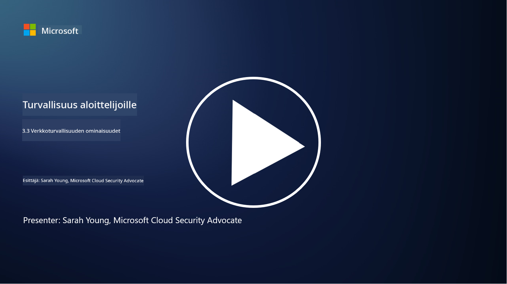

<!--
CO_OP_TRANSLATOR_METADATA:
{
  "original_hash": "c3aba077bb98eebc925dd58d870229ab",
  "translation_date": "2025-09-03T20:20:29+00:00",
  "source_file": "3.3 Network security capabilities.md",
  "language_code": "fi"
}
-->
# Verkkoturvallisuuden ominaisuudet

Tässä osiossa opimme seuraavista ominaisuuksista, joita voidaan käyttää verkon suojaamiseen:

 - Perinteiset palomuurit
 - Web-sovellusten palomuurit
 - Pilvipalveluiden suojausryhmät
 - CDN
 - Kuormantasaajat
 - Bastion-isännät
 - VPN:t
 - DDoS-suojaus

## Perinteiset palomuurit

Perinteiset palomuurit ovat turvallisuuslaitteita, jotka hallitsevat ja seuraavat sisään- ja ulosmenevää verkkoliikennettä ennalta määriteltyjen turvallisuussääntöjen perusteella. Ne toimivat esteenä luotettavan sisäverkon ja epäluotettavien ulkoisten verkkojen välillä, suodattaen liikennettä estääkseen luvattoman pääsyn ja mahdolliset uhat.

## Web-sovellusten palomuurit

Web-sovellusten palomuurit (WAF) ovat erikoistuneita palomuureja, jotka suojaavat web-sovelluksia erilaisilta hyökkäyksiltä, kuten SQL-injektioilta, cross-site scriptingiltä ja muilta haavoittuvuuksilta. Ne analysoivat HTTP-pyyntöjä ja -vastauksia tunnistaakseen ja estääkseen haitallisen liikenteen, joka kohdistuu web-sovelluksiin.

## Pilvipalveluiden suojausryhmät

Suojausryhmät ovat pilvipalveluntarjoajien tarjoama keskeinen verkkoturvallisuusominaisuus. Ne toimivat virtuaalisina palomuureina, jotka hallitsevat sisään- ja ulosmenevää liikennettä pilvipalveluiden resursseihin, kuten virtuaalikoneisiin (VM) ja instansseihin. Suojausryhmät mahdollistavat organisaatioiden määritellä säännöt, jotka määrittävät, millainen liikenne sallitaan ja estetään, lisäten ylimääräisen suojakerroksen pilvipalveluiden käyttöönottoon.

## Sisällönjakeluverkko (CDN)

Sisällönjakeluverkko on hajautettu palvelinverkosto, joka sijaitsee eri maantieteellisillä alueilla. CDN:t parantavat verkkosivustojen suorituskykyä ja saatavuutta välimuistittamalla sisältöä ja tarjoamalla sitä käyttäjälle lähempänä olevilta palvelimilta. Ne tarjoavat myös jonkin verran suojaa DDoS-hyökkäyksiä vastaan jakamalla liikennettä useiden palvelinsijaintien välillä.

## Kuormantasaajat

Kuormantasaajat jakavat sisään tulevan verkkoliikenteen useiden palvelimien kesken optimoidakseen resurssien käyttöä, varmistaakseen korkean saatavuuden ja parantaakseen sovellusten suorituskykyä. Ne auttavat estämään palvelimien ylikuormitusta ja ylläpitämään tehokkaita vasteaikoja, mikä parantaa verkon kestävyyttä.

## Bastion-isännät

Bastion-isännät ovat erittäin turvallisia ja eristettyjä palvelimia, jotka tarjoavat hallitun pääsyn verkkoon ulkoisesta, epäluotettavasta verkosta (kuten internetistä). Ne toimivat sisäänkäyntipisteinä järjestelmänvalvojille, jotka haluavat päästä sisäisiin järjestelmiin turvallisesti. Bastion-isännät on yleensä konfiguroitu vahvoilla turvallisuustoimenpiteillä hyökkäyspinnan minimoimiseksi.

## Virtuaaliset yksityisverkot (VPN:t)

VPN:t luovat salattuja tunneliyhteyksiä käyttäjän laitteen ja etäpalvelimen välillä, varmistaen turvallisen ja yksityisen viestinnän mahdollisesti epävarmojen verkkojen, kuten internetin, yli. VPN:t ovat yleisesti käytössä tarjoamaan etäyhteyksiä sisäisiin verkkoihin, jolloin käyttäjät voivat käyttää resursseja aivan kuin olisivat fyysisesti samassa verkossa.

## DDoS-suojaustyökalut

DDoS (Distributed Denial of Service) -suojaustyökalut ja -palvelut on suunniteltu lieventämään DDoS-hyökkäysten vaikutuksia, joissa useat kompromissilaitteet tulvivat verkkoa tai palvelua ylikuormittaakseen sen. DDoS-suojausratkaisut tunnistavat ja suodattavat haitallisen liikenteen, varmistaen, että laillinen liikenne pääsee edelleen kohteeseensa.

## Lisälukemista

- [What Is a Firewall? - Cisco](https://www.cisco.com/c/en/us/products/security/firewalls/what-is-a-firewall.html#~types-of-firewalls)
- [What Does a Firewall Actually Do? (howtogeek.com)](https://www.howtogeek.com/144269/htg-explains-what-firewalls-actually-do/)
- [What is a Firewall? How Firewalls Work & Types of Firewalls (kaspersky.com)](https://www.kaspersky.com/resource-center/definitions/firewall)
- [Network security group - how it works | Microsoft Learn](https://learn.microsoft.com/azure/virtual-network/network-security-group-how-it-works)
- [Introduction to Azure Content Delivery Network (CDN) - Training | Microsoft Learn](https://learn.microsoft.com/training/modules/intro-to-azure-content-delivery-network/?WT.mc_id=academic-96948-sayoung)
- [What is a content delivery network (CDN)? - Azure | Microsoft Learn](https://learn.microsoft.com/azure/cdn/cdn-overview?WT.mc_id=academic-96948-sayoung)
- [What Is Load Balancing? How Load Balancers Work (nginx.com)](https://www.nginx.com/resources/glossary/load-balancing/)
- [Bastion hosts vs. VPNs · Tailscale](https://tailscale.com/learn/bastion-hosts-vs-vpns/)
- [What is VPN? How It Works, Types of VPN (kaspersky.com)](https://www.kaspersky.com/resource-center/definitions/what-is-a-vpn)
- [Introduction to Azure DDoS Protection - Training | Microsoft Learn](https://learn.microsoft.com/training/modules/introduction-azure-ddos-protection/?WT.mc_id=academic-96948-sayoung)
- [What Is a DDoS Attack? | Microsoft Security](https://www.microsoft.com/security/business/security-101/what-is-a-ddos-attack?WT.mc_id=academic-96948-sayoung)

---

**Vastuuvapauslauseke**:  
Tämä asiakirja on käännetty käyttämällä tekoälypohjaista käännöspalvelua [Co-op Translator](https://github.com/Azure/co-op-translator). Vaikka pyrimme tarkkuuteen, huomioithan, että automaattiset käännökset voivat sisältää virheitä tai epätarkkuuksia. Alkuperäinen asiakirja sen alkuperäisellä kielellä tulisi pitää ensisijaisena lähteenä. Kriittisen tiedon osalta suositellaan ammattimaista ihmiskäännöstä. Emme ole vastuussa väärinkäsityksistä tai virhetulkinnoista, jotka johtuvat tämän käännöksen käytöstä.