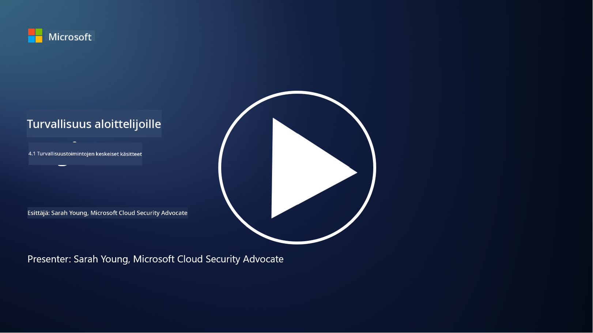

<!--
CO_OP_TRANSLATOR_METADATA:
{
  "original_hash": "6a55b31df9eebf550d040cef0ef7dff3",
  "translation_date": "2025-09-03T22:15:27+00:00",
  "source_file": "4.1 SecOps key concepts.md",
  "language_code": "fi"
}
-->
# Tietoturvaoperaatioiden keskeiset käsitteet

Tietoturvaoperaatiot ovat olennainen osa organisaation kokonaisvaltaista tietoturvatoimintoa. Tässä oppitunnissa opimme lisää seuraavista aiheista:

- Mitä tietoturvaoperaatiot tarkoittavat liiketoiminnassa?

- Millaisia muotoja tietoturvaoperaatiot voivat saada?

- Miten tietoturvaoperaatiot eroavat perinteisistä IT-operaatioista?

## Mitä tietoturvaoperaatiot tarkoittavat liiketoiminnassa?

Tietoturvaoperaatiot liiketoiminnassa viittaavat omistautuneeseen tiimiin tai osastoon, joka vastaa kyberuhkien ja -tapahtumien valvonnasta, havaitsemisesta, tutkimisesta ja niihin reagoinnista. Tietoturvaoperaatioiden ensisijainen tavoite on varmistaa organisaation digitaalisten omaisuuserien luottamuksellisuus, eheys ja saatavuus tunnistamalla ja lieventämällä tietoturvariskejä ennakoivasti sekä reagoimalla tehokkaasti tietoturvatapahtumiin.

## Millaisia muotoja tietoturvaoperaatiot voivat saada?

Tietoturvaoperaatiot voivat saada erilaisia muotoja organisaation koosta ja monimutkaisuudesta riippuen. Yleisiä muotoja ovat:

**Tietoturvaoperaatiokeskus (SOC):** Keskitetty tiimi, joka vastaa tietoturvatapahtumien ympärivuorokautisesta valvonnasta, analysoinnista ja reagoinnista. SOC:t käyttävät usein kehittyneitä työkaluja ja teknologioita uhkien tunnistamiseen ja niihin reagointiin reaaliajassa.

**Tapahtumien hallintatiimi:** Erikoistunut tiimi, joka keskittyy tietoturvatapahtumiin ja -rikkomuksiin reagointiin. Tiimi suorittaa tutkimuksia, koordinoi reagointitoimia ja tukee palautumista.

**Uhkien metsästystiimi:** Tiimi, joka etsii ennakoivasti merkkejä kehittyneistä uhista ja piilevistä haavoittuvuuksista, joita perinteiset tietoturvatyökalut eivät välttämättä havaitse.

**Red Team/Blue Team:** Red-tiimi simuloi hyökkäyksiä haavoittuvuuksien tunnistamiseksi, kun taas blue-tiimi puolustaa näitä hyökkäyksiä vastaan. Molemmat tiimit työskentelevät yhdessä tietoturvatoimien parantamiseksi.

**Hallinnoitu tietoturvapalveluntarjoaja (MSSP):** Jotkut organisaatiot ulkoistavat tietoturvaoperaationsa kolmannen osapuolen palveluntarjoajille, jotka erikoistuvat tietoturvavalvontaan ja tapahtumien hallintaan.

## Miten tietoturvaoperaatiot eroavat perinteisistä IT-operaatioista?

Tietoturvaoperaatiot ja perinteiset IT-operaatiot ovat toisiinsa liittyviä mutta erillisiä toimintoja:

**Painopiste:** IT-operaatiot keskittyvät organisaation IT-infrastruktuurin hallintaan ja ylläpitoon, varmistaen sen toimivuuden ja saatavuuden. Tietoturvaoperaatiot puolestaan priorisoivat tietoturvariskien tunnistamista ja lieventämistä sekä tapahtumiin reagointia.

**Vastuualueet:** IT-operaatiot hoitavat tehtäviä, kuten järjestelmän ylläpitoa, ohjelmistopäivityksiä ja käyttäjätukea. Tietoturvaoperaatiot hoitavat uhkien havaitsemista, tapahtumiin reagointia, haavoittuvuuksien hallintaa ja tietoturvavalvontaa.

**Ajankohtaisuus:** IT-operaatiot korostavat järjestelmän välitöntä saatavuutta ja suorituskykyä. Tietoturvaoperaatiot keskittyvät uhkien tunnistamiseen ja korjaamiseen, mikä ei aina välttämättä sovi yhteen välittömän saatavuuden kanssa.

**Osaaminen:** Tietoturvaoperaatiot vaativat erikoistuneita taitoja uhka-analyysissä, tapahtumiin reagoinnissa ja kyberturvatyökalujen käytössä. IT-operaatiot vaativat asiantuntemusta järjestelmän hallinnassa, verkon hallinnassa ja sovellustuen tarjoamisessa.

## Tapahtumiin reagoinnin työnkulku

NIST Cybersecurity Framework Core Functions -toimintojen mukaan organisaation operatiivisessa ympäristössä tulisi jatkuvasti suorittaa viisi yleistä toimintoa kyberturvariskin vähentämiseksi. 

On tärkeää ymmärtää, että nämä toiminnot tulisi sisällyttää osaksi suurempaa kokonaisuutta, joka liittyy ja on linjassa organisaation laajempien kyberturvaprosessien kanssa.

**Note:** Voit lukea lisää NIST Cybersecurity Frameworkista osoitteessa [https://www.nist.gov/cybersecurity](https://www.nist.gov/cybersecurity)

## Lisälukemista

- [Security operations | Microsoft Learn](https://learn.microsoft.com/security/operations/overview?WT.mc_id=academic-96948-sayoung)
- [Implementing security operations processes | Microsoft Learn](https://learn.microsoft.com/security/operations/?WT.mc_id=academic-96948-sayoung)
- [What is a security operations center (SOC)? | Microsoft Security](https://www.microsoft.com/security/business/security-101/what-is-a-security-operations-center-soc?WT.mc_id=academic-96948-sayoung)
- [What Is a Security Operations Center | Cybersecurity | CompTIA](https://www.comptia.org/content/articles/what-is-a-security-operations-center)

---

**Vastuuvapauslauseke**:  
Tämä asiakirja on käännetty käyttämällä tekoälypohjaista käännöspalvelua [Co-op Translator](https://github.com/Azure/co-op-translator). Vaikka pyrimme tarkkuuteen, huomioithan, että automaattiset käännökset voivat sisältää virheitä tai epätarkkuuksia. Alkuperäinen asiakirja sen alkuperäisellä kielellä tulisi pitää ensisijaisena lähteenä. Kriittisen tiedon osalta suositellaan ammattimaista ihmiskäännöstä. Emme ole vastuussa väärinkäsityksistä tai virhetulkinnoista, jotka johtuvat tämän käännöksen käytöstä.