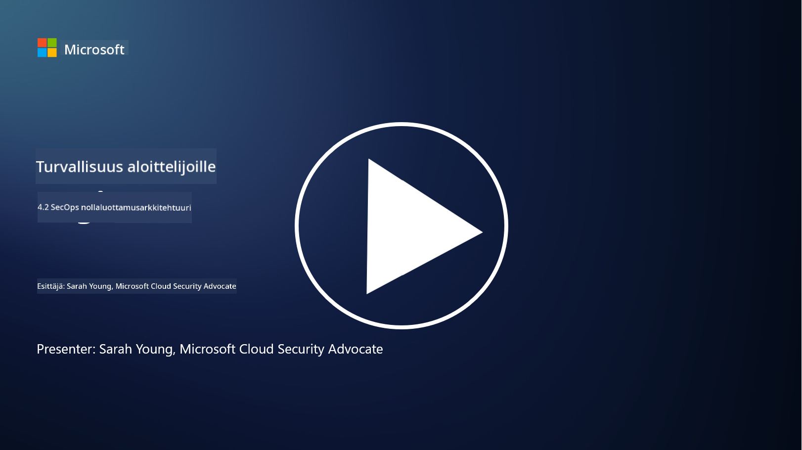

<!--
CO_OP_TRANSLATOR_METADATA:
{
  "original_hash": "45bbdc114e70936816b0b3e7c40189cf",
  "translation_date": "2025-09-03T21:19:58+00:00",
  "source_file": "4.2 SecOps zero trust architecture.md",
  "language_code": "fi"
}
-->
# SecOps zero trust -arkkitehtuuri

Tietoturvaoperaatiot muodostavat kaksi osaa zero trust -arkkitehtuurista, ja tässä oppitunnissa opimme molemmista:

- Kuinka IT-arkkitehtuurit tulisi rakentaa, jotta keskitetty lokien keräys olisi mahdollista?

- Mitkä ovat parhaat käytännöt tietoturvaoperaatioille nykyaikaisissa IT-ympäristöissä?

## Kuinka IT-arkkitehtuurit tulisi rakentaa, jotta keskitetty lokien keräys olisi mahdollista?

Keskitetty lokien keräys on olennainen osa nykyaikaisia tietoturvaoperaatioita. Se mahdollistaa lokien ja datan keräämisen eri lähteistä, kuten palvelimista, sovelluksista, verkkolaitteista ja tietoturvatyökaluista, yhteen keskitettyyn säilöön analysointia, valvontaa ja tapahtumien käsittelyä varten. Tässä on joitakin parhaita käytäntöjä IT-arkkitehtuurien rakentamiseksi keskitettyä lokien keräystä varten:

1. **Lokilähteiden integrointi**:

- Varmista, että kaikki asiaankuuluvat laitteet ja järjestelmät on konfiguroitu tuottamaan lokitietoja. Näihin kuuluvat palvelimet, palomuurit, reitittimet, kytkimet, sovellukset ja tietoturvalaitteet.

- Konfiguroi lokilähteet lähettämään lokit keskitettyyn lokien keräys- tai hallintajärjestelmään.

2. **Valitse oikea SIEM-työkalu (Security Information and Event Management)**:

- Valitse SIEM-ratkaisu, joka vastaa organisaatiosi tarpeita ja mittakaavaa.

- Varmista, että valittu ratkaisu tukee lokien keräystä, yhdistämistä, analysointia ja raportointia.

3. **Laajennettavuus ja redundanssi**:

- Suunnittele arkkitehtuuri laajennettavaksi, jotta se pystyy käsittelemään kasvavaa lokilähteiden määrää ja lisääntyvää lokimäärää.

- Toteuta redundanssi korkean käytettävyyden varmistamiseksi, jotta laitteisto- tai verkkoviat eivät aiheuta keskeytyksiä.

4. **Lokien turvallinen siirto**:

- Käytä turvallisia protokollia, kuten TLS/SSL tai IPsec, lokien siirtämiseen lähteistä keskitettyyn säilöön.

- Toteuta todennus ja käyttöoikeuksien hallinta, jotta vain valtuutetut laitteet voivat lähettää lokitietoja.

5. **Normalisointi**:

- Vakioi lokiformaatit ja normalisoi data, jotta analysointi on johdonmukaista ja helppoa.

6. **Tallennus ja säilytys**:

- Määritä lokien säilytysaika vaatimustenmukaisuuden ja tietoturvavaatimusten perusteella.

- Tallenna lokit turvallisesti, suojaten ne luvattomalta käytöltä ja manipuloinnilta.

## Mitkä ovat parhaat käytännöt tietoturvaoperaatioille nykyaikaisissa IT-ympäristöissä?

Keskitetyn lokien keräyksen lisäksi tässä on joitakin parhaita käytäntöjä tietoturvaoperaatioille nykyaikaisissa IT-ympäristöissä:

1. **Jatkuva valvonta**: Toteuta jatkuva verkko- ja järjestelmätoimintojen valvonta, jotta uhkiin voidaan reagoida reaaliajassa.

2. **Uhkatiedustelu**: Pysy ajan tasalla uusista uhkista ja haavoittuvuuksista hyödyntämällä uhkatiedustelusyötteitä ja -palveluita.

3. **Käyttäjien koulutus**: Järjestä säännöllistä tietoturvatietoisuuskoulutusta työntekijöille, jotta sosiaalisen manipuloinnin ja tietojenkalasteluhyökkäysten riskejä voidaan vähentää.

4. **Tapahtumien käsittelysuunnitelma**: Kehitä ja testaa tapahtumien käsittelysuunnitelma, jotta tietoturvatapahtumiin voidaan reagoida nopeasti ja tehokkaasti.

5. **Tietoturva-automaatio**: Hyödynnä tietoturva-automaatio- ja orkestrointityökaluja tapahtumien käsittelyn ja toistuvien tehtävien tehostamiseksi.

6. **Varmuuskopiointi ja palautus**: Toteuta vahvat varmuuskopiointi- ja katastrofipalautusratkaisut, jotta data on saatavilla tietojen menetyksen tai kiristysohjelmahyökkäysten sattuessa.

## Lisälukemista

- [Microsoft Security Best Practices module: Security operations | Microsoft Learn](https://learn.microsoft.com/security/operations/security-operations-videos-and-decks?WT.mc_id=academic-96948-sayoung)
- [Security operations - Cloud Adoption Framework | Microsoft Learn](https://learn.microsoft.com/azure/cloud-adoption-framework/secure/security-operations?WT.mc_id=academic-96948-sayoung)
- [What is Security Operations and Analytics Platform Architecture? A Definition of SOAPA, How It Works, Benefits, and More (digitalguardian.com)](https://www.digitalguardian.com/blog/what-security-operations-and-analytics-platform-architecture-definition-soapa-how-it-works#:~:text=All%20in%20all%2C%20security%20operations%20and%20analytics%20platform,become%20more%20efficient%20and%20operative%20with%20your%20security.)

---

**Vastuuvapauslauseke**:  
Tämä asiakirja on käännetty käyttämällä tekoälypohjaista käännöspalvelua [Co-op Translator](https://github.com/Azure/co-op-translator). Vaikka pyrimme tarkkuuteen, huomioithan, että automaattiset käännökset voivat sisältää virheitä tai epätarkkuuksia. Alkuperäinen asiakirja sen alkuperäisellä kielellä tulisi pitää ensisijaisena lähteenä. Kriittisen tiedon osalta suositellaan ammattimaista ihmiskäännöstä. Emme ole vastuussa väärinkäsityksistä tai virhetulkinnoista, jotka johtuvat tämän käännöksen käytöstä.