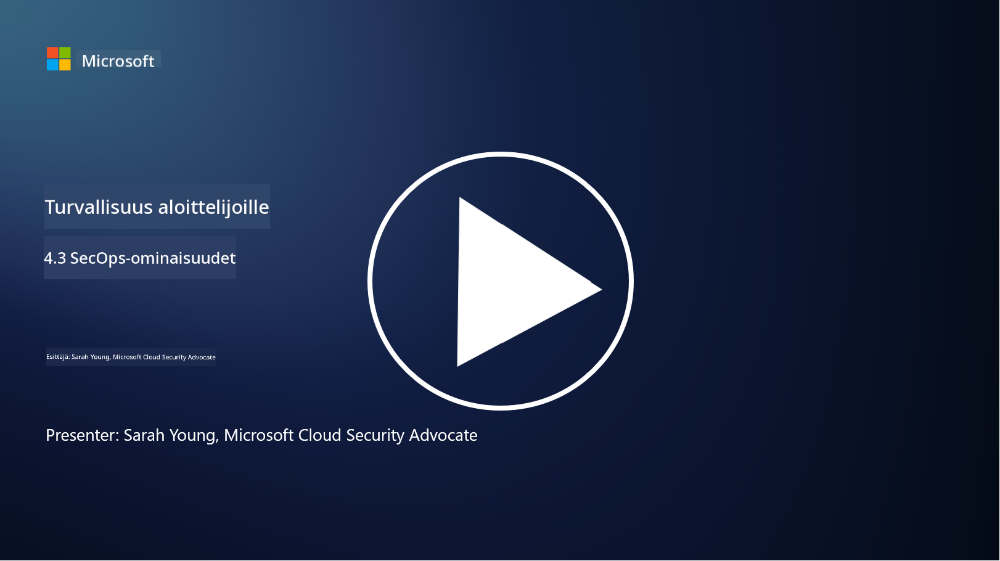

<!--
CO_OP_TRANSLATOR_METADATA:
{
  "original_hash": "553eb694c89f1caca0694e8d8ab89e0e",
  "translation_date": "2025-09-03T21:45:48+00:00",
  "source_file": "4.3 SecOps capabilities.md",
  "language_code": "fi"
}
-->
# SecOps-ominaisuudet

Tässä osiossa käsitellään tarkemmin keskeisiä työkaluja ja ominaisuuksia, joita voidaan käyttää turvallisuustoimintojen tukena.

Tässä oppitunnissa käsitellään:

- Mikä on tietoturvatiedon ja tapahtumien hallintatyökalu (SIEM)?

- Mikä on XDR?

- Millaisia ominaisuuksia voidaan hyödyntää turvallisuustoimintojen parantamiseksi?

## Mikä on tietoturvatiedon ja tapahtumien hallintatyökalu (SIEM)?

Tietoturvatiedon ja tapahtumien hallintatyökalu (Security Information and Event Management, SIEM) tarjoaa analyysin organisaation IT-ympäristössä syntyvistä tietoturvahälytyksistä. SIEM kerää, yhdistää, korreloi ja analysoi lokitietoja ja tietoturvatapahtumia eri lähteistä, kuten verkkolaitteista, palvelimista, sovelluksista ja tietoturvajärjestelmistä.

SIEM-työkalujen keskeiset toiminnot ja ominaisuudet:

1. **Lokien kerääminen**: SIEM-työkalut keräävät lokitietoja ja tietoturvatapahtumia monenlaisista laitteista, järjestelmistä ja sovelluksista, kuten palomuureista, tunkeutumisen havaitsemisjärjestelmistä, virustorjuntaohjelmista ja muista.

2. **Tietojen normalisointi**: Ne normalisoivat lokitiedot yhtenäiseen muotoon analyysin ja korrelaation helpottamiseksi.

3. **Tapahtumien korrelaatio**: SIEM-työkalut korreloivat tapahtumia tunnistaakseen kuvioita ja poikkeavuuksia, jotka voivat viitata tietoturvapoikkeamiin tai uhkiin.

4. **Hälytykset ja ilmoitukset**: SIEM-työkalut luovat hälytyksiä ja ilmoituksia reaaliajassa, kun epäilyttävää toimintaa tai tietoturvaloukkauksia havaitaan, mahdollistaen välittömän reagoinnin.

5. **Poikkeamien havaitseminen**: Ne auttavat havaitsemaan tietoturvapoikkeamia, kuten luvattomia pääsyjä, tietomurtoja, haittaohjelmatartuntoja ja sisäisiä uhkia.

6. **Käyttäjä- ja entiteettikäyttäytymisen analytiikka (UEBA)**: Jotkut SIEM-työkalut sisältävät UEBA-ominaisuuksia, jotka tunnistavat epänormaalia käyttäjä- ja entiteettikäyttäytymistä, mikä voi viitata vaarantuneisiin tileihin tai sisäisiin uhkiin.

7. **Uhkatiedon integrointi**: SIEM-työkalut voivat integroitua uhkatiedon syötteisiin parantaakseen uhkien havaitsemista vertaamalla tunnettuja kompromissin indikaattoreita (IOC) verkkotoimintaan.

8. **Automaatio ja orkestrointi**: Automaatio-ominaisuudet mahdollistavat SIEM-työkalujen automaattisen reagoinnin yleisiin tietoturvapoikkeamiin, mikä vähentää reagointiaikaa ja manuaalista työtä.

9. **Hallintapaneelit ja visualisointi**: Ne tarjoavat hallintapaneeleja ja visualisointityökaluja tietoturvatietojen seurantaan ja mukautettujen raporttien luomiseen.

10. **Integraatio muiden tietoturvatyökalujen kanssa**: SIEM-työkalut integroituvat usein muihin tietoturvatyökaluihin ja -teknologioihin, kuten päätelaitteiden havaitsemis- ja reagointiratkaisuihin (EDR), tarjoten kokonaisvaltaisen näkymän organisaation tietoturvatilanteeseen.

## Mikä on XDR?

XDR (Extended Detection and Response) on teknologia, joka laajentaa perinteisten päätelaitteiden havaitsemis- ja reagointiratkaisujen (EDR) kyvykkyyksiä ja yhdistää ne laajempiin tietoturvatelemetriatietoihin eri lähteistä tarjoten kattavamman näkymän organisaation tietoturvatilanteeseen. XDR pyrkii parantamaan uhkien havaitsemista, poikkeamiin reagointia ja yleistä tietoturvaa korjaamalla EDR:n, SIEM:n tai muiden yksittäisten tietoturvatyökalujen rajoituksia.

XDR:n keskeiset ominaisuudet ja komponentit:

1. **Tietojen integrointi**: XDR integroi tietoja useista lähteistä, kuten päätelaitteista, verkkoliikenteestä, pilvipalveluista, sähköposteista ja muista. Tämä kattava tietojen yhdistäminen tarjoaa laajemman kontekstin uhkien havaitsemiseen ja analysointiin.

2. **Edistynyt analytiikka**: XDR hyödyntää edistynyttä analytiikkaa, koneoppimista ja käyttäytymisanalyysiä tunnistaakseen ja priorisoidakseen tietoturvauhkia. Se etsii kuvioita ja poikkeavuuksia yhdistetyistä tiedoista havaitakseen sekä tunnettuja että tuntemattomia uhkia.

3. **Automaattinen uhkien havaitseminen**: XDR automatisoi tietoturvauhkien ja poikkeavuuksien havaitsemisen korreloimalla tietoja eri lähteistä. Se voi tunnistaa monimutkaisia hyökkäysketjuja, jotka ulottuvat useisiin vektoreihin.

4. **Poikkeamien tutkinta ja reagointi**: XDR tarjoaa työkaluja poikkeamien tutkintaan ja reagointiin, auttaen tietoturvatiimejä arvioimaan nopeasti poikkeamien laajuutta ja vaikutuksia sekä toteuttamaan tarvittavat korjaavat toimenpiteet.

5. **Uhkatiedon integrointi**: Se integroi uhkatiedon syötteitä ja tietoja parantaakseen uhkien havaitsemista vertaamalla tunnettuja kompromissin indikaattoreita (IOC) organisaation verkko- ja päätelaitetoimintaan.

6. **Yhtenäinen käyttöliittymä**: XDR tarjoaa yleensä yhtenäisen käyttöliittymän tai hallintapaneelin, jossa tietoturvatiimit voivat tarkastella ja hallita tietoturvahälytyksiä ja poikkeamia eri lähteistä keskitetysti.

7. **Monialustainen kattavuus**: XDR-ratkaisut kattavat laajan valikoiman alustoja, kuten päätelaitteet, palvelimet, pilviympäristöt ja mobiililaitteet, mikä tekee niistä sopivia nykyaikaisiin, monialustaisiin IT-ympäristöihin.

## Millaisia ominaisuuksia voidaan hyödyntää turvallisuustoimintojen parantamiseksi?

Turvallisuustoimintojen parantamiseksi organisaatiot voivat hyödyntää useita ominaisuuksia SIEM-työkalujen lisäksi:

1. **Koneoppiminen ja tekoäly**: Ota käyttöön edistynyttä analytiikkaa, koneoppimista ja tekoälyä kehittyvien uhkien havaitsemiseksi ja uhkametsästyksen automatisoimiseksi.

2. **Käyttäjä- ja entiteettikäyttäytymisen analytiikka (UEBA)**: Analysoi käyttäjä- ja entiteettikäyttäytymistä poikkeavuuksien ja sisäisten uhkien havaitsemiseksi.

3. **Uhkatiedon syötteet**: Integroi uhkatiedon syötteitä pysyäksesi ajan tasalla uusimmista uhkista ja kompromissin indikaattoreista.

4. **Tietoturvan orkestrointi, automaatio ja reagointi (SOAR)**: Ota käyttöön SOAR-alustoja automatisoidaksesi poikkeamiin reagoinnin ja virtaviivaistaaksesi tietoturvatoimintojen työnkulkuja.

5. **Harhautus- ja ansateknologiat**: Käytä harhautus- ja ansateknologioita hyökkääjien harhauttamiseen ja havaitsemiseen verkossa.

## Lisälukemista

- [What is SIEM? | Microsoft Security](https://www.microsoft.com/security/business/security-101/what-is-siem?WT.mc_id=academic-96948-sayoung)
- [What Is SIEM? - Security Information and Event Management - Cisco](https://www.cisco.com/c/en/us/products/security/what-is-siem.html)
- [Security information and event management - Wikipedia](https://en.wikipedia.org/wiki/Security_information_and_event_management)
- [What Is XDR? | Microsoft Security](https://www.microsoft.com/security/business/security-101/what-is-xdr?WT.mc_id=academic-96948-sayoung)
- [XDR & XDR Security (kaspersky.com.au)](https://www.kaspersky.com.au/resource-center/definitions/what-is-xdr)
- [The Power of SecOps: Redefining Core Security Capabilities - The New Stack](https://thenewstack.io/the-power-of-secops-redefining-core-security-capabilities/)
- [Seven Steps to Improve Your Security Operations and Response (securityintelligence.com)](https://securityintelligence.com/seven-steps-to-improve-your-security-operations-and-response/)

---

**Vastuuvapauslauseke**:  
Tämä asiakirja on käännetty käyttämällä tekoälypohjaista käännöspalvelua [Co-op Translator](https://github.com/Azure/co-op-translator). Vaikka pyrimme tarkkuuteen, huomioithan, että automaattiset käännökset voivat sisältää virheitä tai epätarkkuuksia. Alkuperäistä asiakirjaa sen alkuperäisellä kielellä tulisi pitää ensisijaisena lähteenä. Kriittisen tiedon osalta suositellaan ammattimaista ihmiskäännöstä. Emme ole vastuussa väärinkäsityksistä tai virhetulkinnoista, jotka johtuvat tämän käännöksen käytöstä.