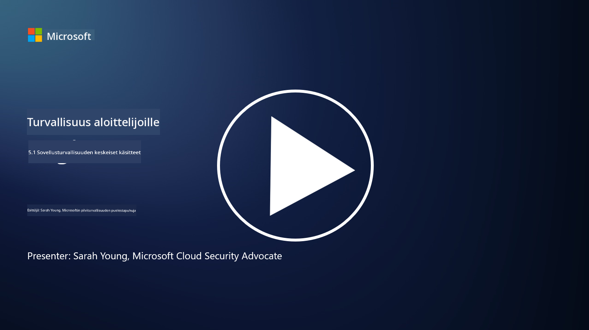

<!--
CO_OP_TRANSLATOR_METADATA:
{
  "original_hash": "e4b56bb23078d3ffb7ad407d280b0c36",
  "translation_date": "2025-09-03T21:09:25+00:00",
  "source_file": "5.1 AppSec key concepts.md",
  "language_code": "fi"
}
-->
# Sovellusturvallisuuden keskeiset käsitteet

Sovellusturvallisuus on oma erikoisalansa tietoturvan saralla. Tässä kurssin osassa perehdymme tarkemmin sovellusturvallisuuteen.

## Johdanto

Tässä oppitunnissa käsitellään:

- Mitä sovellusturvallisuus on?

- Mitkä ovat sovellusturvallisuuden keskeiset käsitteet ja periaatteet?

## Mitä sovellusturvallisuus on?

Sovellusturvallisuus, usein lyhennettynä "AppSec", viittaa käytäntöihin, joilla suojataan ohjelmistosovelluksia tietoturvauhilta, haavoittuvuuksilta ja hyökkäyksiltä. Se kattaa prosessit, tekniikat ja työkalut, joita käytetään turvallisuusriskien tunnistamiseen, lieventämiseen ja estämiseen sovelluksen kehittämisen, käyttöönoton ja ylläpidon elinkaaren aikana.

Sovellusturvallisuus on kriittistä, koska sovellukset ovat yleisiä kohteita kyberhyökkäyksille. Haitalliset toimijat hyödyntävät ohjelmistojen haavoittuvuuksia ja heikkouksia saadakseen luvattoman pääsyn, varastaakseen tietoja, häiritäkseen palveluita tai toteuttaakseen muita haitallisia toimia. Tehokas sovellusturvallisuus auttaa varmistamaan sovelluksen ja siihen liittyvien tietojen luottamuksellisuuden, eheyden ja saatavuuden.

## Mitkä ovat sovellusturvallisuuden keskeiset käsitteet ja periaatteet?

Sovellusturvallisuuden keskeisiä käsitteitä ja periaatteita ovat:

1. **Turvallisuus suunnittelussa**:

- Turvallisuus tulisi integroida sovelluksen suunnitteluun ja arkkitehtuuriin alusta alkaen, eikä lisätä sitä jälkikäteen.

2. **Syötteen validointi**:

- Kaikki käyttäjän syötteet tulisi validoida, jotta ne vastaavat odotettuja muotoja ja ovat vapaita haitallisesta koodista tai tiedoista.

3. **Lähtevän datan koodaus**:

- Asiakkaalle lähetettävä data tulisi koodata asianmukaisesti, jotta vältetään haavoittuvuudet, kuten cross-site scripting (XSS).

4. **Autentikointi ja valtuutus**:

- Varmista käyttäjien tunnistaminen ja valtuuta heidän pääsynsä resursseihin heidän rooliensa ja oikeuksiensa perusteella.

5. **Tietojen suojaus**:

- Arkaluontoiset tiedot tulisi salata tallennettaessa, siirrettäessä ja käsiteltäessä luvattoman pääsyn estämiseksi.

6. **Istunnon hallinta**:

- Turvallinen istunnon hallinta varmistaa, että käyttäjäistunnot ovat suojattuja kaappaukselta ja luvattomalta käytöltä.

7. **Turvalliset riippuvuudet**:

- Pidä kaikki ohjelmistoriippuvuudet ajan tasalla tietoturvapäivitysten avulla haavoittuvuuksien estämiseksi.

8. **Virheiden käsittely ja lokitus**:

- Toteuta turvallinen virheiden käsittely, jotta arkaluontoista tietoa ei paljasteta, ja varmista turvalliset lokituskäytännöt.

9. **Turvallisuustestaus**:

- Testaa sovelluksia säännöllisesti haavoittuvuuksien varalta käyttämällä menetelmiä, kuten tunkeutumistestausta, koodin tarkistuksia ja automatisoituja skannaustyökaluja.

10. **Turvallinen ohjelmistokehityksen elinkaari (SDLC)**:

- Integroi turvallisuuskäytännöt ohjelmistokehityksen elinkaaren jokaiseen vaiheeseen, vaatimuksista käyttöönottoon ja ylläpitoon.

## Lisälukemista

- [SheHacksPurple: What is Application Security? - YouTube](https://www.youtube.com/watch?v=eNmccQNzSSY)
- [What Is Application Security? - Cisco](https://www.cisco.com/c/en/us/solutions/security/application-first-security/what-is-application-security.html#~how-does-it-work)
- [What is application security? A process and tools for securing software | CSO Online](https://www.csoonline.com/article/566471/what-is-application-security-a-process-and-tools-for-securing-software.html)
- [OWASP Cheat Sheet Series | OWASP Foundation](https://owasp.org/www-project-cheat-sheets/)

---

**Vastuuvapauslauseke**:  
Tämä asiakirja on käännetty käyttämällä tekoälypohjaista käännöspalvelua [Co-op Translator](https://github.com/Azure/co-op-translator). Vaikka pyrimme tarkkuuteen, huomioithan, että automaattiset käännökset voivat sisältää virheitä tai epätarkkuuksia. Alkuperäistä asiakirjaa sen alkuperäisellä kielellä tulisi pitää ensisijaisena lähteenä. Kriittisen tiedon osalta suositellaan ammattimaista ihmiskäännöstä. Emme ole vastuussa väärinkäsityksistä tai virhetulkinnoista, jotka johtuvat tämän käännöksen käytöstä.