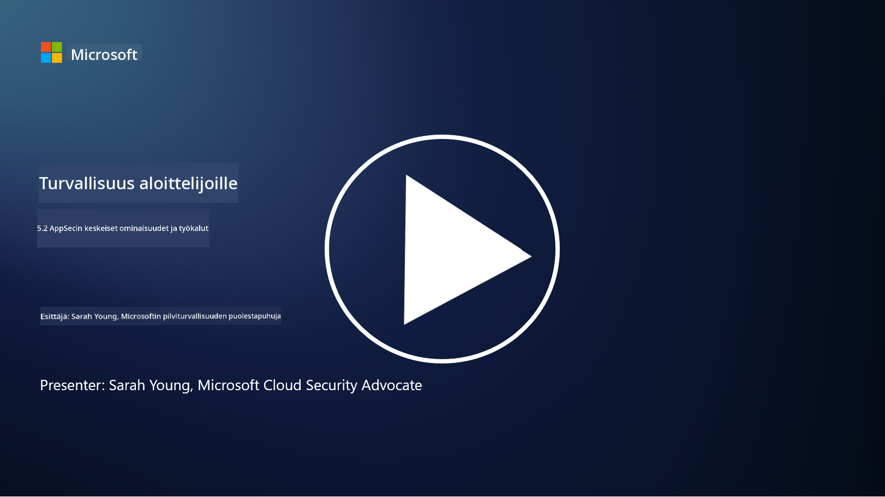

<!--
CO_OP_TRANSLATOR_METADATA:
{
  "original_hash": "790a3fa7e535ec60bb51bde13e759781",
  "translation_date": "2025-09-03T21:24:51+00:00",
  "source_file": "5.2 AppSec key capabilities.md",
  "language_code": "fi"
}
-->
## Johdanto

Tässä osiossa käsitellään sovellusturvallisuudessa käytettäviä keskeisiä työkaluja ja ominaisuuksia.

## Sovellusturvallisuuden keskeiset ominaisuudet ja työkalut

Sovellusturvallisuudessa käytettävät keskeiset ominaisuudet ja työkalut ovat olennaisia turvallisuusheikkouksien ja uhkien tunnistamisessa, lieventämisessä ja estämisessä ohjelmistosovelluksissa. Tässä joitakin tärkeimpiä:

**1. Staattinen sovellusturvallisuustestaus (SAST)**:

- **Ominaisuudet**: Analysoi lähdekoodia, tavukoodia tai binäärikoodia tunnistaakseen turvallisuusheikkouksia sovelluksen koodipohjassa.

- **Työkalut**: Esimerkkejä ovat Fortify, Checkmarx ja Veracode.

**2. Dynaaminen sovellusturvallisuustestaus (DAST)**:

- **Ominaisuudet**: Skannaa käynnissä olevan sovelluksen tunnistaakseen haavoittuvuuksia lähettämällä syötepyyntöjä ja analysoimalla vastauksia.

- **Työkalut**: Esimerkkejä ovat ZAP, Burp Suite ja Qualys Web Application Scanning.

**3. Interaktiivinen sovellusturvallisuustestaus (IAST)**:

- **Ominaisuudet**: Yhdistää SAST:n ja DAST:n elementtejä analysoidakseen koodia ajonaikaisesti, tarjoten tarkempia tuloksia ja vähentäen virheellisiä hälytyksiä.

- **Työkalut**: Esimerkkejä ovat Contrast Security ja HCL AppScan.

**4. Ajonaikainen sovelluksen itsepuolustus (RASP)**:

- **Ominaisuudet**: Valvoo ja suojaa sovelluksia reaaliajassa, tunnistaen ja reagoiden turvallisuusuhkiin niiden tapahtuessa.

- **Työkalut**: Esimerkkejä ovat Veracode Runtime Protection ja F5 Advanced WAF with RASP.

**5. Verkkosovellusten palomuurit (WAF)**:

- **Ominaisuudet**: Tarjoaa suojaavan kerroksen sovelluksen ja internetin välille, suodattaen saapuvaa liikennettä ja estäen haitalliset pyynnöt.

- **Työkalut**: Esimerkkejä ovat ModSecurity, AWS WAF ja Akamai Kona Site Defender.

**6. Riippuvuuksien skannaus**:

- **Ominaisuudet**: Tunnistaa haavoittuvuuksia sovelluksessa käytetyissä kolmannen osapuolen kirjastoissa ja komponenteissa.

- **Työkalut**: Esimerkkejä ovat OWASP Dependency-Check ja Snyk.

**7. Haavoittuvuustestaus (Penetration Testing)**:

- **Ominaisuudet**: Simuloi todellisia hyökkäyksiä haavoittuvuuksien löytämiseksi ja sovelluksen turvallisuuden arvioimiseksi.

- **Työkalut**: Sertifioidut eettiset hakkerit ja turvallisuusammattilaiset käyttävät erilaisia työkaluja, kuten Metasploit ja Nmap.

**8. Turvallisuusskannaus ja analyysi**:

- **Ominaisuudet**: Skannaa tunnettuja haavoittuvuuksia, konfigurointivirheitä ja turvallisuuspuutteita.

- **Työkalut**: Esimerkkejä ovat Nessus, Qualys Vulnerability Management ja OpenVAS.

**9. Konttiturvallisuustyökalut**:

- **Ominaisuudet**: Keskittyvät konttipohjaisten sovellusten ja niiden ympäristöjen turvallisuuden varmistamiseen.

- **Työkalut**: Esimerkkejä ovat Docker Security Scanning ja Aqua Security.

**10. Turvallisen kehityksen koulutus**:

- **Ominaisuudet**: Tarjoaa koulutusta ja tietoisuusohjelmia kehitystiimeille turvallisten koodauskäytäntöjen edistämiseksi.

- **Työkalut**: Räätälöidyt koulutusohjelmat ja -alustat.

**11. Turvallisuustestauskehykset**:

- **Ominaisuudet**: Tarjoaa kattavia testauskehyksiä erilaisiin sovellusturvallisuustestauksen tarpeisiin.

- **Työkalut**: OWASP Amass, OWASP OWTF ja FrAppSec.

**12. Turvallisen koodin tarkastustyökalut**:

- **Ominaisuudet**: Tarkastaa lähdekoodin turvallisuusheikkouksien ja koodauksen parhaiden käytäntöjen osalta.

- **Työkalut**: Esimerkkejä ovat SonarQube ja Checkmarx.

**13. Turvalliset API- ja mikropalvelutyökalut**:

- **Ominaisuudet**: Keskittyvät API:en ja mikropalveluiden turvallisuuteen, mukaan lukien autentikointi, valtuutus ja tietosuoja.

- **Työkalut**: Esimerkkejä ovat Apigee, AWS API Gateway ja Istio.

## Lisälukemista

- [What Is Application Security? Concepts, Tools & Best Practices | HackerOne](https://www.hackerone.com/knowledge-center/what-application-security-concepts-tools-best-practices)
- [What is IAST? (Interactive Application Security Testing) (comparitech.com)](https://www.comparitech.com/net-admin/what-is-iast/)
- [10 Types of Application Security Testing Tools: When and How to Use Them (cmu.edu)](https://insights.sei.cmu.edu/blog/10-types-of-application-security-testing-tools-when-and-how-to-use-them/)
- [Shifting the Balance of Cybersecurity Risk: Principles and Approaches for Security-by-Design and Default | Cyber.gov.au](https://www.cyber.gov.au/about-us/view-all-content/publications/principles-and-approaches-for-security-by-design-and-default)

---

**Vastuuvapauslauseke**:  
Tämä asiakirja on käännetty käyttämällä tekoälypohjaista käännöspalvelua [Co-op Translator](https://github.com/Azure/co-op-translator). Vaikka pyrimme tarkkuuteen, huomioithan, että automaattiset käännökset voivat sisältää virheitä tai epätarkkuuksia. Alkuperäistä asiakirjaa sen alkuperäisellä kielellä tulisi pitää ensisijaisena lähteenä. Kriittisen tiedon osalta suositellaan ammattimaista ihmiskäännöstä. Emme ole vastuussa väärinkäsityksistä tai virhetulkinnoista, jotka johtuvat tämän käännöksen käytöstä.