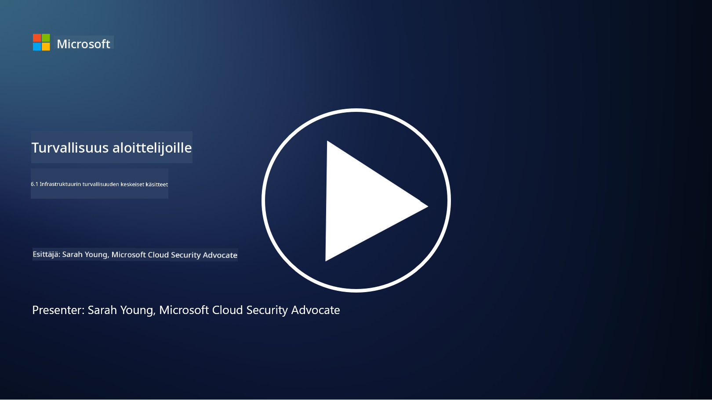

<!--
CO_OP_TRANSLATOR_METADATA:
{
  "original_hash": "882ebf66a648f419bcbf680ed6aefa00",
  "translation_date": "2025-09-03T20:04:39+00:00",
  "source_file": "6.1 Infrastructure security key concepts.md",
  "language_code": "fi"
}
-->
# Infrastruktuurin turvallisuuden keskeiset käsitteet

"Infrastruktuuri" viittaa minkä tahansa IT-ympäristön rakennuspalikoihin, kuten palvelimiin, pilvipalveluihin ja kontteihin – laajaan valikoimaan erilaisia teknologioita. Sovellukset, joita käsiteltiin edellisessä osiossa, toimivat infrastruktuurin päällä, joten myös infrastruktuuri voi olla hyökkäysten kohteena.

Tässä oppitunnissa käsitellään:

- Mitä tarkoittaa turvallisuushygienia ja miksi se on tärkeää?

- Mitä tarkoittaa turvallisuusaseman hallinta?

- Mitä tarkoittaa päivitykset ja miksi ne ovat tärkeitä?

- Mitä kontit ovat ja mitä eroa niiden turvallisuudessa on?

## Mitä tarkoittaa turvallisuushygienia ja miksi se on tärkeää?

**Turvallisuushygienia** viittaa käytäntöihin ja toimintatapoihin, joita yksilöt ja organisaatiot noudattavat ylläpitääkseen hyviä kyberturvallisuustottumuksia. Se sisältää toimenpiteitä järjestelmien, datan ja verkkojen suojaamiseksi uhkilta ja haavoittuvuuksilta. Hyvä turvallisuushygienia on tärkeää useista syistä:

- **Hyökkäysten estäminen**: Parhaiden käytäntöjen noudattaminen voi estää yleisiä kyberhyökkäyksiä, kuten tietojenkalastelua, haittaohjelmatartuntoja ja luvattomia pääsyjä.

- **Datan suojaaminen**: Oikea turvallisuushygienia suojaa arkaluonteista ja luottamuksellista dataa varkaudelta tai paljastumiselta.

- **Luottamuksen ylläpitäminen**: Organisaatiot, jotka osoittavat hyvää turvallisuushygieniaa, rakentavat luottamusta asiakkaiden ja kumppaneiden keskuudessa.

- **Säädösten noudattaminen**: Monet säädökset ja standardit edellyttävät organisaatioilta turvallisuushygienian käytäntöjen noudattamista.

- **Riskin vähentäminen**: Johdonmukainen turvallisuushygienia vähentää turvallisuusongelmien ja tietomurtojen riskiä.

Turvallisuushygieniaan kuuluu käytäntöjä, kuten ohjelmistojen päivittäminen, vahvojen salasanojen ja monivaiheisen tunnistautumisen käyttö, säännölliset varmuuskopiot, työntekijöiden koulutus ja epäilyttävien toimintojen seuranta. Se on vahvan kyberturvallisuuden perusta.

## Mitä tarkoittaa turvallisuusaseman hallinta?

Turvallisuusaseman hallinta viittaa organisaation kyberturvallisuuden kokonaisvaltaisen tilan arviointiin, seurantaan ja hallintaan. Kyberturvallisuusasema tarkoittaa organisaation yleistä lähestymistapaa ja valmiutta suojata sen IT-järjestelmiä, verkkoja, dataa ja resursseja kyberuhkilta ja -hyökkäyksiltä. Se kattaa strategiat, käytännöt, toimintatavat ja teknologiat, joita organisaatio käyttää digitaalisten resurssiensa suojaamiseen sekä tiedon luottamuksellisuuden, eheyden ja saatavuuden ylläpitämiseen. 

Turvallisuusaseman hallinta sisältää järjestelmien, verkkojen, sovellusten ja datan turvallisuuden arvioinnin ja ylläpidon, jotta ne vastaavat turvallisuuskäytäntöjä, parhaita käytäntöjä ja säädösten vaatimuksia. SPM:n tavoitteena on tarjota kattava näkymä organisaation turvallisuustilanteeseen, tunnistaa haavoittuvuudet ja heikkoudet sekä priorisoida korjaustoimenpiteet.

## Mitä tarkoittaa päivitykset ja miksi ne ovat tärkeitä?

**Päivitykset** viittaavat prosessiin, jossa ohjelmistoihin, käyttöjärjestelmiin ja sovelluksiin lisätään päivityksiä, joita kutsutaan myös korjauksiksi tai paikkauksiksi. Nämä päivitykset korjaavat yleensä turvallisuushaavoittuvuuksia, virheitä ja muita ongelmia, joita hyökkääjät voivat käyttää hyväkseen. Myös laitteistot vaativat päivityksiä: ne voivat koskea laiteohjelmistoa tai sisäänrakennettua käyttöjärjestelmää. Laitteistojen päivittäminen voi olla paljon haastavampaa kuin ohjelmistojen päivittäminen.

Päivitykset ovat tärkeitä useista syistä:

- **Turvallisuus**: Päivitykset korjaavat tunnettuja haavoittuvuuksia, joita hyökkääjät voivat käyttää järjestelmien vaarantamiseen ja datan varastamiseen.

- **Vakauttaminen**: Päivitykset sisältävät usein parannuksia vakauteen ja suorituskykyyn, mikä vähentää kaatumisten tai järjestelmävirheiden riskiä.

- **Säädösten noudattaminen**: Monet säädökset ja vaatimukset edellyttävät organisaatioilta turvallisuuspäivitysten nopeaa soveltamista.

- **Luottamuksen ylläpitäminen**: Säännöllinen päivittäminen auttaa ylläpitämään asiakkaiden ja sidosryhmien luottamusta osoittamalla sitoutumista turvallisuuteen.

- **Riskin vähentäminen**: Päivitykset pienentävät hyökkäyspintaa ja vähentävät onnistuneiden kyberhyökkäysten todennäköisyyttä.

Päivitysten laiminlyönti voi jättää järjestelmät alttiiksi tunnetuille haavoittuvuuksille, mikä lisää tietomurtojen ja datan menetyksen riskiä.

## Mitä kontit ovat ja mitä eroa niiden turvallisuudessa on?

Kontit ovat kevyitä, itsenäisiä ja suoritettavia ohjelmistopaketteja, jotka sisältävät kaiken tarvittavan ohjelmiston suorittamiseen, mukaan lukien koodi, ajonaikainen ympäristö, kirjastot ja järjestelmätyökalut. Kontit tarjoavat yhtenäisen ja eristetyn ympäristön sovelluksille, mikä helpottaa ohjelmistojen kehittämistä, pakkaamista ja käyttöönottoa eri ympäristöissä ja alustoilla. Suosittuja konttiteknologioita ovat esimerkiksi Docker ja Kubernetes.

Konttien turvallisuus viittaa käytäntöihin ja teknologioihin, joita käytetään konttien ja niiden isännöimien sovellusten suojaamiseen erilaisilta turvallisuusuhkilta ja haavoittuvuuksilta. Konttien turvallisuus on tärkeää, koska vaikka kontit tarjoavat monia etuja siirrettävyyden ja skaalautuvuuden suhteen, ne tuovat mukanaan myös mahdollisia turvallisuushaasteita:

1. **Kuva-turvallisuus**: Konttikuvat voivat sisältää haavoittuvuuksia, ja jos näitä kuvia ei päivitetä ja korjata säännöllisesti, hyökkääjät voivat käyttää niitä hyväkseen. Konttien turvallisuus sisältää kuvien skannaamisen tunnettuja haavoittuvuuksia varten ja varmistamisen, että vain luotettuja kuvia käytetään.

2. **Ajonaikainen turvallisuus**: Käynnissä olevat kontit on eristettävä toisistaan ja isäntäjärjestelmästä luvattoman pääsyn ja mahdollisten hyökkäysten estämiseksi. Ajonaikaiset turvallisuusmekanismit sisältävät konttien eristysteknologioita, kuten nimialueita ja cgroup-ryhmiä, sekä työkaluja konttien käyttäytymisen seurantaan ja auditointiin.

3. **Verkkoturvallisuus**: Kontit kommunikoivat keskenään ja ulkoisten järjestelmien kanssa verkkojen kautta. Oikea verkon segmentointi ja palomuurisäännöt ovat välttämättömiä konttien välisen liikenteen hallitsemiseksi ja luvattoman pääsyn estämiseksi.

4. **Pääsynhallinta**: Vain valtuutettujen käyttäjien ja prosessien on voitava käyttää ja muokata kontteja. Roolipohjainen pääsynhallinta (RBAC) ja identiteetinhallintatyökalut ovat usein käytössä pääsynhallinnassa.

5. **Lokitus ja seuranta**: Konttien turvallisuus sisältää lokien keräämisen ja analysoinnin sekä seurantatietojen hyödyntämisen turvallisuusongelmien ja poikkeavuuksien havaitsemiseksi ja niihin reagoimiseksi reaaliajassa.

6. **Orkestroinnin turvallisuus**: Kun käytetään konttien orkestrointialustoja, kuten Kubernetesia, myös orkestrointikerroksen turvallisuus on tärkeää. Tämä sisältää Kubernetesin API-palvelimen suojaamisen, asianmukaisten RBAC-käytäntöjen varmistamisen ja klusterin toiminnan auditoinnin.

7. **Salaisuuksien hallinta**: Arkaluonteisten tietojen, kuten API-avainten ja salasanojen, käsittely konteissa vaatii turvallisia säilytys- ja hallintaratkaisuja altistumisen estämiseksi.

Konttien turvallisuusratkaisut sisältävät usein yhdistelmän turvallisuuden parhaita käytäntöjä, haavoittuvuuksien skannaustyökaluja, ajonaikaisia suojamekanismeja, verkkoturvallisuuskonfiguraatioita ja konttien orkestroinnin turvallisuusominaisuuksia. Jatkuva seuranta ja automaatio ovat keskeisiä osia konttien turvallisuudessa, jotta uhkat voidaan havaita ja niihin reagoida nopeasti konttien sovellusten kehittyessä ja skaalautuessa.

## Lisälukemista

- [The importance of security hygiene | Security Magazine](https://www.securitymagazine.com/articles/99510-the-importance-of-security-hygiene)
- [What is CSPM? | Microsoft Security](https://www.microsoft.com/security/business/security-101/what-is-cspm?WT.mc_id=academic-96948-sayoung)
- [What is Cloud Security Posture Management (CSPM)? | HackerOne](https://www.hackerone.com/knowledge-center/what-cloud-security-posture-management)
- [Function of cloud security posture management - Cloud Adoption Framework | Microsoft Learn](https://learn.microsoft.com/azure/cloud-adoption-framework/organize/cloud-security-posture-management?WT.mc_id=academic-96948-sayoung)
- [What Is a CNAPP? | Microsoft Security](https://www.microsoft.com/security/business/security-101/what-is-cnapp)
- [Why Everyone Is Talking About CNAPP (forbes.com)](https://www.forbes.com/sites/forbestechcouncil/2021/12/10/why-everyone-is-talking-about-cnapp/?sh=567275ca1549)
- [Why is patching important to cybersecurity? - CyberSmart](https://cybersmart.co.uk/blog/why-is-patching-important-to-cybersecurity/)
- [What Is Container Security? Complete Guide [2023] (aquasec.com)](https://www.aquasec.com/cloud-native-academy/container-security/container-security/)

---

**Vastuuvapauslauseke**:  
Tämä asiakirja on käännetty käyttämällä tekoälypohjaista käännöspalvelua [Co-op Translator](https://github.com/Azure/co-op-translator). Vaikka pyrimme tarkkuuteen, huomioithan, että automaattiset käännökset voivat sisältää virheitä tai epätarkkuuksia. Alkuperäinen asiakirja sen alkuperäisellä kielellä tulisi pitää ensisijaisena lähteenä. Kriittisen tiedon osalta suositellaan ammattimaista ihmiskäännöstä. Emme ole vastuussa väärinkäsityksistä tai virhetulkinnoista, jotka johtuvat tämän käännöksen käytöstä.