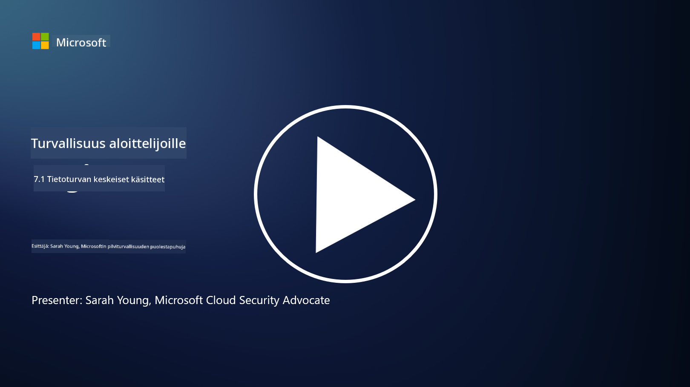

<!--
CO_OP_TRANSLATOR_METADATA:
{
  "original_hash": "9703868f41dcddd5a98dea9ea6fcd94d",
  "translation_date": "2025-09-03T20:39:29+00:00",
  "source_file": "7.1 Data security key concepts.md",
  "language_code": "fi"
}
-->
# Tietoturvan keskeiset käsitteet

Olemme viitanneet tietoturvaan ja käsitelleet sitä useaan otteeseen tämän kurssin aikana. Nyt sukellamme aiheeseen syvällisemmin. Tässä oppitunnissa opit:

- Mitä tietoturva tarkoittaa?

- Mitä on tiedon luokittelu?

- Mitä on tiedon elinkaaren hallinta?

- Mitä on tietovuotojen estäminen (DLP)?

- Miksi tietoturva on tärkeää organisaatiolle?

## Mitä tietoturva tarkoittaa?

**Tietoturva** viittaa digitaalisen tiedon, kuten tietokantojen, tiedostojen ja arkaluontoisten tietojen, suojaamiseen luvattomalta pääsyltä, paljastumiselta, muuttamiselta tai tuhoamiselta. Tietoturvan ensisijainen tavoite on varmistaa tiedon luottamuksellisuus, eheys ja saatavuus. Tämä edellyttää teknisten, hallinnollisten ja fyysisten turvatoimien yhdistämistä tiedon suojaamiseksi erilaisilta uhkilta ja haavoittuvuuksilta, kuten kyberhyökkäyksiltä, sisäisiltä uhkilta ja tietomurroilta. Tietoturvatoimiin voi kuulua salaus, käyttöoikeuksien hallinta, tunnistautuminen, auditointijäljet ja tietoturvapolitiikat.

## Mitä on tiedon luokittelu?

**Tiedon luokittelu** tarkoittaa tiedon kategorisointia sen arkaluontoisuuden, arvon ja merkityksen perusteella organisaatiolle. Tiedon luokittelun tarkoituksena on auttaa organisaatioita tunnistamaan ja priorisoimaan erilaisten tietotyyppien suojaamista ja käsittelyä. Yleisiä tiedon luokittelukategorioita ovat esimerkiksi "julkinen," "sisäinen," "luottamuksellinen" ja "rajoitettu" tai "erittäin luottamuksellinen." Kun tieto on luokiteltu, organisaatiot voivat soveltaa asianmukaisia turvatoimia ja käyttörajoituksia varmistaakseen, että arkaluontoinen tieto on riittävästi suojattu ja että sääntelyvaatimusten noudattaminen toteutuu.

## Mitä on tiedon elinkaaren hallinta?

**Tiedon elinkaaren hallinta** on jäsennelty lähestymistapa tiedon hallintaan sen koko elinkaaren ajan, alkaen sen luomisesta tai hankinnasta ja päättyen arkistointiin tai poistamiseen. Tiedon elinkaari koostuu yleensä vaiheista, kuten luominen, tallennus, käsittely, siirto, arkistointi ja hävittäminen. Tiedon elinkaaren hallinta sisältää politiikkojen ja menettelytapojen määrittämisen jokaiselle elinkaaren vaiheelle, mukaan lukien tiedon säilyttäminen, käyttöoikeuksien hallinta, varmuuskopiointi ja tiedon puhdistus. Tehokas tiedon elinkaaren hallinta auttaa organisaatioita optimoimaan tiedon tallennusta, parantamaan tiedon laatua ja varmistamaan tietosuojamääräysten noudattamisen.

## Mitä on tietovuotojen estäminen (DLP)?

**Tietovuotojen estäminen (DLP)** viittaa teknologioiden, politiikkojen ja käytäntöjen kokonaisuuteen, jotka on suunniteltu estämään arkaluontoisen tai luottamuksellisen tiedon luvaton käyttö, jakaminen tai vuotaminen. DLP-ratkaisut käyttävät sisällön tarkastusta ja kontekstuaalista analyysiä valvoakseen ja hallitakseen liikkuvaa tietoa (esim. sähköposti, verkkoliikenne), paikallaan olevaa tietoa (esim. tallennetut tiedostot ja tietokannat) ja käytössä olevaa tietoa (esim. käyttäjien käsittelemä tieto). DLP pyrkii tunnistamaan ja estämään tai salaamaan arkaluontoisen tiedon tietomurtojen estämiseksi, tietosuojamääräysten noudattamiseksi ja organisaation maineen suojaamiseksi.

## Miksi tietoturva on tärkeää organisaatiolle?

Tietoturva on kriittisen tärkeää organisaatioille useista syistä:

- **Arkaluontoisen tiedon suojaaminen**: Organisaatiot säilyttävät usein arkaluontoista tietoa, kuten asiakastietoja, immateriaalioikeuksia, taloustietoja ja työntekijätietoja. Tietoturva suojaa näitä tietoja luvattomalta käytöltä tai varkaudelta.

- **Sääntelyn noudattaminen**: Monet toimialat ja oikeudenkäyttöalueet asettavat tiukkoja tietosuoja- ja yksityisyysvaatimuksia. Tietoturva auttaa organisaatioita noudattamaan näitä lakeja, välttäen oikeudelliset seuraamukset ja mainehaitat.

- **Tietomurtojen estäminen**: Tietomurrot voivat aiheuttaa taloudellisia tappioita, maineen vahingoittumista ja oikeudellisia seurauksia. Tehokkaat tietoturvatoimet auttavat estämään tietomurtoja tai rajoittamaan niiden vaikutuksia.

- **Luottamuksen säilyttäminen**: Asiakkaat ja sidosryhmät luottavat organisaatioihin heidän tietojensa käsittelyssä. Tietoturvaloukkaukset heikentävät luottamusta. Vahvan tietoturvan ylläpitäminen auttaa säilyttämään luottamuksen ja asiakasuskollisuuden.

- **Kilpailuetu**: Sitoutuminen tietoturvaan voi olla kilpailuetu. Asiakkaat ja kumppanit ovat todennäköisemmin yhteistyössä organisaatioiden kanssa, jotka ottavat tietoturvan vakavasti.

- **Toiminnan jatkuvuus**: Tietoturvatoimet, kuten varmuuskopiointi ja katastrofivalmiussuunnittelu, auttavat varmistamaan kriittisen tiedon saatavuuden ja liiketoiminnan jatkuvuuden tietojen menetyksen tai katastrofien sattuessa.

- **Sisäisten uhkien torjunta**: Tietoturvatoimet käsittelevät myös organisaation sisäisiä uhkia, mukaan lukien työntekijöiden tahaton tiedon paljastaminen ja sisäpiiriläisten haitalliset toimet.

Yhteenvetona voidaan todeta, että tietoturva on välttämätöntä arkaluontoisen tiedon suojaamiseksi, sääntelyn noudattamiseksi, tietomurtojen estämiseksi, luottamuksen säilyttämiseksi ja organisaation menestyksen ja maineen varmistamiseksi.

## Lisälukemista

- [What Is Data Security? | Microsoft Security](https://www.microsoft.com/en-au/security/business/security-101/what-is-data-security?WT.mc_id=academic-96948-sayoung)
- [Automatically Classify & Protect Documents & Data | Microsoft Purview Information Protection](https://youtu.be/v8LqmzBUaOo)
- [Example data classification policy](https://www.cmu.edu/data/guidelines/data-classification.html)
- [What is Data Security? Data Security Definition and Overview | IBM](https://www.ibm.com/topics/data-security)
- [Data Lifecycle Management: A 2023 Guide for Your Business (cloudwards.net)](https://www.cloudwards.net/data-lifecycle-management/)
- [What is data loss prevention (DLP)? | Microsoft Security](https://www.microsoft.com/security/business/security-101/what-is-data-loss-prevention-dlp?WT.mc_id=academic-96948-sayoung)
- [What is DLP? How data loss prevention software works and why you need it | CSO Online](https://www.csoonline.com/article/569559/what-is-dlp-how-data-loss-prevention-software-works-and-why-you-need-it.html)

---

**Vastuuvapauslauseke**:  
Tämä asiakirja on käännetty käyttämällä tekoälypohjaista käännöspalvelua [Co-op Translator](https://github.com/Azure/co-op-translator). Vaikka pyrimme tarkkuuteen, huomioithan, että automaattiset käännökset voivat sisältää virheitä tai epätarkkuuksia. Alkuperäistä asiakirjaa sen alkuperäisellä kielellä tulisi pitää ensisijaisena lähteenä. Kriittisen tiedon osalta suositellaan ammattimaista ihmiskäännöstä. Emme ole vastuussa väärinkäsityksistä tai virhetulkinnoista, jotka johtuvat tämän käännöksen käytöstä.