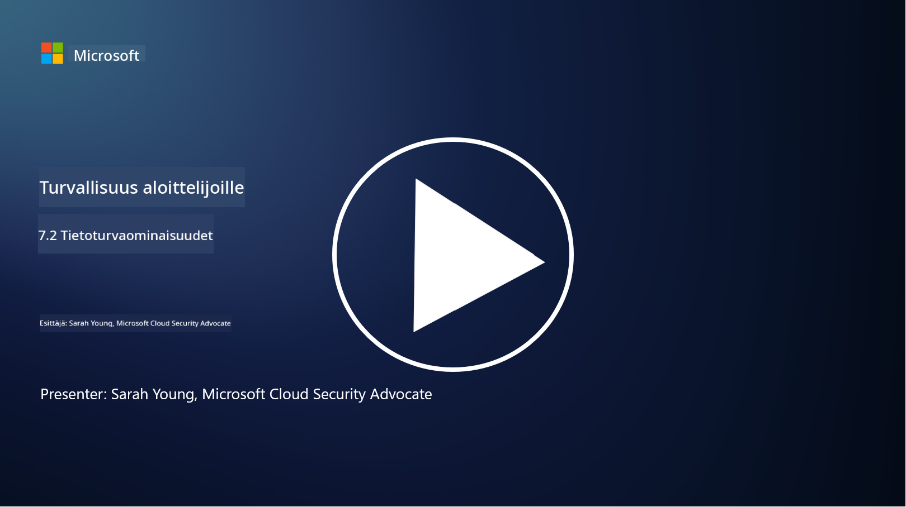

<!--
CO_OP_TRANSLATOR_METADATA:
{
  "original_hash": "50697add9758e54693442d502d2d5f8a",
  "translation_date": "2025-09-03T21:29:07+00:00",
  "source_file": "7.2 Data security capabilities.md",
  "language_code": "fi"
}
-->
# Tietoturvaominaisuudet

Tässä osiossa käsitellään tarkemmin keskeisiä työkaluja ja ominaisuuksia, joita käytetään tietoturvassa:

**Johdanto**

Tässä oppitunnissa käsitellään:

- Mitä ovat tietojen menetyksen estotyökalut?

- Mitä ovat sisäisten riskien hallintatyökalut?

- Mitä tietojen säilyttämiseen liittyviä työkaluja on saatavilla?

## Mitä ovat tietojen menetyksen estotyökalut?

Tietojen menetyksen estotyökalut (Data Loss Prevention, DLP) viittaavat ohjelmistoratkaisuihin ja teknologioihin, jotka on suunniteltu estämään luvaton pääsy, jakaminen tai arkaluontoisten tai luottamuksellisten tietojen vuotaminen organisaation sisällä. Nämä työkalut käyttävät sisällön tarkastusta, sääntöjen täytäntöönpanoa ja valvontaa tunnistaakseen ja suojatakseen arkaluontoisia tietoja paljastumiselta tai väärinkäytöltä. Esimerkkejä DLP-tuotteista ovat: Symantec Data Loss Prevention, McAfee Total Protection for Data Loss Prevention, Microsoft 365 DLP**: Integroituu Microsoft 365 -sovelluksiin auttaen organisaatioita tunnistamaan ja suojaamaan arkaluontoisia tietoja sähköposteissa, asiakirjoissa ja viesteissä.

## Mitä ovat sisäisten riskien hallintatyökalut?

Sisäisten riskien hallintatyökalut auttavat organisaatioita tunnistamaan ja vähentämään riskejä, joita aiheuttavat työntekijät, alihankkijat tai kumppanit, jotka voivat tahallisesti tai tahattomasti vaarantaa tietoturvan. Nämä työkalut seuraavat käyttäjien toimintaa, pääsykuvioita ja tietojen käyttöä havaitakseen epäilyttävää toimintaa ja mahdollisia sisäisiä uhkia. Esimerkkejä sisäisten riskien hallintatuotteista ovat: Microsoft Insider Risk Management (osa Microsoft 365:tä), Forcepoint Insider Threat Data Protection, Varonis Insider Threat Detection.

## Mitä tietojen säilyttämiseen liittyviä työkaluja on saatavilla?

Tietojen säilyttämiseen liittyvät työkalut sisältävät ohjelmistoja ja ratkaisuja, jotka on suunniteltu hallitsemaan tietojen säilyttämistä ja poistamista organisaation tietojen säilyttämiskäytäntöjen ja lakisääteisten vaatimusten mukaisesti. Nämä työkalut auttavat automatisoimaan tietojen säilyttämistä tiettyjen aikajaksojen ajan ja niiden turvallista poistamista, kun niitä ei enää tarvita. Esimerkkejä tietojen säilyttämistuotteista ovat: Veritas Enterprise Vault, Commvault Complete Data Protection, Microsoft data lifecycle management. Nämä työkalut auttavat organisaatioita hallitsemaan tietojen säilyttämistä ja hävittämistä, varmistamaan tietosuojamääräysten noudattamisen ja hallitsemaan tietoja tehokkaasti niiden elinkaaren ajan.

## Lisälukemista

- [Guide to Data Security Posture Management (DSPM) | CSA (cloudsecurityalliance.org)](https://cloudsecurityalliance.org/blog/2023/03/31/the-big-guide-to-data-security-posture-management-dspm/)
- [Data Loss Prevention across endpoints, apps, & services | Microsoft Purview](https://youtu.be/hvqq8L_0kgI)
- [18 Best Data Loss Prevention Software Tools 2023 (Free + Paid) (comparitech.com)](https://www.comparitech.com/data-privacy-management/data-loss-prevention-tools-software/)
- [Data Loss Prevention (nist.gov)](https://tsapps.nist.gov/publication/get_pdf.cfm?pub_id=904672)
- [Learn about insider risk management | Microsoft Learn](https://learn.microsoft.com/purview/insider-risk-management?WT.mc_id=academic-96948-sayoung)
- [Data Lifecycle Management | IBM](https://www.ibm.com/topics/data-lifecycle-management)
- [What Is Data Lifecycle Management (DLM)? | 2023 Best Practices (selecthub.com)](https://www.selecthub.com/big-data-analytics/data-lifecycle-management/)

---

**Vastuuvapauslauseke**:  
Tämä asiakirja on käännetty käyttämällä tekoälypohjaista käännöspalvelua [Co-op Translator](https://github.com/Azure/co-op-translator). Vaikka pyrimme tarkkuuteen, huomioithan, että automaattiset käännökset voivat sisältää virheitä tai epätarkkuuksia. Alkuperäinen asiakirja sen alkuperäisellä kielellä tulisi pitää ensisijaisena lähteenä. Kriittisen tiedon osalta suositellaan ammattimaista ihmiskäännöstä. Emme ole vastuussa väärinkäsityksistä tai virhetulkinnoista, jotka johtuvat tämän käännöksen käytöstä.