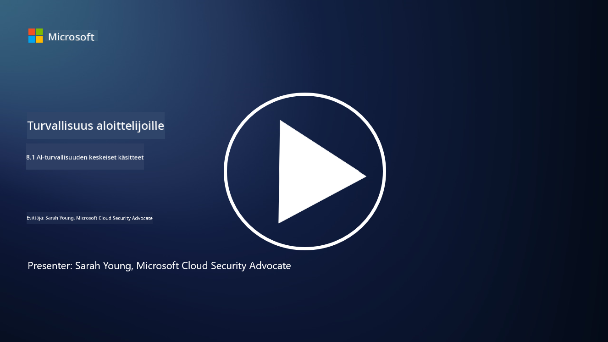

<!--
CO_OP_TRANSLATOR_METADATA:
{
  "original_hash": "66b61d96936cf25d20fcb411d4ce5227",
  "translation_date": "2025-09-03T19:42:28+00:00",
  "source_file": "8.1 AI security key concepts.md",
  "language_code": "fi"
}
-->
# AI:n turvallisuuden keskeiset käsitteet

## Miten AI:n turvallisuus eroaa perinteisestä kyberturvallisuudesta?

AI-järjestelmien suojaaminen tuo mukanaan ainutlaatuisia haasteita verrattuna perinteiseen kyberturvallisuuteen, erityisesti AI:n oppimiskykyjen ja päätöksentekoprosessien luonteen vuoksi. Tässä joitakin keskeisiä eroja:

-   **Datan eheys**: AI-järjestelmät ovat vahvasti riippuvaisia datasta oppimisen kannalta. [Datan eheyden varmistaminen on kriittistä, sillä hyökkääjät voivat manipuloida dataa vaikuttaakseen AI:n toimintaan, mikä tunnetaan datan myrkyttämisenä.
-   **Mallin turvallisuus**: AI:n päätöksentekomalli itsessään voi olla kohteena. [Hyökkääjät voivat yrittää käänteisesti suunnitella mallin tai hyödyntää sen heikkouksia aiheuttaakseen virheellisiä tai haitallisia päätöksiä.
-   **Vihamieliset hyökkäykset**: AI-järjestelmät voivat olla alttiita vihamielisille hyökkäyksille, joissa pienet, usein huomaamattomat muutokset syöttödatassa voivat saada AI:n tekemään virheitä tai vääriä ennusteita.
-   **Infrastruktuurin turvallisuus**: Vaikka perinteinen kyberturvallisuus keskittyy myös infrastruktuurin suojaamiseen, AI-järjestelmillä voi olla lisäkerroksia, kuten pilvipalvelut tai erikoistunut laitteisto, jotka vaativat erityisiä turvatoimia.
-   **Eettiset näkökohdat**: AI:n käyttö turvallisuudessa tuo mukanaan eettisiä kysymyksiä, kuten yksityisyyden suojan ja mahdollisen puolueellisuuden päätöksenteossa, jotka on otettava huomioon turvallisuusstrategiassa.

Kaiken kaikkiaan AI-järjestelmien suojaaminen vaatii erilaista lähestymistapaa, joka huomioi AI-teknologian ainutlaatuiset piirteet, kuten datan, mallien ja oppimisprosessin suojauksen, samalla kun käsitellään AI:n käyttöönoton eettisiä vaikutuksia.

AI:n turvallisuudella ja perinteisellä kyberturvallisuudella on monia yhtäläisyyksiä, mutta myös selkeitä eroja, jotka johtuvat tekoälyjärjestelmien ainutlaatuisista ominaisuuksista ja kyvyistä. Näin ne eroavat toisistaan:

- **Uhkien monimutkaisuus**: AI-järjestelmät tuovat kyberturvallisuuteen uusia monimutkaisuuden kerroksia. Perinteinen kyberturvallisuus käsittelee pääasiassa uhkia, kuten haittaohjelmia, tietojenkalastelua ja verkkomurtoja. AI-järjestelmät voivat kuitenkin olla alttiita hyökkäyksille, kuten vihamielisille hyökkäyksille, datan myrkyttämiselle ja mallin kiertämiselle, jotka kohdistuvat erityisesti koneoppimisalgoritmeihin.

- **Hyökkäyspinta**: AI-järjestelmillä on usein laajempi hyökkäyspinta verrattuna perinteisiin järjestelmiin. Tämä johtuu siitä, että ne eivät ole riippuvaisia pelkästään ohjelmistosta, vaan myös datasta ja malleista. Hyökkääjät voivat kohdistaa hyökkäyksiä koulutusdataan, manipuloida malleja tai hyödyntää algoritmien haavoittuvuuksia.

- **Uhkien mukautuvuus**: AI-järjestelmät voivat mukautua ja oppia ympäristöstään, mikä tekee niistä alttiimpia mukautuville ja kehittyville uhille. Perinteiset kyberturvallisuustoimenpiteet eivät välttämättä riitä puolustamaan hyökkäyksiä vastaan, jotka kehittyvät AI-järjestelmän käyttäytymisen perusteella.

- **Tulosten tulkittavuus ja selitettävyys**: AI-järjestelmän tekemän päätöksen syyn ymmärtäminen on usein haastavampaa verrattuna perinteisiin ohjelmistojärjestelmiin. Tämä tulkittavuuden ja selitettävyyden puute voi vaikeuttaa AI-järjestelmiin kohdistuvien hyökkäysten havaitsemista ja torjumista tehokkaasti.

- **Tietosuojakysymykset**: AI-järjestelmät ovat usein riippuvaisia suurista datamääristä, mikä voi aiheuttaa yksityisyysriskejä, jos niitä ei käsitellä asianmukaisesti. Perinteiset kyberturvallisuustoimenpiteet eivät välttämättä riitä käsittelemään AI-järjestelmien erityisiä tietosuojakysymyksiä.

- **Sääntelyn noudattaminen**: AI:n turvallisuutta koskeva sääntely on vielä kehittymässä, ja uusia säädöksiä ja standardeja syntyy AI-järjestelmien ainutlaatuisten haasteiden ratkaisemiseksi. Perinteisiä kyberturvallisuuskehyksiä voi olla tarpeen laajentaa tai mukauttaa, jotta ne täyttävät nämä uudet sääntelyvaatimukset.

- **Eettiset näkökohdat**: AI:n turvallisuus ei koske pelkästään järjestelmien suojaamista haitallisilta hyökkäyksiltä, vaan myös sen varmistamista, että AI-järjestelmiä käytetään eettisesti ja vastuullisesti. Tämä sisältää esimerkiksi oikeudenmukaisuuden, läpinäkyvyyden ja vastuullisuuden, jotka eivät välttämättä ole yhtä keskeisiä perinteisessä kyberturvallisuudessa.

## Miten AI:n suojaaminen on samanlaista kuin perinteisten IT-järjestelmien suojaaminen?

AI-järjestelmien suojaaminen jakaa useita perusperiaatteita perinteisen kyberturvallisuuden kanssa:

-   **Uhkasuojaus**: Sekä AI- että perinteiset järjestelmät on suojattava luvattomalta pääsyltä, datan muokkaamiselta ja tuhoamiselta sekä muilta yleisiltä uhkilta.
-   **Haavoittuvuuksien hallinta**: Monet haavoittuvuudet, jotka vaikuttavat perinteisiin järjestelmiin, kuten ohjelmistovirheet tai väärät konfiguraatiot, voivat vaikuttaa myös AI-järjestelmiin.
-   **Datan turvallisuus**: Käsitellyn datan suojaaminen on molemmilla alueilla tärkeää tietomurtojen estämiseksi ja luottamuksellisuuden varmistamiseksi.
-   **Toimitusketjun turvallisuus**: Molemmat järjestelmät ovat alttiita toimitusketjuhyökkäyksille, joissa vaarantunut komponentti voi heikentää koko järjestelmän turvallisuutta.

Nämä yhtäläisyydet korostavat, että vaikka AI-järjestelmät tuovat mukanaan uusia turvallisuushaasteita, niiden suojaaminen vaatii myös vakiintuneiden kyberturvallisuuskäytäntöjen soveltamista. Kyseessä on perinteisen turvallisuusosaamisen hyödyntäminen samalla, kun mukautetaan menetelmiä AI-teknologian ainutlaatuisiin piirteisiin.

## Lisälukemista

- [Not with a Bug, But with a Sticker [Book] (oreilly.com)](https://www.oreilly.com/library/view/not-with-a/9781119883982/)
   
- [Intro to AI Security Part 1: AI Security 101 | by HarrietHacks | Medium](https://medium.com/@harrietfarlow/intro-to-ai-security-part-1-ai-security-101-b8662a9efe5)
   
- [Best practices for AI security risk management | Microsoft Security Blog](https://www.microsoft.com/en-us/security/blog/2021/12/09/best-practices-for-ai-security-risk-management/?WT.mc_id=academic-96948-sayoung)
   
- [OWASP AI Security and Privacy Guide | OWASP Foundation](https://owasp.org/www-project-ai-security-and-privacy-guide/)

---

**Vastuuvapauslauseke**:  
Tämä asiakirja on käännetty käyttämällä tekoälypohjaista käännöspalvelua [Co-op Translator](https://github.com/Azure/co-op-translator). Vaikka pyrimme tarkkuuteen, huomioithan, että automaattiset käännökset voivat sisältää virheitä tai epätarkkuuksia. Alkuperäistä asiakirjaa sen alkuperäisellä kielellä tulisi pitää ensisijaisena lähteenä. Kriittisen tiedon osalta suositellaan ammattimaista ihmiskäännöstä. Emme ole vastuussa väärinkäsityksistä tai virhetulkinnoista, jotka johtuvat tämän käännöksen käytöstä.