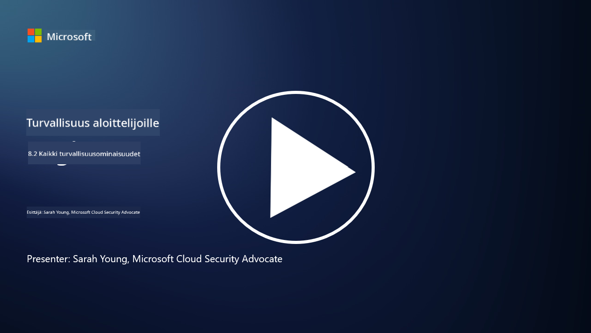

<!--
CO_OP_TRANSLATOR_METADATA:
{
  "original_hash": "b6bb7175672298d1e2f73ba7e0006f95",
  "translation_date": "2025-09-03T21:36:06+00:00",
  "source_file": "8.2 AI security capabilities.md",
  "language_code": "fi"
}
-->
# AI:n turvallisuusominaisuudet

## Mitä työkaluja ja ominaisuuksia meillä on tällä hetkellä AI-järjestelmien suojaamiseen?

Tällä hetkellä on saatavilla useita työkaluja ja ominaisuuksia AI-järjestelmien suojaamiseen:

-   **Counterfit**: Avoimen lähdekoodin automaatiotyökalu AI-järjestelmien turvallisuustestaukseen, joka auttaa organisaatioita tekemään AI-turvallisuusriskien arviointeja ja varmistamaan algoritmien luotettavuuden.
-   **Adversarial Machine Learning Tools**: Nämä työkalut arvioivat koneoppimismallien kestävyyttä vihamielisiä hyökkäyksiä vastaan, auttaen tunnistamaan ja lieventämään haavoittuvuuksia.
-   **AI Security Toolkits**: Saatavilla on avoimen lähdekoodin työkalupakkeja, jotka tarjoavat resursseja AI-järjestelmien suojaamiseen, mukaan lukien kirjastot ja kehykset turvallisuustoimenpiteiden toteuttamiseen.
-   **Yhteistyöalustat**: Yritysten ja AI-yhteisöjen kumppanuudet AI-spesifisten turvallisuusskannereiden ja muiden työkalujen kehittämiseksi AI-toimitusketjun suojaamiseksi.

Nämä työkalut ja ominaisuudet ovat osa kasvavaa alaa, joka keskittyy AI-järjestelmien turvallisuuden parantamiseen monenlaisia uhkia vastaan. Ne edustavat tutkimuksen, käytännön työkalujen ja teollisuuden yhteistyön yhdistelmää, joka pyrkii ratkaisemaan AI-teknologioiden ainutlaatuisia haasteita.

## Entä AI red teaming? Miten se eroaa perinteisestä turvallisuuden red teamingistä?

AI red teaming eroaa perinteisestä turvallisuuden red teamingistä useilla keskeisillä tavoilla:

-   **Keskittyminen AI-järjestelmiin**: AI red teaming kohdistuu erityisesti AI-järjestelmien, kuten koneoppimismallien ja dataputkien, ainutlaatuisiin haavoittuvuuksiin, eikä perinteiseen IT-infrastruktuuriin.
-   **AI:n käyttäytymisen testaus**: Siinä testataan, miten AI-järjestelmät reagoivat epätavallisiin tai odottamattomiin syötteisiin, mikä voi paljastaa haavoittuvuuksia, joita hyökkääjät voisivat käyttää hyväkseen.
-   **AI:n epäonnistumisten tutkiminen**: AI red teaming tarkastelee sekä haitallisia että harmittomia epäonnistumisia, huomioiden laajemman joukon käyttäjäpersoonia ja mahdollisia järjestelmävirheitä pelkkien turvallisuusongelmien sijaan.
-   **Prompt Injection ja sisällön tuottaminen**: AI red teaming sisältää myös epäonnistumisten tutkimisen, kuten prompt injection -hyökkäykset, joissa hyökkääjät manipuloivat AI-järjestelmiä tuottamaan haitallista tai perusteetonta sisältöä.
-   **Eettinen ja vastuullinen AI**: Se on osa vastuullisen AI:n suunnittelua, jossa varmistetaan, että AI-järjestelmät ovat kestäviä yrityksiä vastaan saada ne toimimaan ei-toivotuilla tavoilla.

Kaiken kaikkiaan AI red teaming on laajennettu käytäntö, joka ei ainoastaan kata turvallisuushaavoittuvuuksien tutkimista, vaan myös muiden AI-teknologioille ominaisten järjestelmävirheiden testaamista. Se on olennainen osa turvallisempien AI-järjestelmien kehittämistä ymmärtämällä ja lieventämällä AI:n käyttöönottoon liittyviä uusia riskejä.

## Lisälukemista

 - [Microsoft AI Red Team rakentaa turvallisempaa AI:n tulevaisuutta | Microsoft Security Blog](https://www.microsoft.com/en-us/security/blog/2023/08/07/microsoft-ai-red-team-building-future-of-safer-ai/?WT.mc_id=academic-96948-sayoung)
 - [Microsoftin avoimen automaatioalustan julkistus generatiivisten AI-järjestelmien red teamingiin | Microsoft Security Blog](https://www.microsoft.com/en-us/security/blog/2024/02/22/announcing-microsofts-open-automation-framework-to-red-team-generative-ai-systems/?WT.mc_id=academic-96948-sayoung)
 - [AI Security Tools: The Open-Source Toolkit | Wiz](https://www.wiz.io/academy/ai-security-tools)

---

**Vastuuvapauslauseke**:  
Tämä asiakirja on käännetty käyttämällä tekoälypohjaista käännöspalvelua [Co-op Translator](https://github.com/Azure/co-op-translator). Vaikka pyrimme tarkkuuteen, huomioithan, että automaattiset käännökset voivat sisältää virheitä tai epätarkkuuksia. Alkuperäistä asiakirjaa sen alkuperäisellä kielellä tulisi pitää ensisijaisena lähteenä. Kriittisen tiedon osalta suositellaan ammattimaista ihmiskäännöstä. Emme ole vastuussa väärinkäsityksistä tai virhetulkinnoista, jotka johtuvat tämän käännöksen käytöstä.