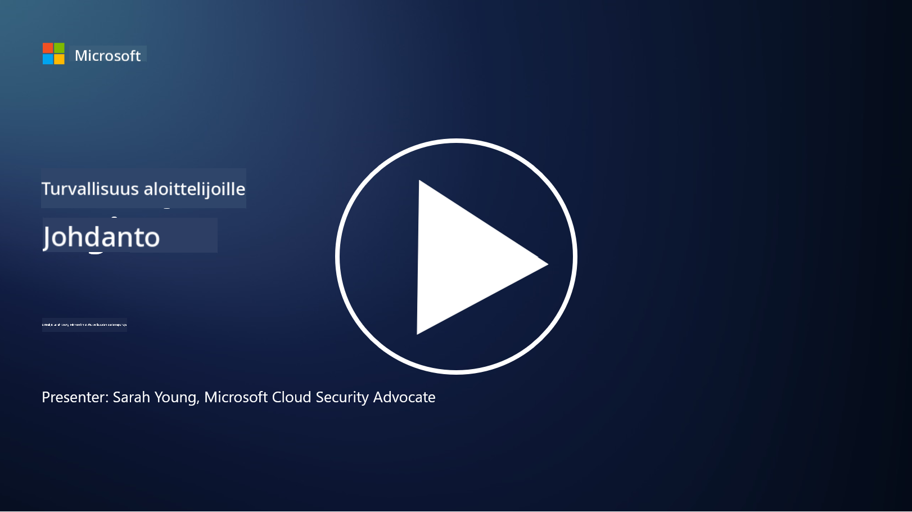

<!--
CO_OP_TRANSLATOR_METADATA:
{
  "original_hash": "fc3d47b5af0cc4fc954ae5d2ea2f7811",
  "translation_date": "2025-10-24T09:09:50+00:00",
  "source_file": "README.md",
  "language_code": "fi"
}
-->

### 🌐 Monikielinen tuki

#### Tuettu GitHub Actionin kautta (automaattinen ja aina ajan tasalla)

<!-- CO-OP TRANSLATOR LANGUAGES TABLE START -->
[Arabia](../ar/README.md) | [Bengali](../bn/README.md) | [Bulgaria](../bg/README.md) | [Burma (Myanmar)](../my/README.md) | [Kiina (yksinkertaistettu)](../zh/README.md) | [Kiina (perinteinen, Hongkong)](../hk/README.md) | [Kiina (perinteinen, Macao)](../mo/README.md) | [Kiina (perinteinen, Taiwan)](../tw/README.md) | [Kroatia](../hr/README.md) | [Tšekki](../cs/README.md) | [Tanska](../da/README.md) | [Hollanti](../nl/README.md) | [Viro](../et/README.md) | [Suomi](./README.md) | [Ranska](../fr/README.md) | [Saksa](../de/README.md) | [Kreikka](../el/README.md) | [Heprea](../he/README.md) | [Hindi](../hi/README.md) | [Unkari](../hu/README.md) | [Indonesia](../id/README.md) | [Italia](../it/README.md) | [Japani](../ja/README.md) | [Korea](../ko/README.md) | [Liettua](../lt/README.md) | [Malaiji](../ms/README.md) | [Marathi](../mr/README.md) | [Nepali](../ne/README.md) | [Norja](../no/README.md) | [Persia (Farsi)](../fa/README.md) | [Puola](../pl/README.md) | [Portugali (Brasilia)](../br/README.md) | [Portugali (Portugali)](../pt/README.md) | [Punjabi (Gurmukhi)](../pa/README.md) | [Romania](../ro/README.md) | [Venäjä](../ru/README.md) | [Serbia (kyrillinen)](../sr/README.md) | [Slovakia](../sk/README.md) | [Slovenia](../sl/README.md) | [Espanja](../es/README.md) | [Swahili](../sw/README.md) | [Ruotsi](../sv/README.md) | [Tagalog (Filipino)](../tl/README.md) | [Tamili](../ta/README.md) | [Thai](../th/README.md) | [Turkki](../tr/README.md) | [Ukraina](../uk/README.md) | [Urdu](../ur/README.md) | [Vietnam](../vi/README.md)
<!-- CO-OP TRANSLATOR LANGUAGES TABLE END -->

**Jos haluat lisätä tuettuja kieliä, löydät listan [täältä](https://github.com/Azure/co-op-translator/blob/main/getting_started/supported-languages.md)**

#### Liity yhteisöömme 

# 🚀 Kyberturvallisuus aloittelijoille – opintokokonaisuus

Tässä nopeasti muuttuvassa tekoälyteknologian aikakaudessa on entistä tärkeämpää ymmärtää, miten IT-järjestelmiä suojataan. Tämä kurssi on suunniteltu opettamaan sinulle kyberturvallisuuden peruskäsitteitä, jotta pääset alkuun turvallisuusoppimisessa. Kurssi on riippumaton toimittajista ja jaettu pieniin oppitunteihin, joiden suorittaminen kestää noin 30–60 minuuttia. Jokaisessa oppitunnissa on lyhyt testi ja linkkejä lisälukemiseen, jos haluat syventyä aiheeseen tarkemmin.

Mitä kurssi sisältää 📚

- 🔐 Kyberturvallisuuden peruskäsitteet, kuten CIA-kolmio, riskien, uhkien jne. erot.
- 🛡️ Ymmärrys siitä, mitä turvallisuuskontrollit ovat ja millaisia muotoja ne voivat ottaa.
- 🌐 Ymmärrys siitä, mitä nollaluottamus tarkoittaa ja miksi se on tärkeää modernissa kyberturvallisuudessa.
- 🔑 Keskeisten käsitteiden ja teemojen ymmärtäminen identiteetistä, verkottumisesta, turvallisuustoiminnoista, infrastruktuurista ja tietoturvasta.
- 🔧 Esimerkkejä työkaluista, joita käytetään turvallisuuskontrollien toteuttamiseen.

Mitä kurssi ei sisällä 🙅‍♂️

- 🚫 Kuinka käyttää tiettyjä turvallisuustyökaluja.
- 🚫 Kuinka "hakata" tai tehdä punatiimityötä/hyökkäävää turvallisuutta.
- 🚫 Oppiminen erityisistä vaatimustenmukaisuusstandardeista.

Kun olet suorittanut tämän kurssin, voit siirtyä joihinkin Microsoft Learn -moduuleihimme. Suosittelemme jatkamaan oppimista [Microsoft Security, Compliance, and Identity Fundamentals](https://learn.microsoft.com/training/paths/describe-concepts-of-security-compliance-identity/?WT.mc_id=academic-96948-sayoung) -moduulin avulla.

Lopulta voit harkita [Exam SC-900: Microsoft Security, Compliance, and Identity Fundamentals -koetta](https://learn.microsoft.com/credentials/certifications/exams/sc-900/?WT.mc_id=academic-96948-sayoung).

> 💁 Jos sinulla on palautetta tai ehdotuksia tästä kurssista tai mielestäsi puuttuvasta sisällöstä, kuulisimme mielellämme ajatuksesi!

## Moduulien yleiskatsaus 📝 
| **Moduulin numero** | **Moduulin nimi**                        | **Opetettavat käsitteet**             | **Oppimistavoitteet**                                                                                          |
|---------------------|------------------------------------------|---------------------------------------|----------------------------------------------------------------------------------------------------------------|
| **1.1**             | Turvallisuuden peruskäsitteet            | [CIA-kolmio](https://github.com/microsoft/Security-101/blob/main/1.1%20The%20CIA%20triad%20and%20other%20key%20concepts.md)                        | Opettele luottamuksellisuudesta, saatavuudesta ja eheydestä. Myös aitoudesta, kiistämättömyydestä ja yksityisyydestä. |
| **1.2**             | Turvallisuuden peruskäsitteet            | [Yleiset kyberturvallisuusuhat](https://github.com/microsoft/Security-101/blob/main/1.2%20Common%20cybersecurity%20threats.md)        | Opettele yleisistä kyberturvallisuusuhista, jotka koskevat yksilöitä ja organisaatioita.                             |
| **1.3**             | Turvallisuuden peruskäsitteet            | [Riskienhallinnan ymmärtäminen](https://github.com/microsoft/Security-101/blob/main/1.3%20Understanding%20risk%20management.md)       | Opettele riskien arviointia ja ymmärtämistä – vaikutus/todennäköisyys ja kontrollien toteuttaminen.                                                                                                               | |
| **1.4**             | Turvallisuuden peruskäsitteet            | [Turvallisuuskäytännöt ja dokumentaatio](https://github.com/microsoft/Security-101/blob/main/1.4%20Security%20practices%20and%20documentation.md) | Opettele politiikkojen, menettelytapojen, standardien ja säädösten/lakien erot.                         |
| **1.5**             | Turvallisuuden peruskäsitteet            | [Nollaluottamus](https://github.com/microsoft/Security-101/blob/main/1.5%20Zero%20trust.md)                           | Opettele, mitä nollaluottamus tarkoittaa ja miten se vaikuttaa arkkitehtuuriin. Mitä syvällinen puolustus tarkoittaa?                   |
| **1.6**             | Turvallisuuden peruskäsitteet            | [Jaetun vastuun malli](https://github.com/microsoft/Security-101/blob/main/1.6%20Shared%20responsibility%20model.md)                           | Mitä jaetun vastuun malli tarkoittaa ja miten se vaikuttaa kyberturvallisuuteen?                  |
| **1.7**             | [Moduulin lopputesti](https://github.com/microsoft/Security-101/blob/main/1.7%20End%20of%20module%20quiz.md)                        |                                      |                                                                                                                 |
| **2.1**             | Identiteetin ja pääsynhallinnan perusteet | [IAM:n keskeiset käsitteet](https://github.com/microsoft/Security-101/blob/main/2.1%20IAM%20key%20concepts.md)                     | Opettele vähimmän oikeuden periaate, tehtävien erottelu, miten IAM tukee nollaluottamusta.               |
| **2.2**             | Identiteetin ja pääsynhallinnan perusteet | [IAM:n nollaluottamusarkkitehtuuri](https://github.com/microsoft/Security-101/blob/main/2.2%20IAM%20zero%20trust%20architecture.md)          | Opettele, miten identiteetti on modernien IT-ympäristöjen uusi rajapinta ja mitä uhkia se torjuu.          |
| **2.3**             | Identiteetin ja pääsynhallinnan perusteet | [IAM:n ominaisuudet](https://github.com/microsoft/Security-101/blob/main/2.3%20IAM%20capabilities.md)                     | Opettele IAM:n ominaisuuksia ja kontrollien käyttöä identiteettien suojaamiseksi.                                                  |
| **2.4**             | [Moduulin lopputesti](https://github.com/microsoft/Security-101/blob/main/2.4%20End%20of%20module%20quiz.md)                        |                                      |                                                                                                                 |
| **3.1**             | Verkkoturvallisuuden perusteet           | [Verkottumisen keskeiset käsitteet](https://github.com/microsoft/Security-101/blob/main/3.1%20Networking%20key%20concepts.md)              | Opettele verkottumisen käsitteitä (IP-osoitteet, porttinumerot, salaus jne.)                                 |
| **3.2**             | Verkkoturvallisuuden perusteet           | [Verkottumisen nollaluottamusarkkitehtuuri](https://github.com/microsoft/Security-101/blob/main/3.2%20Networking%20zero%20trust%20architecture.md)   | Opettele, miten verkottuminen tukee kokonaisvaltaista nollaluottamusarkkitehtuuria ja mitä uhkia se torjuu.                  |
| **3.3**             | Verkkoturvallisuuden perusteet           | [Verkkoturvallisuuden ominaisuudet](https://github.com/microsoft/Security-101/blob/main/3.3%20Network%20security%20capabilities.md)        | Opettele verkkoturvallisuuden työkaluja – palomuurit, WAF, DDoS-suojaus jne.                                    |
| **3.4**             | [Moduulin lopputesti](https://github.com/microsoft/Security-101/blob/main/3.4%20End%20of%20module%20quiz.md)                        |                                      |                                                                                                                 |
| **4.1**             | Turvallisuustoimintojen perusteet        | [SecOps:n keskeiset käsitteet](https://github.com/microsoft/Security-101/blob/main/4.1%20SecOps%20key%20concepts.md)                  | Opettele, miksi turvallisuustoiminnot ovat tärkeitä ja miten ne eroavat tavallisista IT-operaatiotiimeistä.                  |
| **4.2**             | Turvallisuustoimintojen perusteet        | [SecOps:n nollaluottamusarkkitehtuuri](https://github.com/microsoft/Security-101/blob/main/4.2%20SecOps%20zero%20trust%20architecture.md)       | Opettele, miten SecOps tukee kokonaisvaltaista nollaluottamusarkkitehtuuria ja mitä uhkia se torjuu.                      |
| **4.3**             | Turvallisuustoimintojen perusteet        | [SecOps:n ominaisuudet](https://github.com/microsoft/Security-101/blob/main/4.3%20SecOps%20capabilities.md)                  | Opettele SecOps:n työkaluja – SIEM, XDR jne.                                                                    |
| **4.4**             | [Moduulin lopputesti](https://github.com/microsoft/Security-101/blob/main/4.4%20End%20of%20module%20quiz.md)                        |                                      |                                                                                                                 |
| **5.1**             | Sovellusturvallisuuden perusteet         | [AppSec:n keskeiset käsitteet](https://github.com/microsoft/Security-101/blob/main/5.1%20AppSec%20key%20concepts.md)                  | Opettele AppSec:n käsitteitä, kuten turvallisuus suunnittelussa, syötteen validointi jne.                                    |
| **5.2**           | Sovellusten turvallisuuden perusteet         | [AppSec-ominaisuudet](https://github.com/microsoft/Security-101/blob/main/5.2%20AppSec%20key%20capabilities.md)                  | Opi AppSec-työkaluista: putkiston turvallisuustyökalut, koodin skannaus, salaisuuksien skannaus jne.                       |
| **5.3**           | [Moduulin lopputesti](https://github.com/microsoft/Security-101/blob/main/5.3%20End%20of%20module%20quiz.md)                        |                                      |                                                                                                                 |
| **6.1**           | Infrastruktuurin turvallisuuden perusteet      | [Infrastruktuurin turvallisuuden keskeiset käsitteet](https://github.com/microsoft/Security-101/blob/main/6.1%20Infrastructure%20security%20key%20concepts.md) | Opi järjestelmien koventamisesta, päivityksistä, turvallisuushygieniasta, konttien turvallisuudesta.                                  |
| **6.2**           | Infrastruktuurin turvallisuuden perusteet      | [Infrastruktuurin turvallisuusominaisuudet](https://github.com/microsoft/Security-101/blob/main/6.2%20Infrastructure%20security%20capabilities.md) | Opi työkaluista, jotka voivat auttaa infrastruktuurin turvallisuudessa, kuten CSPM, konttien turvallisuus jne.            |
| **6.3**           | [Moduulin lopputesti](https://github.com/microsoft/Security-101/blob/main/6.3%20End%20of%20module%20quiz.md)                        |                                      |                                                                                                                 |
| **7.1**           | Tietoturvan perusteet                | [Tietoturvan keskeiset käsitteet](https://github.com/microsoft/Security-101/blob/main/7.1%20Data%20security%20key%20concepts.md)           | Opi tietojen luokittelusta ja säilyttämisestä sekä miksi nämä ovat tärkeitä organisaatiolle.                     |
| **7.2**           | Tietoturvan perusteet                | [Tietoturvaominaisuudet](https://github.com/microsoft/Security-101/blob/main/7.2%20Data%20security%20capabilities.md)           | Opi tietoturvatyökaluista – DLP, sisäisen riskienhallinta, tietojen hallinta jne.                          |
| **7.3**           | [Moduulin lopputesti](https://github.com/microsoft/Security-101/blob/main/7.3%20End%20of%20module%20quiz.md)                        |
| **8.1**           | AI-turvallisuuden perusteet                | [AI-turvallisuuden keskeiset käsitteet](https://github.com/microsoft/Security-101/blob/main/8.1%20AI%20security%20key%20concepts.md)          | Opi perinteisen turvallisuuden ja AI-turvallisuuden erot ja yhtäläisyydet.                 |
| **8.2**           | AI-turvallisuuden perusteet                | [AI-turvallisuusominaisuudet](https://github.com/microsoft/Security-101/blob/main/8.2%20AI%20security%20capabilities.md)           | Opi AI-turvallisuustyökaluista ja hallintakeinoista, joita voidaan käyttää AI:n suojaamiseen.                         |
| **8.3**           | AI-turvallisuuden perusteet                | [Vastuullinen AI](https://github.com/microsoft/Security-101/blob/main/8.3%20Responsible%20AI.md)          | Opi, mitä vastuullinen AI tarkoittaa ja AI:n erityisistä riskeistä, jotka turvallisuusammattilaisten tulee huomioida.                          |
| **8.4**           | [Moduulin lopputesti](https://github.com/microsoft/Security-101/blob/main/8.4%20End%20of%20module%20quiz.md)     

## 🎒 Muut kurssit 

Tiimimme tuottaa myös muita kursseja! Tutustu:

<!-- CO-OP TRANSLATOR OTHER COURSES START -->
### Azure / Edge / MCP / Agentit

---
 
### Generatiivisen AI:n sarja

[-9333EA?style=for-the-badge&labelColor=E5E7EB&color=9333EA)](https://github.com/microsoft/Generative-AI-for-beginners-dotnet?WT.mc_id=academic-105485-koreyst)
[-C084FC?style=for-the-badge&labelColor=E5E7EB&color=C084FC)](https://github.com/microsoft/generative-ai-for-beginners-java?WT.mc_id=academic-105485-koreyst)
[-E879F9?style=for-the-badge&labelColor=E5E7EB&color=E879F9)](https://github.com/microsoft/generative-ai-with-javascript?WT.mc_id=academic-105485-koreyst)

---
 
### Ydinkoulutus

---
 
### Copilot-sarja

<!-- CO-OP TRANSLATOR OTHER COURSES END -->

## Apua saatavilla

Jos jäät jumiin tai sinulla on kysymyksiä AI-sovellusten rakentamisesta, liity:

Jos sinulla on palautetta tuotteesta tai kohtaat virheitä rakentamisen aikana, käy:

---

**Vastuuvapauslauseke**:  
Tämä asiakirja on käännetty käyttämällä tekoälypohjaista käännöspalvelua [Co-op Translator](https://github.com/Azure/co-op-translator). Vaikka pyrimme tarkkuuteen, huomioithan, että automaattiset käännökset voivat sisältää virheitä tai epätarkkuuksia. Alkuperäinen asiakirja sen alkuperäisellä kielellä tulisi pitää ensisijaisena lähteenä. Kriittisen tiedon osalta suositellaan ammattimaista ihmiskäännöstä. Emme ole vastuussa väärinkäsityksistä tai virhetulkinnoista, jotka johtuvat tämän käännöksen käytöstä.