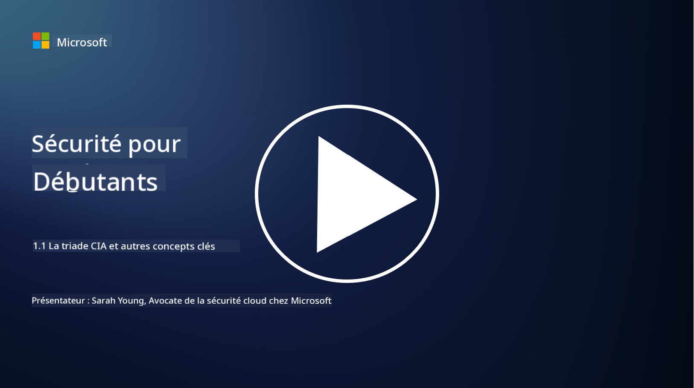
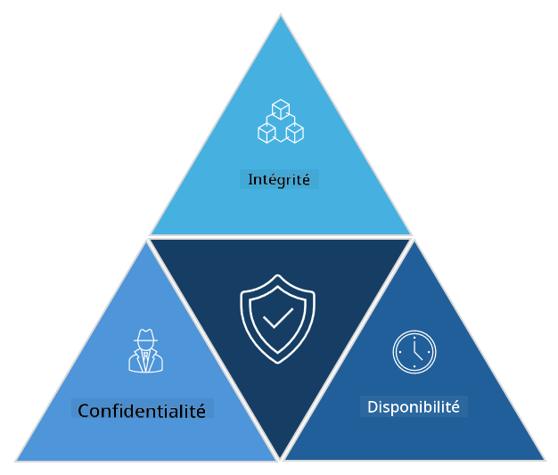

<!--
CO_OP_TRANSLATOR_METADATA:
{
  "original_hash": "16a76f9fa372fb63cffb6d76b855f023",
  "translation_date": "2025-09-03T18:47:07+00:00",
  "source_file": "1.1 The CIA triad and other key concepts.md",
  "language_code": "fr"
}
-->
# La triade CIA et autres concepts clés

## Introduction

Dans cette leçon, nous aborderons :

 - Qu'est-ce que la cybersécurité ?
   
 
 - Qu'est-ce que la triade CIA en cybersécurité ?

   

 - Que signifient authenticité, non-répudiation et confidentialité dans le contexte de la cybersécurité ?

## Qu'est-ce que la cybersécurité ?

La cybersécurité, également appelée sécurité de l'information, est la pratique consistant à protéger les systèmes informatiques, les réseaux, les appareils et les données contre les attaques numériques, les accès non autorisés, les dommages ou le vol. L'objectif principal de la cybersécurité est de garantir la confidentialité, l'intégrité et la disponibilité des actifs numériques et des informations. Les professionnels de la cybersécurité conçoivent et mettent en œuvre des contrôles de sécurité pour protéger les actifs, les données et les informations. Alors que de plus en plus d'aspects de nos vies sont numérisés et en ligne, la cybersécurité est devenue une préoccupation majeure pour les particuliers et les organisations.

## Qu'est-ce que la triade CIA en cybersécurité ?

La triade CIA en cybersécurité fait référence au modèle qui intègre les trois principales considérations pour tout travail en cybersécurité ou la conception d'un système/environnement :

### Confidentialité

C'est la considération la plus familière pour la plupart des gens lorsqu'ils pensent à la "cybersécurité" : la confidentialité est le processus de protection des données et des informations contre les tentatives d'accès non autorisées, c'est-à-dire que seules les personnes qui ont besoin de voir les informations peuvent y accéder. Cependant, toutes les données ne sont pas égales, et elles sont généralement classées et protégées en fonction des dommages potentiels si elles étaient accessibles par des personnes non autorisées.

### Intégrité

Cela concerne la protection de l'exactitude et de la fiabilité des données contenues dans les environnements, en empêchant leur modification ou altération par des individus non autorisés. Par exemple, un étudiant modifie sa date de naissance dans son dossier de permis de conduire au DMV pour se vieillir et obtenir un permis avec une date de naissance antérieure afin d'acheter de l'alcool.

### Disponibilité

Bien que ce soit une considération dans l'informatique opérationnelle, la disponibilité est également essentielle en cybersécurité. Il existe des types spécifiques d'attaques qui ciblent la disponibilité et contre lesquelles les professionnels de la sécurité doivent se protéger (par exemple, les attaques par déni de service distribué – DDoS).

**Triade CIA en cybersécurité**

## Que signifient authenticité, non-répudiation et confidentialité dans le contexte de la cybersécurité ?

Ce sont des concepts supplémentaires importants qui visent à garantir la sécurité et la fiabilité des systèmes et des données :

**Authenticité** - fait référence à l'assurance que l'information, la communication ou l'entité avec laquelle vous interagissez est authentique et n'a pas été altérée ou modifiée par des parties non autorisées.

**Non-répudiation** - est le concept qui garantit qu'une partie ne peut pas nier son implication ou l'authenticité d'une transaction ou d'une communication. Cela empêche quelqu'un de prétendre qu'il n'a pas envoyé un message ou effectué une action particulière lorsqu'il existe des preuves du contraire.

**Confidentialité** - concerne la protection des informations sensibles et des données personnelles identifiables contre les accès, utilisations, divulgations ou manipulations non autorisés. Cela implique de contrôler qui a accès aux données personnelles et comment ces données sont collectées, stockées et partagées.

## Lecture complémentaire

[Qu'est-ce que la sécurité de l'information (InfoSec) ? | Microsoft Security](https://www.microsoft.com/security/business/security-101/what-is-information-security-infosec#:~:text=Three%20pillars%20of%20information%20security%3A%20the%20CIA%20triad,as%20guiding%20principles%20for%20implementing%20an%20InfoSec%20plan.)

---

**Avertissement** :  
Ce document a été traduit à l'aide du service de traduction automatique [Co-op Translator](https://github.com/Azure/co-op-translator). Bien que nous nous efforcions d'assurer l'exactitude, veuillez noter que les traductions automatisées peuvent contenir des erreurs ou des inexactitudes. Le document original dans sa langue d'origine doit être considéré comme la source faisant autorité. Pour des informations critiques, il est recommandé de faire appel à une traduction humaine professionnelle. Nous déclinons toute responsabilité en cas de malentendus ou d'interprétations erronées résultant de l'utilisation de cette traduction.