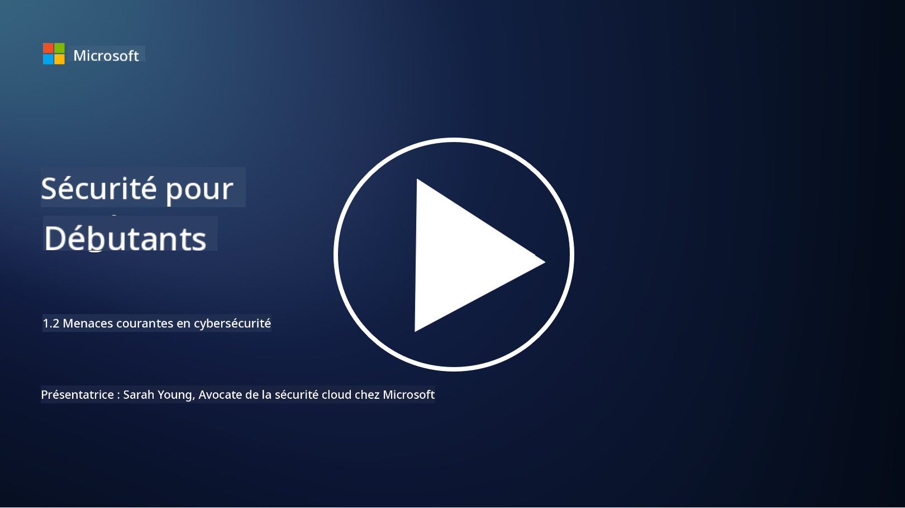

<!--
CO_OP_TRANSLATOR_METADATA:
{
  "original_hash": "6fc3030323139d7134a4ca9d03eccac9",
  "translation_date": "2025-09-03T18:17:18+00:00",
  "source_file": "1.2 Common cybersecurity threats.md",
  "language_code": "fr"
}
-->
# Menaces courantes en cybersécurité

## Introduction

Dans cette leçon, nous aborderons :

- Qu'est-ce qu'une menace en cybersécurité ?

- Pourquoi les acteurs malveillants cherchent-ils à compromettre les données et les systèmes informatiques ?

- Quels sont les types de menaces en cybersécurité les plus courants ?

- Qu'est-ce que le cadre MITRE ATT&CK ?

- Où puis-je me tenir informé de l'évolution des menaces en cybersécurité ?

## Qu'est-ce qu'une menace en cybersécurité ?

Une menace en cybersécurité désigne tout danger ou risque potentiel susceptible de compromettre la confidentialité, l'intégrité ou la disponibilité des données ou des systèmes informatiques. Ces menaces sont posées par des acteurs malveillants qui tentent d'exploiter des vulnérabilités afin d'obtenir un accès non autorisé, de voler des informations sensibles, de perturber les opérations ou de causer des dommages à des individus, des organisations ou même des nations entières. Les menaces en cybersécurité peuvent prendre diverses formes et cibler différents aspects des systèmes numériques et des données.

## Pourquoi les acteurs malveillants cherchent-ils à compromettre les données et les systèmes informatiques ?

Les acteurs malveillants compromettent les données et les systèmes informatiques pour diverses raisons, souvent motivées par un gain personnel, des motifs idéologiques ou le désir de provoquer des perturbations. Comprendre ces motivations peut aider les organisations et les individus à mieux se défendre contre les menaces cybernétiques. Voici quelques raisons courantes pour lesquelles les acteurs malveillants mènent des cyberattaques :

1. **Gain financier** : De nombreuses attaques sont motivées par la recherche de profit financier. Les acteurs malveillants peuvent voler des informations sensibles telles que des numéros de carte de crédit, des coordonnées bancaires ou des données personnelles pour commettre des fraudes, des vols d'identité, demander une rançon ou vendre les données volées sur le dark web.

2. **Espionnage** : Des États-nations, des concurrents ou d'autres entités peuvent mener des cyberespionnages pour voler des données sensibles gouvernementales, corporatives ou de recherche à des fins politiques, économiques ou militaires.

3. **Perturbation et sabotage** : Certaines attaques visent à perturber les infrastructures critiques, les services ou les opérations pour des raisons politiques ou idéologiques. Ces attaques peuvent provoquer un chaos généralisé, des pertes financières et des dommages à la réputation.

4. **Motivations idéologiques** : Les hacktivistes et les groupes ayant des motivations idéologiques ou politiques peuvent compromettre des systèmes pour sensibiliser à certaines problématiques, promouvoir leurs croyances ou protester contre des actions ou organisations spécifiques.

5. **Actions involontaires** : Toutes les actions malveillantes ne sont pas délibérées ; certaines personnes peuvent contribuer involontairement aux menaces cybernétiques en étant victimes d'ingénierie sociale ou en faisant partie d'un réseau compromis.

En fin de compte, les motivations pour compromettre les données et les systèmes informatiques peuvent varier considérablement, et l'impact de ces attaques peut être grave. Il est essentiel que les individus, les organisations et les gouvernements prennent la cybersécurité au sérieux et mettent en œuvre des mesures pour se protéger contre ces menaces.

## Quels sont les types de menaces en cybersécurité les plus courants ?

Il existe plusieurs types courants d'attaques en cybersécurité que les acteurs malveillants utilisent pour compromettre des systèmes, voler des données et provoquer des perturbations. Voici quelques-uns des types les plus répandus à ce jour :

1. **Hameçonnage (Phishing)** :

Le hameçonnage consiste à envoyer des courriels ou des messages trompeurs qui semblent provenir de sources légitimes afin de pousser les destinataires à divulguer des informations sensibles, telles que des mots de passe, des numéros de carte de crédit ou des données personnelles. Le hameçonnage peut également conduire les victimes vers des sites web malveillants ou les inciter à télécharger des logiciels malveillants.

2. **Logiciels malveillants (Malware)** :

Les logiciels malveillants (malicious software) englobent une gamme de programmes conçus pour infecter des systèmes, voler des données ou causer des dommages. Les types de logiciels malveillants incluent :

- **Ransomware** : Crypte les fichiers et exige une rançon pour leur décryptage.

- **Chevaux de Troie (Trojans)** : Déguisés en logiciels légitimes, ils donnent aux attaquants un accès non autorisé.

- **Virus** : Programmes auto-réplicants qui s'attachent à des fichiers et se propagent.

- **Vers (Worms)** : Programmes auto-réplicants qui se propagent via les réseaux.

3. **Attaques par déni de service (DoS) et déni de service distribué (DDoS)** :

Les attaques DoS surchargent un système cible, le rendant indisponible pour les utilisateurs. Les attaques DDoS impliquent l'utilisation d'un réseau d'appareils compromis pour inonder une cible de trafic, rendant difficile son fonctionnement ou l'arrêtant complètement.

4. **Injection SQL** :

Dans cette attaque, les attaquants manipulent les champs de saisie d'une application web pour injecter des requêtes SQL malveillantes, obtenant potentiellement un accès non autorisé aux bases de données et aux données sensibles.

5. **Scripts intersites (XSS)** :

Les attaquants injectent des scripts malveillants dans des applications web, qui sont ensuite exécutés par les navigateurs des utilisateurs. Cela peut entraîner le vol de données utilisateur et/ou la propagation de logiciels malveillants.

6. **Ingénierie sociale** :

L'ingénierie sociale exploite la psychologie humaine pour manipuler les individus afin qu'ils divulguent des informations confidentielles ou effectuent des actions compromettant la sécurité.

7. **Exploits Zero-Day (0day)** :

Ces attaques ciblent des vulnérabilités dans des logiciels ou matériels qui ne sont pas encore connues du fournisseur ou du public. Les attaquants exploitent ces vulnérabilités avant que des correctifs ne soient développés. Bien que préoccupants, les exploits zero-day sont moins fréquents que les autres attaques de cette liste. Lorsqu'un zero-day est découvert, les chercheurs en sécurité travaillent rapidement pour développer un correctif, ce qui rend ces exploits généralement de courte durée.

8. **Attaques sur les identifiants** :

Ces attaques incluent les attaques par force brute, où les attaquants devinent des mots de passe à répétition, et les attaques par bourrage d'identifiants, où des identifiants volés sur un site sont utilisés pour tenter d'accéder à d'autres sites.

## Qu'est-ce que le cadre MITRE ATT&CK ?

Le [cadre MITRE ATT&CK](https://attack.mitre.org/) (Adversarial Tactics, Techniques, and Common Knowledge) est un cadre qui répertorie et catégorise les tactiques, techniques et procédures (TTPs) utilisées par les adversaires lors des cyberattaques. Ce cadre a été créé par la MITRE Corporation, une organisation à but non lucratif qui gère des centres de recherche et développement pour diverses agences gouvernementales.

Le cadre MITRE ATT&CK fournit une méthode standardisée pour décrire et analyser les menaces cybernétiques, permettant aux professionnels de la cybersécurité de mieux comprendre et se défendre contre diverses techniques d'attaque. Il est largement utilisé par les équipes de sécurité, les chasseurs de menaces et les intervenants en cas d'incident pour :

1. **Comprendre le comportement des adversaires** : Le cadre documente les comportements d'attaque réels, décrivant les étapes suivies par les attaquants depuis l'entrée initiale jusqu'à l'atteinte de leurs objectifs. Il couvre une large gamme de techniques d'attaque utilisées par différents groupes de menaces.

2. **Planifier et mettre en œuvre des stratégies de défense** : Les équipes de sécurité peuvent utiliser le cadre pour développer des stratégies de défense proactives alignées sur les tactiques et techniques spécifiques que les adversaires pourraient employer.

3. **Réponse aux incidents et chasse aux menaces** : Lors de l'investigation d'incidents ou de la chasse aux menaces, les professionnels de la sécurité peuvent se référer au cadre pour identifier et atténuer les techniques spécifiques utilisées par les attaquants.

Le cadre MITRE ATT&CK est organisé en matrices qui regroupent les techniques d'attaque en fonction de plateformes et environnements spécifiques, tels que Windows, macOS, Linux et services cloud. Chaque matrice est divisée en tactiques (objectifs de haut niveau) et techniques (méthodes spécifiques utilisées pour atteindre ces objectifs). Pour chaque technique, le cadre fournit des informations sur son fonctionnement, les mesures d'atténuation possibles et des références pertinentes à des acteurs de menace réels ayant utilisé la technique.

Le cadre est continuellement mis à jour et enrichi à mesure que de nouvelles informations sur les menaces sont collectées et que le paysage de la cybersécurité évolue. C'est une ressource précieuse pour renforcer la posture de cybersécurité d'une organisation en permettant une compréhension approfondie des méthodes des attaquants et des moyens de se défendre contre leurs tactiques.

## Où puis-je me tenir informé de l'évolution des menaces en cybersécurité ?

Il existe de nombreuses sources pour se tenir informé des menaces en cybersécurité. Voici une sélection :

- [Open Web Application Security Project (OWASP) top 10 vulnerabilities](https://owasp.org/Top10/)
- [Common Vulnerabilities and Exposures (CVEs)](https://www.bing.com/ck/a?!&&p=53df6007f017bca2JmltdHM9MTY5MjU3NjAwMCZpZ3VpZD0zYmY4N2RiYS1jYWI1LTYwMDgtMWY1YS02ZmYyY2JjNjYxZWUmaW5zaWQ9NTc2OQ&ptn=3&hsh=3&fclid=3bf87dba-cab5-6008-1f5a-6ff2cbc661ee&psq=cve&u=a1aHR0cHM6Ly9iaW5nLmNvbS9hbGluay9saW5rP3VybD1odHRwcyUzYSUyZiUyZmN2ZS5taXRyZS5vcmclMmYmc291cmNlPXNlcnAtcnImaD1BZXN4S0VBWTNnbGhNZEFpd3daMlNSZkZQNTlrODhIUnYxRUtlSkY1RTk0JTNkJnA9a2NvZmZjaWFsd2Vic2l0ZQ&ntb=1 "Common Vulnerabilities and Exposures")
- [Microsoft Security Response Center blogs](https://msrc.microsoft.com/blog/)
- [National Institute of Standards and Technology (NIST)](https://www.dhs.gov/topics/cybersecurity) : NIST fournit des ressources, des alertes et des mises à jour sur les menaces potentielles en cybersécurité.
- [Cybersecurity and Infrastructure Security Agency (CISA)](https://www.cisa.gov/resources-tools/resources/free-cybersecurity-services-and-tools) : CISA propose des ressources en cybersécurité et des bonnes pratiques pour les entreprises, les agences gouvernementales et autres organisations. CISA partage des informations actualisées sur les types d'activités de sécurité ayant un impact important sur la communauté et des analyses approfondies sur les nouvelles menaces cybernétiques.
- [National Cybersecurity Center of Excellence (NCCoE)](https://www.dhs.gov/topics/cybersecurity) : NCCoE est un centre qui fournit des solutions pratiques en cybersécurité applicables dans des situations réelles.
- [US-CERT](https://www.cisa.gov/resources-tools/resources/free-cybersecurity-services-and-tools) : L'équipe de préparation aux urgences informatiques des États-Unis (US-CERT) offre une variété de ressources en cybersécurité, notamment des alertes, des conseils et plus encore.
- L'équipe de réponse aux urgences informatiques (CERT) de votre pays.

---

**Avertissement** :  
Ce document a été traduit à l'aide du service de traduction automatique [Co-op Translator](https://github.com/Azure/co-op-translator). Bien que nous nous efforcions d'assurer l'exactitude, veuillez noter que les traductions automatisées peuvent contenir des erreurs ou des inexactitudes. Le document original dans sa langue d'origine doit être considéré comme la source faisant autorité. Pour des informations critiques, il est recommandé de faire appel à une traduction humaine professionnelle. Nous déclinons toute responsabilité en cas de malentendus ou d'interprétations erronées résultant de l'utilisation de cette traduction.