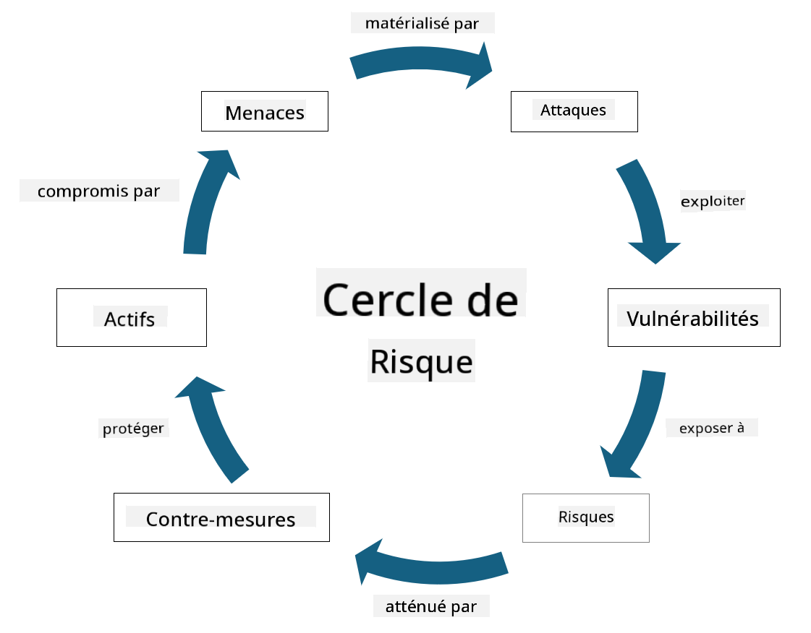

<!--
CO_OP_TRANSLATOR_METADATA:
{
  "original_hash": "fcca304f072cabf206388199e8e2e578",
  "translation_date": "2025-09-03T18:52:46+00:00",
  "source_file": "1.3 Understanding risk management.md",
  "language_code": "fr"
}
-->
# Comprendre la gestion des risques

## Introduction

Dans cette leçon, nous aborderons :

 - Les définitions des termes couramment utilisés en sécurité
   
 - Les types de contrôles de sécurité

 - L'évaluation des risques de sécurité

## Définitions des termes couramment utilisés en sécurité

Ces termes sont des concepts fondamentaux dans le domaine de la cybersécurité et de la gestion des risques. Décomposons chaque terme et voyons comment ils sont liés les uns aux autres :

1. **Agent de menace** :

Un agent de menace est un individu, un groupe, une organisation ou un système automatisé qui a le potentiel d'exploiter des vulnérabilités dans un système ou un réseau pour causer des dommages. Les agents de menace peuvent être des hackers, des auteurs de logiciels malveillants, des employés mécontents ou toute entité représentant un risque pour les systèmes d'information et de technologie.

2. **Menace** :

Une menace est un événement ou une action potentielle qui peut exploiter des vulnérabilités dans un système et causer des dommages à un actif. Les menaces peuvent inclure des actions telles que le piratage, les violations de données, les attaques par déni de service, et plus encore. Les menaces représentent le "quoi" en termes de dommages potentiels pouvant être infligés aux actifs d'une organisation.

3. **Vulnérabilité** :

Une vulnérabilité est une faiblesse ou un défaut dans la conception, l'implémentation ou la configuration d'un système qui peut être exploité par un agent de menace pour compromettre la sécurité du système. Les vulnérabilités peuvent exister dans les logiciels, le matériel, les processus ou le comportement humain. Identifier et corriger les vulnérabilités est essentiel pour minimiser le risque d'attaques réussies.

4. **Risque** :

Le risque est le potentiel de perte, de dommage ou de préjudice résultant de l'interaction entre une menace et une vulnérabilité. C'est la probabilité qu'un agent de menace exploite une vulnérabilité pour causer un impact négatif. Les risques sont souvent évalués en fonction de leur impact potentiel et de leur probabilité d'occurrence.

5. **Actif** :

Un actif est tout ce qui a de la valeur et que l'organisation cherche à protéger. Les actifs peuvent inclure des objets physiques (comme des ordinateurs et des serveurs), des données (informations clients, dossiers financiers), des propriétés intellectuelles (secrets commerciaux, brevets), et même des ressources humaines (compétences et connaissances des employés). Protéger les actifs est un objectif clé de la cybersécurité.

6. **Exposition** :

L'exposition fait référence à l'état d'être vulnérable à des menaces potentielles. Elle se produit lorsqu'une vulnérabilité existe et pourrait être exploitée par un agent de menace. L'exposition met en évidence le risque associé à la présence de vulnérabilités dans un système ou un réseau.

7. **Contrôle** :

Un contrôle est une mesure mise en place pour réduire le risque associé aux vulnérabilités et aux menaces. Les contrôles peuvent être techniques, procéduraux ou administratifs. Ils sont conçus pour prévenir, détecter ou atténuer les menaces et les vulnérabilités potentielles. Exemples : pare-feu, contrôles d'accès, cryptage, politiques de sécurité et formation des employés.

Pour résumer la relation entre ces termes : les agents de menace exploitent les vulnérabilités pour exécuter des menaces, ce qui peut entraîner des risques susceptibles de causer des dommages aux actifs précieux. L'exposition se produit lorsque des vulnérabilités sont présentes, et des contrôles sont mis en place pour réduire le risque en prévenant ou en atténuant l'impact des menaces sur les actifs. Ce cadre constitue la base de la gestion des risques en cybersécurité, guidant les organisations dans l'identification, l'évaluation et la gestion des risques potentiels pour leurs systèmes d'information et leurs actifs.

## Types de contrôles de sécurité

Les contrôles de sécurité sont des mesures ou des protections mises en œuvre pour protéger les systèmes d'information et les actifs contre diverses menaces et vulnérabilités. Ils peuvent être classés en plusieurs catégories en fonction de leur objectif et de leur portée. Voici quelques types courants de contrôles de sécurité :

1. **Contrôles administratifs** :

Ces contrôles concernent les politiques, procédures et directives qui régissent les pratiques de sécurité et le comportement des utilisateurs au sein de l'organisation.

- Politiques et procédures de sécurité : Directives documentées définissant comment la sécurité est maintenue dans une organisation.

- Sensibilisation et formation à la sécurité : Programmes pour éduquer les employés sur les meilleures pratiques de sécurité et les menaces potentielles.

- Réponse et gestion des incidents : Plans pour répondre et atténuer les incidents de sécurité.

2. **Contrôles techniques** :

Les contrôles techniques impliquent l'utilisation de la technologie pour appliquer des mesures de sécurité et protéger les systèmes et les données. Exemples de contrôles techniques :

- Contrôles d'accès : Mesures qui restreignent l'accès des utilisateurs aux ressources en fonction de leurs rôles et permissions.

- Cryptage : Conversion des données dans un format sécurisé pour empêcher tout accès non autorisé.

- Pare-feu : Dispositifs de sécurité réseau qui filtrent et contrôlent le trafic entrant et sortant.

- Systèmes de détection et de prévention des intrusions (IDPS) : Outils qui surveillent le trafic réseau pour détecter des activités suspectes.

- Logiciels antivirus et anti-malware : Programmes qui détectent et suppriment les logiciels malveillants.

- Mécanismes d'authentification : Méthodes pour vérifier l'identité des utilisateurs, comme les mots de passe, la biométrie et l'authentification multi-facteurs.

- Gestion des correctifs : Mise à jour régulière des logiciels pour corriger les vulnérabilités connues.

3. **Contrôles physiques** :

Les contrôles physiques sont des mesures pour protéger les actifs physiques et les installations.

- Agents de sécurité et personnel de contrôle d'accès : Personnel qui surveille et contrôle l'accès aux locaux physiques.

- Caméras de surveillance : Systèmes de vidéo surveillance pour surveiller et enregistrer les activités.

- Serrures et barrières physiques : Mesures physiques pour restreindre l'accès aux zones sensibles.

- Contrôles environnementaux : Mesures pour réguler la température, l'humidité et d'autres facteurs environnementaux affectant les équipements et les centres de données.

4. **Contrôles opérationnels** :

Ces contrôles concernent les opérations quotidiennes et les activités qui garantissent la sécurité continue des systèmes.

- Gestion des changements : Processus pour suivre et approuver les modifications apportées aux systèmes et configurations.

- Sauvegarde et reprise après sinistre : Plans pour la sauvegarde et la récupération des données en cas de pannes ou de catastrophes.

- Journalisation et audit : Surveillance et enregistrement des activités du système pour des raisons de sécurité et de conformité.

- Pratiques de codage sécurisé : Directives pour écrire des logiciels afin de minimiser les vulnérabilités.

5. **Contrôles légaux et réglementaires** :

Ces contrôles garantissent la conformité aux lois, réglementations et normes industrielles pertinentes. Les normes auxquelles une organisation doit se conformer dépendent de la juridiction, du secteur d'activité et d'autres facteurs.

- Réglementations sur la protection des données : Conformité à des lois telles que le RGPD, HIPAA et CCPA.

- Normes spécifiques à l'industrie : Respect de normes comme PCI DSS pour la sécurité des données de cartes de paiement.

Ces catégories de contrôles de sécurité travaillent ensemble pour créer une posture de sécurité globale pour les organisations, aidant à protéger leurs systèmes, données et actifs contre une large gamme de menaces.

## Évaluation des risques de sécurité

Certains professionnels de la sécurité estiment que la gestion des risques est réservée aux spécialistes des risques, mais comprendre le processus de gestion des risques de sécurité est essentiel pour tout professionnel de la sécurité afin d'exprimer les risques de sécurité dans un langage que le reste de l'organisation peut comprendre et sur lequel elle peut agir.

Les organisations doivent constamment évaluer les risques de sécurité et décider des actions (ou non) à entreprendre face aux risques pour l'entreprise. Voici un aperçu de la manière dont cela est généralement fait. Notez que ce processus est généralement réalisé par plusieurs équipes différentes au sein d'une organisation ; il est rare qu'une seule équipe soit responsable de la gestion complète des risques.

1. **Identifier les actifs et les menaces** :

L'organisation identifie les actifs qu'elle souhaite protéger. Cela peut inclure des données, des systèmes, du matériel, des logiciels, des propriétés intellectuelles, et plus encore. Ensuite, elle identifie les menaces potentielles qui pourraient cibler ces actifs.

2. **Évaluer les vulnérabilités** :

Les organisations identifient ensuite les vulnérabilités ou faiblesses dans les systèmes ou processus qui pourraient être exploitées par des menaces. Ces vulnérabilités peuvent provenir de défauts logiciels, de mauvaises configurations, d'un manque de contrôles de sécurité, et d'erreurs humaines.

3. **Évaluation de la probabilité** :

L'organisation évalue ensuite la probabilité de chaque menace. Cela implique de considérer les données historiques, les renseignements sur les menaces, les tendances du secteur et les facteurs internes. La probabilité peut être catégorisée comme faible, moyenne ou élevée en fonction de la probabilité que la menace se matérialise.

4. **Évaluation de l'impact** :

Ensuite, l'organisation détermine l'impact potentiel de chaque menace si elle exploitait une vulnérabilité. L'impact peut inclure des pertes financières, des perturbations opérationnelles, des dommages à la réputation, des conséquences juridiques, et plus encore. L'impact peut également être catégorisé comme faible, moyen ou élevé en fonction des conséquences potentielles.

5. **Calcul du risque** :

Les évaluations de probabilité et d'impact sont combinées pour calculer le niveau de risque global pour chaque menace identifiée. Cela se fait souvent à l'aide d'une matrice de risque qui attribue des valeurs numériques ou des descripteurs qualitatifs aux niveaux de probabilité et d'impact. Le niveau de risque résultant aide à prioriser les risques nécessitant une attention immédiate.

6. **Priorisation et prise de décision** :

L'organisation priorise ensuite les risques en se concentrant sur ceux ayant les valeurs de probabilité et d'impact combinées les plus élevées. Cela lui permet d'allouer des ressources et de mettre en œuvre des contrôles plus efficacement. Les menaces à haut risque nécessitent une attention immédiate, tandis que les menaces à faible risque peuvent être traitées sur une période plus longue.

7. **Traitement des risques** :

Sur la base de l'évaluation des risques, l'organisation détermine comment atténuer ou gérer chaque risque. Cela peut inclure la mise en œuvre de contrôles de sécurité, le transfert du risque via une assurance, ou même l'acceptation de certains niveaux de risque résiduel s'ils sont jugés gérables/trop coûteux à corriger/etc.

8. **Surveillance et révision continues** :

L'évaluation des risques n'est pas un processus ponctuel. Elle doit être réalisée périodiquement ou chaque fois qu'il y a des changements significatifs dans l'environnement de l'organisation. Une surveillance continue garantit que les nouvelles menaces, vulnérabilités ou changements dans le paysage commercial sont pris en compte.

En évaluant les risques de sécurité de manière structurée, les organisations peuvent prendre des décisions éclairées sur l'allocation des ressources, les contrôles de sécurité et les stratégies globales de gestion des risques. L'objectif est de réduire l'exposition globale aux risques tout en alignant les efforts de sécurité sur les objectifs et les priorités de l'organisation.

---

**Avertissement** :  
Ce document a été traduit à l'aide du service de traduction automatique [Co-op Translator](https://github.com/Azure/co-op-translator). Bien que nous nous efforcions d'assurer l'exactitude, veuillez noter que les traductions automatisées peuvent contenir des erreurs ou des inexactitudes. Le document original dans sa langue d'origine doit être considéré comme la source faisant autorité. Pour des informations critiques, il est recommandé de recourir à une traduction professionnelle réalisée par un humain. Nous déclinons toute responsabilité en cas de malentendus ou d'interprétations erronées résultant de l'utilisation de cette traduction.