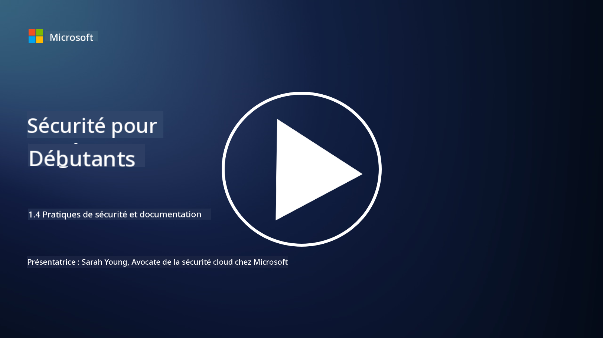

<!--
CO_OP_TRANSLATOR_METADATA:
{
  "original_hash": "d33500902124e52870935bdce4546fcc",
  "translation_date": "2025-09-03T18:33:28+00:00",
  "source_file": "1.4 Security practices and documentation.md",
  "language_code": "fr"
}
-->
# Pratiques de sécurité et documentation

Vous avez peut-être déjà entendu les expressions « politique de sécurité », « norme de sécurité », etc., mais la réalité est que de nombreux professionnels de la cybersécurité ne les utilisent pas correctement. Dans cette section, nous allons expliquer ce que signifient chacune de ces expressions et pourquoi une organisation les utiliserait.

## Introduction

Dans cette leçon, nous aborderons :

- Qu'est-ce qu'une politique de sécurité ?
- Qu'est-ce qu'une norme de sécurité ?
- Qu'est-ce qu'un référentiel de sécurité ?
- Qu'est-ce qu'une directive de sécurité ?
- Qu'est-ce qu'une procédure de sécurité ?
- Quelles sont les lois et réglementations dans le contexte de la cybersécurité ?

Ces termes sont souvent utilisés dans le contexte de la cybersécurité pour définir différents niveaux de documentation et de pratiques de sécurité au sein d'une organisation. Clarifions chaque terme :

## Qu'est-ce qu'une politique de sécurité ?

Une politique de sécurité est un document de haut niveau qui décrit les objectifs, principes et directives de sécurité généraux d'une organisation. Elle fournit un cadre pour prendre des décisions liées à la sécurité et définit l'approche globale de l'organisation en matière de sécurité. Les politiques de sécurité couvrent généralement des sujets tels que l'utilisation acceptable des ressources, la protection des données, le contrôle d'accès, la réponse aux incidents, et bien plus encore. Une politique est indépendante des solutions et des technologies. Un exemple de politique de sécurité bien connu serait la politique d'utilisation acceptable d'une organisation.

## Qu'est-ce qu'une norme de sécurité ?

Une norme de sécurité est un document plus détaillé et spécifique qui fournit des directives et des exigences pour mettre en œuvre des contrôles et des mesures de sécurité au sein d'une organisation. Les normes sont plus concrètes et techniques que les politiques, offrant des instructions et des recommandations précises pour configurer et maintenir les systèmes, réseaux et processus afin d'atteindre les objectifs de sécurité. Un exemple de norme de sécurité serait : _« Toutes les données internes doivent être chiffrées au repos et en transit. »_

## Qu'est-ce qu'un référentiel de sécurité ?

Un référentiel de sécurité est un ensemble de configurations de sécurité minimales considérées comme essentielles pour un système, une application ou un environnement particulier à un moment donné. Il définit un point de départ en matière de sécurité qui doit être appliqué à toutes les instances concernées. Les référentiels de sécurité permettent d'assurer une cohérence et un certain niveau de sécurité dans l'infrastructure informatique d'une organisation. Un exemple de référentiel de sécurité serait : _« Les machines virtuelles Azure ne doivent pas avoir d'accès direct à Internet. »_

## Qu'est-ce qu'une directive de sécurité ?

Une directive de sécurité est un document qui offre des recommandations et des conseils lorsqu'une norme de sécurité spécifique ne s'applique pas. Les directives tentent de traiter les « zones grises » qui apparaissent lorsque qu'une norme ne couvre pas ou ne couvre que partiellement un sujet.

## Qu'est-ce qu'une procédure de sécurité ?

Une procédure de sécurité est un guide détaillé étape par étape qui décrit les actions et tâches spécifiques à effectuer pour exécuter un processus ou une tâche liée à la sécurité. Les procédures sont des documents pratiques et exploitables qui fournissent une séquence claire d'actions à suivre lors de la réponse aux incidents, de la maintenance des systèmes, de l'intégration des utilisateurs, et d'autres activités liées à la sécurité. Un exemple de procédure de sécurité serait : _« Lorsqu'un incident de sécurité de niveau P1 est généré par Microsoft Sentinel, le centre des opérations de sécurité (SOC) doit immédiatement informer le responsable de la sécurité de garde et lui transmettre les détails de l'incident. »_

En résumé, ces termes représentent différents niveaux de documentation et de directives au sein du cadre de cybersécurité d'une organisation. Les politiques de sécurité définissent les objectifs généraux, les normes fournissent des exigences détaillées, les référentiels établissent des configurations minimales, les directives offrent des bonnes pratiques, et les procédures proposent des étapes concrètes pour les processus de sécurité.

## Quelles sont les lois/réglementations dans le contexte de la cybersécurité ?

Les lois et réglementations désignent les cadres juridiques établis par les gouvernements et les organismes de réglementation pour définir et appliquer des règles, normes et exigences visant à sécuriser les systèmes numériques, les données et les informations. Ces lois et réglementations varient selon les juridictions et se concentrent sur différents aspects de la cybersécurité, notamment la protection des données, la confidentialité, le signalement des incidents et la sécurité des infrastructures critiques. Voici quelques exemples de lois et réglementations liées à la cybersécurité : par exemple, le Règlement Général sur la Protection des Données (RGPD), la loi HIPAA (Health Insurance Portability and Accountability Act), la loi CCPA (California Consumer Privacy Act), et la norme PCI DSS (Payment Card Industry Data Security Standard).

## Lectures complémentaires

[Modèles de politiques de sécurité de l'information | SANS Institute](https://www.sans.org/information-security-policy/)

[Conformité aux lois et réglementations en matière de cybersécurité et de confidentialité | NIST](https://www.nist.gov/mep/cybersecurity-resources-manufacturers/compliance-cybersecurity-and-privacy-laws-and-regulations)

---

**Avertissement** :  
Ce document a été traduit à l'aide du service de traduction automatique [Co-op Translator](https://github.com/Azure/co-op-translator). Bien que nous nous efforcions d'assurer l'exactitude, veuillez noter que les traductions automatisées peuvent contenir des erreurs ou des inexactitudes. Le document original dans sa langue d'origine doit être considéré comme la source faisant autorité. Pour des informations critiques, il est recommandé de recourir à une traduction professionnelle réalisée par un humain. Nous déclinons toute responsabilité en cas de malentendus ou d'interprétations erronées résultant de l'utilisation de cette traduction.