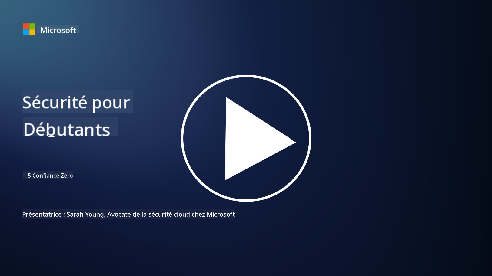
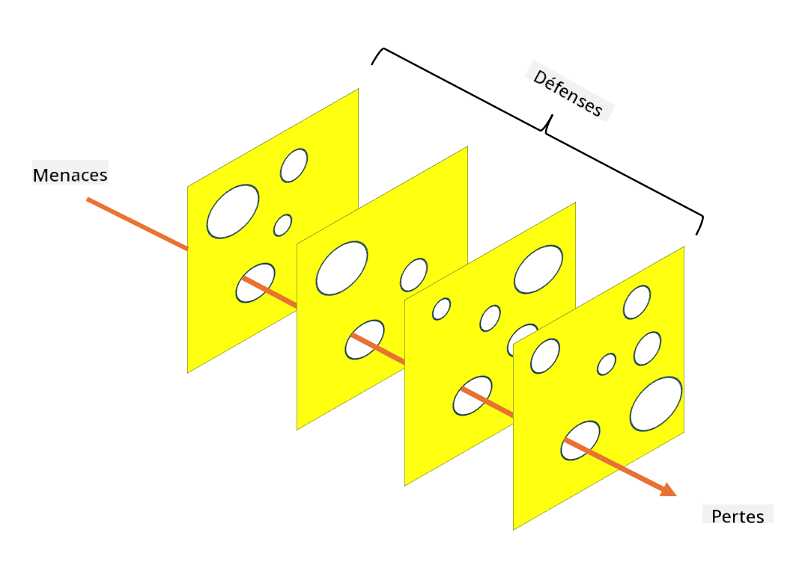

<!--
CO_OP_TRANSLATOR_METADATA:
{
  "original_hash": "75f77f972d2233c584f87c1eb96c983b",
  "translation_date": "2025-09-03T18:23:54+00:00",
  "source_file": "1.5 Zero trust.md",
  "language_code": "fr"
}
-->
# Zero Trust

« Zero trust » est une expression très utilisée dans les cercles de sécurité de nos jours. Mais que signifie-t-elle réellement ? Est-ce juste un mot à la mode ? Dans cette leçon, nous allons explorer en détail ce qu'est le zero trust.

## Introduction

 - Dans cette leçon, nous aborderons :
   
   
 - Qu'est-ce que le zero trust ?

   
  

 - En quoi le zero trust diffère-t-il des architectures de sécurité traditionnelles ?

   
   

 - Qu'est-ce que la défense en profondeur ?

## Zero Trust

Le Zero Trust est une approche de cybersécurité qui remet en question la notion traditionnelle de « faire confiance mais vérifier » en supposant qu'aucune entité, qu'elle soit à l'intérieur ou à l'extérieur du réseau d'une organisation, ne doit être considérée comme digne de confiance par défaut. Au lieu de cela, le Zero Trust préconise de vérifier chaque utilisateur, appareil et application cherchant à accéder aux ressources, peu importe leur emplacement. Le principe fondamental du Zero Trust est de minimiser la « surface d'attaque » et de réduire l'impact potentiel des violations de sécurité.

Dans un modèle Zero Trust, les principes suivants sont mis en avant :

1. **Vérification de l'identité** : L'authentification et l'autorisation sont appliquées rigoureusement à tous les utilisateurs et appareils, quel que soit leur emplacement. Rappelez-vous qu'une identité n'est pas nécessairement humaine : elle peut être un appareil, une application, etc.

2. **Privilège minimal** : Les utilisateurs et les appareils reçoivent le niveau d'accès minimum nécessaire pour accomplir leurs tâches, réduisant ainsi les dommages potentiels en cas de compromission.

3. **Micro-segmentation** : Les ressources du réseau sont divisées en segments plus petits pour limiter les mouvements latéraux au sein du réseau en cas de violation.

4. **Surveillance continue** : Une surveillance et une analyse continues du comportement des utilisateurs et des appareils sont effectuées pour détecter les anomalies et les menaces potentielles. Les techniques modernes de surveillance utilisent également l'apprentissage automatique, l'intelligence artificielle et les renseignements sur les menaces pour fournir des détails et un contexte supplémentaires.

5. **Chiffrement des données** : Les données sont chiffrées à la fois en transit et au repos pour empêcher tout accès non autorisé.

6. **Contrôle d'accès strict** : Les contrôles d'accès sont appliqués en fonction du contexte, comme les rôles des utilisateurs, l'état des appareils et l'emplacement du réseau.

Microsoft divise le zero trust en cinq piliers, que nous aborderons dans une leçon ultérieure.

## Différences avec les architectures de sécurité traditionnelles

Le Zero Trust diffère des architectures de sécurité traditionnelles, telles que les modèles basés sur le périmètre, de plusieurs manières :

1. **Périmètre vs. Centré sur l'identité** : Les modèles traditionnels se concentrent sur la sécurisation du périmètre du réseau et supposent que les utilisateurs et appareils internes peuvent être dignes de confiance une fois à l'intérieur. Le Zero Trust, en revanche, suppose que les menaces peuvent provenir à la fois de l'intérieur et de l'extérieur du réseau et applique des contrôles stricts basés sur l'identité.

2. **Confiance implicite vs. Confiance explicite** : Les modèles traditionnels font implicitement confiance aux appareils et utilisateurs au sein du réseau jusqu'à preuve du contraire. Le Zero Trust vérifie explicitement les identités et surveille en continu les anomalies.

3. **Réseau plat vs. segmenté** : Les architectures traditionnelles impliquent souvent des réseaux plats où les utilisateurs internes ont un accès étendu. Le Zero Trust préconise de segmenter le réseau en zones plus petites et isolées pour contenir les violations potentielles.

4. **Réactif vs. Proactif** : La sécurité traditionnelle repose souvent sur des mesures réactives telles que les pare-feu périmétriques et la détection des intrusions. Le Zero Trust adopte une approche proactive en supposant que les violations sont probables et en minimisant leur impact.

## Défense en profondeur

La défense en profondeur, également appelée sécurité en couches, est une stratégie de cybersécurité qui consiste à déployer plusieurs couches de contrôles et de mesures de sécurité pour protéger les actifs d'une organisation. L'objectif est de créer des couches de défense qui se chevauchent afin que, si une couche est compromise, les autres puissent toujours offrir une protection. Chaque couche se concentre sur un aspect différent de la sécurité et améliore la posture globale de sécurité d'une organisation.

La défense en profondeur implique une combinaison de mesures de sécurité techniques, procédurales et physiques. Cela peut inclure des pare-feu, des systèmes de détection des intrusions, des contrôles d'accès, le chiffrement, la formation des utilisateurs, des politiques de sécurité, et bien plus encore. L'idée est de créer plusieurs barrières qui, ensemble, rendent difficile pour les attaquants de pénétrer les systèmes et réseaux d'une organisation. Cela est également parfois appelé le modèle « fromage suisse », utilisé dans la prévention des accidents dans d'autres industries (par exemple, le transport).

## Lectures complémentaires

[Qu'est-ce que le Zero Trust ?](https://learn.microsoft.com/security/zero-trust/zero-trust-overview?WT.mc_id=academic-96948-sayoung)

[Évolution du Zero Trust – Document de position de Microsoft](https://query.prod.cms.rt.microsoft.com/cms/api/am/binary/RWJJdT?WT.mc_id=academic-96948-sayoung)

[Zero Trust et BeyondCorp Google Cloud | Blog Google Cloud](https://cloud.google.com/blog/topics/developers-practitioners/zero-trust-and-beyondcorp-google-cloud)

---

**Avertissement** :  
Ce document a été traduit à l'aide du service de traduction automatique [Co-op Translator](https://github.com/Azure/co-op-translator). Bien que nous nous efforcions d'assurer l'exactitude, veuillez noter que les traductions automatisées peuvent contenir des erreurs ou des inexactitudes. Le document original dans sa langue d'origine doit être considéré comme la source faisant autorité. Pour des informations critiques, il est recommandé de recourir à une traduction professionnelle réalisée par un humain. Nous déclinons toute responsabilité en cas de malentendus ou d'interprétations erronées résultant de l'utilisation de cette traduction.